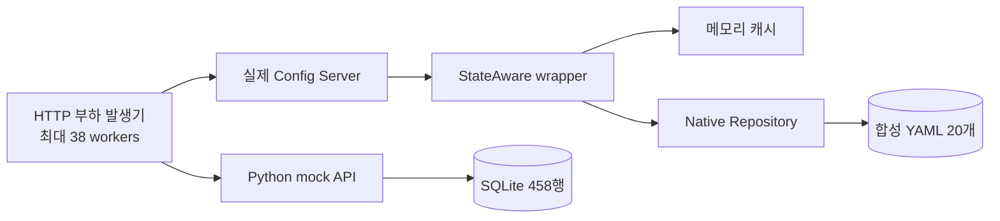

“캐시를 넣어서 빨라졌다”는 설명은 그럴듯하지만 무엇과 비교했는지가 빠져 있다. 같은 JVM에서 처음 읽은 요청과 이미 구성된 설정을 읽은 요청은 다르다. 38건짜리 burst와 1,900건짜리 반복 구간의 RPS도 동일한 조건의 전후 비교가 아니다.

이 글은 [1편](/blog/gateway-config-01-composition-boundary)의 wrapper, [2편](/blog/gateway-config-02-filesystem-memory-cache)의 캐시, [3편](/blog/gateway-config-03-bus-rabbitmq)의 갱신 신호를 검증 가능한 주장으로 연결한다. 실제 Spring Config Server를 띄워 HTTP 실험을 했고, 해석 과정에서 원래 보고서의 표현도 보수적으로 바로잡았다.

## 부하의 기준을 20과 38로 나눴다

실험은 20개 application 설정과 최대 38개 client 요청을 사용한다. 실제 업무 시스템의 구성과 규모는 공개하지 않는다.

실행한 것은 **Config Server 프로세스 하나와 최대 38개의 Python HTTP worker**다. 38개 Kubernetes Pod를 만든 것이 아니다. 각 worker가 고정된 Pod identity를 갖는 것도 아니며, 38개 worker가 barrier에서 동시에 출발하도록 구현하지도 않았다. 따라서 “38 Pod 동시 시작”은 시나리오 의도를 나타내는 이름으로 읽어야 한다.

운영의 20개 서비스가 모두 route 20개씩을 가지는 것도 아니다. fixture에서 응답 크기를 일정하게 만들기 위해 정한 합성 데이터다. 20개 YAML에 총 400개 route 모양 설정을 넣었고 파일 합계는 76,403 bytes였다.

## mock DB를 만든 이유와 실제 요청 경로

SQLite에는 application 20행, Pod 매핑 38행, route 400행을 넣었다. Python mock API는 이 데이터를 조회한다. Config Server는 같은 생성기가 만든 YAML 파일을 읽는다. **Config Server가 mock API를 거쳐 DB를 읽는 구조는 아니다.** route의 URI가 mock을 가리켜도 설정 조회만으로 upstream 요청이 실행되지는 않는다.

실험의 두 HTTP 경로는 아래처럼 독립적이다.



> 실선은 접근 경로다. SQLite 결과는 mock 자체의 참고 측정이며, 캐시와 DB 제품을 비교하는 벤치마크가 아니다.

## 실제 측정값을 어떻게 읽을 것인가

측정 시각은 2026-09-08 00:02 KST다. macOS arm64, Corretto 17.0.10, Spring Boot 3.5.6, Python 3.14.6을 사용했다. client와 서버는 같은 머신의 loopback을 이용했고 Kubernetes CPU·memory 제한은 적용하지 않았다. 커스텀 wrapper 로그는 WARN으로 낮췄고 native 로그는 INFO가 남았다. 운영 기본 로그 레벨과도 조건이 다르다.

숫자의 원본 근거는 비공개 부하 테스트 결과다. 공개 검증을 위해 비식별 고정 사본을 `demos/gateway-config/2026-09-08-results.json`에 넣었다. 업무 저장소의 커밋과 파일 위치는 공개하지 않는다.

| 시나리오 | 요청 | HTTP 오류 | 평균 ms | p95 ms | p99 ms | RPS | 구간 초 |
|---|---:|---:|---:|---:|---:|---:|---:|
| cold로 명명한 초기 조회 | 38 | 0 | 64.038 | 69.207 | 69.624 | 525.12 | 0.072 |
| warm 반복 조회 | 1,900 | 0 | 6.167 | 11.223 | 29.886 | 5,945.42 | 0.320 |
| 변경 없는 재조회 burst | 38 | 0 | 1.764 | 3.018 | 3.326 | 6,410.80 | 0.006 |
| SQLite mock API | 1,900 | 0 | 26.931 | 32.325 | 35.001 | 1,400.17 | 1.357 |

정량 구간 합계는 3,876요청이며 모두 HTTP 200이었다. 별도의 invalidation 조회는 3회다. 성공 집계는 status 200 기준이므로 전체 응답 필드가 모두 기대값이었다는 검증은 아니다. version과 state 확인은 별도 invalidation 시나리오에서만 수행했다.

warm p95가 초기 조회보다 작다는 관찰은 가능하다. 하지만 5,945 RPS를 운영 최대 용량으로 제시하거나, cold 대비 11배 성능 개선을 입증했다고 말하지 않는다. 표본 수와 측정 시간이 다르고 cache-off 서버를 동일 조건으로 비교하지 않았다.

## cold라는 이름에 숨어 있는 측정 문제

실행 스크립트는 readiness 확인에 `service-01/local` 조회를 사용한다. 실제 코드에는 polling 외에 최종 확인 요청도 있다. 이 과정에서 service-01이 이미 캐시에 들어갈 수 있다. 이후 fixture를 다시 생성하지만 mtime key는 초 단위라서 재생성이 항상 다른 key를 만든다는 보장이 없다.

따라서 이 하네스는 “모든 cache가 비어 있는 cold start”를 엄밀하게 보장하지 않는다. 특정 실행 로그에서 재구성이 보였더라도 스크립트 자체의 재현성 문제는 남는다. 다음 측정에서는 설정 조회를 하지 않는 readiness를 사용하고, 측정 대상 application의 사전 접근을 없애거나 캐시 초기화 조건을 명시해야 한다.

JVM과 OS cache도 이미 warm할 수 있다. 여기서 cold는 저장장치나 전체 프로세스가 완전히 차가운 상태를 뜻하지 않는다.

## 38개의 로그가 말해주는 것

원래 실행 로그에는 `Adding property source`가 총 40개 남았다. 초기 readiness에서 발생한 구성과 마지막 mtime 변경 후 구성을 각각 하나로 보면 중간 초기 부하 구간에는 38개가 있다. 일반 application은 두 번씩, batch는 한 번씩 등장했다.

이 로그는 native가 property source를 추가하는 지점의 관찰값이다. **OS read syscall이나 물리 디스크 read 횟수를 계측한 값은 아니다.** 파일 하나와 단일 문서로 만든 fixture에서 중복 native 구성이 일어났다는 해석을 뒷받침하지만, 복수 문서·파일에서도 로그 한 줄을 delegate 한 번으로 환산할 수는 없다.

현재 구현의 순서는 `get → miss 확인 → delegate → put`이다. 두 replica 요청이 put 전에 모두 miss를 확인하면 각각 구성할 수 있다. 블로그 Demo는 이 순서를 barrier로 고정해 두 요청이 각각 한 번씩 load하는 것을 재현한다. Demo의 deterministic 결과와 당시 서버 로그의 관찰은 별개 근거다.

원본 로그는 `load-test/.run/config-server.log`에 있으며 Git 추적 대상이 아니어서 후속 실행에 덮어써질 수 있다. 블로그에는 로그의 완전한 사본을 옮기지 않았다. 따라서 원본 커밋의 JSON으로 확인할 수 있는 수치와 원본 로그에 의존하는 관찰을 구분한다.

## 더 확실하게 재현한 것은 stale이었다

| 조작 | 응답 state | version |
|---|---|---:|
| 최초 조회 | `20260908-000224` | 1 |
| version 2 기록 후 mtime 원복 | `20260908-000224` | 1 |
| mtime 2초 진행 | `20260908-000226` | 2 |

이는 처리량 개선보다 분명한 기능적 증거다. 내용이 바뀌어도 key가 같으면 이전 설정이 반환된다. Bus로 재조회 신호를 보내도 같은 key를 계속 사용하면 그 신호만으로 해결되지 않는다.

블로그 루트에서 아래 명령을 실행하면 같은 원리와 동일 초 충돌을 작은 파일로 확인할 수 있다.

```bash
python3 demos/gateway-config/cache_boundary_demo.py
```

출력은 순서대로 `same_mtime: 1`, `same_second: 1`, `next_second: 2`, `concurrent_miss_loads: 2`다. 앞의 1은 파일에는 2를 써도 캐시 값 1이 남았다는 뜻이다. 마지막 2는 동일 key에 대해 두 load가 발생했다는 뜻이다. 실패 시 assertion으로 종료된다. 이것은 학습 모델이며 Spring의 응답 계약이나 성능을 검증하지 않는다.

## 다음 실험은 어떻게 바꿀 것인가

먼저 캐시가 없는 native baseline과 wrapper 서버를 같은 데이터·로그 레벨·요청 수로 비교하겠다. warm-up과 측정 시간을 분리하고 여러 번 반복해 변동 폭을 남기겠다. 이번 warm 구간은 0.320초라 GC·JIT·스케줄링 변화나 지속 부하 특성을 평가하기에 짧다.

요청별 latency에는 worker가 실행을 시작한 뒤의 HTTP 시간이 들어가며 executor 대기 시간은 빠진다. RPS의 분모에는 executor 생성과 정리 시간이 들어간다. 짧은 38건 구간은 이 비용의 영향이 크다. closed-loop 방식이라 서버가 느려지면 부하 발생률도 낮아진다. 고정 arrival-rate 실험과 CPU·heap·GC·delegate timer를 함께 관측해야 병목을 더 정확히 볼 수 있다.

기능 검증도 강화할 수 있다. 지금은 오류나 stale 검증 실패가 JSON에 남아도 실행 전체가 반드시 실패 종료하도록 묶여 있지는 않다. CI용으로 쓰려면 허용 오류와 기대 version 조건을 exit code에 연결하고, 생성 파일을 변경하는 실험에는 복원 절차가 필요하다.

그리고 38은 플랫폼 전체 규모를 이용한 모사다. 실제 Config client와 Bus 구독자 목록, client당 startup fetch 횟수를 확인한 다음 요청 모델을 보정해야 한다. RabbitMQ와 Gateway가 연결된 별도 E2E에서는 파일 반영부터 replica별 route 적용까지 측정하겠다.

## 면접에서 숫자를 설명하는 방법

**“어느 정도 빨라졌나요?”** 로컬 wrapper 실험에서 초기 조회 p95는 69.207 ms, 반복 조회는 11.223 ms였다. 조건이 다른 짧은 구간이므로 운영 개선 배수로 일반화하지 않는다. 캐시 hit 경로가 재구성 비용을 줄인다는 설명을 보조하는 수치다.

**“가장 중요한 발견은요?”** 동일 mtime stale을 실제 HTTP로 재현했고, 동시 miss가 중복 구성을 허용한다는 점을 코드와 로그로 확인했다. 최적화 성능뿐 아니라 캐시의 정확성 조건이 드러났다.

**“왜 보고서 표현을 수정했나요?”** worker 모사를 실제 Pod 실행처럼 쓰거나 property-source 로그를 디스크 I/O로 환산하면 증거보다 주장이 커진다. 성능 보고서는 수치뿐 아니라 측정 방법의 제약까지 설명해야 재사용할 수 있다.

## 산출물 지도

| 확인할 내용 | 블로그 저장소만 있을 때 | 원본 저장소가 있을 때 |
|---|---|---|
| 설계와 면접 답변 | 이 시리즈 1~4편 | Java 구현과 변경 이력 대조 |
| 당시 정량값 | `demos/gateway-config/2026-09-08-results.json` | 비식별 고정 사본 |
| cache 원리 실행 | `demos/gateway-config/cache_boundary_demo.py` | 실제 wrapper 비교 |
| 실제 Spring HTTP 재실행 | `demos/gateway-config/README.md`의 안내 | `load-test/scripts/run.sh` |
| 초기 보고서 | 이 글의 수치·한계 해설 | `docs/load-test/2026-09-08-report.md` |

원본은 비공개 업무 저장소이다. 재실행 경로와 커밋은 제거했고, 공개 블로그 Demo와 실제 Spring 부하 테스트의 차이는 위 표를 기준으로 구분한다.
