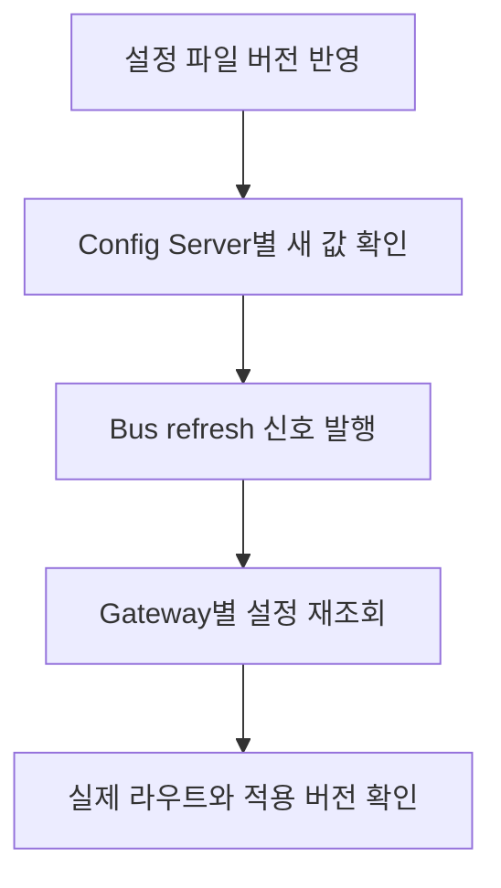

면접에서는 먼저 구현한 범위를 짧게 답하고, 추가 질문이 나오면 선택의 비용과 확인한 한계를 설명한다. 아래 답변은 Gateway 설정 관리 코드와 후속 로컬 실험에 근거한다. 운영 성능 개선 수치로 제시할 자료는 아니다.

## 어떤 캐시를 어디에 썼나요?

> Config Server가 구성한 `Environment`를 프로세스 내부의 `ConcurrentHashMap<String, Environment>`에 저장했습니다. application, profile, 파일 수정 시각으로 키를 만들고, 같은 키면 기존 객체를 반환합니다. Caffeine을 사용한 구현은 아닙니다.

**꼬리 질문: 파일 접근도 없어지나요?**

아니다. hit 여부를 판단하기 전에 파일 존재 여부, 읽기 가능 여부, mtime과 크기를 조회한다. hit에서 생략하는 것은 native repository의 설정 재구성이다. 따라서 파일시스템 metadata 비용과 응답 직렬화 비용은 남는다.

**꼬리 질문: 파일이 작으면 캐시가 필요 없지 않나요?**

파일 크기만으로 결정하기 어렵다. 파싱과 객체 생성이 반복되는지, 요청이 얼마나 몰리는지 함께 봐야 한다. 후속 실험의 합성 YAML은 20개, 총 76,403 bytes였다. Java 객체의 heap 점유량은 별도로 측정하지 않았다. 이 숫자로 운영 메모리가 충분하다고 결론 내릴 수는 없다.

코드 근거는 `sp-gw-mgmt@private-revision`의 `src/main/java/com/example/configserver/StateAwareNativeEnvironmentRepository.java`다. `cache`, `findOne`, `getFileInfo`, `buildCacheKey`를 함께 읽으면 조회 순서가 보인다. 캐시 도입은 비공개 이력, 키 구성 변경은 비공개 이력이며 비공개 이력는 분석과 실험 기준이다. 실험 데이터는 블로그 저장소의 `demos/gateway-config/2026-09-08-results.json`에 있다.

## 왜 Redis, Memcached, DB를 쓰지 않았나요?

> 이 구현의 목적은 이미 파일에 있는 설정을 매번 재구성하는 비용을 줄이는 것이었습니다. 로컬 map이면 원격 왕복 없이 객체를 재사용할 수 있습니다. 다만 세 제품을 비교 실험해서 배제했다는 근거는 없습니다. 지금 설계를 설명한다면 데이터 크기와 변경 빈도, 여러 서버의 일관성 요구부터 비교하겠습니다.

다음 표는 현재 관점의 설계 비교다. 당시의 제품 선정 기록이나 측정 결과를 대신하지 않는다.

| 선택 | 기대하는 이점 | 추가로 맡아야 할 일 |
|---|---|---|
| 로컬 map | 같은 프로세스에서 객체 재사용 | 서버별 중복 메모리, 크기 제한, 무효화 |
| Caffeine | 크기 제한과 만료, 로딩 정책 사용 | 올바른 키와 변경 버전 설계, 서버 간 반영 |
| Redis 또는 Memcached | 여러 서버가 공통 캐시를 조회하는 구성 | 네트워크 왕복, 직렬화, 장애 시 동작, 무효화 |
| DB를 설정 원본으로 사용 | 설정 버전과 변경 이력을 데이터 모델로 관리 가능 | 저장 방식 전환, 조회 부하, client 반영 절차 |

**꼬리 질문: 수치로 손익을 말할 수 있나요?**

외부 캐시의 지연과 운영 비용은 측정하지 않았다. 비교하려면 로컬 조회 비용뿐 아니라 원격 왕복과 직렬화 비용, miss 비율, replica 수를 같은 조건에서 재야 한다. 로컬 방식은 대략 `replica 수 × replica당 캐시 객체 크기`만큼 중복 저장한다. 실제 객체 크기가 없으므로 이 식에 YAML 파일 크기를 넣어 메모리 절감액을 만들지는 않는다.

SQLite mock API p95 32.325 ms와 Config Server warm p95 11.223 ms는 서로 다른 처리 경로의 측정이다. 이를 “DB보다 캐시가 약 3배 빠르다”로 답하면 비교 대상이 어긋난다.

## Caffeine과 ConcurrentHashMap은 어떻게 다른가요?

> ConcurrentHashMap은 동시 접근을 지원하는 map입니다. 현재 코드처럼 직접 쓰면 만료와 크기 제한, 중복 로딩 제어를 따로 설계해야 합니다. Caffeine은 이런 캐시 정책을 제공하지만, 라이브러리를 바꾸는 것만으로 잘못된 캐시 키나 서버 간 일관성이 해결되지는 않습니다.

Caffeine은 `maximumSize`, `maximumWeight`, 시간 기반 만료를 제공한다. `cache.get(key, mappingFunction)`은 없는 값을 계산하고 저장하는 작업을 원자적으로 수행하는 API다. 실제 프로젝트에는 이 API를 도입하지 않았다. [Caffeine Eviction](https://github.com/ben-manes/caffeine/wiki/Eviction), [Caffeine Population](https://github.com/ben-manes/caffeine/wiki/Population)

**꼬리 질문: 현재 map도 예전 키를 삭제하잖아요?**

`cleanupOldCacheEntries`는 같은 application/profile의 이전 버전 키를 제거한다. 전체 application/profile 수의 상한이나 TTL은 아니다. 코드상으로는 이전 버전 요청이 늦게 완료되며 새 키를 지우는 순서도 가능하다. 이 경우 최신 키 조회는 miss가 되어 다시 구성한다. 서로 다른 버전의 로딩과 정리가 원자적으로 묶이지 않는다는 뜻이며, 이 경쟁을 실행으로 재현한 결과는 아니다.

## ConcurrentHashMap은 동시성을 어떻게 해결하나요?

> Java 17 기준으로 조회는 일반적으로 락 없이 진행합니다. 갱신은 상황에 따라 CAS와 bin 단위 동기화를 사용합니다. 전체 map을 하나의 락으로 잠그는 방식도, 모든 연산이 lock-free인 방식도 아닙니다.

OpenJDK 17의 `putVal`은 빈 bin에 CAS로 노드를 넣고, 이미 노드가 있으면 해당 bin의 첫 노드를 기준으로 동기화한 뒤 갱신한다. resize에는 여러 스레드가 이전 작업을 돕는 경로가 있다. 과거 Java 구현의 segment 설명을 현재 구현에 그대로 적용하지 않는다. [OpenJDK 17 ConcurrentHashMap 소스](https://github.com/openjdk/jdk17u/blob/master/src/java.base/share/classes/java/util/concurrent/ConcurrentHashMap.java)

**꼬리 질문: get 다음 put도 안전한가요?**

각 호출은 안전하지만 그 사이의 작업은 하나의 원자 연산이 아니다. 현재 흐름을 축약하면 다음과 같다.

```java
Environment cached = cache.get(key);
if (cached != null) return cached;
Environment loaded = delegate.findOne(application, profile, label, includeOrigin);
cache.put(key, loaded);
return loaded;
```

두 요청이 모두 miss를 보면 둘 다 설정을 구성한다. 저장된 값의 안전한 공개와 중복 계산 방지는 별개다. 같은 키의 갱신과 그 값을 읽는 조회 사이에는 happens-before 관계가 있지만, 이것이 `get → load → put` 전체를 묶지는 않는다. [Java 17 API 계약](https://docs.oracle.com/en/java/javase/17/docs/api/java.base/java/util/concurrent/ConcurrentHashMap.html)

**꼬리 질문: computeIfAbsent로 바꾸면 끝인가요?**

동일 키의 값 생성은 묶을 수 있다. 다만 계산 중 다른 갱신이 대기할 수 있어 긴 파일 로딩을 넣을 때는 영향 범위를 봐야 한다. 실패 후 재시도, 다른 버전 키의 동시 로딩, 반환 객체의 변경 가능성도 남는다. API는 계산을 짧고 단순하게 유지하도록 안내한다. [computeIfAbsent 계약](https://docs.oracle.com/en/java/javase/17/docs/api/java.base/java/util/concurrent/ConcurrentHashMap.html#computeIfAbsent(K,java.util.function.Function))

## 파일이 바뀌면 반드시 새 값을 읽나요?

> 현재는 그렇지 않습니다. 키에 쓰는 mtime이 초 단위여서 같은 시각으로 보이는 변경을 놓칠 수 있습니다. 실제 HTTP 실험에서 파일 내용을 바꾸고 mtime을 복원하자 이전 값이 반환됐습니다.

| 실제 HTTP 조작 | 반환 version |
|---|---:|
| 최초 조회 | 1 |
| version 2 저장 후 기존 mtime 복원 | 1 |
| mtime을 2초 진행 | 2 |

**꼬리 질문: nanosecond나 hash로 바꾸면요?**

시간 해상도를 높이면 같은 초 충돌은 줄지만, mtime 보존과 공통 설정 파일 누락은 남는다. 내용 hash는 변경을 더 직접적으로 표현하지만 매번 계산하면 파일 내용을 읽는 비용이 생긴다. 개선한다면 배포 시 설정 묶음에 버전을 부여하고 불변 파일 묶음을 읽는 방안을 먼저 비교하겠다.

현재 키에는 `label`, `includeOrigin`이 없고 파일 추적은 첫 profile의 후보 파일을 기준으로 한다. delegate가 해석하는 전체 입력과 캐시 키가 같은 응답 범위를 표현하는지부터 확인해야 한다. 근거는 앞서 든 `buildCacheKey`, `getFileInfo`, `findOne`이다.

## 다른 서버의 캐시는 어떻게 맞추나요?

> Config Server replica의 캐시와 Gateway가 이미 적용한 설정은 별개입니다. 서버들이 같은 설정 버전을 읽게 한 뒤, Gateway에 재조회 신호를 보내고 실제 적용 결과를 확인해야 합니다. 현재 코드만으로 전 인스턴스의 동시 적용을 보장하지는 않습니다.

아래는 확인해야 할 순서다. 마지막 적용 확인까지 완료한 운영 실험을 뜻하지 않는다.



**꼬리 질문: Bus가 캐시 객체를 복제하나요?**

아니다. Spring Cloud Bus의 refresh는 `RefreshScope` 캐시를 지우고 `ConfigurationProperties`를 다시 바인딩하는 경로다. 이 프로젝트의 임의 `ConcurrentHashMap` 내용을 다른 서버에 복제하는 기능으로 설명할 수 없다. [Spring Cloud Bus 4.3 endpoint 문서](https://docs.spring.io/spring-cloud-bus/reference/4.3/spring-cloud-bus/bus-endpoints.html)

**꼬리 질문: 한 서버만 이벤트를 놓치면요?**

Gateway에는 1시간 주기의 자기 refresh 호출이 있다. 하지만 요청 실패와 최종 route 적용까지 확인하지 않았으므로 “1시간 안에 반드시 복구”라고 말할 수 없다. 보강한다면 마지막 적용 성공 시각과 버전을 노출하고, 재시도와 인스턴스별 수렴 확인을 추가하겠다.

클라이언트 근거는 `gateway-example`의 `src/main/java/com/example/apigateway/route/SelfRefreshScheduler.java`와 `src/main/resources/application.yaml`이다. Bus 의존성 추가는 비공개 이력, 주기 변경은 비공개 이력이다. 서버 파일 변경을 자동으로 감시해 Bus를 호출하는 기능은 확인되지 않았다.

## 직접 확인할 자료

원본 저장소는 로컬의 `private-workspace`와 `gateway-example`다. 비공개 코드는 위 파일 경로와 커밋으로 추적하며, 공개 저장소 링크를 추정해 만들지 않았다.

블로그 저장소에서 다음 명령을 실행하면 mtime 충돌과 동시 miss를 확인할 수 있다.

```bash
python3 demos/gateway-config/cache_boundary_demo.py
```

이 Python Demo는 Java 구현의 일부 원리를 축약한 학습 모델이다. Spring 성능 측정은 아니다. 실제 HTTP 수치와 실험 조건은 [다음 편](/blog/interview-prep-02-gateway-performance)에서 이어서 정리한다.
