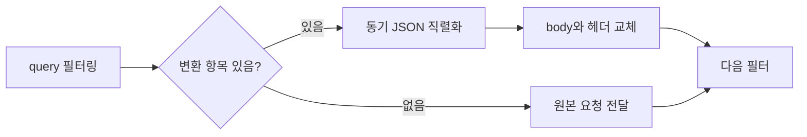

Gateway의 요청 변환 구현과 Config Server의 부하 실험은 서로 다른 근거다. 요청 필터를 구현했다는 설명에 설정 서버의 RPS를 붙여 전체 Gateway 성능을 입증한 것처럼 답하지 않도록 나눠 준비했다.

## Gateway에서 직접 바꾼 것은 무엇인가요?

> query parameter를 JSON body로 바꾸는 라우트 필터를 구현했습니다. 복수 값은 배열로 보존하고, 지정된 이름은 변환에서 제외합니다. 외부 Config Server 연결과 주기적 refresh, Bus 연결 구성도 작업했습니다. 인증과 응답 정규화 전체를 제 단독 구현으로 설명하지는 않습니다.

**꼬리 질문: 왜 서비스 대신 Gateway에서 바꿨나요?**

서로 다른 요청 형식을 라우트 설정으로 연결할 수 있기 때문이다. 다만 당시의 모든 대안 검토가 코드에 기록된 것은 아니다. 설계 관점에서 설명하면 기존 클라이언트와 서비스의 배포를 함께 맞추는 부담을 줄이는 대신, Gateway가 변환 계약을 맡게 된다. 업무 규칙까지 계속 넣으면 서비스 변경이 Gateway 변경으로 번지므로 범위를 제한해야 한다.

개인 구현 근거는 `sp-gw`의 `8c1e8cb`, 제외 항목 추가는 `48d48ea`다. 기준 HEAD는 `9c7dc07`이며 파일은 `src/main/java/com/avis/apigateway/filter/QueryParameterToRequestBodyGatewayFilterFactory.java`다.

## 실제 입력과 출력으로 설명해 보세요

> 한 값은 문자열, 같은 이름의 여러 값은 배열로 만듭니다. 숫자처럼 보여도 문자열을 유지합니다. 변환할 query가 하나라도 있으면 기존 body를 대체하고, 전부 제외되면 원래 요청을 그대로 통과시킵니다.

다음은 코드 동작을 설명하는 예시다. 운영 요청 기록은 아니다.

| 입력 query | `excludes` | 결과 body |
|---|---|---|
| `age=30` | 없음 | `{"age":"30"}` |
| `tag=a&tag=b` | 없음 | `{"tag":["a","b"]}` |
| `name=Kim&trace=t1` | `trace` | `{"name":"Kim"}` |
| `trace=t1` | `trace` | 기존 body 유지 |

**꼬리 질문: 기존 JSON과 병합하나요?**

병합하지 않는다. 변환할 query가 있으면 새 body가 우선한다. 따라서 기존 body도 보내는 클라이언트가 있다면 덮어쓰기를 계약에 명시하거나 입력을 제한해야 한다.

**꼬리 질문: 제외한 query는 민감정보 제거에도 쓸 수 있나요?**

현재 필터는 원본 URI를 수정하지 않는다. `excludes`는 JSON으로 옮길 항목만 제외하며 원래 query는 뒤쪽 서비스에 남는다. 보안 목적의 제거라고 답하면 실제 구현과 다르다.

**꼬리 질문: GET을 POST로 바꾸는 건가요?**

method도 유지한다. GET에 body가 생기는 경우에는 상대 서버와 중간 장비가 이를 어떻게 취급하는지 확인해야 한다. HTTP 표준은 GET content에 일반적으로 정의된 의미가 없다고 설명한다. 이 필터를 어떤 method의 라우트에 적용할지 별도 계약이 필요하다. [RFC 9110, GET](https://www.rfc-editor.org/rfc/rfc9110.html#section-9.3.1)

코드에서는 `convertQueryParamsToMap`이 타입과 제외 규칙을, `apply`의 `bodyMap.isEmpty()`와 `ServerHttpRequestDecorator`가 통과 및 교체 분기를 보여준다.

## WebFlux인데 JSON 직렬화도 비동기인가요?

> 이 코드의 ObjectMapper 호출은 현재 스레드에서 동기적으로 실행됩니다. 필터에 `block()`이 없다는 것과 모든 작업이 비동기라는 것은 다릅니다. 큰 입력을 허용하면 직렬화 CPU 시간과 메모리 할당이 요청 처리에 영향을 줄 수 있습니다.

WebFlux는 적은 수의 스레드로 동시 요청을 처리하는 non-blocking 모델을 사용한다. 따라서 호출 스레드에서 긴 작업을 하면 다른 요청에도 영향을 줄 수 있다는 점을 고려해야 한다. [Spring WebFlux 개요](https://docs.spring.io/spring-framework/reference/web/webflux/new-framework.html)

아래는 원본 필터의 처리 순서다.



**꼬리 질문: 무조건 다른 스레드로 보내면 되나요?**

작은 query를 직렬화할 때도 스케줄링 비용이 생긴다. 먼저 허용 입력 크기와 직렬화 시간, event loop 지연을 측정하겠다. 블로킹 I/O를 섞는 경우와 짧은 CPU 작업은 같은 처방으로 다루지 않겠다. 이 프로젝트에서 해당 비교 실험을 수행한 근거는 없다.

**꼬리 질문: body를 바꾸면 헤더는요?**

복사한 헤더의 Content-Type을 JSON으로 바꾸고 Content-Length를 `jsonBytes.length`로 설정한다. 한글은 글자 수와 byte 수가 다르므로 byte 배열 길이를 써야 한다. 다만 원래 Content-Encoding이나 Transfer-Encoding이 남는 경우까지 통합 검증한 근거는 없다. RFC는 Content-Length를 octet 수로 정의하고 잘못된 길이 전달의 위험을 설명한다. [RFC 9110, Content-Length](https://www.rfc-editor.org/rfc/rfc9110.html#section-8.6)

## 회귀 테스트는 어디까지 있나요?

> 과거 커밋에는 query 변환과 query가 없는 요청의 통과를 확인하는 테스트가 있습니다. 기준 HEAD에는 필터 테스트가 남아 있지 않고 context test만 있습니다. 현재 필터의 모든 계약이 자동 검증된 상태라고 답할 수는 없습니다.

과거 파일은 `sp-gw@6f3b8cf`의 `src/test/java/com/avis/apigateway/filter/QueryParameterToRequestBodyGatewayFilterFactoryTest.java`다. 다음처럼 당시 소스를 조회할 수 있다.

```bash
git show 6f3b8cf:src/test/java/com/avis/apigateway/filter/QueryParameterToRequestBodyGatewayFilterFactoryTest.java
```

**꼬리 질문: 먼저 어떤 테스트를 추가하겠어요?**

기존 body와 query가 함께 있는 경우, 모든 query가 제외된 경우, 복수 값과 한글, URI와 method 유지 여부를 확인하겠다. 실제 upstream이 받은 최종 body와 헤더도 검사해야 decorator 단위 테스트와 HTTP 전송 결과의 차이를 잡을 수 있다. 이는 후속 검증 계획이며 이번 문서에서 실행한 테스트는 아니다.

## 어느 정도 규모를 대상으로 부하를 줬나요?

> 플랫폼 구성 자료의 20개 application, 합계 38개 Pod를 기준으로 후속 로컬 실험에 합성 YAML 20개와 최대 38개의 Python HTTP worker를 만들었습니다. 실제 Kubernetes Pod 38개를 띄운 실험은 아닙니다.

구성 자료의 일반 서비스 18개에 replica 2개씩, batch 2개에 하나씩을 실험 토폴로지에 반영했다. 운영 배포 목록을 직접 집계한 값은 아니다. 38개 모두가 Gateway나 Bus 구독자라는 의미는 아니다. fixture에는 application당 route 20개, 총 400개의 route 모양 설정을 넣었다. 실제 운영 route 수가 아니다.

**꼬리 질문: Gateway를 통과해 backend까지 호출했나요?**

아니다. 측정 대상은 Config Server의 설정 조회였다. 별도로 측정한 Python mock API는 SQLite를 읽었지만, Config Server가 그 API를 통해 DB를 조회하지는 않았다. Gateway 요청 변환 필터의 지연이나 전체 API 처리량은 이 실험으로 알 수 없다.

근거는 `sp-gw-mgmt@2afe725`의 `load-test/scripts/load_test.py`, `load-test/scripts/run.sh`, `load-test/results/latest.json`이다. 블로그 저장소에 당시 JSON을 `demos/gateway-config/2026-09-08-results.json`으로 보관했다.

## 수치가 얼마나 좋아졌나요?

> 로컬 실험에서 초기 조회 p95는 69.207 ms, warm 반복 조회는 11.223 ms였습니다. 다만 요청 수와 구간 길이가 다르고 cache-off 대조군이 없어 운영 개선 배수로 환산하지 않습니다. 설정 조회의 관찰값으로만 설명하겠습니다.

| Config Server 시나리오 | 요청 수 | p95 | 측정 구간 | HTTP 오류 |
|---|---:|---:|---:|---:|
| 초기 조회 | 38 | 69.207 ms | 0.072초 | 0 |
| warm 반복 조회 | 1,900 | 11.223 ms | 0.320초 | 0 |
| 변경 없는 재조회 burst | 38 | 3.018 ms | 0.006초 | 0 |

측정은 2026-09-08, macOS arm64의 같은 머신에서 loopback으로 실행했다. Java는 Corretto 17.0.10, Spring Boot는 3.5.6이다. Kubernetes resource limit은 적용하지 않았고 warm RPS는 5,945.42였다.

**꼬리 질문: 그러면 초당 약 6천 요청을 처리할 수 있나요?**

이 조건의 0.320초 구간에서 관찰한 처리량이다. 지속 부하, CPU 제한, GC 변화, 다른 client 수에서도 유지되는지는 모른다. 운영 용량을 답하려면 더 긴 구간과 반복 측정, 자원 사용량이 필요하다.

**꼬리 질문: 오류 0이면 응답도 정확했나요?**

이 집계는 HTTP 200 기준이다. 3,876건의 정량 요청이 200이었지만 모든 응답 필드를 검증한 것은 아니다. version과 state는 별도의 3회 invalidation 조회에서 확인했다. 그 실험은 같은 mtime에서 stale 값이 남는 문제를 재현했다.

**꼬리 질문: 3 ms면 모든 서버에 설정이 반영됐나요?**

아니다. 하네스는 Bus를 비활성화했고 변경 없는 설정을 재조회했다. JSON의 `bus_refresh_burst_38_pods`라는 이름은 시나리오 의도이며 RabbitMQ 전파나 route 적용 시간의 측정값이 아니다.

## 다시 측정한다면 무엇을 바꾸겠어요?

> 캐시 유무만 다르게 한 두 서버를 같은 데이터와 부하로 비교하겠습니다. 준비 확인이 캐시를 미리 채우지 않도록 하고, warm-up과 측정 구간을 분리하겠습니다. latency와 오류율뿐 아니라 CPU, heap, GC, delegate 호출 횟수도 함께 보겠습니다.

**꼬리 질문: 기존 cold 측정에는 어떤 문제가 있나요?**

readiness가 `service-01/local`을 조회하므로 대상 캐시를 미리 채울 수 있다. fixture를 다시 생성해도 초 단위 mtime이 같을 수 있다. 따라서 빈 애플리케이션 캐시를 보장하지 못하며 JVM이나 OS page cache가 차가운 상태를 뜻하지도 않는다.

**꼬리 질문: closed-loop 부하가 왜 문제인가요?**

각 worker가 응답을 기다린 뒤 다음 요청을 처리하면 서버가 느려질수록 새 요청 발생도 줄어든다. 외부에서 일정한 속도로 요청이 계속 도착하는 상황을 충분히 모사하지 못할 수 있다. 고정 arrival-rate 실험을 함께 사용하고 목표 부하를 발생기가 실제로 보냈는지도 확인하겠다. [k6의 open/closed model 설명](https://grafana.com/docs/k6/latest/using-k6/scenarios/concepts/open-vs-closed/)

**꼬리 질문: Gateway 성능은 어떻게 따로 재겠어요?**

같은 backend에 직접 호출하는 경로, Gateway를 통과하는 경로, 변환 필터까지 적용한 경로를 비교하겠다. 단일 값과 복수 값, 입력 크기를 바꾸고 응답 지연과 CPU를 함께 기록하겠다. 설정 전파 실험은 별도로 두 Gateway의 적용 버전과 실제 목적지 응답을 비교하겠다. 아직 수행한 결과는 없다.

## 답변 전 확인할 근거

| 말하려는 내용 | 확인할 자료 |
|---|---|
| 개인 구현 범위와 과거 테스트 | `docs/sp-gw-interview/source-map.md` |
| body 대체와 타입 규칙 | `sp-gw@9c7dc07`의 `QueryParameterToRequestBodyGatewayFilterFactory.apply`, `convertQueryParamsToMap` |
| 실험 수치 | `demos/gateway-config/2026-09-08-results.json` |
| 실험 실행 범위 | `demos/gateway-config/README.md`, 원본 `load-test/scripts/run.sh` |
| 캐시의 동시성 및 stale 조건 | [면접 준비 1편](/blog/interview-prep-01-cache-consistency) |

원본은 로컬 `Work/mobility/backup/GatewayPoC/sp-gw`와 `sp-gw-mgmt`에 있다. 구현 코드, 후속 실험, 아직 실행하지 않은 개선안을 나눠 답하면 숫자와 기술 용어보다 실제로 판단한 내용을 설명하기 쉽다.
