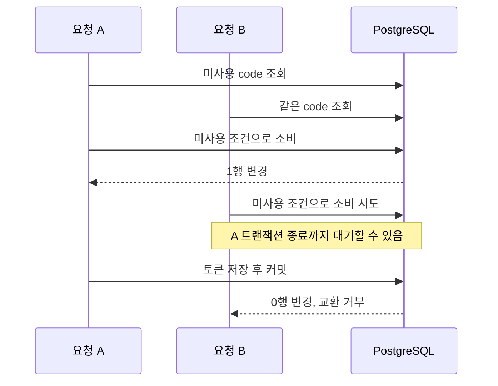

이 경험은 자체 회원 인증과 OAuth 인가 경로를 구현하고, 포털/BFF와 실제 SMS, 개발 PostgreSQL을 연결해 검증한 작업이다. 운영 트래픽이나 장애 감소 수치는 없다. 면접에서는 처리량보다 **동시에 요청해도 지켜야 하는 조건**을 먼저 설명한다.

구현 근거는 비공개 인증 서비스의 상태 전이와 동시성 테스트다. 업무 저장소의 이름·패키지·커밋은 공개 문서에서 제거했고, 일반 원리는 공개 표준 문서로 연결했다.

## “가장 어려웠던 문제는 무엇인가요?”

**짧은 답변.** “OTP를 맞혔다는 사실과 계정을 변경할 권한을 구분하는 일이었습니다. 가입에서는 서버가 검증한 번호만 저장했고, 비밀번호 복구에서는 변경 직전에 번호와 계정의 결합을 다시 잠그고 확인했습니다. 화면에서 인증 완료가 보인다는 사실만으로 저장을 허용하지 않았습니다.”

**꼬리질문: OAuth를 직접 구현해야 했나요?**

“당시에는 기존 DB와 UI 계약을 연결하는 자체 구현을 선택했습니다. 인증원 요구가 LDAP, ADFS, 자체 회원으로 바뀌는 동안 client가 보는 authorize/token 계약을 유지하려는 목적이 있었습니다. LDAP와 ADFS는 설계 검토 범위였습니다. 지금 다시 선택한다면 SAS 확장 가능성을 먼저 비교하겠습니다. 자체 구현에는 보안 권고를 직접 따라가야 하는 비용이 있습니다.”

SAS 비교 실험은 사후에 수행한 별도 작업이다. 당시 제품에 SAS를 적용했다는 뜻은 아니다. 기존 상세 기록은 `src/content/posts/oauth-auth-platform-01-protocol-boundary.md`와 `oauth-auth-platform-05-sas-extension-experiment.md`에 있다.

## “Authorization code를 동시에 두 번 보내면요?”

**짧은 답변.** “조회한 사용 여부만 믿으면 둘 다 통과할 수 있습니다. client, redirect, 만료, PKCE를 검사한 뒤 미사용 code를 조건부 UPDATE하고, 영향받은 행이 정확히 하나일 때만 토큰을 발급했습니다.”

두 요청이 같은 code를 읽더라도 소비 단계에서는 한 요청만 진행해야 한다.

**꼬리질문: `synchronized`로 막으면 안 되나요?**

“같은 JVM 안의 호출만 묶습니다. 여러 서버가 같은 code를 받는 상황에는 공통 DB에서 소비를 결정해야 합니다. 이 구현은 애플리케이션 락에 의존하지 않습니다.”

**꼬리질문: 조건부 UPDATE에는 락이 없나요?**

“UPDATE도 DB의 행 잠금을 사용합니다. 애플리케이션이 먼저 `SELECT FOR UPDATE`를 호출하는 방식과 구분해야 합니다. 여러 필드를 읽고 상태를 계산하는 OTP 경로는 명시적 행 잠금을 쓰고, 일회용 소비는 조건부 변경 결과로 성공을 판정했습니다.” PostgreSQL의 행 잠금은 같은 행의 충돌하는 변경을 기다리게 하며, 보통 트랜잭션 종료까지 유지된다. [PostgreSQL Explicit Locking](https://www.postgresql.org/docs/current/explicit-locking.html#LOCKING-ROWS)

**꼬리질문: code 소비 뒤 토큰 저장이 실패하면요?**

“`TokenService.exchange`의 트랜잭션 안에서 소비와 발급을 처리합니다. 롤백 대상 예외가 발생하면 DB 변경은 함께 취소됩니다. 하지만 커밋 후 응답만 유실되면 서버 상태는 이미 진행됐습니다. DB 트랜잭션이 HTTP 응답 전달까지 보장하지는 않습니다.”

코드 근거: `authz/token/service/TokenService.java`의 `exchange`, `exchangeAuthorizationCode`; `authz/repository/AuthzCodeRepository.java`의 `markUsed`.

## “PKCE와 client secret은 무엇이 다른가요?”

**짧은 답변.** “client secret은 confidential client를 인증하는 재료입니다. PKCE는 이번 인가 요청에서 만든 verifier를 code 교환 요청이 알고 있는지 확인합니다. S256에서는 verifier의 SHA-256 결과를 Base64url로 인코딩한 challenge를 먼저 보내고, 교환할 때 verifier를 보내 대조합니다. code만 탈취한 요청은 이 검증을 통과할 수 없습니다.” [RFC 7636 §4](https://www.rfc-editor.org/rfc/rfc7636.html#section-4)

**꼬리질문: `state`와 `nonce`도 같은 역할인가요?**

“state는 client가 시작한 요청과 돌아온 응답을 묶어 CSRF를 방어하는 데 사용합니다. OIDC nonce는 ID Token을 인증 요청과 연결하고 재생을 탐지하는 값입니다. 각각 보관과 검증 주체를 확인해야 합니다. 여기서 nonce는 개념 비교이며, 이 프로젝트에서 OIDC 전체 계약을 구현했다는 뜻은 아닙니다.” [RFC 9700 §4.7](https://www.rfc-editor.org/rfc/rfc9700.html#section-4.7), [OIDC Core ID Token](https://openid.net/specs/openid-connect-core-1_0.html#IDToken)

**꼬리질문: 모든 client에서 S256을 강제했나요?**

“운영 정책은 S256을 강제하고 redirect와 client binding을 함께 검증해야 합니다. 비공개 환경의 하위 호환 설정과 현재 배포 상태는 공개 문서에서 제거했습니다.”

코드 근거: `authz/domain/pkce/CodeChallenge.java`의 `verify`, `TokenService.exchangeAuthorizationCode`가 선택한 `PkceVerifyStep`의 호출. PKCE를 사용하더라도 redirect와 client binding 검증을 생략하지 않는다.

## “Refresh rotation을 넣으면 탈취 문제는 끝나나요?”

**짧은 답변.** “기존 refresh를 조건부 폐기하고 새 access/refresh를 발급했습니다. 이전 refresh를 다시 쓰면 거부하지만, 토큰 계보 전체를 찾아 폐기하는 기능까지 구현했다고 말하지는 않습니다.”

**꼬리질문: 정상 요청 두 개가 동시에 갱신하면요?**

“기존 refresh를 폐기한 한 요청만 진행하고 다른 요청은 실패합니다. BFF에서는 갱신 요청을 하나로 합치는 방법을 검토할 수 있습니다. 여러 BFF 인스턴스라면 프로세스 내부 락만으로 충분하지 않습니다. 이 조정 기능을 구현 완료로 설명하지는 않습니다.”

**꼬리질문: 새 refresh 응답을 잃어버린 뒤 재시도하면요?**

“이전 토큰이 폐기됐으므로 실패할 수 있습니다. 재로그인을 허용할지, 제한된 재시도 유예나 동일 결과 반환을 설계할지 결정해야 합니다. 유예를 주면 탈취 토큰도 다시 쓸 수 있는 시간이 생깁니다. 현재 구현에 유예가 있다고 말할 수는 없습니다.”

**꼬리질문: rotation 없이 만료를 짧게 하면요?**

“탈취 토큰의 사용 시간을 줄일 수 있지만 재사용 탐지와 같은 기능은 아닙니다. RFC 9700은 public client의 refresh 보호에 sender constraint 또는 rotation을 요구합니다. 어떤 client를 허용하는지와 실제 보호 수단을 함께 확인해야 합니다.” [RFC 9700 §4.14.2](https://www.rfc-editor.org/rfc/rfc9700.html#section-4.14.2)

구현은 기존 refresh token의 조건부 폐기가 정확히 1건 성공했을 때만 새 토큰을 발급한다. 새 토큰에는 기존 절대 만료 시각을 전달하므로 갱신만으로 절대 수명을 계속 늘리지 않는다. 내부 클래스와 repository 위치는 생략했다.

## “SMS 호출을 트랜잭션에 넣으면 더 안전하지 않나요?”

**짧은 답변.** “DB가 롤백돼도 이미 보낸 SMS는 취소되지 않습니다. 가입 OTP는 상태를 먼저 커밋하고 SMS를 보냅니다. 발송 예외가 나면 현재 상태가 방금 준비한 상태와 같을 때만 보상했습니다.”

**꼬리질문: 왜 무조건 이전 값으로 복구하지 않나요?**

“실패 응답이 늦게 오는 동안 다른 요청이 새 상태를 만들었을 수 있습니다. 오래된 실패가 최신 인증 상태를 덮으면 안 됩니다. `restorePhoneChallenge`는 행을 잠그고 준비 상태와 현재 상태를 비교한 다음 조건부로 복구합니다.”

**꼬리질문: timeout이면 문자가 안 간 게 확실한가요?**

“아닙니다. 상대가 발송했지만 응답을 못 받은 경우도 있습니다. 보상은 로컬 상태를 정리하는 동작이지 SMS 미발송을 증명하지 않습니다. 제공자의 요청 ID, 결과 조회, 멱등성 계약이 있으면 이 모호함을 줄일 수 있습니다. 이번 구현에 그런 보장을 추가했다고 말하지는 않습니다.”

**꼬리질문: Outbox를 쓰면 해결되나요?**

“DB 상태와 발송할 작업을 함께 저장해 커밋 직후 프로세스가 죽어 작업이 사라지는 구간을 줄일 수 있습니다. 다만 worker가 전송한 직후 완료 기록 전에 죽으면 중복 전송 가능성이 남습니다. 수신 측 멱등성이나 중복 허용 정책이 필요하고, 이 프로젝트의 현재 구현은 직접 발송과 조건부 보상입니다.”

코드 근거: `signup/service/SignupPhoneVerificationService.java`의 `challenge`, `restoreOrThrow`; `SignupSessionService.java`의 `preparePhoneChallenge`, `restorePhoneChallenge`. SMS 호출 서비스와 트랜잭션을 여는 세션 서비스가 분리돼 있다.

## “OTP가 맞았는데 계정을 왜 다시 조회하나요?”

**짧은 답변.** “OTP는 그 연락처에 접근할 수 있다는 증거입니다. 비밀번호를 바꿀 계정이 지금도 그 연락처와 연결됐는지는 별도로 확인해야 합니다. 번호와 login ID로 계정을 찾고, 관련 행을 잠근 뒤 결합을 재검증했습니다.”

**꼬리질문: 같은 번호로 두 계정이 나오면 첫 번째를 쓰나요?**

“복구할 계정이 모호하면 거부합니다. 활성 password도 정확히 하나여야 합니다. 임의의 첫 행을 선택하면 잘못된 계정을 변경할 수 있습니다.”

**꼬리질문: OTP 발송 횟수 제한을 복구 세션에만 두면요?**

“세션 단위 제한만으로는 부족할 수 있습니다. 복구에서는 복수 신호를 조합한 비가역 조회 키와 DB의 원자적 카운터를 사용했습니다. 계정·네트워크·기기 축의 다층 제한은 후속 설계 항목입니다. 구체적인 키 구성과 우회 조건은 공개하지 않습니다.”

**꼬리질문: 비밀번호 변경과 완료 SMS는 언제 확정되나요?**

“`PasswordResetService.reset`에서 비밀번호 변경, 잠금 해제, 복구 세션 완료를 한 트랜잭션으로 처리합니다. 호출자가 반환받은 뒤 완료 SMS를 보냅니다. 알림이 실패해도 비밀번호 변경은 되돌리지 않습니다. 커밋 직후 프로세스 종료로 알림이 누락될 가능성은 남습니다.”

**꼬리질문: 같은 클래스의 `@Transactional` 메서드를 호출해도 되나요?**

“기본 프록시 방식에서는 자기 호출이 새 트랜잭션 경계를 만들지 않습니다. 그래서 복구 서비스에서 별도 `PasswordResetService` Bean을 호출하도록 분리했습니다. 애노테이션 유무뿐 아니라 프록시를 거치는 호출인지 확인합니다.” [Spring 트랜잭션 프록시 동작](https://docs.spring.io/spring-framework/reference/data-access/transaction/declarative/annotations.html)

구현은 비밀번호 변경, 잠금 해제, 복구 세션 완료를 하나의 트랜잭션으로 묶고 계정과 연락처의 결합을 잠금 상태에서 재검증한다. 발송 카운터와 OTP 오답 검증 횟수는 다른 제한이다. 내부 클래스·메서드·repository 이름은 생략했다. 계정 존재 여부를 드러내지 않는 응답, 만료와 일회용 복구 토큰, 요청 제한의 일반 원칙은 [OWASP Forgot Password Cheat Sheet](https://cheatsheetseries.owasp.org/cheatsheets/Forgot_Password_Cheat_Sheet.html)에서 확인할 수 있다.

**꼬리질문: 비밀번호 저장 방식은 어떻게 개선하겠어요?**

“현재 구현은 기존 비밀번호 저장 계약과의 호환성을 유지합니다. 구체적인 레거시 알고리즘과 함수명은 공개하지 않습니다. 새 버전의 해시 형식을 구분해 저장하고, 로그인 성공 시 Argon2id 같은 password KDF로 재해시하는 이행안을 검토하겠습니다.” [OWASP Password Storage](https://cheatsheetseries.owasp.org/cheatsheets/Password_Storage_Cheat_Sheet.html)

## 면접 직전 확인할 세 가지

- 수치 질문에는 개발계 검증 범위를 답한다. 운영 TPS와 사고 감소율은 측정하지 않았다.
- 이메일 복구의 계정 정본과 credential 변경은 SMS 경로와 같다고 설명하지 않는다.
- 기존 저장 계약의 호환성을 유지한 것이며, modern password KDF로의 이행은 별도 과제다.

[다음: 배포와 외부 API](/blog/interview-prep-04-delivery-external-api)
