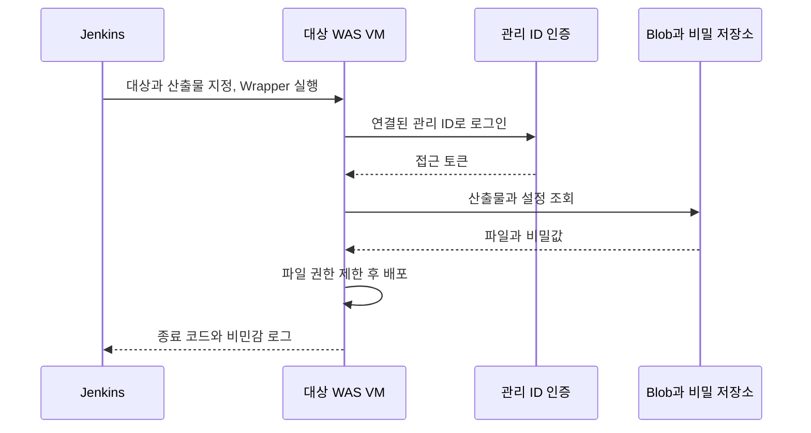

배포 경험과 외부 API 경험에서 공통으로 받기 쉬운 질문은 “실패했을 때 어디까지 영향을 받나요?”다. 아래 답변은 당시 운영 변경과 이후 로컬 재현 실험을 구분한다. 배포 시간 단축률이나 외부 API 응답시간 개선율은 측정한 근거가 없다.

## “어느 정도 규모의 배포였나요?”

**짧은 답변.** “차량용 소프트웨어를 제공하는 3개 OEM 사이트의 CI/CD를 구축했습니다. 사이트별 설정과 복수 WAS VM을 다뤘고, 운영 CD는 한 번 실행할 때 한 VM만 바꾸도록 나눴습니다. 잘못된 대상 입력과 원격 실행 실패가 Jenkins 실패로 나타나게 했습니다.”

**꼬리질문: 그러면 무중단 배포인가요?**

“한 VM씩 바꾼다는 사실만으로 무중단은 아닙니다. 코드에는 로드 밸런서 트래픽 제외와 복귀, 배포 후 health check, 자동 롤백이 없습니다. 다른 VM이 요청을 받을 수 있는지 확인하고 각 배포 사이에 운영 점검이 필요했습니다.”

**꼬리질문: 한 Job에서 순서대로 바꿔도 되지 않나요?**

“가능합니다. 다만 첫 VM의 상태를 확인하기 전에 다음 VM도 바뀌는 흐름을 피하려고 실행 자체를 나눴습니다. 검증을 통과해야 다음 VM으로 넘어가는 자동 게이트를 만든다면 한 Job에서도 같은 목적을 달성할 수 있습니다.”

**꼬리질문: 다운로드가 실패하면 이미 서비스가 내려갔나요?**

“다운로드를 먼저 끝내고 WAS를 중지하도록 했습니다. 하지만 중지 이후 파일 교체나 기동이 실패하면 서비스가 내려간 상태로 남을 수 있습니다. 이전 산출물 보존, 복원 절차, health check를 연결하는 것이 다음 개선입니다.”

코드 근거는 업무 저장소 `navupd/backend/cd_issue_resolve/<OEM>/prd/cd_pipeline.v3-uami-noproxy.groovy`다. 고객사 디렉터리명은 생략했다. `allServers.findAll { it.id == params.TARGET_VM }`, 입력 검증, 원격 Wrapper의 `set -Eeuo pipefail`과 종료 코드 전달을 확인했다. 상세 기록은 `src/content/posts/navigation-cd-01-targeted-deployment.md`에 있다. 최종 운영 성공 로그는 이 포트폴리오에 보관돼 있지 않으므로, 배포 성공률을 계산하지 않는다.

## “Managed Identity로 무엇이 달라졌나요?”

**짧은 답변.** “Azure에 접근하는 주체를 Jenkins에서 대상 WAS VM으로 옮겼습니다. VM이 자신의 사용자 할당 관리 ID로 산출물과 비밀값을 조회하므로, Jenkins가 스토리지 고정 키와 애플리케이션 비밀값을 받아 원격 명령에 넣는 경로를 없앴습니다.”

변경 후 비밀값은 대상 VM이 조회하며, Jenkins는 실행과 결과 수집을 맡는다.

**꼬리질문: client ID는 비밀인가요?**

“사용할 ID를 지정하는 식별자입니다. 비밀번호 역할은 아닙니다. 그 관리 ID가 VM에 연결돼 있어야 하고 대상 리소스의 권한도 있어야 합니다. 이 구성을 준비한 VM에서 `az login --identity --client-id`를 사용했습니다.” [Microsoft Azure CLI 관리 ID 로그인](https://learn.microsoft.com/en-us/cli/azure/authenticate-azure-cli-managed-identity?view=azure-cli-latest)

**꼬리질문: Jenkins가 침해돼도 안전한가요?**

“그렇게 말할 수는 없습니다. Jenkins에 VM 원격 실행 권한이 남아 있으면 VM 권한을 악용할 가능성이 있습니다. 없앤 것은 비밀값이 Jenkins를 통과하는 경로입니다. SSH 권한과 호스트 검증, VM의 최소 권한은 별도로 관리해야 합니다.”

**꼬리질문: TLS 오류에 RBAC을 바꾸면 안 되나요?**

“인증서 검증 실패는 권한 평가보다 앞선 문제입니다. CLI 옵션, 메타데이터 도달 여부, ID 연결, TLS 신뢰, 리소스 권한을 나눠 확인했습니다. 인증서를 신뢰하지 못하는 상태를 권한 추가로 해결할 수는 없습니다.”

**꼬리질문: 진단 모드가 실패하면 배포를 막나요?**

“현재 코드는 경고를 출력한 뒤 `exit 0`으로 끝나고 실제 배포도 이어집니다. 차단 게이트라고 설명하면 틀립니다. 진단 전용 모드를 분리하고 필수 점검 실패 시 종료하도록 바꾸는 것이 후속 과제입니다.”

코드 근거: 같은 Groovy 파일의 Preflight 끝 `exit 0`, Wrapper의 `umask 077`, `az login --identity --client-id`, Blob 조회의 `--auth-mode login`. 상세 기록은 `src/content/posts/navigation-cd-02-managed-identity.md`에 있다.

## “RestTemplate을 매번 만들면 설정도 독립적이지 않나요?”

**짧은 답변.** “상위 객체가 달라도 같은 request factory를 넘겼다면 하위 설정은 공유됩니다. 기존 utility의 timeout setter가 공유 factory를 바꾸는 구조를 로컬에서 재현했습니다. 회고 개선군은 생성 시 설정을 끝내고 호출 중에는 setter를 쓰지 않습니다.”

**꼬리질문: `finally`에서 기본값으로 돌리면요?**

“예외 후 설정이 남는 문제는 줄일 수 있지만 동시 요청의 덮어쓰기는 남습니다. A가 설정한 뒤 B가 값을 바꾸고, 그 다음 A가 요청을 만드는 순서가 가능합니다. 복원 시점도 다른 요청에 영향을 줄 수 있습니다.”

**꼬리질문: 이 문제를 어떻게 재현했나요?**

“의도한 timeout이 50ms인 wrapper를 만든 뒤 같은 factory를 쓰는 1000ms wrapper를 만들었습니다. 첫 wrapper로 300ms 지연 응답을 받아 설정 간섭을 확인했습니다. 특정 순서를 고정한 테스트이며 실제 운영의 발생 빈도를 측정한 것은 아닙니다.”

**꼬리질문: 독립 설정마다 pool도 새로 만들어야 하나요?**

“반드시 그렇지는 않습니다. 요청 설정과 연결 용량은 별도 관심사입니다. 다만 같은 pool을 공유하면 한 파트너가 연결을 오래 잡을 때 다른 요청도 영향을 받습니다. Lab은 격리를 보여주기 위해 pool도 분리했습니다. 요청마다 새 pool을 만드는 구현은 아닙니다.”

코드 근거: [SharedFactoryTimeoutTest.java](https://github.com/inchangson/inchangson.github.io/blob/6fe3c578d608df417f3f2f4eb144323e8edc079c/lab/b2g-resttemplate-lab/src/test/java/com/example/b2glab/SharedFactoryTimeoutTest.java)의 `laterClientCreationOverwritesEarlierClientTimeout`, [FixedPartnerClient.java](https://github.com/inchangson/inchangson.github.io/blob/6fe3c578d608df417f3f2f4eb144323e8edc079c/lab/b2g-resttemplate-lab/src/main/java/com/example/b2glab/improved/FixedPartnerClient.java)의 생성자. 당시 운영 수정과 이후 개선군 실험을 섞어 설명하지 않는다.

## “timeout은 몇 초로 설정했나요?”

**짧은 답변.** “숫자 전에 대기 구간을 나눠 설명하겠습니다. 이 Lab의 HttpClient 4.5 계열에서는 pool에서 연결을 빌리는 대기, 연결 수립, 소켓 읽기 대기가 다릅니다. connect timeout만 짧게 해도 pool 고갈 대기는 제한되지 않습니다.”

| 설정 | 멈출 수 있는 위치 | 대응할 때 확인할 것 |
|---|---|---|
| connection request timeout | pool에서 연결 대기 | route 한도, leased와 pending |
| connect timeout | 새 연결 수립 | 목적지 접근과 네트워크 상태 |
| read timeout | 연결 후 데이터 읽기 | 상대 지연과 응답 body 처리 |

**꼬리질문: read timeout이 1초면 전체 호출도 1초 안에 끝나나요?**

“아닙니다. pool 대기와 연결 수립 시간이 있고, 읽기 timeout은 전체 업무 기한과 다릅니다. 상대가 데이터를 조금씩 계속 보내는 경우에도 총시간은 길어질 수 있습니다. 상위 요청의 남은 기한과 취소 정책을 함께 설계해야 합니다.”

**꼬리질문: pool이 작다는 근거는 무엇인가요?**

“leased, available, pending과 목적지별 대기 시간을 보겠습니다. 전체 한도가 남아도 특정 route 한도 때문에 기다릴 수 있습니다. Lab에서는 pool 1개를 첫 요청이 점유한 뒤 두 번째 요청이 50ms 대기 한도를 넘는 조건을 고정했습니다. 운영 최적 pool 크기를 산정한 결과는 아닙니다.”

**꼬리질문: pool 크기를 늘리면 해결되나요?**

“느린 상대에 보내는 동시 부하만 늘릴 수도 있습니다. 요청률과 연결 점유 시간, 상대의 허용 부하, 내부 대기 스레드를 함께 봅니다. 평균 점유량은 용량 추정의 출발점이지만 피크와 긴 응답시간까지 커버하는 상한은 부하 실험으로 확인해야 합니다.”

route별 pool과 응답 소비에 따른 연결 반환은 [Apache HttpClient 4.5 연결 관리 문서](https://hc.apache.org/httpcomponents-client-4.5.x/current/tutorial/html/connmgmt.html)에 설명돼 있다. Lab 근거는 [ImprovedBehaviorTest.java](https://github.com/inchangson/inchangson.github.io/blob/6fe3c578d608df417f3f2f4eb144323e8edc079c/lab/b2g-resttemplate-lab/src/test/java/com/example/b2glab/ImprovedBehaviorTest.java)의 `exhaustedPoolHasDifferentTimeoutFromSocketRead`다. 이 설명을 버전 확인 없이 HttpClient 5 설정 이름에 그대로 적용하지 않는다.

## “연결을 재사용했으니 더 빨라졌겠네요?”

**짧은 답변.** “연결 재사용은 확인했지만 속도 향상은 입증하지 못했습니다. 같은 pool로 20회 순차 요청했을 때 `Connection: close`가 있으면 서로 다른 원격 포트가 20개, 없으면 1개였습니다. 이는 연결을 구분하는 대용값이며 TCP SYN을 직접 센 결과는 아닙니다.”

**꼬리질문: 처리 시간도 측정했나요?**

“별도 200회 workload의 전체 JUnit 시간은 레거시 6.074초, 고정 client 15.604초로 개선군이 더 길었습니다. 초기화와 로그 등이 포함됐고 호출 조건도 완전히 같지 않았습니다. 이를 요청 지연이나 개선율로 쓰면 안 됩니다.”

**꼬리질문: 왜 더 느렸나요?**

“원인을 확정하지 못했습니다. TCP 동작이나 delayed ACK를 의심할 수는 있지만 패킷 근거가 없습니다. 같은 workload로 한 변수씩 바꾸고, 독립 실행에서 요청별 지연과 패킷 시점을 함께 보겠습니다.”

코드와 결과: [ConnectionReuseTest.java](https://github.com/inchangson/inchangson.github.io/blob/6fe3c578d608df417f3f2f4eb144323e8edc079c/lab/b2g-resttemplate-lab/src/test/java/com/example/b2glab/ConnectionReuseTest.java), [wall-clock 실험 기록](https://github.com/inchangson/inchangson.github.io/blob/6fe3c578d608df417f3f2f4eb144323e8edc079c/lab/b2g-resttemplate-lab/lessons/05-wall-clock-profile.md). 이 수치는 2026-09-07 로컬 Java 8 실험 기록이며 운영 서비스 지표가 아니다.

## “timeout이면 한 번 더 보내면 되지 않나요?”

**짧은 답변.** “응답을 못 받았어도 상대가 처리를 끝냈을 수 있습니다. 부작용이 있는 POST는 같은 요청을 다시 보내도 한 번만 반영되는 계약이나 결과 조회가 있어야 재시도를 판단할 수 있습니다. Lab 개선군은 자동 재시도를 껐습니다.”

**꼬리질문: 멱등성 키만 넣으면 충분한가요?**

“상대가 그 키를 저장하고 중복 요청을 같은 작업으로 처리해야 합니다. 동일 키에 다른 payload가 오면 어떻게 할지, 보존 기간과 처리 중 중복 응답도 정해야 합니다. 클라이언트가 헤더 하나를 추가했다고 보장이 생기지는 않습니다.”

**꼬리질문: 재시도할 수 있는 요청이라면 어떤 제한이 필요한가요?**

“최대 횟수와 전체 기한을 정하고, 지수 backoff와 jitter로 동시 재시도를 분산하는 방안을 검토하겠습니다. 서비스와 SDK가 각각 재시도하면 실제 호출 수가 곱으로 늘 수 있으므로 어느 계층이 책임지는지도 확인합니다. 이 정책들은 후속 설계 답변이며 당시 구현 성과는 아닙니다.”

비멱등 요청의 자동 재시도 조건은 [RFC 9110 §9.2.2](https://www.rfc-editor.org/rfc/rfc9110.html#section-9.2.2)에 명시돼 있다. 구현 근거는 `FixedPartnerClient`의 `disableAutomaticRetries()`다.

[이전: 인증과 동시성](/blog/interview-prep-03-auth-concurrency)
