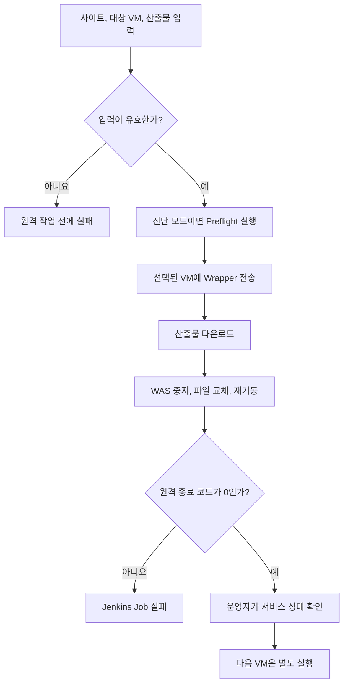

여러 고객 내비게이션 업데이트 사이트를 운영하며 CI/CD 구축과 배포 문제 해결을 담당했다. 각 사이트는 복수의 WAS VM을 사용하고 애플리케이션, 프로필, 배포 경로가 달랐다. 운영 CD는 한 번의 실행이 선택된 VM 한 대만 변경하도록 분리했다.

## 한 번에 바뀌는 서버 수를 제한

하나의 Job이 여러 VM을 순회하면 첫 VM의 상태를 확인하기 전에 다음 VM까지 바뀔 수 있다. VM별로 Job을 모두 나누면 대상은 명확해지지만 설정 중복이 늘어난다.

사이트별 파이프라인을 유지하면서 실행 시 허용 목록에서 대상 VM을 고르게 했다. 사이트마다 공통 실행 구조를 맞추고 애플리케이션, 경로, 프로필 등은 값으로 구분했다. 공통 안전장치를 수정할 때는 세 파일을 함께 갱신해야 한다.

아래 흐름은 한 번의 배포 실행 범위를 보여준다.

> 화살표는 실행 순서다. Preflight는 경고를 남기며 이후 배포를 차단하지 않는다. 서비스 상태 확인도 자동화된 단계는 아니다.

## 입력 오류와 셸 실패를 실행 결과에 반영

대상 VM, 산출물 이름, 관리 ID 설정을 원격 접속 전에 검사했다. 빈 대상 목록이나 산출물 이름이 “아무 작업도 하지 않은 성공”으로 끝나지 않도록 하기 위해서다.

Jenkins는 선택된 VM에 실행 Wrapper를 전송한다. Wrapper의 fail-fast 옵션은 명령 실패, 미정의 변수, 파이프 중간 실패를 드러낸다. 오류 trap은 실패 코드와 위치를 남기고, 원격 종료 코드가 0이 아니면 Jenkins Job도 실패시킨다.

배포 스크립트는 산출물 다운로드를 마친 뒤 WAS를 중지한다. 다운로드 실패로 서비스가 먼저 내려가는 일을 피한 순서다. WAS 중지 이후 파일 교체나 기동에 실패하면 중지 상태로 남을 수 있다.

## 진단 모드의 역할과 한계

Preflight에서는 대상 VM의 CLI, 메타데이터 서비스, 관리 ID 토큰, TLS 연결, 조회 권한을 차례로 확인한다. 인증 오류의 원인을 나누기 위한 기능이다.

현재는 실패를 경고로 출력하고 Preflight 자체는 성공 처리한다. **진단 모드를 켜도 실제 배포가 이어진다.** 진단만 실행하는 동작과 배포를 분리하고, 필수 조건의 실패는 배포를 중단하도록 바꾸는 일이 남아 있다. 인증 주체를 VM으로 옮긴 내용은 [2편](/blog/navigation-cd-02-managed-identity)에서 다룬다.

## 검증한 범위

코드와 이력에서 대상 필터가 한 VM만 반환하는지, 입력 검사가 원격 작업보다 앞서는지, 오류 코드가 Jenkins까지 전달되는지 확인했다. 세 사이트의 파이프라인도 같은 실행 구조로 맞췄다. 저장소에는 관리 ID 옵션 오류와 인증서 검증 실패 로그가 있으며, 수정한 최종 코드는 있지만 마지막 운영 성공 로그는 없다. 실제 CD 문제 해결은 확인된 업무 결과이나 배포 시간과 장애율 변화는 측정하지 않았다.

로드 밸런서의 트래픽 제외와 복귀, 배포 후 health check, 자동 롤백은 구현하지 않았다. 따라서 한 VM씩 배포한다는 사실만으로 무중단 배포를 보장하지 않는다. SSH 호스트 검증과 인증 방식도 별도 보강이 필요하다.
