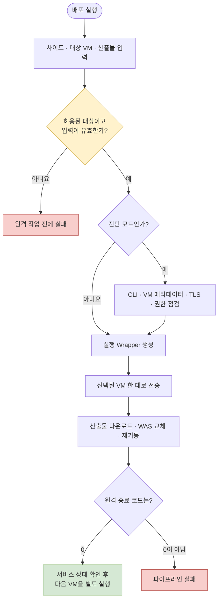

차량용 소프트웨어를 제공하는 3개 OEM 사이트를 운영하면서 CI/CD 파이프라인을 구축했다. 각 사이트의 애플리케이션과 설정은 다르지만 운영 환경은 공통으로 복수의 WAS VM을 사용했다. 이 글은 CI가 만든 배포 산출물을 운영 WAS에 반영하는 CD 구간에 초점을 둔다.

나는 파이프라인 구축과 VM별 CD 실행 단위 분리, 보안 개선, 그리고 이 과정에서 발생한 배포 문제 해결을 담당했다. 다만 배포 시간이나 장애 건수의 전후 수치는 측정하지 않았으므로 정량적인 효율 개선을 주장하지 않는다. 확인할 수 있는 결과는 각 실행의 대상 범위를 한 VM으로 제한했고, 잘못된 입력과 원격 실행 실패가 파이프라인 실패로 드러나도록 만들었다는 점이다.

## 문제는 자동화보다 변경 범위였다

운영 WAS가 두 대라면 파이프라인에서 두 서버를 순회하는 구현이 가장 간단하다. 그러나 한 번의 실행이 모든 VM을 연속으로 바꾸면 첫 번째 VM에서 발견하지 못한 문제가 두 번째 VM까지 전파될 수 있다. 파이프라인이 성공했다고 표시되더라도 실제 기동 상태를 확인하기 전에 다음 서버가 바뀌는 문제도 있다.

여기에 3개 사이트의 애플리케이션 이름, 실행 프로필, 배포 경로, 설정용 비밀정보가 서로 달랐다. 모든 차이를 하나의 거대한 조건문으로 합치면 공통 로직은 줄어들지만, 한 사이트의 수정이 다른 사이트의 운영 배포에 영향을 줄 가능성이 커진다. 반대로 모든 내용을 복사하면 사이트별 독립성은 생기지만 공통 안전장치의 편차를 관리해야 한다.

내가 먼저 고정한 원칙은 **한 번의 실행이 바꾸는 대상을 한 VM으로 제한하는 것**이었다. 사이트별 파이프라인은 유지하되, 공통 실행 구조를 맞추고 대상 VM을 명시적으로 선택하게 했다.

## 검토한 세 가지 실행 모델

| 선택지 | 장점 | 운영상 대가 |
|---|---|---|
| 모든 VM을 한 Job에서 순차 배포 | 실행이 한 번이고 코드가 단순하다 | 첫 배포의 검증 전에 다음 VM까지 변경될 수 있다 |
| VM마다 완전히 별도인 Job과 스크립트 | 변경 범위가 명확하다 | 사이트 수와 VM 수의 곱만큼 설정이 중복되고 편차가 생긴다 |
| 사이트별 파이프라인 + 실행 시 대상 VM 선택 | 사이트 차이를 격리하면서 실행 범위를 한 VM으로 제한한다 | 작업자가 VM을 선택하고 각 배포 사이의 확인 절차를 지켜야 한다 |

세 번째 방식을 선택했다. 파이프라인에는 허용된 VM 목록을 두고, 입력받은 대상과 일치하는 한 대만 남긴다. 대상이 없거나 산출물 이름이 비어 있으면 원격 서버에 접속하기 전에 실패시킨다. 이 방식은 무중단 배포를 자동으로 보장하지 않는다. 로드 밸런서에서 트래픽을 제외하고 복귀시키는 로직은 파이프라인에 없기 때문에, 한 VM 배포 후 상태를 확인하고 다음 VM으로 넘어가는 운영 절차가 함께 필요하다.

아래 흐름은 한 번의 실행이 선택된 VM 밖으로 퍼지지 않도록 만든 경계를 보여 준다.

> 실선은 한 번의 Job 실행 흐름이다. 다음 VM 배포는 같은 흐름의 반복이 아니라, 첫 VM 확인 후 시작하는 별도 실행이다.

## 파이프라인을 다섯 개의 검증 경계로 나눴다

### 1. 입력을 원격 작업 전에 거부한다

대상 VM, 산출물 이름, 관리 ID 설정을 첫 단계에서 확인한다. 여기서 중요한 점은 단순히 로그로 출력하는 것이 아니라 유효하지 않으면 즉시 종료하는 것이다. 잘못된 대상이 빈 서버 목록으로 흘러가 “아무것도 하지 않았지만 성공한 Job”이 되는 경우와, 빈 산출물 이름이 원격 셸까지 전달되는 경우를 막는다.

### 2. 진단과 배포를 구분해 관찰한다

진단 모드에서는 선택된 VM에서 Azure CLI 설치 여부, VM 메타데이터 서비스 도달 여부, 관리 ID 토큰 발급, Blob·비밀 저장소의 TLS 연결, 비밀정보 조회 권한을 순서대로 확인한다. 인증 실패를 곧바로 “권한 문제”라고 단정하지 않고 네트워크, TLS, 인증, RBAC 단계로 나눠 보는 장치다.

현재 구현의 진단 단계는 경고를 출력한 뒤 성공 코드로 끝나며, 진단 모드를 켜도 실제 배포 단계가 이어진다. 따라서 이것은 배포를 차단하는 품질 게이트가 아니라 원인 분리용 도구다. 운영자가 진단만 실행한다고 오해할 수 있어, 이후에는 `DIAGNOSE_ONLY`와 `DEPLOY`를 별도 동작으로 나누는 편이 더 안전하다.

### 3. Jenkins는 조정하고 대상 VM이 실행한다

Jenkins가 원격에서 실행할 Wrapper를 만들고 선택된 VM에 전송한다. Wrapper는 대상 VM 안에서 산출물 접근과 설정 준비를 수행하고, 기존 WAS를 중지한 뒤 파일을 교체하고 다시 기동한다. 이 경계 덕분에 Jenkins의 책임은 대상 선택과 실행 조정으로 좁아진다. 인증 주체를 대상 VM으로 옮긴 보안 설계는 2편에서 자세히 설명한다.

### 4. 셸 실패를 성공으로 삼키지 않는다

Wrapper에는 명령 실패, 미정의 변수, 파이프 중간 실패를 즉시 드러내는 fail-fast 옵션을 적용했다. 오류 trap은 실패 코드와 실행 위치를 로그에 남긴다. 원격 실행의 종료 코드는 Jenkins로 전달되고, 0이 아니면 해당 서버 결과를 실패로 기록한 뒤 Job도 실패시킨다.

배포 스크립트도 필수 인자를 확인하고 산출물 다운로드가 완료된 다음 WAS를 중지한다. 다운로드 실패 때문에 서비스가 먼저 내려가는 순서를 피한 것이다. 하지만 WAS 중지 후 파일 이동이나 기동이 실패하면 중지 상태로 남을 수 있다. 자동 롤백과 기동 상태 확인은 현재 코드에 포함되지 않은 후속 과제다.

### 5. 사이트별 차이는 값으로 제한한다

3개 운영 파이프라인은 대상 VM 선택, 입력 검증, 사전 점검, Wrapper 실행, 결과 수집 구조를 동일하게 맞췄다. 차이는 애플리케이션, 배포 경로, 실행 프로필, 조회할 비밀정보처럼 사이트에 종속된 값이다. 완전한 공통 라이브러리화 대신 동일한 골격의 사이트별 파일을 택해 운영 변경 범위를 분리했다.

이 선택에도 비용은 있다. 안전장치를 수정할 때 세 파이프라인을 함께 갱신하고 차이를 검토해야 한다. 향후 변경 빈도가 커지면 공통 함수를 Jenkins Shared Library로 옮기되, 사이트별 설정과 승인 경계는 그대로 분리하는 편이 낫다.

## 어떻게 검증했는가

저장소에는 실패부터 수정까지의 파이프라인 버전과 실행 로그를 남겼다. 초기 로그에서는 관리 ID 로그인 옵션의 변경으로 명령이 거부된 사례와, 인증서 체인 검증 실패로 Azure 로그인이 중단된 사례를 확인할 수 있다. 이후 버전에서는 로그인 옵션을 수정하고, 대상 VM에서 사전 점검과 인증을 수행하도록 구조를 바꿨다.

코드 수준에서는 다음을 대조했다.

- 대상 VM 필터가 선택값과 일치하는 한 대만 반환하는지
- 대상·산출물·관리 ID 설정 검증이 원격 실행보다 앞에 있는지
- 세 사이트의 운영 파이프라인이 같은 실패 처리 구조를 갖는지
- Wrapper의 오류 코드가 원격 명령과 Jenkins Job까지 전달되는지
- 산출물 다운로드가 WAS 중지보다 먼저 실행되는지
- 성공과 실패가 서버별 결과로 남는지

최종 문제 해결은 사용자가 실제 업무 결과로 확인한 사실이다. 저장소에는 최종 버전의 코드와 중간 실패 로그가 있지만, 마지막 운영 성공 로그는 포함되어 있지 않다. 따라서 이 글은 성공률이나 중단 시간 감소 같은 수치를 근거로 삼지 않는다.

## 결과와 회고

이번 개선으로 3개 사이트의 CD가 같은 실행 골격을 갖고, 한 번의 실행이 선택된 VM 한 대만 변경하게 되었다. 입력 오류와 원격 셸 실패도 성공처럼 지나가지 않고 실행 결과에 반영된다. 무엇보다 “자동화되어 있다”보다 “실패했을 때 어디까지 바뀌었는가”를 설명할 수 있는 파이프라인이 되었다.

남은 과제도 분명하다. 진단 경고는 아직 배포를 차단하지 않고, 로드 밸런서 트래픽 제어와 배포 후 health check, 자동 롤백도 없다. SSH 호스트 검증과 인증 방식 역시 별도 보강이 필요하다. 다음 개선에서는 사전 점검을 필수 조건과 참고 경고로 나누고, 기동 확인이 통과해야 다음 VM 배포를 허용하는 승인 절차를 연결하고 싶다.
