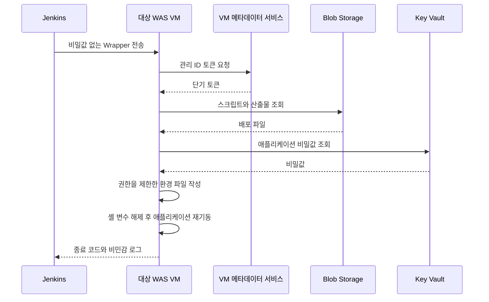

여러 고객 사이트의 초기 CD는 Jenkins가 스토리지 계정 키로 배포 스크립트를 받고 DB 비밀번호와 토큰 서명용 비밀값을 조회했다. 이를 SSH 명령문에 넣어 대상 VM의 환경 파일을 만들었다. 나는 이 조회를 대상 WAS VM의 Azure 관리 ID로 옮기고, 전환 중 발생한 CLI 옵션과 인증서 오류를 해결했다.

## 대상 VM이 직접 조회하도록 변경

Jenkins의 로그 마스킹을 강화해도 비밀값이 프로세스와 명령 구성 단계를 지나는 구조는 남는다. 단기 토큰을 Jenkins에서 전달하는 방식 역시 전달과 만료를 관리해야 한다.

배포 파일과 비밀값을 실제로 사용하는 VM에 사용자 할당 관리 ID(UAMI)를 연결하고 읽기 권한을 부여했다. 대신 각 VM의 ID 연결, 권한, 네트워크와 CA 신뢰를 준비해야 했다.

아래 시퀀스는 변경 후 조회 위치를 보여준다.

> 실선은 요청과 실행, 점선은 응답이다. SSH 접속 자격증명은 별도로 필요하다.

Wrapper는 fail-fast 옵션과 제한적인 기본 파일 권한으로 시작한다. 비밀값이 비어 있으면 중단하고, 값은 출력하지 않는다. 환경 파일의 소유자와 읽기 권한을 제한하며 작성 후 셸 변수도 해제한다.

이 변경으로 스토리지 고정 키를 배포 인자로 넘기거나 DB 비밀번호를 Jenkins에서 원격 명령에 삽입하던 경로를 제거했다. 환경 파일과 애플리케이션 프로세스에는 값이 남으므로 호스트 권한과 비밀값 회전은 계속 관리해야 한다. 변수 해제가 메모리의 완전 삭제를 보장하는 것도 아니다.

## 로그인 실패를 원인별로 분리

첫 실패는 관리 ID 식별자를 전달하는 Azure CLI 옵션이었다. 사용 중인 버전이 기존 옵션을 거부해 client ID를 명시하는 옵션으로 수정했다.

다른 환경에서는 Azure 로그인 중 인증서 체인 검증이 실패했다. HTTPS 연결이 성립하지 않은 상태라 RBAC부터 바꾸어 해결할 문제는 아니었다. 프록시가 TLS를 중간 종료하면 런타임이 사내 CA를 신뢰하는지 확인해야 하고, VM 메타데이터 주소가 프록시로 향하는지도 구분해야 했다.

필요한 주소의 프록시 예외를 검토했지만 파이프라인에서 인증서 검증을 끄거나 임의의 CA 경로를 강제하지 않았다. CA 신뢰와 네트워크 정책은 대상 VM 환경에서 다뤄야 할 문제로 남겼다.

진단 모드의 Preflight에는 다음 순서의 점검을 넣었다.

| 단계 | 확인 대상 |
|---|---|
| CLI | 설치 여부와 버전 |
| 메타데이터 | VM 메타데이터 서비스 HTTP 응답 |
| 관리 ID | 지정한 ID의 토큰 발급 |
| TLS | Blob과 Key Vault의 인증서 연결 |
| 로그인 | 관리 ID를 사용한 Azure 로그인 |
| 권한 | 비밀값을 출력하지 않고 실제 조회 가능 여부 확인 |

**Preflight 실패는 현재 경고이며 배포를 차단하지 않는다.** 진단 모드를 켜도 배포가 계속되므로 로그 확인이 필요하다. 필수 실패 조건으로 배포를 중단시키고 진단 전용 실행을 분리하는 것은 후속 작업이다.

## 확인한 결과와 남은 작업

실행 로그에서 CLI 옵션 오류와 인증서 검증 실패를 확인했고, 코드와 이력에서 명령 실행 및 비밀값 조회 위치가 대상 VM으로 바뀐 것을 확인했다. 세 사이트에 같은 인증과 실패 처리 구조를 적용했다. 최종 운영 성공 로그는 저장소에 없으며, CD 문제 해결은 확인된 업무 결과다. 유출 사고나 대응 시간 감소를 측정한 자료는 없다.

관리 ID 권한이 과도하면 대상 VM 침해 시 피해가 커질 수 있다. 리소스별 권한 점검, SSH 키 인증과 호스트 키 검증, 환경 파일의 회전 및 삭제 정책은 추가로 보강해야 한다.
