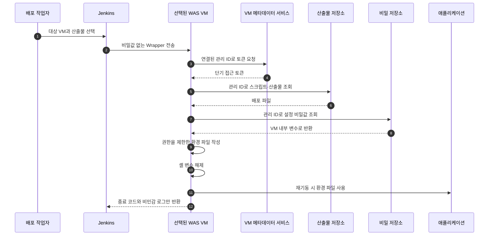
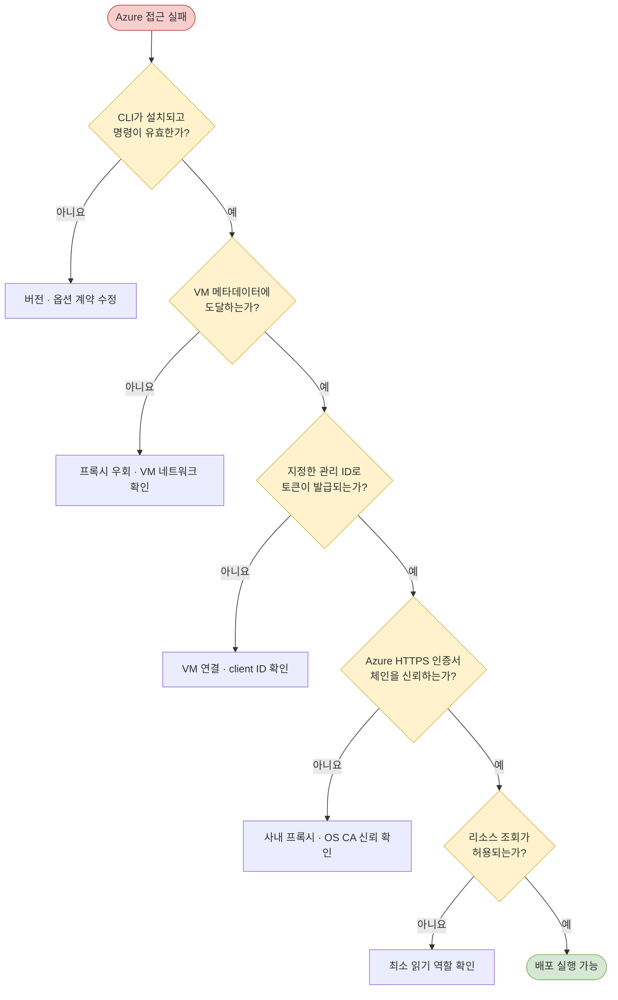

1편에서는 3개 OEM 사이트의 운영 CD를 VM 단위로 실행하고 실패 경계를 나눈 과정을 다뤘다. 그러나 대상 범위를 줄여도 Jenkins가 스토리지 고정 키와 애플리케이션 비밀값을 조회한 뒤 원격 명령에 넣어 전달한다면, 배포는 성공해도 보안 경계는 여전히 넓다.

나는 CI/CD 파이프라인을 구축하고 보안 개선을 진행하면서, Azure 리소스에 인증하는 주체를 Jenkins에서 실제 배포 대상 WAS VM으로 옮겼다. 그 과정에서 관리 ID 로그인 옵션과 프록시가 개입한 인증서 체인 문제로 CD가 실패했고, 원인을 나눠 확인해 문제를 해결했다. 이 글의 결과는 민감한 값을 Jenkins 경유 경로에서 제거한 구조와 해결된 배포 문제이며, 유출 사고가 줄었다거나 대응 시간이 단축됐다는 수치는 주장하지 않는다.

## 기존 구조에서는 Jenkins가 너무 많은 것을 알고 있었다

초기 파이프라인은 Jenkins가 스토리지 계정 키로 배포 스크립트를 받고, 비밀 저장소에서 DB 비밀번호와 토큰 서명용 비밀값을 조회했다. 이후 SSH 명령문을 통해 대상 VM의 환경 파일을 만들었다. 이 구조는 Jenkins 하나만 준비하면 된다는 장점이 있지만 다음 문제가 있었다.

- Jenkins Credential에 장기 고정 키를 보관하고 사용해야 한다.
- DB·토큰 비밀값이 Jenkins 프로세스와 원격 명령 구성 단계를 지난다.
- 문자열 보간 방식에 따라 Jenkins가 민감정보 사용 경고를 출력하고, 로그 노출 가능성을 검토해야 한다.
- Jenkins VM의 관리 ID와 대상 WAS VM의 관리 ID가 혼동되기 쉽다.
- Azure 인증 실패가 Jenkins 네트워크 문제인지, 대상 VM 문제인지 경계가 모호하다.

핵심 질문은 “비밀값을 어떻게 더 잘 마스킹할까?”가 아니었다. **그 값을 Jenkins가 애초에 알아야 하는가?**였다.

## 대안을 비교하고 인증 주체를 옮겼다

| 대안 | 장점 | 한계 |
|---|---|---|
| Jenkins가 계속 조회하고 마스킹 강화 | 기존 흐름 변경이 작다 | 비밀값과 고정 키가 Jenkins를 통과한다는 구조는 남는다 |
| Jenkins에서 단기 토큰을 발급해 VM에 전달 | 고정 키 사용을 줄일 수 있다 | 토큰 전달·만료·권한 범위를 Jenkins가 계속 책임진다 |
| 대상 VM이 자신의 관리 ID로 직접 조회 | Jenkins가 애플리케이션 비밀값을 알 필요가 없다 | 모든 대상 VM에 ID 연결, 권한, 네트워크와 CA 신뢰가 준비돼야 한다 |

세 번째 방식을 선택했다. 대상 VM에는 이미 배포 작업을 실행할 런타임과 Azure CLI가 필요했고, Blob Storage와 비밀 저장소에 접근하는 실제 주체도 그 VM이었다. 사용자 할당 관리 ID(UAMI)를 각 대상 VM에 연결하고 최소한의 데이터 읽기 권한을 부여하면 장기 스토리지 키를 배포 인자로 넘길 필요가 없다.

아래 다이어그램은 인증 주체를 옮긴 뒤 비밀정보가 머무는 범위를 보여 준다.

> Jenkins는 배포를 조정하지만 애플리케이션 비밀값과 스토리지 고정 키를 전달하지 않는다. SSH 접속 자격증명은 별도 경계로 남아 있다.

## 구현에서는 비밀값의 생명주기를 짧게 만들었다

Jenkins는 선택된 VM에서 실행할 Wrapper만 생성해 전송한다. Wrapper는 fail-fast 설정과 제한적인 기본 파일 권한으로 시작한다. 대상 VM은 자신의 관리 ID로 로그인하고, 고정 키 대신 로그인 기반 권한으로 배포 스크립트와 산출물을 다운로드한다.

비밀 저장소 조회도 대상 VM에서 실행한다. 조회값이 비어 있으면 즉시 중단하고, 값 자체는 로그로 출력하지 않는다. 필요한 환경 파일은 대상 WAS 도메인 아래에 만들고 소유자와 읽기 권한을 제한한다. 작성 후 셸 변수도 해제한다.

이 설계가 비밀값을 메모리에서 완전히 제거한다는 뜻은 아니다. 환경 파일과 애플리케이션 프로세스에는 여전히 값이 필요하다. 개선한 경계는 **Jenkins Workspace, Jenkins 셸 출력, Groovy 문자열, 원격 명령 인자**를 거치던 경로를 없앤 것이다. 환경 파일의 보관·회전과 호스트 권한 통제는 계속 운영해야 한다.

## 첫 실패: 인증 방식이 아니라 CLI 계약이 바뀌었다

실행 로그의 첫 실패는 관리 ID 자체의 권한 문제가 아니었다. 사용 중인 Azure CLI에서는 관리 ID 식별자를 전달하던 이전 옵션이 더 이상 지원되지 않았고, client ID를 명시하는 옵션을 사용해야 했다. 같은 “관리 ID 로그인 실패”라도 다음 원인은 서로 다르다.

- CLI 옵션 계약 불일치
- 지정한 관리 ID가 VM에 연결되지 않음
- VM 메타데이터 서비스에 도달하지 못함
- 토큰은 발급됐지만 리소스 권한이 없음

로그의 명시적인 오류 메시지와 CLI 동작을 기준으로 옵션을 수정했다. 커밋 작성자만으로 개인 역할을 추정하지 않고, 이 문제를 해결했다는 사실은 사용자가 확인한 업무 범위를 근거로 한다.

## 두 번째 실패: 403보다 앞에서 TLS가 끊겼다

다른 환경에서는 관리 ID 로그인 중 자체 서명 인증서가 인증서 체인에 포함됐다는 검증 오류가 발생했다. 이때 곧바로 관리 ID의 RBAC을 바꾸는 것은 맞지 않다. 권한을 평가하려면 먼저 HTTPS 연결과 토큰 발급이 성공해야 하기 때문이다.

나는 실패를 다음 순서로 분리했다.

> 403은 인증과 TLS를 통과한 뒤의 권한 문제다. 인증서 검증 실패와 같은 전송 계층 오류를 RBAC 변경으로 해결할 수는 없다.

프록시가 HTTPS를 중간 종료하는 환경에서는 조직 내부 CA를 런타임이 신뢰하지 않으면 인증서 검증이 실패할 수 있다. VM 메타데이터 주소까지 프록시로 보내면 관리 ID 토큰 요청 자체가 실패할 수도 있다. 단기적으로 필요한 주소만 프록시 예외에 넣는 방법을 검토했지만, 파이프라인 안에서 인증서 검증을 끄거나 임의의 CA 경로를 강제하지 않았다. 장기적으로는 대상 VM의 OS 신뢰 저장소와 네트워크 정책에서 해결해야 같은 VM의 다른 도구도 일관된 경로를 사용한다.

## Preflight로 “로그인 실패”를 여섯 단계로 펼쳤다

최종 파이프라인에는 진단 모드에서 다음을 순서대로 확인하는 Preflight를 넣었다.

1. Azure CLI 설치와 버전 출력
2. VM 메타데이터 서비스의 HTTP 응답
3. 선택한 관리 ID의 토큰 발급
4. Blob과 비밀 저장소의 TLS 응답
5. 관리 ID 로그인
6. 실제 비밀값을 출력하지 않는 조회 권한 확인

이 순서는 실패 지점을 빠르게 분류하지만 현재 구현은 각 실패를 경고로 남기고 Preflight 자체는 성공 처리한다. 또한 진단 모드를 켜면 이후 배포도 계속 실행된다. 따라서 로그를 읽는 운영 절차가 필요하며, 필수 조건은 hard fail로 바꾸고 진단 전용 실행을 분리하는 것이 후속 개선점이다.

## 검증 근거와 결과의 범위

저장소의 실행 로그에서는 두 실패를 직접 확인했다. 하나는 관리 ID 로그인 옵션 오류로 명령이 종료된 기록이고, 다른 하나는 인증서 체인 검증 단계에서 Azure 로그인이 중단된 기록이다. 파이프라인 이력에서는 다음 변화가 이어진다.

- 관리 ID 식별 옵션을 현재 CLI 계약에 맞게 변경
- Azure 명령의 실행 위치를 Jenkins에서 대상 VM으로 이동
- Blob 접근을 고정 키에서 관리 ID 로그인 방식으로 전환
- DB·토큰 비밀값 조회와 환경 파일 작성을 대상 VM 안으로 이동
- 민감한 변수의 빈 값 검사, 파일 권한 제한, 사용 후 변수 해제
- 3개 사이트의 운영 파이프라인에 같은 인증·실패 처리 골격 적용

최종 운영 성공 로그는 이 저장소에 보관돼 있지 않다. CD 문제를 해결했다는 결과는 사용자가 확인한 사실이며, 코드와 이력은 해결을 위해 선택한 구조를 뒷받침한다. 이 구분 때문에 “비밀 유출을 방지했다”처럼 검증 범위를 넘는 표현 대신 “비밀값이 Jenkins를 통과하지 않도록 경로를 제거했다”고 쓴다.

## 결과와 회고

이번 전환으로 Jenkins는 배포 대상과 실행 순서를 조정하고, Azure 리소스 접근은 선택된 WAS VM의 관리 ID가 담당하게 되었다. 스토리지 고정 키를 배포 스크립트 인자로 넘기지 않고, DB와 토큰 비밀값도 Jenkins에서 조회하거나 원격 명령에 삽입하지 않는다. 동시에 하나로 보이던 CD 실패를 CLI, 메타데이터, ID 연결, TLS, RBAC 단계로 나눠 확인할 수 있게 했다.

하지만 관리 ID가 CD 보안을 자동으로 완성하지는 않는다. 대상 VM의 권한이 과도하면 피해 범위가 커지고, SSH 비밀번호 인증과 느슨한 호스트 검증은 별도 위험으로 남는다. 환경 파일도 회전과 삭제 정책이 필요하다. 다음 단계는 관리 ID 권한을 리소스 단위로 재점검하고, SSH 키 기반 인증과 호스트 키 검증을 적용하며, Preflight의 필수 항목을 실제 배포 게이트로 승격하는 것이다.
