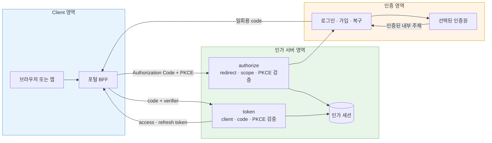

이 프로젝트의 출발점은 새 로그인 화면을 만드는 일이 아니었다. 기존 시스템에는 단말·사용자 프로필·내부 식별자마다 별도의 토큰 발급 API가 있었다. 호출자는 각 도메인의 식별자와 서명 재료를 직접 알고 토큰을 요청했고, 인증 절차와 토큰 발급 계약이 강하게 엮여 있었다. 신규 서비스가 늘 때마다 같은 결합을 반복하면 인증 방식을 바꾸는 일이 곧 모든 클라이언트의 변경이 된다.

2026년 4월 논의를 시작해 8~9월에 집중 구현했다. 나는 요구 분석, 설계, 핵심 구현, 검증을 주도했다. 목표는 신규 서비스에 표준화된 인가 경로를 제공하는 동시에, 서비스·테넌트마다 다른 로그인 방식과 정책을 하나의 플랫폼에서 조합하는 것이었다. 결과의 범위는 운영 배포가 아니다. 포털/BFF, 실제 외부 SMS, 개발 PostgreSQL을 연결한 개발계 E2E 검증까지 완료했다.

## 토큰 API 추가가 아니라 경계 재설계였다

기존 API는 “어떤 도메인 객체의 토큰을 발급한다”가 중심이었다. 새 경로는 브라우저에서 로그인한 사용자의 권한 위임을 `authorize → login → code → token`으로 분리했다. 클라이언트는 비밀번호나 내부 인증원 계약을 알지 않고, 짧게 살아 있는 일회용 code와 PKCE verifier를 교환한다.

이 글에서는 이를 **OAuth 2.1 지향** 경로라고 부른다. 정확히는 OAuth 2.0 Authorization Code 흐름에 PKCE와 [RFC 9700의 OAuth 2.0 보안 권고](https://www.rfc-editor.org/info/rfc9700/)를 적용한 구현이다. OAuth 2.1은 현재도 [IETF Internet-Draft](https://datatracker.ietf.org/doc/draft-ietf-oauth-v2-1/)이며, 환경별 정책 설정과 배포 상태는 공개하지 않는다. 따라서 완전 준수를 주장하지 않는다.

핵심 경계는 다음과 같다. 인증원이 달라져도 클라이언트가 보는 `authorize/token` 계약과 인가 서버의 code 교환 규칙은 유지한다.

> 실선은 동기 호출 또는 리다이렉트를 뜻한다. 인증원은 인증된 주체를 만드는 책임을, 인가 서버는 client·redirect·scope·code·token 계약을 지킨다.

요구는 실제로 LDAP에서 ADFS, 다시 자체 회원과 내부 식별자 매핑으로 바뀌었다. LDAP bind와 JIT 매핑, ADFS 연동은 설계 단계에서만 검토했고 구현 완료 기술이 아니다. 반면 클라이언트가 호출하는 authorize/token 경계는 유지되었다. 변경은 로그인·가입·복구 영역과 “인증 결과를 내부 주체로 어떻게 연결할지”에 집중되었다. 이 분리가 프로젝트에서 OAuth를 도입한 가장 현실적인 이점이었다.

## 관심사를 Step으로 나눈 이유

멀티테넌트라고 해서 모든 차이를 하나의 거대한 정책 객체나 조건문으로 넣고 싶지는 않았다. authorize 경로에는 다음 관심사가 서로 다른 이유로 변한다.

| 관심사 | 대표 선택 | 실패 시 의미 |
|---|---|---|
| redirect 검증 | 등록된 URI와의 일치 검증 | 잘못된 목적지로 code 유출 가능 |
| PKCE | S256 및 client binding 검증 | 탈취된 code의 재사용 위험 |
| scope | 허용 범위 검증 | 과도한 권한 발급 가능 |
| 세션 저장 | DB 세션 | 로그인과 token 교환 사이 문맥 보존 |
| 로그인 목적지 | hosted login | 인증 UI와 인증원 선택 |
| client 인증 | public, client secret | client 유형별 token endpoint 계약 |
| token 발급 | JWT access + opaque refresh | 수명·rotation·claim 정책 |

각 관심사는 인터페이스와 복수의 Strategy 구현으로 만들었다. 애플리케이션 시작 시 Registry가 타입별 구현 목록을 색인하고, 중복 ID나 기본 구현 부재를 실패로 처리한다. 요청 시에는 클라이언트의 DB 설정을 읽어 Registry에서 구현을 찾는다. 정확한 패턴 이름은 **Strategy 구현 + Registry + 설정 기반 Service Locator**다.

이 구조에서 서비스 코드는 “redirect 검증 → PKCE 검증 → scope 결정 → 세션 저장 → 로그인 경로 결정” 순서를 보여 주는 orchestration이 된다. 새 정책은 Step 구현을 추가하고 설정에 연결할 수 있다. authorize와 token의 Registry는 일부러 나눴다. 두 endpoint가 사용하는 관심사와 변경 시점이 다른데 합치면 쓰지도 않는 구현까지 서로 주입받기 때문이다.

대가도 있다. 실행 동작이 코드만이 아니라 DB 설정과의 조합으로 결정된다. 기본 구현으로의 fallback은 점진적 반입에는 편하지만, 누락을 조용히 허용할 수 있다. 이 문제를 런타임까지 미루지 않기 위해 4편에서 설명할 설정 무결성 스캔을 별도로 만들었다.

## code 교환에서 고정한 불변식

token endpoint는 단순히 code가 존재하는지만 보지 않는다. 다음을 순서대로 확인했다.

1. client 정책을 찾고 public/confidential 유형에 맞게 인증한다.
2. 요청을 받은 앱과 client가 같은 테넌트 서비스에 묶였는지 확인한다.
3. code 해시로 인가 결과를 찾고 발급 client, 만료, 사용 여부, redirect URI를 대조한다.
4. authorize 단계에 저장한 challenge와 token 요청의 verifier를 검증한다.
5. 조건부 update로 code를 한 번만 소비한다. 동시 요청 중 한 건만 성공한다.
6. 인가 당시 확정된 scope와 주체로 access/refresh token을 발급한다.

단위 테스트는 잘못된 redirect, PKCE 누락·불일치, 알 수 없는 Step ID와 중복 default를 고정했다. 통합 테스트는 개발 PostgreSQL에서 code 발급 상태를 만들고 실제 token endpoint를 호출해 client binding, 일회용 소비, refresh rotation을 검증했다. 마지막으로 포털/BFF가 authorize를 시작하고 실제 로그인 뒤 code를 교환하는 개발계 E2E를 수행했다.

## 계약형 client에도 OAuth가 이득이었나

클라이언트와 서버를 같은 조직이 함께 개발하고 계약이 단단하다면, OAuth가 언제나 가장 싼 답은 아니다. 신뢰된 BFF 하나뿐이고 외부 위임·다중 client·scope 분리가 없다면 서버 세션이나 짧은 자체 교환 ticket이 더 단순할 수 있다. redirect 검증, code 저장·소각, PKCE, token rotation, 오류 규약을 모두 운영해야 하는 비용을 피할 수 있기 때문이다.

그럼에도 이 프로젝트에서는 OAuth 경계가 유효했다. 신규 서비스가 늘고 public/confidential client와 앱 유형이 달라지며, 인증원 변경 가능성이 이미 현실화되었기 때문이다. 클라이언트가 인증원의 세부 절차 대신 표준 인가 계약에 의존하게 한 것이 이 비용을 정당화했다. 즉 “표준이어서”가 아니라 **변경되는 영역을 계약 밖으로 밀어냈기 때문에** 선택했다.

## 자체 구현을 선택한 당시 판단과 지금의 회고

당시 팀에서는 Spring Authorization Server(SAS), Keycloak, Spring Security 기반 구성을 논의했지만 PoC는 하지 않았다. 개발 리드는 Spring Security filter 흐름의 가독성과 `User`라는 프레임워크 개념이 도메인 식별자를 오해하게 만들 가능성을 우려했다. 나는 custom principal과 명시적 mapping으로 해결할 수 있다는 의견이었다. 최종적으로 기존 DB 계약과 UI 흐름을 직접 연결하는 자체 구현을 선택했다.

이 선택을 “유일한 답”으로 말할 수는 없다. Spring Security도 [FilterChain, SecurityContext, AuthenticationManager/Provider](https://docs.spring.io/spring-security/reference/servlet/authentication/architecture.html)를 명시적으로 설명하고 있고, SAS는 [issuer별 컴포넌트 registry를 이용한 멀티테넌시](https://docs.spring.io/spring-authorization-server/reference/guides/how-to-multitenancy.html)를 안내한다. Keycloak 역시 [Service Provider Interface](https://www.keycloak.org/docs/latest/server_development/index.html)로 확장 지점을 제공한다.

현재 다시 한다면 최소한 다음 PoC를 먼저 비교한다.

- 기존 테넌트·서비스 설정을 SAS의 registered client/issuer 모델에 매핑할 수 있는가
- 자체 회원의 내부 식별자 모델을 custom principal과 token claim으로 오해 없이 표현할 수 있는가
- hosted login, 가입, 복구 UI를 프레임워크 경계 안팎 어디에 둘 것인가
- 기존 profile/device/identity token 계약과 단계적 이행이 가능한가
- Keycloak SPI 확장이 제품 upgrade 비용과 운영 복잡성을 감수할 만큼 작은가

자체 구현은 도메인 흐름을 코드에서 직접 통제하게 해 주었지만, 표준 프레임워크가 이미 해결한 프로토콜 세부와 보안 업데이트를 스스로 추적해야 한다. 운영 적용에는 엄격한 redirect/PKCE 정책 검증이 필요하다. 이번 결과는 “OAuth 2.1 완전 구현”이 아니라, **인증원 변경을 견디는 인가 경계를 만들고 개발계에서 끝까지 검증한 것**이다.
