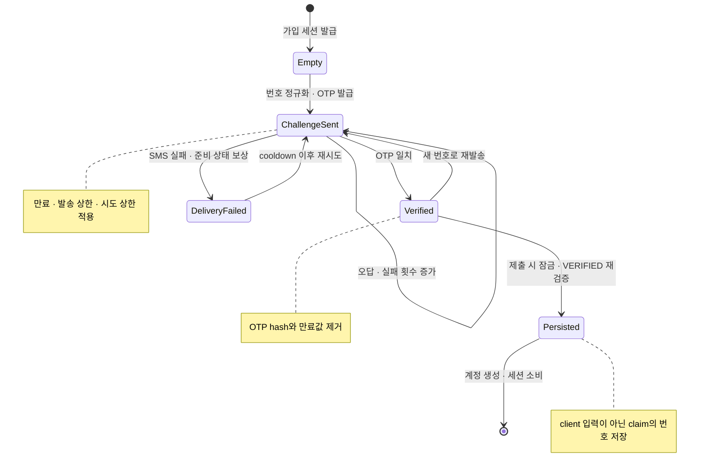

자체 회원 가입이 도입되면서 휴대폰 번호는 단순 프로필 필드가 아니게 되었다. 가입 때 검증한 번호를 나중의 아이디 찾기와 비밀번호 재설정에서 계정 소유를 확인하는 신뢰값으로 쓰기로 했기 때문이다. 그러면 저장해야 할 값은 브라우저가 제출한 `phone`이 아니라 **서버가 OTP 검증을 완료한 번호**여야 한다.

2026년 8~9월 집중 구현에서 나는 이 요구의 분석, 상태 설계, 핵심 구현과 검증을 주도했다. 범위는 특정 테마의 자체 회원 가입이었다. 다른 테마는 기존 동작을 유지해 rollout을 분리했다. 실제 외부 SMS와 개발 PostgreSQL을 연결한 가입 E2E까지 확인했지만 운영 배포 성과로 확대하지 않는다.

## 숨은 문제는 최종 submit이었다

처음 떠올리기 쉬운 흐름은 “인증번호 API를 호출하고 화면에서 인증 완료 표시를 한 뒤, 가입 form에 번호를 넣어 제출”하는 것이다. 그러나 이 방식은 개발자 도구로 hidden input을 바꾸거나 OTP 검증 뒤 번호만 교체할 수 있다. 프론트의 disabled 버튼과 상태 변수는 사용자 경험을 돕지만 신뢰 경계가 아니다.

따라서 가입 세션의 서버 측 JSON claim에 휴대폰 인증 상태를 저장했다. 세션은 다음만 가진다.

- 정규화된 휴대폰 번호
- 상태(`CHALLENGE_SENT`, `DELIVERY_FAILED`, `VERIFIED`)
- OTP 원문이 아닌 서버 비밀키 기반 keyed hash
- OTP 만료 시각, 재발송 가능 시각
- 발송 횟수와 실패 시도 횟수
- 검증 완료 시각

OTP는 6자리 난수로 발급하고 원문은 SMS client에 전달한 뒤 보관하지 않는다. DB 유출만으로 작은 OTP 공간을 즉시 대입하지 못하도록 서버 비밀키가 들어간 해시를 저장했다. 동일한 primitive를 계정 복구와 공유하되, 가입과 복구의 세션·정책은 분리했다.

## 상태 전이로 성공과 실패를 함께 설계했다

아래 상태도는 발급, 재발송, 오답, 발송 실패, 최종 제출의 전이를 보여 준다.

발급과 검증은 가입 세션 행을 `FOR UPDATE`로 잠근 상태에서 수행한다. 현재 claim과 호출자가 읽은 이전 상태가 같을 때만 JSON 일부를 조건부 갱신한다. 이중 클릭이나 여러 탭에서의 요청이 서로의 발송 횟수와 OTP 상태를 덮어쓰는 것을 막기 위해서다.

재발송은 60초 cooldown, OTP는 180초 TTL, 발송과 검증 시도는 각각 상한을 둔다. 숫자 자체는 정책으로 이동할 여지가 있지만, 중요한 점은 응답이 서버 시각의 `resendAvailableAt`과 남은 횟수를 알려 준다는 것이다. 브라우저 countdown이 보안 판정을 대신하지 않는다.

## SMS 실패도 상태 전이의 일부다

외부 SMS 발송은 DB 트랜잭션에 묶을 수 없다. 상태를 먼저 저장한 뒤 SMS가 실패하면 사용자는 받지 못한 OTP 때문에 기존 번호가 무효화되고 발송 기회와 cooldown만 소비한다. 반대로 SMS를 먼저 보내고 상태 저장이 실패하면 사용자가 받은 OTP를 서버가 모른다.

선택은 **상태 준비 → SMS 발송 → 실패 시 조건부 보상**이었다.

1. 트랜잭션에서 새 OTP hash와 발송 횟수, cooldown을 확정한다.
2. 트랜잭션 밖에서 SMS를 발송한다.
3. 발송 실패 시 “현재 상태가 방금 준비한 상태와 같은 경우에만” 이전 상태로 복구한다.
4. 그 사이 다른 요청이 상태를 바꿨다면 오래된 실패가 최신 상태를 덮지 않도록 보상을 중단한다.

최초 발송 실패에는 `DELIVERY_FAILED`를 남기고 hash와 만료값은 제거한다. 이전 challenge가 있었다면 이전 OTP 정보를 복원하되 새 발송 시도 횟수와 cooldown은 보존한다. 보상 자체가 실패하면 단순 발송 오류로 숨기지 않고 서버 오류로 승격한다. 정상처럼 보이게 하는 것보다 운영자가 불일치를 발견하게 하는 편이 안전하다.

## 최종 제출에서 한 번 더 잠그고 확인했다

OTP API가 `VERIFIED`를 반환했더라도 가입 submit은 별도 요청이다. 그 사이 세션이 만료되거나, 다른 요청이 번호를 바꾸거나, claim이 훼손될 수 있다. 최종 submit에서는 다음 순서를 지켰다.

1. 가입 세션과 CSRF를 검증한다.
2. login ID와 비밀번호, 필수 프로필 정책을 서버에서 다시 검증한다.
3. 휴대폰 인증 대상 테마라면 가입 세션을 잠그고 `VERIFIED`, 번호 형식, 검증 시각을 재검증한다.
4. 브라우저 form의 번호가 아니라 잠긴 세션 claim의 번호와 검증 시각을 계정 속성에 넣는다.
5. 계정·로그인 수단·비밀번호 credential을 만들고 가입 세션을 같은 트랜잭션에서 소비한다.

여기서 “세션을 잠근다”는 것은 OTP 검증 완료를 가입 저장 시점의 신뢰값으로 고정한다는 뜻이다. UI가 인증 완료였다는 과거 사실만 믿지 않는다.

## 중복과 재전송 경쟁은 DB까지 내려가 막았다

login ID 사용 가능 여부 API는 빠른 피드백을 준다. 하지만 조회와 insert 사이에는 TOCTOU 경쟁이 남는다. 최종 방어는 테넌트와 정규화된 login ID의 DB unique 제약이다. 중복 key는 도메인 오류로 변환하고 가입 세션은 소비하지 않아 다른 ID로 재시도할 수 있게 했다.

계정 생성과 세션 소비도 하나의 트랜잭션이다. 세션 소비는 진행 중 상태에서 완료 상태로 가는 조건부 update이며 정확히 한 행이어야 한다. 두 submit이 경쟁하면 한쪽의 consume이 실패하고, 그 요청에서 먼저 만든 계정 행까지 롤백된다. “버튼을 한 번만 누르게” 하는 것으로 중복 가입을 막지 않았다.

비밀번호 저장은 기존 로그인과 호환해야 해서 legacy SHA-256 기반 계약을 그대로 사용했다. 이는 현대적인 password KDF 강도로 포장할 수 없다. 브라우저에서 서버 세션 공개키로 RSA-OAEP 암호화하는 것은 전송 중 평문 노출을 줄이는 별도 층이며 TLS를 대체하지도, 저장 해시의 약점을 보완하지도 않는다.

## 검증과 rollout

검증은 세 층으로 나눴다.

- 도메인/서비스 테스트: 번호 정규화, OTP 형식·만료, cooldown, 발송·검증 상한, keyed hash 대조
- 저장소 테스트: `FOR UPDATE`, 현재 JSON과 일치할 때만 갱신하는 조건, 보상 경쟁
- 통합 테스트: 인증되지 않은 submit 거부, 검증된 번호의 저장, 중복 ID 재시도, CSRF 오류 뒤 재시도, 세션 중복 소비 rollback

프론트에서는 번호가 바뀌거나 API가 실패하면 인증 UI를 즉시 무효화하고, 서버의 `VERIFIED` 응답에서만 submit을 연다. 그러나 이 로직은 UX 보조다. 서버 테스트는 프론트를 우회한 요청이 같은 불변식을 지키는지 검증했다.

rollout은 테마별로 제한했다. 새 자체 회원 테마만 OTP를 필수화하고 기존 테마는 종전 흐름을 유지했다. 위험 반경을 줄이는 대신 정책 분기가 생겼으므로, 장기적으로는 문자열 비교가 아니라 명시적 tenant/service 정책으로 옮겨야 한다.

결과적으로 가입 때 검증한 번호를 이후 복구 흐름의 신뢰값으로 사용할 기반을 개발계에서 확인했다. 남은 과제는 legacy password hash를 modern KDF로 이행하고, OTP 수치와 rollout 대상을 관리 가능한 정책으로 승격하는 것이다.
