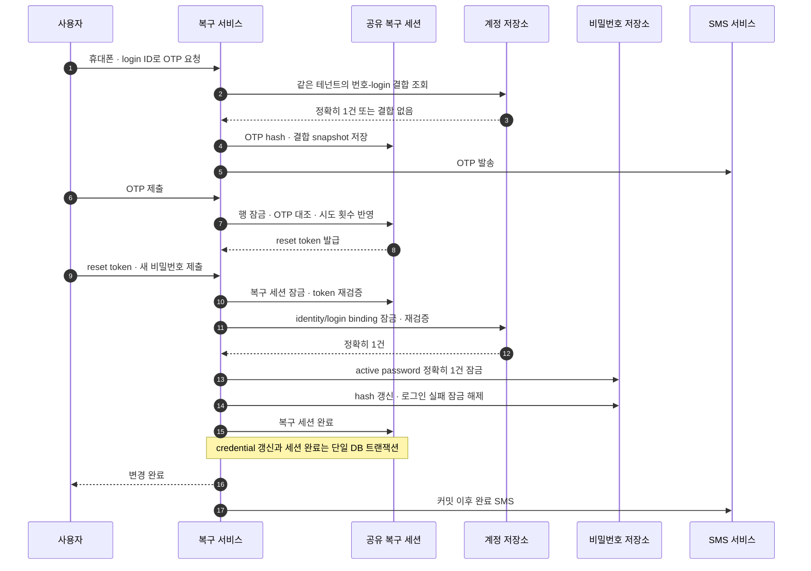

가입 OTP를 통과한 번호는 아이디 찾기와 비밀번호 재설정의 신뢰값이 된다. 그러나 “그 번호로 받은 OTP가 맞다”와 “지금 바꾸려는 계정이 그 번호의 유일하고 유효한 계정이다”는 다른 명제다. 둘을 한 번의 성공으로 취급하면 자신의 번호로 인증하고 다른 사람의 아이디를 적는 공격이나, 인증 뒤 계정 결합이 바뀌는 경쟁을 놓칠 수 있다.

나는 2026년 8~9월 복구 흐름의 요구 분석, 설계, 핵심 구현과 검증을 주도했다. 초기 메모리 구현을 개발 PostgreSQL의 공유 상태로 옮기고, 실제 외부 SMS까지 연결했다. 결과는 개발계 E2E 완료이며 운영 효과나 장애 감소 수치를 주장하지 않는다.

## 메모리 상태에서 공유 DB 상태로

초기 구현은 복구 세션과 발송 제한을 프로세스 메모리에 둘 수 있었다. 단일 인스턴스 로컬 검증에는 간단하지만 멀티 인스턴스에서는 보안 한도가 노드 수만큼 늘어난다. 한 노드에서 발급한 OTP를 다른 노드가 모를 수도 있고, 재시작하면 시도 횟수와 사용 여부가 사라진다.

복구 세션을 공용 DB 세션으로 옮겨 다음을 함께 저장했다.

- 원래 로그인/인가 세션과 테넌트 소유권
- 복구 유형(아이디 찾기 또는 비밀번호 재설정)
- 인증 연락처와 선택적으로 결합된 login ID
- OTP keyed hash, 만료, 발송·시도 횟수
- reset token keyed hash와 만료
- 진행·검증·완료·만료 상태

상태를 읽고 바꾸는 동안 `SELECT ... FOR UPDATE`로 한 행을 직렬화했다. OTP 대조와 실패 횟수 증가는 같은 잠금 안에서 일어난다. 여러 요청이 같은 실패 횟수를 읽고 각자 1로 되쓰는 lost update를 막기 위해서다.

## 최초 발송 제한은 세션 밖에 두었다

재발송 cooldown과 횟수는 하나의 복구 세션 안에서 잘 작동한다. 그러나 공격자가 매번 새 복구 세션을 만들면 모두 처음 발송이다. 그래서 복구 세션을 만들기 전에 “비공개 복합 식별자”의 해시 키로 별도 발송 창을 기록했다.

확인 후 증가하는 두 쿼리 대신 unique key 위의 한 문장 upsert를 사용했다. 창이 살아 있으면 횟수를 증가시키고, 지났으면 같은 행을 1로 되돌린 뒤 `RETURNING`으로 이 요청이 반영된 횟수를 받는다. 여러 인스턴스가 동시에 요청해도 DB가 하나의 순서를 정하므로 상한을 넘은 요청만 거부할 수 있다. 연락처 원문은 rate-limit 테이블에 남기지 않고 비가역 조회 키로 바꿨다.

## 계정을 찾는 단계부터 모호함을 실패로 처리했다

아이디 찾기는 같은 테넌트에서 검증된 번호에 연결된 login ID를 조회하고 마스킹해 보여 준다. 없는 번호도 동일한 화면 흐름을 사용해 등록 여부를 응답 차이로 드러내지 않는다.

비밀번호 재설정은 더 엄격하다. 사용자가 입력한 login ID와 인증 번호가 함께 가리키는 내부 identity를 조회하되 최대 두 건까지만 읽는다. 결과가 정확히 하나일 때만 결합된 것으로 본다. 0건은 불일치이고 2건 이상은 데이터 모호성이므로 모두 fail-closed다. 임의의 첫 행을 고르면 요청마다 다른 credential을 바꾸거나, 성공했는데 로그인이 되지 않는 상태를 만들 수 있다.

일부 경로에서는 계정 불일치여도 OTP 검증과 reset token 화면까지 같은 모양으로 진행한다. 존재 여부를 단계별 응답 차이로 노출하지 않기 위해서다. 실제 password 변경 직전에 결합이 없음을 확인하고 실패시킨다.

## OTP 뒤에 binding을 다시 잠근 이유

OTP 발송 시점의 결합이 재설정 시점에도 유지된다는 보장은 없다. 운영 도구나 다른 요청이 휴대폰 속성, login ID 상태, 계정 활성 상태를 바꿀 수 있다. 따라서 실제 변경 직전에 다음을 수행한다.

1. 번호와 login ID로 identity가 정확히 하나인지 찾는다.
2. 찾은 identity와 login binding 행을 `FOR UPDATE`로 잠근다.
3. 잠근 상태에서 테넌트, 번호, login ID, 유효 상태를 다시 확인한다.
4. 다시 정확히 하나일 때만 password credential로 진행한다.

PostgreSQL에서는 `DISTINCT` 결과를 그대로 `FOR UPDATE`할 수 없고, 중복 제거 없이 `LIMIT`을 걸면 여러 login 행이 다른 identity를 가릴 수 있다. 그래서 “정확히 하나 판정 → 지목된 행 잠금 → 조건 재검증”의 두 단계로 나눴다. 이 잠금은 트랜잭션이 끝날 때까지 결합을 고정한다.

아래 시퀀스는 OTP 성공 이후에도 계정 결합과 credential을 다시 확인한 뒤에만 변경하는 흐름을 보여 준다.

> 실선은 동기 요청, 점선은 응답이다. SMS는 로컬 DB 트랜잭션 밖에 있으며 완료 알림은 commit 이후에만 보낸다.

## active password도 정확히 하나여야 했다

내부 identity에 활성 password credential이 없거나 여러 개라면 무엇을 바꿔야 하는지 결정할 수 없다. 저장소는 활성 password 행을 최대 두 건까지 잠그고 정확히 하나일 때만 진행한다. 그 한 행의 salt/hash를 갱신하고 로그인 실패 누적과 잠금 상태를 초기화한다. 재설정했는데 계정 잠금 때문에 새 비밀번호로도 로그인하지 못하는 상황을 피하기 위해서다.

비밀번호 계산은 가입·로그인이 사용하는 기존 함수를 그대로 호출했다. 이 시스템의 저장 계약은 legacy password hash 조합이다. 호환성은 확보하지만 modern password KDF와 같은 강도는 아니다. 별도 마이그레이션 전략 없이 복구 경로만 알고리즘을 바꾸면 로그인과 불일치하므로, 이번에는 계약 유지가 우선이었다.

## 변경과 세션 완료를 한 트랜잭션으로

credential 갱신, 로그인 잠금 해제, 복구 세션 완료는 하나의 서비스 메서드와 한 트랜잭션에 묶었다. 중간에 실패하면 모두 롤백한다. 그렇지 않으면 “비밀번호는 바뀌었지만 reset token은 다시 쓸 수 있음” 또는 그 반대가 남는다.

외부 SMS는 이 트랜잭션에 넣지 않았다. 완료 알림은 트랜잭션 메서드가 성공적으로 반환한 뒤 보낸다. 알림 실패는 이미 커밋된 password를 되돌리지 않고 경고로 기록한다. 외부 메시지가 먼저 나가고 DB가 롤백되는 거짓 성공 알림을 피하는 선택이다.

## 무엇으로 검증했나

단위 테스트는 OTP 실패 횟수, 만료, reset token 재사용, 연락처 마스킹, 결합 없음/모호함, 활성 password 0·2건을 고정했다. 저장소 테스트는 upsert 기반 rate limit, `FOR UPDATE`, 행 수 검증과 SQL 계약을 확인했다.

개발 PostgreSQL 통합 테스트에서는 다음 시나리오를 실행했다.

- 같은 번호의 아이디 찾기는 현재 테넌트 결과만 마스킹해 반환한다.
- 다른 번호로 입력한 login ID는 OTP가 맞아도 password를 바꾸지 않는다.
- 중복 identity 결합과 중복 active password는 임의 선택하지 않는다.
- 결합 확인 뒤 경쟁 변경이 발생해도 잠금과 재검증이 보호한다.
- 갱신 도중 실패하면 credential과 복구 세션이 함께 롤백된다.
- 성공 후에는 새 비밀번호로 로그인되고 기존 reset token은 재사용되지 않는다.

실제 외부 SMS와 포털/BFF까지 연결한 개발계 E2E도 수행했다. 다만 email 복구는 정본 데이터가 없어 로컬 시나리오 수준에 머문다. 운영 전에는 email 정본 정의, legacy password KDF 이행, 알림 실패의 재처리/관측 체계가 필요하다.

이 설계의 핵심은 OTP 성공을 계정 소유권의 최종 증명으로 과대평가하지 않은 것이다. OTP는 연락처 접근을 증명하고, password 변경은 **그 연락처와 계정의 현재 결합을 잠근 뒤 다시 확인했을 때만** 허용한다.
