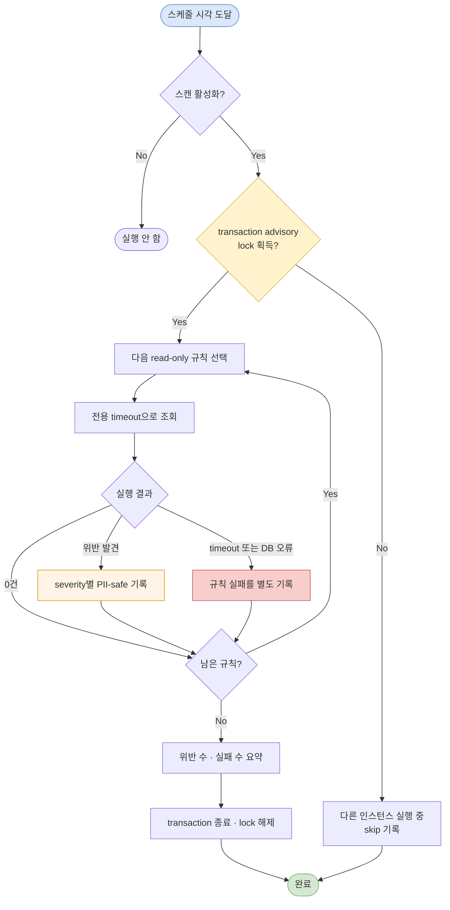

멀티테넌트 인증 플랫폼의 동작은 애플리케이션 코드만으로 결정되지 않는다. 테넌트-서비스 연결, OAuth client, Step 선택, 화면 presentation, 가입 정책, identity와 login/password 관계가 여러 테이블과 JSON 설정에 흩어져 있었다. 설정은 수동 DML로 반입되기도 했다.

이 구조의 가장 위험한 점은 잘못된 값 하나보다 **각각은 그럴듯하지만 함께 놓으면 성립하지 않는 조합**이다. 예를 들어 hosted login 화면은 열리는데 가입 정책이 비활성일 수 있고, DB에는 Registry가 모르는 Step ID가 들어갈 수 있다. 이런 오류는 해당 테넌트의 특정 경로를 호출하기 전까지 숨는다.

나는 2026년 8~9월 설정 반입 위험을 분석하고, 규칙·실행 모델·검증을 주도했다. 목표는 자동 수정이 아니라 잘못된 조합을 미리 드러내는 것이었다. 결과는 개발 환경에서 스캔 동작과 실패 격리를 검증한 것이며, 운영 지표 개선이나 실제 장애 예방 건수를 주장하지 않는다.

## 검토한 선택지

가장 강한 방법은 모든 관계를 DB foreign key, check, unique constraint로 표현하는 것이다. 가능한 제약은 당연히 DB에 두는 편이 낫다. 그러나 JSON 내부 shape, runtime Registry의 지원 ID, “presentation이 있으면 signup이 활성이어야 한다” 같은 교차 의미 규칙은 단일 제약으로 표현하기 어렵다. 기존 데이터와 단계적 반입 때문에 즉시 강제 제약을 추가하기 어려운 관계도 있었다.

애플리케이션이 설정을 읽을 때만 검증하는 방법도 있다. fail-fast라는 장점이 있지만 트래픽이 없는 테넌트의 오류는 계속 숨고, 여러 경로마다 검증을 중복하게 된다. 관리 API에서만 검사하면 수동 DML이 우회한다.

그래서 DB 제약과 런타임 검증을 대체하지 않는 **주기적 read-only 무결성 스캔**을 추가했다. 전체 설정을 사전에 훑고, 규칙별 결과를 구조화해 로그로 남긴다.

## 12개 규칙을 두 수준으로 분류했다

규칙은 `CRITICAL`과 `WARNING`으로 나눴다.

| 범주 | 검사 예 | 의미 |
|---|---|---|
| 기능-정책 조합 | hosted presentation과 signup flag 불일치 | 화면은 열리지만 가입이 실패할 수 있음 |
| JSON shape | signup 설정이 object/boolean 계약인지 | 파싱 fallback 또는 서버 오류 가능 |
| runtime 선택 | 지원하지 않는 OAuth Step ID | 요청 시 Service Locator 해석 실패 |
| 참조 무결성 | OAuth-client/tenant-service, service 연결의 orphan | 테넌트 경계 또는 라우팅 실패 |
| credential 관계 | identity 없는 password, password flag 불일치 | 로그인·복구 대상 불명확 |
| lifecycle | 만료된 가입 세션, 오래된 승인 대기 identity | 정리 또는 업무 확인 필요 |
| 유일성 | 정규화 login ID의 활성 중복 | 계정 선택이 모호함 |
| 활성 상태 전파 | 비활성 identity에 활성 login | 차단되어야 할 진입점 잔존 |

총 12개 SQL은 조회만 한다. 결과는 규칙 ID, severity, 일반화된 대상 종류, 내부 숫자 key, 고정된 진단 설명으로 제한했다. login ID, 휴대폰 번호, 토큰이나 JSON 원문을 보고서에 싣지 않는다. 중복 login 규칙도 실제 값을 노출하지 않고 그룹의 대표 내부 key와 건수만 반환한다. 이 방식은 로그를 PII-safe하게 유지하면서 운영자가 원본 DB에서 제한된 권한으로 후속 조사할 수 있게 한다.

## 한 규칙의 실패가 나머지를 가리지 않게 했다

12개를 하나의 거대한 SQL이나 한 트랜잭션으로 실행하면 한 테이블의 권한 문제나 timeout이 전체 결과를 지운다. 스캔 서비스는 규칙을 하나씩 실행하고 `DataAccessException`을 규칙 단위로 포착한다. 성공한 위반 목록과 실패한 규칙 목록을 함께 반환하며 다음 규칙을 계속 실행한다.

각 위반은 severity에 따라 error 또는 warn 로그로 남기고, 마지막에 위반 수와 실행 실패 수를 요약한다. 여기서 실행 실패를 “위반 없음”으로 취급하지 않는 것이 중요하다. `C5 failed`와 `C5 found zero`는 완전히 다른 상태다.

긴 조회가 인증 트래픽의 DB 자원을 계속 점유하지 않도록 스캔 전용 JDBC template에 query timeout을 적용했다. 공유 template의 timeout은 바꾸지 않아 일반 요청에 부작용을 주지 않는다.

## 여러 인스턴스의 중복 스캔을 transaction advisory lock으로 막았다

스케줄러는 기본 비활성이고 명시적으로 `enabled=true`인 환경에서만 생성된다. cron과 zone, 오래된 승인 대기 판정 일수, query timeout도 설정으로 둔다. opt-in을 택한 이유는 DDL 준비와 실행 비용을 확인하지 않은 환경에 갑자기 전체 스캔을 켜지 않기 위해서다.

여러 인스턴스가 같은 시각에 실행하면 동일한 쿼리가 중복되어 DB 부하와 로그가 늘어난다. 별도 coordinator를 추가하는 대신 PostgreSQL의 transaction-scoped advisory lock을 사용했다. 한 connection에서 auto-commit을 끄고 lock 획득, 전체 scan, commit/rollback을 수행한다. lock을 얻지 못한 인스턴스는 스킵 로그만 남긴다. transaction 종료와 함께 잠금이 해제되므로 프로세스가 비정상 종료되어도 영구 lease가 남지 않는다.

아래 흐름은 opt-in 스케줄부터 규칙별 장애 격리와 보고까지를 보여 준다.

## 자동 수정을 하지 않은 이유

스캔은 잘못된 설정을 고치지 않는다. `signup.enabled`를 자동으로 켜거나 orphan 행을 삭제하고, 중복 login 중 하나를 비활성화하지 않는다. 어떤 값이 업무적으로 정본인지 스캐너가 알 수 없기 때문이다. 특히 인증 설정의 자동 보정은 장애를 가리는 것을 넘어 예상치 못한 접근 허용으로 이어질 수 있다.

따라서 이 도구는 detection과 reporting까지만 책임진다. 수정은 변경 이력, 승인, 재검증을 갖춘 별도 반입 절차에서 수행해야 한다. 장기적으로는 스캔 규칙 중 확실한 불변식을 DB 제약과 설정 관리 API로 옮기고, 스캔은 교차 의미와 legacy 데이터 감시에 집중하는 편이 맞다.

## 검증 범위

테스트에서는 12개 규칙이 모두 실행되는지, 한 규칙이 timeout이어도 뒤 규칙의 위반이 보고되는지 확인했다. repository 테스트는 설정된 timeout이 실제 statement에 적용되고 공유 template에는 영향을 주지 않는지 검증했다. scheduler 테스트는 opt-in 조건과 다른 인스턴스가 lock을 보유한 경우 skip을 확인했다. advisory lock 테스트는 commit, rollback, auto-commit 복원과 SQL 오류 경로를 고정했다.

개발 DB에서는 정상 seed와 의도적으로 깨뜨린 설정을 넣어 규칙별 탐지를 확인했다. 다만 아직 운영에 배치해 수집한 metric은 없다. 위반 수 추세, 규칙별 실행 시간, timeout 빈도, 스캔이 인증 query latency에 주는 영향은 이후 관측해야 한다.

## 플랫폼 전체의 한계와 다음 선택

이 스캔이 있어도 설정이 안전하다는 보장은 아니다.

- 무결성 스캔과 보안 정책 강제는 별개의 검증이다. 환경별 허용 정책과 승인 절차는 별도로 관리하며 공개하지 않는다.
- password는 기존 시스템과의 호환 계약을 유지했다. 무결성 스캔은 credential 관계를 찾지만 해시 강도를 높이지 않는다. 구체적인 레거시 알고리즘은 생략하고, 로그인 성공 시 rehash 같은 단계적 modern KDF 이행 전략만 기록한다.
- SAS와 Keycloak은 당시 팀 논의만 했고 PoC하지 않았다. 자체 Registry와 스캔을 더 확장하기 전에 표준 프레임워크의 멀티테넌시·확장 지점·업그레이드 비용을 같은 요구로 비교해야 한다.

동적 설정은 코드 배포 없이 정책을 조합하게 해 주지만, 검증 책임도 코드 밖으로 이동시킨다. 이번 선택은 그 책임을 “문제가 난 요청의 로그”에만 맡기지 않고, **읽기 전용 규칙으로 미리 관찰 가능한 상태**로 바꾼 것이다.
