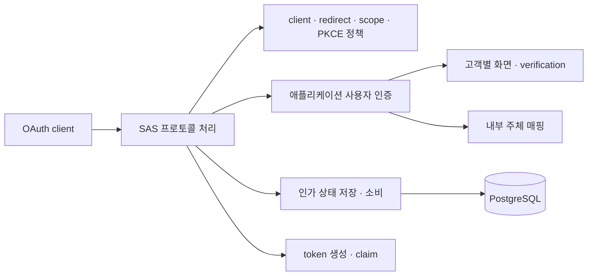
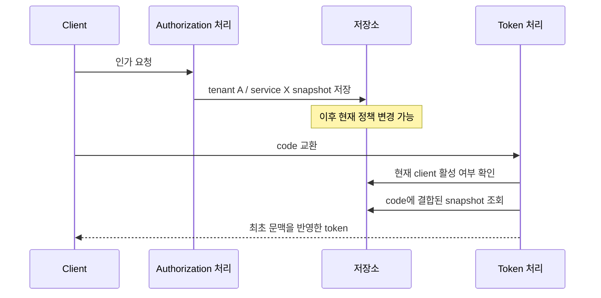
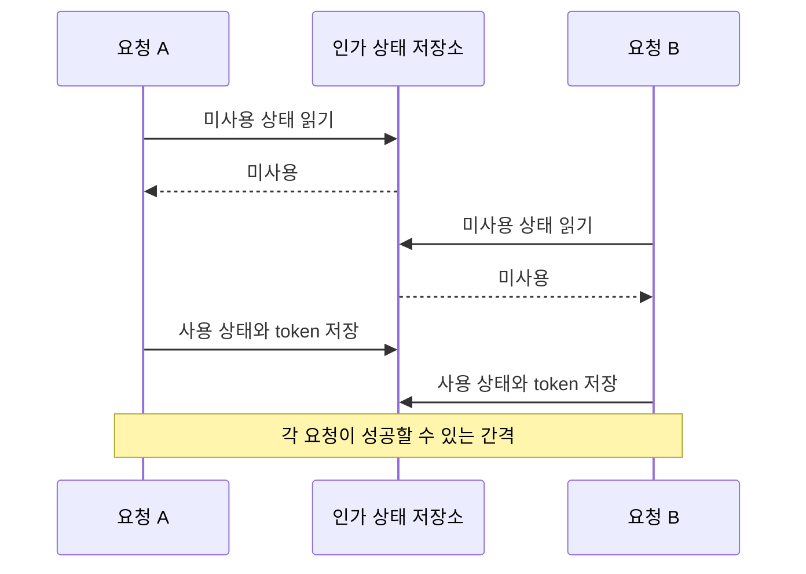

[1편의 OAuth 경계 설계](/blog/oauth-auth-platform-01-protocol-boundary)를 설명하다 보면 결국 이런 질문을 받는다. “표준 프로토콜을 왜 직접 구현했나요? Spring Authorization Server를 라이브러리로 붙이고 필요한 부분만 바꾸면 되지 않나요?”

이 질문에는 고객별 요구가 많았다는 설명만으로 답하기 어렵다. 서비스와 테넌트마다 인증 절차가 다르고, PoC에서는 verification을 생략해 달라고 하며, 로그인 화면의 아이콘까지 고객마다 달랐다. 그렇더라도 그 차이가 OAuth 프로토콜 구현을 직접 소유해야 하는 이유인지는 별개의 문제다.

그래서 Spring Authorization Server(SAS) 1.5.8을 실제 의존성으로 추가한 `SasDemoApplication`을 별도 저장소에 만들었다. 이 글은 2026년 9월 7~8일의 사후 실험이다. 회사 구현 당시의 선택을 실험으로 입증했다고 소급하지 않는다. 기존 코드의 조사 범위는 2026년 8~9월의 `oauth-boundary`이며, 가입·계정 복구 자체를 다시 구현한 실험도 아니다.

확인한 결론은 구체적이다. 표준 프로토콜 처리와 상당수 동적 정책은 SAS로 옮길 수 있었다. 고객별 화면도 장애물이 아니었다. 다만 정책의 적용 시점, 비표준 PKCE 예외, 일회용 grant의 동시 소비, DB 장애 응답은 별도로 설계하고 검증해야 했다. 면접에서 설명할 핵심은 프레임워크 사용 여부보다 이 책임 구분이다.

## 먼저 SAS가 무엇을 대신하는지 정리했다

SAS는 애플리케이션 안에 포함할 수 있는 인가 서버 프레임워크다. 별도 제품으로만 운영해야 하는 것은 아니다. 이번 demo는 Maven 의존성과 `SecurityFilterChain`을 구성해 실제 SAS provider를 실행했다. `@Import`만이 통합 방법이라는 의미도 아니다.

공식 설정 모델은 client 저장소, authorization 저장소, token 생성기와 endpoint 처리 확장점을 제공한다. 사용자 로그인 방식은 별도로 구성해야 하고 OIDC도 명시적으로 활성화해야 한다. [SAS 설정 모델](https://docs.spring.io/spring-authorization-server/reference/configuration-model.html)

이 차이를 요청 흐름으로 그리면 다음과 같다.



> 화살표는 책임 간 연결이다. 고객별 화면과 내부 주체 매핑은 SAS와 함께 사용할 수 있지만 애플리케이션이 구현해야 하는 영역이다.

Keycloak도 비교 후보에는 남겼다. theme과 SPI 확장 경로가 있으므로 고객별 요구만으로 불가능하다고 볼 수 없다. 다만 이번에는 Keycloak을 실행하거나 성능을 측정하지 않았다. SPI 배포와 제품 업그레이드 비용은 후속 비교 항목이다. [Keycloak 개발 가이드](https://www.keycloak.org/docs/latest/server_development/index.html)

## “verification bypass”를 하나의 스위치로 취급하면 안 됐다

같은 bypass라는 말이라도 생략하는 검증에 따라 비용과 위험이 달라진다.

| 요청 | 바뀌는 책임 | demo에서 다룬 방식 |
|---|---|---|
| PoC에서는 OTP/CAPTCHA 생략 | 사용자 인증 과정의 추가 검증 | 로그인 계층의 정책 gate |
| 고객마다 로고·아이콘 변경 | 화면 표현 | 허용된 template과 asset 선택 |
| 등록 redirect 검증 완화 | code 전달 목적지 검증 | authorization validator 확장 |
| 허용 scope 검사 완화 | 권한 부여 | validator와 발급 scope 확인 |
| public client의 PKCE 해제 | code를 교환하는 주체의 증명 | converter와 client 인증 provider 보완 |

아이콘을 바꾸거나 추가 verification을 생략하는 요구는 비교적 자연스럽게 SAS 앞의 로그인 계층에 놓을 수 있었다. 여기서 중요한 불변식은 “OTP를 생략해도 비밀번호, CSRF, tenant binding과 flow 식별은 유지한다”였다. demo에서는 위조 flow와 허용되지 않은 template을 거부하는 경우까지 확인했다.

여러 탭도 고려해야 했다. 세션에 마지막 인가 요청 하나만 보관하면 탭 A에서 시작한 로그인 결과가 탭 B의 요청으로 이어질 수 있다. demo는 flow별 문맥을 두고 로그인 이후 SAS 흐름을 재개했다. 다만 이 문맥은 로컬 세션 기반이다. 여러 서버 사이의 세션 공유까지 검증한 것은 아니다.

OTP와 CAPTCHA 값은 test double이다. 정책에 따라 검증을 요구하거나 생략하는 경계는 확인했지만 실제 SMS 발송 실패, 재전송 제한, CAPTCHA 사업자 timeout까지 검증했다고 말할 수 없다.

반면 redirect나 scope의 bypass는 인가 서버의 보안 의미를 바꾼다. 확장 API로 구현할 수 있다는 사실과 운영에서 허용해도 된다는 판단은 구분해야 한다. 이 실험에서는 완화 후에도 token 교환의 redirect binding과 code 재사용 차단이 유지되는지 확인했다.

## 공개 확장점으로 충분한 부분과 까다로워진 부분

| 변경 | 적용 지점 | 실험에서 확인한 비용 |
|---|---|---|
| client별 token TTL·refresh 허용 | `RegisteredClientRepository` | 요청 시 유효 설정 구성, cache 일관성 필요 |
| 동적 redirect·scope 정책 | authorization validator | 기본 검증을 교체하며 놓치는 규칙 확인 필요 |
| tenant/service claim | `OAuth2TokenCustomizer` | 값의 출처와 적용 시점 결정 필요 |
| 고객별 로그인 UX | Spring Security와 application controller | 인증 후 SAS로 돌아갈 flow 연결 필요 |
| PKCE plain 호환 | authorization converter | 요청을 변환하고 기본 verifier 재사용 |
| public client PKCE off | converter와 client 인증 provider | 기본 인증 경로의 가정을 바꾸는 보완 필요 |
| 인가 당시 정책 보존 | `OAuth2AuthorizationService` wrapper | 저장·역직렬화 계약과 기존 authorization 호환 필요 |

PKCE의 `optional`은 제공된 challenge를 무시한다는 뜻이 아니었다. client의 `requireProofKey`만 false로 바꿔도 public client가 verifier 없이 교환하는 요구를 그대로 만족하지 않았다. 따라서 “설정 한 줄로 끈다”는 가정을 테스트로 깨는 과정이 필요했다.

plain 호환 실험에서는 authorize 요청의 plain challenge를 S256 형태로 변환해 저장하고 SAS 기본 verifier를 재사용했다. 이 변환이 최초 요청에 실린 plain challenge를 비밀로 만드는 것은 아니다. 구현 재사용과 보안 수준 개선은 다른 이야기다.

off 실험은 더 복잡했다. 인가 요청뿐 아니라 token endpoint의 client 인증 경로까지 보완했다. 이미 S256으로 발급한 code를 이후 off 정책으로 바꿔 교환할 수 없도록, 발급 당시 mode와의 결합도 검사했다. 이런 예외가 오래 남을수록 SAS 기본 경로를 재사용하는 이점이 줄어든다.

## 동적 설정에서 어려운 것은 조회보다 시점이었다

authorize 당시에는 client가 tenant A와 서비스 X에 속했는데 token 교환 전에 설정이 tenant B와 서비스 Y로 바뀌었다고 가정해 보자. token customizer가 최신 정책만 조회하면 같은 code가 새로운 tenant claim을 만들 수 있다.

demo에서는 authorization을 처음 저장할 때 tenant/service와 정책 version을 snapshot으로 보관하고 이후 claim 생성에 사용했다. 한편 client 비활성화는 token 교환 시점에 다시 확인했다. 과거 문맥을 보존하는 값과 즉시 차단해야 하는 값을 구분한 것이다.



이 snapshot도 완전한 정책 versioning은 아니다. demo는 TTL과 모든 보안 규칙을 통째로 고정하지 않으며, 여러 정책 조회 사이의 동시 변경까지 하나의 일관된 읽기로 묶지 않았다. 운영 설계에서는 어떤 값은 snapshot을 따르고 어떤 값은 최신 정책을 따를지 명시해야 한다.

저장 단계에서는 예상하지 못한 문제도 만났다. SAS JDBC의 authorization attribute에 중첩 Map과 `Long` 값을 넣었을 때 역직렬화 allowlist 오류가 발생했다. demo는 version을 문자열로 저장하도록 좁혔다. 타입을 제한 없이 허용하는 방식으로 해결하지 않았다. extension point가 존재해도 persistence wire format까지 마음대로 바꿀 수 있는 것은 아니었다.

## 순차 code 재사용 테스트와 동시 소비 테스트는 달랐다

순차 테스트에서는 code 교환이 한 번 성공하고 다음 요청은 실패했다. 이 결과만 보면 일회용 소비가 보장된 것처럼 보인다. 하지만 두 요청이 사용 전 상태를 동시에 읽으면 다른 문제가 생긴다.

다음은 경쟁을 설명하기 위한 개념적 순서다. 특정 라이브러리의 소스 코드를 복사한 것이 아니다.



SAS 1.5.8과 demo의 JDBC 구성에서 lock을 끈 뒤 동일 code를 동시에 교환했을 때 복수 성공을 관측했다. 최종 raw 재현 테스트는 4개 동시 요청을 5회 시도해 복수 성공 회차가 있는지 확인한다. 스케줄링에 의존하는 재현이며 결정적인 barrier를 저장소 내부에 둔 테스트는 아니다. 모든 SAS 버전과 저장소가 동일하다고 일반화할 수도 없다.

보완 구현에서는 grant를 기준으로 PostgreSQL transaction advisory lock을 잡고, SAS의 조회와 저장이 같은 Spring transaction 안에서 실행되도록 했다. code와 refresh 각각 16개 동시 요청을 5회 반복해 회차당 정확히 한 번의 HTTP 성공을 확인했다. 별도 connection으로 lock만 잡고 token 처리에서 또 connection을 빌리면 pool 고갈 위험이 생기므로 transaction 경계가 중요했다.

이때도 검증 결과의 의미를 좁혀야 한다. “HTTP 200이 한 건”은 “그 token이 이후에도 계속 유효하다”와 같지 않다. code 재사용 탐지 후 이미 발급한 token을 무효화하는 동작까지 포함하려면 introspection 또는 resource server 검증을 이어 붙여야 한다. 현재 테스트의 단일 성공 assertion만으로 그 부분까지 주장할 수 없다.

기존 서비스는 조건부 DB update로 상태 전이 성공 여부를 판단하는 구조였다. 원리는 다음처럼 설명할 수 있다.

```sql
-- 개념 설명용 예시: 실제 서비스 schema가 아니다.
UPDATE demo_grant
SET consumed = true
WHERE id = :id AND consumed = false;
```

영향받은 행 수가 1인 요청만 다음 단계로 진행하면 읽기와 별개로 소비 권한을 DB에서 결정할 수 있다. 실패 시 소비와 token 저장이 함께 rollback되는 transaction도 필요하다. SAS 도입 시에는 기존의 이런 보장을 프레임워크 기본 저장소로 교체하면서 잃지 않는지 확인해야 한다.

advisory lock 보완에도 비용은 남는다. DB connection 점유, lock 대기 상한, revoke와의 경합, 응답을 전송하는 시점과 commit 실패의 관계를 더 검증해야 한다. 이번 demo는 운영에 바로 넣을 완성형 lock 설계가 아니다.

## DB 조회를 줄였지만 더 빨라졌다고 말하지 않았다

부하는 실제 HTTP client-credentials 요청 2,000건, 동시성 32로 측정했다. 조건별 100건을 워밍업하고 정책 cache off/on을 비교했다. PostgreSQL 17.6, Hikari 최대 12 connection, 로컬 단일 JVM 조건이었다.

| 지표 | Cache off | Cache on, TTL 2초 |
|---|---:|---:|
| 정상 응답 / 생성 authorization | 2,000 / 2,000 | 2,000 / 2,000 |
| 처리량 | 120.58 req/s | 121.55 req/s |
| p50 | 263ms | 260ms |
| p95 | 318ms | 319ms |
| p99 | 347ms | 360ms |
| 정책 SELECT | 6,000회 | 13회 |
| 정책 SELECT 총 DB 실행 시간 | 136.269ms | 0.203ms |

정책 SQL은 99.78% 감소했다. 요청당 세 번 발생하던 정책 조회를 cache가 대부분 흡수했다. 그러나 처리량은 거의 같았고 p99는 오히려 높아졌다. 확실한 결과는 DB 호출량 감소다. 단일 off→on 비교로 end-to-end 성능 개선을 주장할 수 없다.

`pg_stat_statements`의 실행 시간은 HTTP 전체 시간도, connection 대기 시간도 아니다. 쿼리 실행이 짧다고 바로 서명이 병목이라고 결론낼 수도 없다. CPU, GC, pool acquire, 직렬화와 네트워크 구간을 추가로 관측해야 한다.

측정 도구 해석에서도 한 번 실패했다. 첫 ApacheBench 실행은 `Failed requests: 0`이었지만 모두 non-2xx였고 authorization row도 없었다. 요청 파일 끝의 개행이 scope 값에 들어간 것이 원인이었다. 이후 정상 응답 사전 확인과 non-2xx 검사를 추가했고 그 실패 샘플은 위 표에서 제외했다. 부하 테스트에서는 완료 건수와 업무 성공 건수를 함께 확인해야 한다.

## auth-service와의 직접 성능 비교는 어디까지 했나

두 앱의 시작과 메모리 사용량은 측정했다. Java 17.0.10, Spring Boot 3.5.15, 같은 호스트에서 fat JAR을 실행하고 readiness 이후 20초에 RSS와 thread를 읽었다.

| 지표 | sas-demo | auth-service |
|---|---:|---:|
| Spring 시작 로그의 시간 | 1.375초 | 2.466초 |
| RSS | 318,608KiB | 348,496KiB |
| JVM thread 수 | 50 | 52 |
| 실행 JAR 크기 | 30,465,098 bytes | 77,565,122 bytes |

시작 시간은 프로세스 생성부터 첫 업무 요청 성공까지 직접 잰 시간이 아니라 Spring의 시작 로그 값이다. RSS도 고정 heap이나 장시간 안정 상태에서 반복 측정한 값은 아니다. 무엇보다 auth-service는 여러 업무와 운영 의존성을 포함한 서비스이고 demo는 최소 실험 앱이다. 위 차이를 “SAS가 더 효율적”이라는 근거로 쓰면 안 된다.

token 처리량의 양자 비교는 아직 하지 않았다. SAS 부하는 client credentials이고 기존 서비스의 비교 대상은 authorization code와 refresh 흐름이다. 동일 서명·claim·TTL·DB 규모·logging 조건에서 매 요청 새 code를 발급하는 workload를 구성해야 공정하다. 지금은 두 구현의 **로컬 실행 비용 일부**와 **설계 차이**를 비교했다고 설명하는 것이 정확하다.

## 기능 테스트가 통과해도 DB 장애는 다른 응답을 만들었다

별도 실험에서는 demo DB를 중단했다. Hikari connection timeout을 2초로 설정한 조건에서 token 요청이 약 2초 뒤 302를 반환했고, DB를 다시 시작한 뒤 시작 시간을 포함해 약 4초 후 token 200 응답으로 돌아왔다.

DB 재연결은 확인했지만 장애 응답 계약은 부족했다. token API 이용자는 로그인 redirect 대신 인프라 장애를 해석할 수 있는 응답을 받아야 한다. 다만 현재 증거는 status와 회복 관측이다. redirect의 최종 목적지와 exception/error dispatch의 정확한 연결은 추가 확인이 필요하며, 이를 SAS 자체의 보편적인 결함으로 부르지 않는다.

이 결과 때문에 검증 범위를 기능·비기능으로 나눠 설명하게 됐다.

| 검증 | 확인한 것 | 아직 남은 것 |
|---|---|---|
| code/refresh 경쟁 | demo 보완 후 회차당 HTTP 성공 1건 | 두 JVM, revoke 경쟁, 성공 token의 후속 유효성 |
| DB 부하 | cache 전후 SQL 호출량과 HTTP 지연 | 반복 비교, 대용량 데이터, CPU/GC/WAL |
| DB 장애 | 비정상 302와 자동 재연결 | 오류 원인별 응답 계약, failover, network blackhole |
| 보안 응답 | 일부 no-store/header와 오류 정보 비노출 | 전체 endpoint, audit 로그, 배포 계층 |
| 고객 verification | 정책 gate와 flow 연결 | 실제 외부 사업자 장애·재시도·보상 |

기록 시점 demo는 46개 테스트 메서드, 반복 포함 54회 실행을 통과했다. 이것은 고정한 사례의 범위다. OAuth conformance 전체, 모든 고객 요구, 운영 안전성의 인증을 뜻하지 않는다.

## 멀티테넌시도 격리 수준부터 물어야 한다

client별 설정과 화면이 다른 것, tenant마다 issuer·서명 키·저장소까지 독립적인 것은 서로 다른 요구다. demo는 단일 issuer와 client 정책으로 첫 번째 요구를 검증했다.

공식 SAS 가이드는 다중 issuer를 허용하고 요청 issuer에 따라 client 저장소, authorization/consent service와 JWK source를 선택하는 composite 구성을 제시한다. 동적 tenant 추가 경로도 있다. 이 구조는 가능하지만 이번 demo의 실행 검증 대상은 아니다. [SAS 멀티테넌시 가이드](https://docs.spring.io/spring-authorization-server/reference/guides/how-to-multitenancy.html)

따라서 면접에서 “멀티테넌트라 SAS가 어려웠다”고만 말하면 부족하다. 화면 차이인지, identity namespace 격리인지, issuer와 key 격리인지 먼저 설명해야 기술 선택을 평가할 수 있다.

## 다시 선택한다면 무엇을 바꿀까

지금 다시 시작한다면 S256, strict redirect/scope, 표준 token endpoint를 SAS 기본 경로로 먼저 구성하고, 기존 인증 도메인과 UI를 그 앞에 연결하는 작은 PoC를 먼저 만들겠다. 가장 위험한 비표준 요구 한두 개를 넣어 공개 확장점만으로 유지되는지 확인한 뒤 범위를 결정할 것이다.

| 판단 기준 | 자체 구현 유지 | SAS 기반 전환 |
|---|---|---|
| 표준 protocol 유지보수 | 직접 추적·수정·회귀 책임 | 라이브러리 업데이트와 통합 회귀 책임 |
| 기존 domain·DB 계약 | 현재 모델을 직접 유지 | repository/principal/claim adapter 설계 |
| 비표준 예외가 많은 경우 | step으로 직접 표현 | provider 기본 가정을 바꾸는 비용 증가 |
| 표준 OIDC 확장 | 추가 구현 범위 큼 | 제공 기능 활용 가능 |
| 일회용 상태 보장 | 기존 조건부 상태 전이 검증 | 저장소 교체 후 동일 불변식 재검증 |
| 이행 비용 | 현재 구조 유지 비용 | client 계약, 기존 token, rollback 경로 검증 |

고객별 UI가 있다는 이유는 자체 프로토콜 구현을 정당화하기에 약했다. 기존 DB와 예외 정책을 연결하는 비용, 보안 불변식을 보존하는 비용, 장기 표준 유지보수 비용을 함께 비교해야 했다. 이 실험은 당시 선택의 정답을 증명하기보다 비교해야 했던 항목을 구체화했다.

## 면접에서 설명할 답변과 꼬리 질문

### 1분 답변

> 기존 프로젝트는 인증 과정이 바뀌어도 client의 authorize/token 계약을 유지하도록 경계를 설계했습니다. 이후 자체 구현이 꼭 필요했는지 확인하려고 SAS 1.5.8과 PostgreSQL로 별도 demo를 만들었습니다. 고객별 화면과 동적 TTL·claim은 자연스럽게 분리할 수 있었지만, public client PKCE 해제와 정책 snapshot은 추가 설계가 필요했습니다. 특히 순차 재사용 테스트만으로 부족해 동시 code 소비를 재현했고, DB transaction 보완 후 단일 HTTP 성공을 확인했습니다. 정책 cache는 SQL 조회를 크게 줄였지만 지연 개선은 입증하지 못했습니다. 현재라면 표준 경로를 SAS에 맡기는 PoC를 먼저 하고, 예외와 DB 불변식의 이행 비용을 기준으로 선택하겠습니다.

이 답변은 사후 실험을 설명하는 초안이다. 원 프로젝트의 본인 역할·의사결정 권한·운영 성과는 별도 확인된 사실에 맞춰 덧붙여야 한다.

### “SAS가 다 해주는데 무엇을 직접 설계했나요?”

프로토콜과 사용자 인증을 구분해서 답한다. SAS는 표준 요청 처리의 기반을 제공한다. tenant에 맞는 사용자인지, 어떤 verification을 요구할지, 인가 당시 정책을 어디까지 고정할지, 기존 계정을 어떤 principal로 연결할지는 제품 요구다. extension point 목록보다 그 지점에 넣는 판단을 설명하는 것이 중요하다.

### “트랜잭션만 붙이면 동시성은 해결되지 않나요?”

transaction은 작업의 commit/rollback 경계를 제공하지만, 같은 미사용 상태를 두 요청이 읽는 문제를 자동으로 막지는 않는다. 격리 수준과 상태 변경 SQL을 같이 봐야 한다. 이 실험에서는 grant 단위 lock으로 직렬화했고, 기존 구조의 조건부 update도 비교했다. 단일 성공 이후 token의 유효성과 재사용 탐지 정책은 추가 불변식이다.

### “99.78% 개선은 어떤 성과인가요?”

정책 SELECT 호출량 감소다. token 전체 처리량이나 사용자 대기 시간이 99.78% 개선된 것이 아니다. HTTP percentile은 개선을 뒷받침하지 않았고, 한 번의 순서 고정 실험으로 인과관계를 주장할 수 없다. 수치의 분모와 측정 구간을 먼저 설명한다.

### “그럼 자체 구현이 잘못된 선택이었나요?”

그 결론까지는 아니다. 당시 제약과 migration 비용을 확정하지 못했고 SAS로 기존 제품 전체를 옮겨 본 것도 아니다. 다만 고객별 UI·동적 설정만으로 SAS를 제외할 근거는 약해졌다. 표준 경로는 재사용하고 예외와 원자성은 검증하는 방향으로 현재 판단을 수정했다고 답할 수 있다.

### “운영 반영 전에 무엇부터 하겠나요?”

DB 장애 응답, 두 JVM 동시 소비, revoke와 rotation 경쟁, 정책 cache 무효화, key 영속화·rotation, 실제 verification 장애를 우선한다. 부하는 authorization-code 경로로 맞추고 반복 실행·CPU·GC·pool 대기까지 관측한다. 각각 실패 조건과 성공 기준을 먼저 정한다.

## 근거 경로와 재현 방법

이 글 자체에 판단 과정과 측정 조건을 담았다. 아래 경로는 작성자의 로컬 checkout에서 원본 증거로 이동하기 위한 안내다. 웹사이트의 공개 다운로드 주소가 아니며 회사 소스·비밀값·고객 데이터는 이 블로그 저장소에 포함하지 않는다.

| 구분 | 로컬 경로 | 확인할 내용 |
|---|---|---|
| 원본 서비스 | `private-workspace` | OAuth 경계와 상태 전이의 원래 구현 |
| 독립 demo | `private-workspace` | 실제 SAS dependency, 애플리케이션과 테스트 |
| demo 산출물 index | demo의 `docs/README.md` | 문서·테스트·commit 전체 경로 |
| 확장점 검증 | demo의 `docs/verification-report.md` | 사례별 지원 범위와 한계 |
| 비교 대조표 | demo의 `docs/auth-service-vs-sas-demo.md` | 기능·비기능 차이 |
| 성능·장애 결과 | demo의 `docs/db-load-profile.md`, `docs/non-functional-verification.md` | 측정 조건과 기록된 수치 |

원본 서비스의 내부 심볼, 경로와 revision은 공개하지 않는다. 실험 시점과 이후 코드 변경은 구분해 해석한다.

demo 증거 기준은 `015a45c`다. 다음 commit과 파일을 순서대로 보면 실험의 주장을 추적할 수 있다.

| 질문 | demo commit | 핵심 파일, demo 상대 경로 |
|---|---|---|
| 진짜 SAS를 실행했나 | `da61b81` | `pom.xml`, `src/main/java/example/sas/SasDemoApplication.java` |
| 동적 정책·PKCE는 어디서 바꾸나 | `5d7b507`, `02bf87b` | `src/main/java/example/sas/PolicyValidator.java`, `PkceCompatibility.java` |
| 고객별 UX는 어떻게 연결하나 | `850e79c` | `src/main/java/example/sas/LoginExperience.java` |
| 정책 변경 시 claim은 안전한가 | `56a67bd` | `src/main/java/example/sas/PolicySnapshotAuthorizationService.java` |
| 동시성 근거는 무엇인가 | `39fc1f7`, `034fc0f` | `src/test/java/example/sas/RawJdbcConcurrencyTest.java`, `ConcurrencyTest.java` |
| 비기능 실행은 어디 있나 | `440f0ed`, `08a52b0` | `scripts/run-db-resilience-profile.sh`, `run-runtime-footprint.sh` |

위 표에서 같은 셀의 축약된 파일명은 바로 앞 파일과 같은 디렉터리에 있다. 다음 명령은 demo checkout과 Java 17, Maven, Docker가 준비된 환경에서 실행한다.

```bash
# 독립 실험용 checkout 디렉터리에서 실행
docker compose up -d --wait
mvn test
./scripts/run-load-profile.sh
./scripts/run-db-resilience-profile.sh
```

load 스크립트는 demo authorization 데이터를 초기화하고, resilience 스크립트는 demo DB를 잠시 중단한 뒤 복구한다. 원본 서비스 DB에 연결해서 실행하는 명령이 아니다. 측정 산출물은 `target/load-profile/`, `target/nonfunctional/`, 테스트 결과는 `target/surefire-reports/`에 생성된다. `target`은 Git 제외 경로이므로 checkout만으로 과거 raw 로그가 복원되지는 않는다. 보존된 문서 수치와 재실행 결과를 구분해서 읽어야 한다.

사후 실험에서 얻은 가장 유용한 것은 “가능하다”는 답 뒤에 어떤 추가 코드와 검증이 필요한지 설명할 수 있게 된 점이다. 면접에서도 라이브러리의 지원 목록보다, 무엇을 재사용했고 무엇을 직접 보장했으며 어떤 결과는 아직 확인하지 못했는지를 근거와 함께 설명하려 한다.
