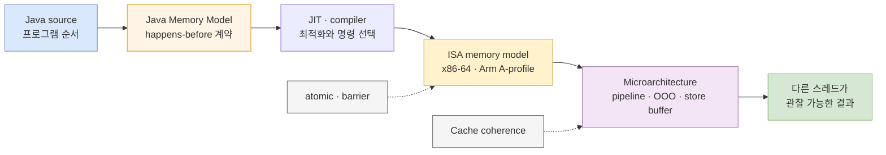
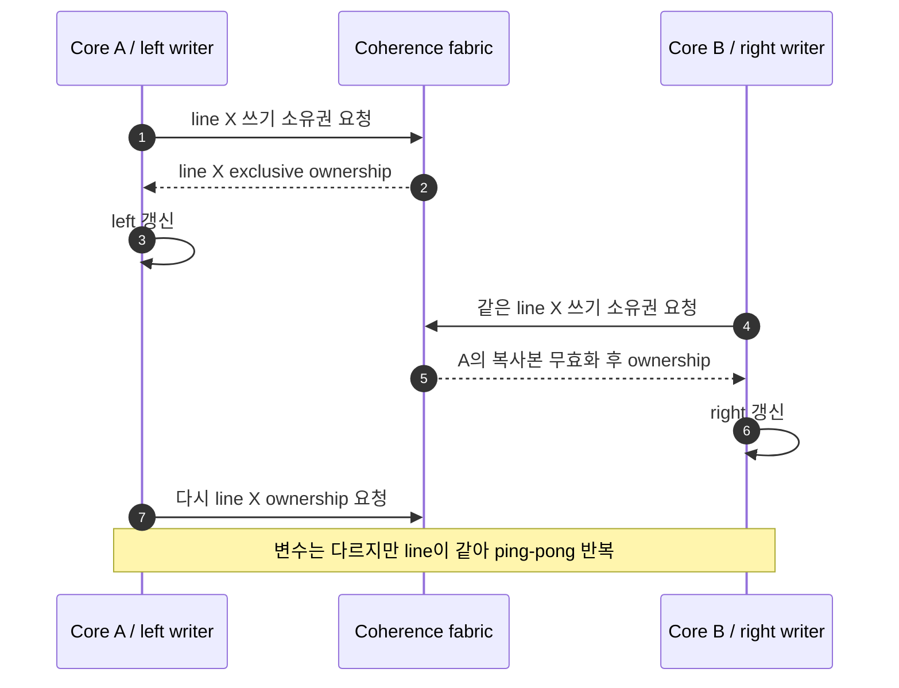

한 스레드가 `ConcurrentHashMap.compute`를 호출하면 JVM은 결국 CPU의 atomic 명령과 메모리 순서 보장을 이용한다. 그렇다면 CPU의 CAS를 알면 `ConcurrentHashMap`의 원자성도 전부 이해한 것일까? 그렇지 않다. CPU는 한 메모리 위치를 원자적으로 바꾸고 관찰 순서를 제한할 **재료**를 제공한다. Java Memory Model과 컬렉션 API는 그 재료 위에 프로그래머가 의존할 수 있는 **언어 계약**을 만든다.

[JVM 안의 원자성: volatile에서 ConcurrentHashMap까지](/blog/concurrency-02-jvm-concurrent-hash-map)가 “어떤 API 호출이 한 덩어리인가?”를 물었다면, 이 글은 한 층 아래로 내려간다.

> **멀티코어 CPU는 왜 공유 변수 하나를 갱신하는 데도 코어 사이 통신이 필요하고, 그 비용은 언제 병렬성의 이득을 삼키는가?**

이 질문에 답하려면 코어 수만 세어서는 부족하다. pipeline과 out-of-order execution, 캐시 계층, cache line, coherence, store buffer, memory ordering을 구분해야 한다. 단, 이 글의 목표는 특정 CPU의 회로를 외우는 것이 아니다. 하드웨어 현상을 Java의 가시성·원자성 계약과 혼동하지 않고, 성능 문제를 검증 가능한 가설로 바꾸는 것이다.

## 1. 싱글 코어의 동시성과 멀티코어의 병렬성

싱글 logical processor에서도 여러 작업이 함께 진행되는 것처럼 보일 수 있다. 운영체제가 실행할 스레드를 바꾸고, 한 작업이 I/O를 기다리는 동안 다른 작업을 실행하기 때문이다. 같은 시간 구간에 여러 작업의 진행이 겹치는 **동시성(concurrency)** 이다. SMT가 없는 logical processor 하나에서는 한 시점에 하나의 software thread가 실행된다. SMT가 켜진 physical core 하나는 여러 logical-processor context를 같은 시각에 진행시킬 수 있지만 실행 자원을 공유하므로 독립 physical core와 같지 않다.

멀티코어에서는 서로 다른 코어가 실제로 같은 시각에 명령을 실행할 수 있다. 이것이 **병렬성(parallelism)** 이다. 병렬성은 동시성을 구현하는 한 방법이지만 둘은 동의어가 아니다.

| 상황 | 동시성 | 실제 CPU 병렬 실행 | 주된 병목 후보 |
|---|---:|---:|---|
| logical CPU 하나에서 여러 runnable 스레드 | 가능 | 불가능 | 스케줄링, 전환, 캐시 교란 |
| physical core 하나 + SMT siblings | 가능 | 제한된 동시 실행 가능 | execution/cache resource 경쟁 |
| 멀티코어에서 독립 계산 | 가능 | 가능 | 계산량, 메모리 대역폭 |
| 멀티코어에서 같은 락 경쟁 | 가능 | 일부만 가능 | 직렬 임계 구역, coherence 통신 |
| 많은 virtual thread가 네트워크 대기 | 가능 | runnable 작업만 코어에서 실행 | 외부 I/O, carrier 스케줄링 |
| 많은 virtual thread가 순수 계산 | 가능 | 코어가 허용하는 만큼 | CPU 포화, 스케줄링 오버헤드 |

virtual thread는 대기 비용과 스레드당 자원 비용을 줄여 동시 작업을 많이 다루게 해 주지만 물리 코어를 추가하지는 않는다. compute-bound 작업을 runnable 상태로 더 많이 쌓으면 처리량이 끝없이 늘기보다, 어느 지점부터 같은 CPU 시간을 나누고 캐시와 실행 자원을 경쟁한다. virtual thread의 스케줄링과 blocking 동작은 이후 글에서 다루고, 여기서는 **실제로 명령을 실행하는 병렬 슬롯은 유한하다**는 사실만 기억하자.

## 2. CPU, core, hardware thread는 같은 단위가 아니다

서버 사양의 “CPU”는 문맥에 따라 socket, 물리 core, OS가 보는 logical processor 중 하나를 뜻한다. 성능 실험에서는 반드시 단위를 풀어 써야 한다.

- **socket/package**: 메인보드에 장착되는 프로세서 패키지 단위다.
- **physical core**: 독립적으로 명령을 실행하는 핵심 하드웨어 단위다.
- **hardware thread/logical processor**: 코어가 노출하는 실행 문맥이다. SMT를 지원하면 한 코어가 둘 이상의 logical processor로 보일 수 있다.
- **software thread**: JVM과 OS가 스케줄하는 실행 단위다. 어느 logical processor에서 실행할지는 스케줄러가 정한다.

Intel Hyper-Threading은 SMT의 한 구현이다. 같은 물리 코어의 logical processor들은 각자의 architectural state를 가지지만 execution engine과 cache 같은 코어 자원 상당 부분을 공유한다. 그래서 logical processor가 2개라고 물리 코어 2개와 같은 처리량을 약속하지 않는다. 한 스레드가 cache miss 등으로 멈춘 틈을 다른 스레드가 활용할 수도 있고, 반대로 둘 다 같은 실행 자원을 요구해 경쟁할 수도 있다.

Java의 다음 값도 물리 코어 수가 아니다.

```java
int processors = Runtime.getRuntime().availableProcessors();
```

이는 JVM이 사용할 수 있는 processor 수에 대한 런타임의 관찰값이다. 컨테이너 CPU 제한, affinity, 실행 환경에 따라 장비의 전체 물리 코어 수와 다를 수 있고 실행 중 값이 바뀔 가능성도 API에 명시돼 있다. 스레드 수의 출발점으로는 쓸 수 있지만, 하드웨어 topology를 증명하는 값으로 사용하면 안 된다.

## 3. pipeline과 out-of-order execution은 언어 순서가 아니다

현대 CPU는 한 명령이 끝날 때까지 기다린 뒤 다음 명령을 시작하지 않는다. 명령 처리 단계를 pipeline으로 겹치고, 의존성이 없는 작업을 먼저 실행할 수 있으며, 분기를 예측하고 추측 실행할 수도 있다. 목적은 프로그램이 의존하는 결과를 지키면서 내부 실행 자원을 덜 놀리는 것이다.

여기서 자주 생기는 오해가 있다.

> CPU가 out-of-order로 실행한다는 설명만으로 Java 코드의 재배치를 판단할 수는 없다.

동시성 코드에는 적어도 다음 순서가 함께 존재한다.

1. 개발자가 쓴 **source order**
2. Java 컴파일러와 JIT가 허용된 범위에서 만든 **실행 코드의 순서**
3. CPU microarchitecture 내부의 **실행 순서**
4. 다른 스레드에게 드러나는 **관찰 가능한 순서**

정확성을 판단하는 기준은 2번이나 3번을 추측하는 일이 아니라 Java Memory Model이 허용하는 4번이다. CPU는 speculative 또는 out-of-order로 내부 실행하더라도 architectural state와 다른 logical processor가 관찰할 수 있는 결과에 ISA의 규칙을 지켜야 한다. JVM도 그 ISA 위에서 Java의 `volatile`, monitor, VarHandle 계약을 만족하도록 적절한 명령과 barrier를 선택한다.

아래 그림은 소스 코드에서 다른 스레드의 관찰까지 여러 계약층을 거친다는 점을 보여준다.



> 실선은 추상화가 실제 실행으로 내려가는 경로이고, 점선은 하드웨어가 순서와 가시성을 구현하는 재료다. 위 계층의 계약을 아래 계층의 특정 구현 하나와 동일시하면 안 된다.

## 4. 왜 메모리보다 cache line을 먼저 보게 되는가

코어가 모든 load와 store를 DRAM에 직접 요청하면 지연 시간이 너무 크다. 그래서 일반적인 프로세서는 작은 대신 빠른 cache를 코어 가까이에 계층적으로 둔다.

- **L1**: 코어에 가장 가깝고 작다. 구현에 따라 instruction과 data cache가 나뉜다.
- **L2**: L1보다 크고 느리며, 특정 코어에 가까운 경우가 흔하다.
- **LLC(Last-Level Cache)**: 마지막 cache 계층이다. 흔히 L3이고 여러 코어가 공유하지만, 정확한 공유 범위와 구조는 processor model별로 다르다.

CPU는 보통 변수 하나가 아니라 **cache line** 단위로 데이터를 cache에 가져오고 일관성 상태를 관리한다. 최근 Intel 프로세서 설명에서 흔히 보는 line 크기는 64 byte지만, 이를 모든 ISA와 모든 구현의 영원한 상수로 취급하면 안 된다. 대상 CPU의 공식 문서나 측정 인터페이스로 확인해야 한다.

두 코어가 같은 line을 읽기만 할 때는 각 cache에 복사본을 둘 수 있다. 한 코어가 그 line에 쓰려면 다른 코어의 복사본이 더 이상 오래된 값을 유효하다고 믿지 않도록 소유권과 상태를 조정해야 한다. MESI와 그 변형은 이 동작을 설명하는 대표적인 coherence protocol 계열이다.

하지만 다음 등식은 틀렸다.

```text
cache coherence = Java Memory Model = sequential consistency
```

coherence는 주로 **같은 cache line 또는 같은 메모리 위치의 값들이 모순 없이 전파되게 하는 하드웨어 메커니즘**이다. 서로 다른 위치 `data`와 `ready`를 어떤 순서로 관찰해야 하는지, Java의 plain access에서 data race가 있을 때 무엇이 허용되는지까지 정의하지 않는다. 그 관계는 ISA memory ordering과 그 위의 Java Memory Model이 추가로 정한다.

## 5. store buffer와 memory ordering

store가 cache 계층에 반영되고 다른 코어가 관찰할 수 있게 되기까지 시간이 든다. 코어가 그 완료를 매번 기다리면 pipeline이 자주 멈춘다. store buffer 같은 구조는 store를 임시로 보관하고 코어가 다음 일을 진행하게 해 지연을 숨긴다. load queue, speculation 등 다른 구조도 성능을 높이지만, 결과적으로 다른 코어가 메모리 접근을 source order와 똑같이 관찰한다고 가정할 수 없게 된다.

### x86-64와 Arm을 “강함 대 약함” 한 줄로 끝내지 않는다

Intel 64 memory-ordering model은 많은 일반 load/store 순서를 보존하지만 sequential consistency와 같지는 않다. 예를 들어 이전 store와 다른 위치의 이후 load 사이에는 store buffering의 영향을 고려해야 한다. locked instruction, `MFENCE` 같은 수단은 필요한 순서를 더 강하게 만들 수 있다.

Arm A-profile은 Normal memory 접근에 더 많은 재배치를 허용하며 acquire/release 명령과 `DMB` 같은 barrier를 제공한다. 그렇다고 “Arm은 순서가 없고 x86은 항상 순서대로”라고 요약하면 둘 다 틀린다. 두 ISA 모두 문서화된 규칙이 있고, memory type, 명령 종류, 의존성, barrier에 따라 허용 결과가 달라진다.

| 관점 | Intel 64 계열 | Arm A-profile 계열 | Java 개발자가 의존할 것 |
|---|---|---|---|
| 기본 ordering | 비교적 강한 architectural 규칙이 있지만 SC는 아님 | Normal memory에서 더 완화된 ordering을 허용 | ISA의 인상비평이 아니라 JMM |
| 순서 강화 | locked operation, fence 등 | acquire/release, `DMB` 등 | `volatile`, lock, VarHandle mode |
| 실제 명령 선택 | JIT와 CPU 세대에 따라 달라질 수 있음 | JIT와 ISA feature에 따라 달라질 수 있음 | 생성 assembly를 최적화 검증에만 사용 |
| 이식성 | x86에서 우연히 관찰된 결과만으로 증명 불가 | Arm에서 실패를 봤다고 Arm만의 버그라 단정 불가 | 공식 happens-before와 API 계약 |

같은 Java bytecode라도 JVM은 대상 ISA에 맞게 다른 instruction sequence를 생성할 수 있다. x86에서 fence 명령이 눈에 적다고 동기화가 사라진 것이 아니고, Arm에서 barrier가 더 보인다고 Java의 계약이 더 약한 것도 아니다. **서로 다른 하드웨어 위에서 같은 Java 계약을 구현하는 비용과 방식이 다를 뿐이다.**

## 6. atomic RMW와 fence는 무엇을 제공하는가

read-modify-write(RMW)는 읽기와 조건 판단, 쓰기를 다른 참여자가 끼어든 결과로 찢어지지 않게 수행한다. 대표 연산은 다음과 같다.

- **CAS(compare-and-set)**: 현재 값이 예상값과 같을 때만 새 값으로 바꾼다.
- **fetch-and-add/get-and-add**: 현재 값을 반환하면서 증가를 한 원자 연산으로 수행한다.
- **exchange/get-and-set**: 새 값을 넣고 이전 값을 원자적으로 얻는다.

Java의 VarHandle은 plain, opaque, acquire/release, volatile access와 여러 atomic update를 명시적으로 표현한다.

```java
import java.lang.invoke.MethodHandles;
import java.lang.invoke.VarHandle;

final class Sequence {
    private int value;

    private static final VarHandle VALUE;

    static {
        try {
            VALUE = MethodHandles.lookup()
                    .findVarHandle(Sequence.class, "value", int.class);
        } catch (ReflectiveOperationException e) {
            throw new ExceptionInInitializerError(e);
        }
    }

    int next() {
        return (int) VALUE.getAndAdd(this, 1); // 한 변수의 atomic RMW
    }
}
```

이 연산은 `value` 갱신 하나를 원자적으로 만들지만, 주문 저장과 메시지 발행 같은 여러 상태 변경을 transaction으로 만들지 않는다. 여러 코어가 같은 CAS 대상에 몰리면 실패와 재시도가 늘고, 해당 line의 쓰기 소유권이 코어 사이를 이동한다. lock-free가 contention-free라는 뜻은 아니다.

fence 또는 barrier는 fence 전후의 memory access가 다른 스레드에게 보이는 순서를 제한한다. 모든 fence가 같은 세기를 갖는 것은 아니다. acquire는 일반적으로 이후 접근이 앞으로 넘어오는 것을, release는 이전 접근이 뒤로 밀리는 것을 제한하는 식으로 사용한다. full fence는 양쪽을 더 강하게 제한한다.

애플리케이션에서 raw fence를 직접 조합하기보다 `volatile`, lock, concurrent collection을 우선 사용하는 편이 안전하다. VarHandle access mode와 fence는 동시성 라이브러리나 특수 자료구조를 구현할 때 계약을 아주 정확히 다뤄야 하는 저수준 도구다.

## 7. release/acquire 공개를 jcstress로 관찰한다

다음 코드는 writer가 `payload`를 먼저 채우고 `ready`를 release store로 공개한다. reader가 같은 `ready` 값 `1`을 acquire load로 관찰했다면 그보다 앞선 `payload = 42`도 볼 수 있어야 한다.

```java
import java.lang.invoke.MethodHandles;
import java.lang.invoke.VarHandle;

import org.openjdk.jcstress.annotations.Actor;
import org.openjdk.jcstress.annotations.Expect;
import org.openjdk.jcstress.annotations.JCStressTest;
import org.openjdk.jcstress.annotations.Outcome;
import org.openjdk.jcstress.annotations.State;
import org.openjdk.jcstress.infra.results.I_Result;

@JCStressTest
@Outcome(id = "-1", expect = Expect.ACCEPTABLE, desc = "reader가 공개 전 실행")
@Outcome(id = "42", expect = Expect.ACCEPTABLE, desc = "release/acquire로 payload 공개")
@Outcome(id = "0", expect = Expect.FORBIDDEN, desc = "ready만 보고 payload를 못 본 경우")
@State
public class ReleaseAcquirePublication {
    int payload;
    int ready;

    static final VarHandle READY;

    static {
        try {
            READY = MethodHandles.lookup().findVarHandle(
                    ReleaseAcquirePublication.class, "ready", int.class);
        } catch (ReflectiveOperationException e) {
            throw new ExceptionInInitializerError(e);
        }
    }

    @Actor
    public void writer() {
        payload = 42;
        READY.setRelease(this, 1);
    }

    @Actor
    public void reader(I_Result result) {
        result.r1 = (int) READY.getAcquire(this) == 1 ? payload : -1;
    }
}
```

`setRelease`와 `getAcquire`를 plain `set`과 `get`으로 바꾼 변형도 함께 돌려 보면 memory ordering 계약의 차이를 탐색할 수 있다. 다만 특정 장비에서 금지 결과가 한 번도 나오지 않았다는 사실은 올바름의 증명이 아니다. jcstress는 가능한 interleaving과 JVM 최적화를 체계적으로 압박하는 관찰 도구이고, 최종 판정 기준은 VarHandle과 Java Memory Model의 명세다.

## 8. false sharing: 다른 변수를 썼는데 왜 서로 방해할까

두 스레드가 서로 다른 변수만 수정해도 두 변수가 같은 cache line에 놓이면 coherence 관점에서는 같은 전송 단위를 쓴다. Thread A가 `left`를 갱신할 때 line의 쓰기 소유권을 얻고, Thread B가 `right`를 갱신하려 다시 소유권을 가져온다. 논리적으로 데이터를 공유하지 않는데 line을 공유해서 생기는 이 현상이 **false sharing**이다.

아래 그림은 값이 아니라 cache line의 소유권이 왕복하는 경로를 보여준다.



> 화살표는 특정 MESI 메시지 이름이 아니라 개념적인 ownership 이동이다. 실제 coherence protocol과 interconnect는 processor model마다 다를 수 있다.

true sharing도 비슷한 ping-pong을 만들지만 의미가 다르다. true sharing은 여러 스레드가 정말 같은 counter나 lock word를 갱신한다. false sharing은 독립 변수가 우연히 같은 line에 배치된 경우다. 전자는 알고리즘의 공유 구조를 줄여야 하고, 후자는 데이터 배치를 분리해 개선할 여지가 있다.

## 9. false sharing benchmark는 이렇게 설계한다

아래 JMH 골격은 인접 후보 필드와 padding으로 분리한 후보 필드를 두 그룹에서 비교한다. 각 counter는 writer 한 명만 갱신하므로 lost update가 아니라 coherence 비용을 관찰하려는 실험이다.

```java
import java.util.concurrent.TimeUnit;
import org.openjdk.jmh.annotations.Benchmark;
import org.openjdk.jmh.annotations.BenchmarkMode;
import org.openjdk.jmh.annotations.Fork;
import org.openjdk.jmh.annotations.Group;
import org.openjdk.jmh.annotations.GroupThreads;
import org.openjdk.jmh.annotations.Measurement;
import org.openjdk.jmh.annotations.Mode;
import org.openjdk.jmh.annotations.OutputTimeUnit;
import org.openjdk.jmh.annotations.Scope;
import org.openjdk.jmh.annotations.State;
import org.openjdk.jmh.annotations.Warmup;

@BenchmarkMode(Mode.Throughput)
@OutputTimeUnit(TimeUnit.SECONDS)
@Warmup(iterations = 5, time = 1)
@Measurement(iterations = 8, time = 1)
@Fork(3)
public class FalseSharingBenchmark {
    @State(Scope.Group)
    public static class Counters {
        volatile long adjacentLeft;
        volatile long adjacentRight;

        volatile long separatedLeft;
        long p01, p02, p03, p04, p05, p06, p07, p08;
        long p09, p10, p11, p12, p13, p14, p15, p16;
        volatile long separatedRight;
    }

    @Benchmark
    @Group("adjacent")
    @GroupThreads(1)
    public void adjacentLeft(Counters c) {
        c.adjacentLeft++;
    }

    @Benchmark
    @Group("adjacent")
    @GroupThreads(1)
    public void adjacentRight(Counters c) {
        c.adjacentRight++;
    }

    @Benchmark
    @Group("separated")
    @GroupThreads(1)
    public void separatedLeft(Counters c) {
        c.separatedLeft++;
    }

    @Benchmark
    @Group("separated")
    @GroupThreads(1)
    public void separatedRight(Counters c) {
        c.separatedRight++;
    }
}
```

이 코드만 보고 “padding이 정확히 64 byte 경계를 만들었다”고 단정해서는 안 된다. Java source의 필드 선언 순서와 실제 object layout, padding 유지 여부는 JVM 구현과 옵션의 영향을 받는다. 따라서 이 코드는 **false sharing 후보를 만드는 실험 설계**다. 결과를 해석할 때는 다음을 지킨다.

1. 같은 JDK, JVM 옵션, CPU affinity, 전원·주파수 정책에서 두 변형을 비교한다.
2. warmup과 여러 fork를 두고 분포를 본다. 한 번의 wall-clock 측정으로 결론 내리지 않는다.
3. 대상 JVM에서 실제 field offset 또는 생성 코드를 확인하고, 가능한 환경에서는 coherence 관련 hardware counter와 함께 본다.
4. counter 사이 간격을 여러 값으로 바꿔 throughput 변화가 경계처럼 나타나는지 확인한다.
5. padding이 객체 크기와 cache miss를 늘리는 역비용도 함께 측정한다.

인접 변형이 항상 느리지 않을 수도 있다. 두 작업이 같은 physical core의 SMT sibling에서 실행됐는지, 서로 다른 core인지, 서로 다른 socket인지에 따라 결과가 달라진다. benchmark가 topology를 통제하지 못했다면 “padding 효과”가 아니라 스케줄링 차이를 측정했을 수도 있다.

## 10. contention과 cache-line ping-pong

false sharing을 없애도 모두가 같은 atomic counter를 갱신하면 true sharing은 남는다.

```java
AtomicLong requests = new AtomicLong();

void record() {
    requests.incrementAndGet();
}
```

스레드 수가 적을 때는 간단하고 정확한 선택이다. 스레드가 늘면 한 line의 최신 쓰기 권한이 코어 사이를 오가고 atomic RMW가 같은 위치에서 직렬화된다. CAS loop라면 실패한 시도도 load, 비교, 재시도 비용을 만든다. 이 때문에 공유 atomic 하나의 처리량이 core 수에 비례하지 않을 수 있다.

관측용 통계처럼 매 순간의 선형화 가능한 합계가 필요 없다면 여러 cell로 update를 분산하고 나중에 합산하는 `LongAdder` 같은 설계가 contention을 줄인다. 대신 `sum()`은 동시 update 전체의 원자 snapshot이 아니다. 도구 선택의 기준은 “lock-free인가?”가 아니라 **정확한 순간값이 필요한가, update 처리량이 더 중요한가?**다. API 경계는 [ConcurrentHashMap 편의 `LongAdder` 절](/blog/concurrency-02-jvm-concurrent-hash-map#8-longadder-높은-처리량의-통계이지-정확한-순간값은-아니다)에서 더 자세히 다룬다.

## 11. NUMA: 같은 RAM도 거리가 다르다

socket이 여러 개인 서버에서는 모든 core가 모든 memory에 같은 비용으로 접근한다고 가정하기 어렵다. NUMA(Non-Uniform Memory Access) 시스템은 core와 가까운 memory node의 접근이 다른 socket 쪽 memory 접근보다 유리하도록 구성될 수 있다. 원격 접근에는 socket 사이 interconnect 통신이 추가되고, 공유 line의 ownership이 socket 경계를 넘나들면 비용이 더 커질 수 있다.

NUMA 문제는 다음처럼 나타날 수 있다.

- 병렬 스레드를 늘렸는데 memory bandwidth 또는 원격 접근이 병목이 되어 처리량이 정체된다.
- 스레드가 이동한 뒤 자주 쓰는 데이터와 멀어져 지연 시간 분산이 커진다.
- 하나의 공유 queue나 counter가 socket 사이 coherence traffic의 중심이 된다.
- 데이터 partition과 worker placement가 맞지 않아 독립 작업도 원격 memory를 반복해서 읽는다.

해결책을 무조건 thread pinning으로 시작하면 안 된다. OS의 NUMA 정책, JVM heap 배치와 GC, 컨테이너 CPU·memory 제한까지 함께 봐야 한다. 우선 topology와 원격 접근을 계측하고, 데이터를 worker 또는 shard별로 나눠 공유 쓰기를 줄이며, placement 최적화는 재현 가능한 benchmark 뒤에 적용한다. 이 경계부터는 CPU만이 아니라 OS 스케줄러의 책임이 커지므로 다음 편으로 넘긴다.

## 12. CPU 수보다 스레드를 늘릴 때 compute-bound 작업은 어떻게 되는가

독립적인 compute-bound 작업은 대체로 사용 가능한 실행 자원이 찰 때까지 처리량이 좋아질 수 있다. 그 이후 runnable thread를 더 늘리면 다음 비용이 커질 수 있다.

- 같은 physical core 또는 SMT 자원의 경쟁
- context switch와 scheduler bookkeeping
- working set 증가에 따른 cache miss와 TLB pressure
- 공유 queue, 결과 집계, allocator에서의 contention
- memory bandwidth 포화와 NUMA 원격 접근

따라서 `availableProcessors()`를 정답으로 박아 두기보다 thread 수에 따른 곡선을 측정한다. 예를 들어 동일한 JMH workload를 `1`, physical core 근처, logical processor 근처, 그 이상의 thread 수로 각각 실행한다.

```bash
java -jar target/benchmarks.jar CpuBound -t 1  -f 3 -wi 5 -i 8
java -jar target/benchmarks.jar CpuBound -t 4  -f 3 -wi 5 -i 8
java -jar target/benchmarks.jar CpuBound -t 8  -f 3 -wi 5 -i 8
java -jar target/benchmarks.jar CpuBound -t 16 -f 3 -wi 5 -i 8
java -jar target/benchmarks.jar CpuBound -t 32 -f 3 -wi 5 -i 8
```

절대 숫자보다 다음 형태를 본다.

| 관찰 | 가능한 가설 | 다음 확인 |
|---|---|---|
| core 증가에 가깝게 처리량 증가 | 작업이 충분히 독립적 | 더 큰 입력과 장시간 안정성 |
| SMT 구간에서 소폭만 증가 | execution resource 공유 | physical core와 sibling 배치 비교 |
| 일정 thread부터 평탄 | 직렬 구간, bandwidth, 공유 자원 | profiler와 hardware counter |
| thread를 더 늘리자 감소 | 전환, cache thrash, contention | runnable 수, cache miss, lock 확인 |
| 평균은 비슷하고 tail만 악화 | migration, NUMA, 간헐 경합 | percentile과 topology별 반복 |

I/O-bound workload의 thread 수 결론을 이 표에서 그대로 가져오면 안 된다. I/O 대기 중에는 다른 작업이 core를 쓸 수 있으므로 동시성의 적정치가 다르다. 또한 서로 다른 benchmark의 `ops/s`만 비교하지 말고 같은 workload에서 thread 수만 바꿔야 한다.

## 13. 실무 진단 순서

성능이 기대만큼 늘지 않을 때 곧바로 “cache coherence 때문”이라고 결론 내리지 않는다. 아래 순서로 범위를 좁힌다.

1. **정확성 계약을 먼저 고정한다.** 어떤 값에 원자성, 가시성, 순서가 필요한지 쓴다.
2. **작업 성격을 나눈다.** compute, memory bandwidth, I/O, lock 대기 시간을 구분한다.
3. **topology를 기록한다.** socket, physical core, logical processor, NUMA node와 컨테이너 제한을 남긴다.
4. **thread scaling 곡선을 그린다.** 1 thread부터 logical processor 수 이상까지 같은 조건으로 측정한다.
5. **공유 쓰기를 찾는다.** lock word, atomic counter, queue head, allocator처럼 자주 바뀌는 위치를 본다.
6. **false sharing 가설을 격리한다.** 데이터 간격만 바꾼 benchmark와 hardware event를 함께 비교한다.
7. **배치 최적화는 마지막에 한다.** padding, sharding, affinity가 다른 비용을 만들지 다시 측정한다.

이 순서는 하드웨어 지식을 “그럴듯한 사후 설명”이 아니라 반증 가능한 실험으로 바꾼다. CPU model, BIOS, JVM, OS, 부하가 바뀌면 결과도 달라질 수 있으므로 benchmark 환경을 결과와 함께 보관해야 한다.

## 14. 핵심 경계 정리

| 개념 | 제공하는 것 | 제공하지 않는 것 |
|---|---|---|
| multicore | 실제 동시 명령 실행 능력 | 공유 상태의 자동 안전성 |
| SMT/hardware thread | 한 core 자원의 활용 기회 | physical core와 같은 독립 처리량 |
| cache coherence | cache 복사본과 line ownership의 일관성 재료 | Java happens-before 전체 |
| memory ordering | ISA가 허용하는 관찰 순서 규칙 | 업무 트랜잭션 |
| CAS/fetch-add | 한 위치의 atomic RMW | 여러 변수·외부 효과의 원자성 |
| fence/acquire-release | memory access의 관찰 순서 제약 | 공유 데이터 구조의 불변식 설계 |
| padding/sharding | line 또는 update 경합 감소 가능성 | 모든 workload의 성능 향상 |
| NUMA-aware placement | remote access 감소 가능성 | 잘못된 동시성 알고리즘의 수정 |

CPU의 atomic 연산과 coherence는 `ConcurrentHashMap` 같은 동시성 도구를 가능하게 한다. 하지만 그것들이 곧바로 map의 key 단위 API 계약이 되지는 않는다. 반대로 Java Memory Model을 안다고 cache-line ping-pong 비용이 사라지는 것도 아니다. **정확성은 언어 계약으로 판단하고, 비용은 실제 하드웨어에서 측정한다.** 두 층을 연결하되 섞지 않는 것이 이 글의 결론이다.

다음 편에서는 CPU 위에서 runnable thread를 실제 core에 배치하는 [OS 스레드와 스케줄러](/blog/parallelism-02-os-threads-scheduler)를 다룬다. context switch, run queue, affinity, oversubscription이 여기서 본 cache와 NUMA 현상을 어떻게 증폭하는지 이어서 살펴본다.

---

함께 읽기: [JVM 안의 원자성: volatile에서 ConcurrentHashMap까지](/blog/concurrency-02-jvm-concurrent-hash-map)

## 참고 자료

- [Intel® 64 and IA-32 Architectures Software Developer's Manuals](https://www.intel.com/content/www/us/en/developer/articles/technical/intel-sdm.html)
- [Intel® 64 and IA-32 Architectures Optimization Reference Manual](https://www.intel.com/content/www/us/en/developer/articles/technical/intel64-and-ia32-architectures-optimization.html)
- [Armv8-A Memory Model Guide](https://developer.arm.com/-/media/Arm%20Developer%20Community/PDF/Learn%20the%20Architecture/Armv8-A%20memory%20model%20guide.pdf)
- [Arm Synchronization Overview and Case Study on Arm Architecture](https://developer.arm.com/community/arm-community-blogs/b/servers-and-cloud-computing-blog/posts/synchronization-overview-and-case-study-on-arm-architecture-563085493)
- [Java SE 26 `VarHandle` API](https://docs.oracle.com/en/java/javase/26/docs/api/java.base/java/lang/invoke/VarHandle.html)
- [Java Language Specification 26, Chapter 17 — Threads and Locks](https://docs.oracle.com/javase/specs/jls/se26/html/jls-17.html)
- [Java SE 26 `Runtime.availableProcessors()` API](https://docs.oracle.com/en/java/javase/26/docs/api/java.base/java/lang/Runtime.html#availableProcessors())
- [OpenJDK JMH](https://openjdk.org/projects/code-tools/jmh/)
- [OpenJDK jcstress](https://openjdk.org/projects/code-tools/jcstress/)
