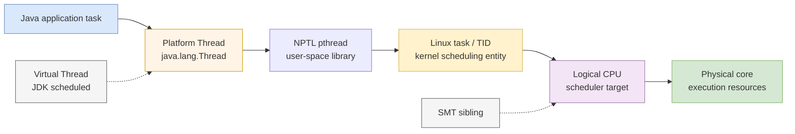
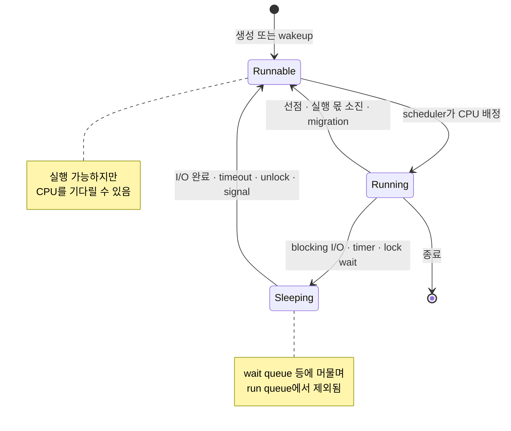

Java에서 플랫폼 스레드 100개를 만들었다. 서버에는 논리 CPU가 8개 있다. 그렇다면 100개가 동시에 실행되는가, 8개만 실행되고 92개는 멈춰 있는가?

둘 다 그대로는 정확하지 않다. I/O나 락을 기다리는 스레드는 CPU를 요구하지 않을 수 있고, 실행 가능한 스레드는 run queue에서 차례를 기다린다. 스케줄러는 우선순위, 공정성, CPU affinity와 cgroup 제약을 고려해 일부를 논리 CPU에 배치한다. 실행 중인 스레드도 선점되거나 스스로 잠들고, 깨어난 스레드가 곧바로 실행된다는 보장은 없다.

이 글의 핵심 문장은 두 개다.

> **동시성(concurrency)** 은 작업들의 수명이 겹치고 한 코어에서도 실행이 번갈아 진행될 수 있다는 성질이다. **병렬성(parallelism)** 은 둘 이상의 작업이 실제로 같은 시각에 서로 다른 실행 자원에서 명령을 수행하는 상태다.

그리고 성능 문제를 풀 때는 “스레드가 몇 개인가?”보다 다음 질문이 먼저다.

> 지금 몇 개의 작업이 **runnable**이고, 그 작업이 실제로 사용할 수 있는 논리 CPU와 CPU 시간은 얼마인가?

## 1. process, thread, task는 같은 단어가 아니다

보통 process는 주소 공간과 파일 descriptor 같은 자원을 소유하는 실행 단위로, thread는 그 자원을 공유하면서 독립적인 register·stack·실행 흐름을 갖는 단위로 설명한다. Linux 내부에서는 스케줄할 수 있는 실행 문맥을 흔히 **task**라고 부른다. process와 thread를 완전히 다른 종류의 커널 객체로 나누기보다, 어떤 자원을 공유하도록 생성했는지가 중요하다.

Linux의 `clone()`은 `CLONE_VM`, `CLONE_FILES`, `CLONE_THREAD` 같은 flag로 주소 공간, 열린 파일 table, thread group을 공유할지 정한다. 같은 thread group의 구성원은 사용자에게 하나의 process처럼 보이지만 각자 고유한 TID를 갖고 독립적으로 스케줄된다.

| 관점 | 대표 식별자·객체 | 공유하는 것 | 독립적인 것 |
|---|---|---|---|
| 사용자 관점의 process | PID | 주소 공간, 열린 파일, 신호 처리 정책 등 | 다른 process와의 자원 경계 |
| POSIX thread | `pthread_t` | 같은 process의 주소 공간과 자원 | stack, register, signal mask, scheduling 속성 일부 |
| Linux thread group | TGID와 여러 TID | `CLONE_THREAD` 등으로 공유한 자원 | 각 task의 TID와 실행 상태 |
| scheduler 관점 | schedulable task | 정책에 따라 group 단위 가중치도 적용 가능 | 어느 CPU에서 언제 실행할지 |

Linux에서 `getpid()`가 반환하는 값은 thread group ID인 TGID이고, 각 thread는 `gettid()`로 구분되는 TID를 갖는다. `/proc/<PID>/task/` 아래에 process의 thread별 TID directory가 보이는 이유다.

```bash
PID=12345

# process에 속한 Linux thread(TID) 목록
ls "/proc/$PID/task"

# thread별 이름과 허용 CPU, context switch 누적값
for task in /proc/$PID/task/*; do
  tid=${task##*/}
  echo "TID=$tid"
  grep -E '^(Name|State|Cpus_allowed_list|voluntary_ctxt_switches|nonvoluntary_ctxt_switches):' \
    "$task/status"
done
```

Java의 `Thread.threadId()`와 Linux TID도 같은 번호라고 가정하면 안 된다. 전자는 Java API가 부여하는 thread ID이고, 후자는 커널 task의 ID다. 서로 다른 관측 도구의 결과를 연결할 때는 thread 이름, stack, 시점과 native 도구가 제공하는 매핑을 함께 사용한다.

## 2. user thread와 kernel thread라는 말의 두 가지 함정

“user thread”는 문맥에 따라 두 뜻으로 쓰인다.

1. kernel이 개별 thread를 모르고 runtime이 user space에서 직접 스케줄하는 실행 단위
2. kernel space가 아니라 user application에 속한 일반 thread

“kernel thread”도 kernel 내부 작업을 수행하는 `kthread`를 뜻할 때가 있고, 단순히 kernel scheduler가 아는 OS thread를 뜻할 때가 있다. 따라서 “Java thread는 kernel thread다”처럼 줄이면 혼동이 생긴다.

현대 Linux의 NPTL은 POSIX thread를 Linux의 schedulable thread와 1:1로 대응시키는 구현이다. OpenJDK의 platform thread도 전통적으로 OS thread의 얇은 wrapper로 설명된다. 따라서 **현대 Linux 위의 일반적인 HotSpot platform thread**를 관찰할 때는 다음 모델이 유용하다.

아래 그림은 이 글에서 사용하는 구현 관계와 일반화하면 안 되는 경계를 보여준다.



> 실선은 이 글이 가정하는 Linux/HotSpot platform-thread 실행 경로다. 점선의 virtual thread는 여러 개가 platform thread를 공유할 수 있고, SMT logical CPU는 물리 core 자원을 공유한다.

하지만 이것은 Java 언어 전체나 모든 JVM·OS의 영구적인 법칙이 아니다.

- Java specification이 모든 `Thread`를 Linux TID와 1:1로 만들라고 요구하는 것은 아니다.
- OpenJDK virtual thread는 특정 OS thread에 수명 전체가 묶이지 않는다.
- platform thread 하나가 OS thread 하나를 점유해도 그 OS thread가 CPU core 하나를 전용으로 소유하는 것은 아니다.
- thread pool의 logical task 여러 개가 하나의 platform thread에서 차례로 실행될 수도 있다.

즉 **task → Java thread → OS thread → logical CPU → physical core**의 각 화살표는 별도의 다중화 경계다.

## 3. runnable과 running을 분리해야 하는 이유

스레드가 살아 있다는 사실은 CPU에서 실행 중이라는 뜻이 아니다. 성능 분석에는 최소한 다음 개념 상태가 필요하다.

- **running**: 지금 특정 logical CPU에서 명령을 실행한다.
- **runnable**: 실행할 준비는 됐지만 run queue에서 CPU를 기다릴 수 있다.
- **sleeping/waiting**: timer, I/O 완료, lock 해제, 조건 충족 같은 event를 기다려 현재 CPU를 요구하지 않는다.
- **blocked**: 기다림을 통칭하는 말로 자주 쓰이지만 Java와 Linux 도구에서는 더 좁거나 다른 의미를 가질 수 있다.

아래 상태도는 일반적인 scheduling 흐름을 단순화해 보여준다.



> 이 그림은 설명용 상태 모델이다. 실제 Linux task state bit와 Java `Thread.State`를 1:1로 옮긴 것이 아니다.

같은 단어라도 도구별 의미가 다르다.

| 관측 층 | 상태 | 실제로 알 수 있는 것 |
|---|---|---|
| Linux `ps`/`/proc` | `R` | running 또는 runnable을 합쳐 표시한다. 한 번의 snapshot으로 둘을 구분하지 못한다. |
| Linux `ps`/`/proc` | `S` | interruptible sleep, event를 기다리는 중이다. |
| Linux `ps`/`/proc` | `D` | uninterruptible sleep이며 흔히 I/O 경로에서 보인다. `D`라고 모두 storage 장애는 아니다. |
| Java `Thread.State` | `RUNNABLE` | Java 관점에서 실행 가능하다. OS CPU를 실제 점유 중이라는 뜻은 아니다. native syscall 대기를 그대로 드러내지 못할 수도 있다. |
| Java `Thread.State` | `BLOCKED` | `synchronized` monitor 진입을 기다린다. 모든 I/O·lock 대기의 총칭이 아니다. |
| Java `Thread.State` | `WAITING`, `TIMED_WAITING` | `wait`, `join`, `park`, `sleep` 등의 대기다. Linux `S`와 정확히 같은 분류는 아니다. |

따라서 thread dump에서 `RUNNABLE`이 100개라고 “100개가 CPU를 태운다”고 결론 내리면 안 된다. 반대로 `ps`에서 대부분 `S`라고 애플리케이션에 병목이 없다고 말할 수도 없다. connection pool, monitor, socket, timer처럼 **무엇을 기다리는지**를 stack과 함께 봐야 한다.

## 4. scheduler는 runnable task에 CPU 시간을 배분한다

일반적인 Linux server workload는 보통 `SCHED_OTHER` 정책의 fair scheduling class에서 실행된다. kernel은 CPU별 run queue를 유지하고 runnable task를 배치하며, load balancing이 필요하면 CPU 사이로 task를 옮길 수 있다.

오래된 설명처럼 “모든 thread에 고정된 10ms time slice를 round-robin으로 준다”고 외우면 현재 Linux를 잘못 이해하게 된다.

- `SCHED_RR` real-time 정책에는 명시적인 time quantum이 있다.
- `SCHED_FIFO`는 같은 의미의 time slice 없이 block, yield 또는 더 높은 우선순위의 선점까지 실행될 수 있다.
- 일반 `SCHED_OTHER`의 fair scheduler는 kernel version과 정책 구현에 따라 실행 몫을 계산한다.
- Linux 6.6부터 fair scheduler는 CFS에서 EEVDF 방식으로 전환되기 시작했다. EEVDF는 virtual runtime으로 lag를 계산하고 eligible task 중 virtual deadline이 가장 이른 task를 고른다.

따라서 이 글에서 **slice**는 “한 task가 다음 scheduling decision 전까지 얻은 실행 몫”이라는 개념으로 사용한다. 모든 정책과 kernel version에 공통인 고정 숫자를 뜻하지 않는다.

### 선점이 일어나는 대표 상황

1. 현재 task가 계산을 계속하더라도 scheduler가 다른 runnable task에 실행 기회를 줘야 한다.
2. 더 높은 scheduling class 또는 우선순위의 task가 runnable이 된다.
3. 잠들어 있던 interactive task가 깨어나 latency 요구를 반영해야 한다.
4. interrupt 처리 뒤 scheduling 판단이 필요하거나 task가 kernel에서 user mode로 돌아오는 경계에 도달한다.
5. task가 스스로 block, sleep, yield 또는 종료한다.

선점은 오류가 아니라 여러 작업을 진행시키는 핵심 메커니즘이다. 문제는 runnable task가 허용된 CPU보다 지나치게 많아 **CPU를 쓰는 시간보다 기다리고 전환하는 비용이 커지는가**다.

## 5. blocking syscall은 CPU를 반납하지만 완료 즉시 실행되지는 않는다

blocking `read()`를 호출한 thread에 아직 읽을 데이터가 없다고 하자. 단순화한 흐름은 다음과 같다.

1. user mode에서 syscall로 kernel에 진입한다.
2. 바로 완료할 수 없으면 task를 적절한 wait queue에 연결하고 sleeping 상태로 전환한다.
3. scheduler가 같은 logical CPU에서 다른 runnable task를 실행한다.
4. 장치 interrupt, network packet, 다른 task의 상태 변경 또는 timeout이 완료 조건을 만든다.
5. wakeup 경로가 잠든 task를 runnable로 만들고 run queue에 넣는다.
6. scheduler가 CPU를 배정한 뒤에야 syscall이 반환되고 user code가 계속된다.

여기서 **I/O 완료 시각**, **runnable이 된 시각**, **실제로 running이 된 시각**은 다를 수 있다. CPU가 붐비면 wakeup 뒤 run queue에서 추가로 기다린다. tail latency에는 storage나 network 시간뿐 아니라 이 scheduling delay도 들어간다.

모든 syscall이 block하는 것도 아니다. 준비된 데이터가 있으면 즉시 반환할 수 있고, non-blocking file descriptor는 준비되지 않았을 때 `EAGAIN` 같은 결과를 반환한다. `epoll` 같은 readiness API도 기다림을 없애는 것이 아니라 **많은 descriptor의 준비 event를 더 적은 thread로 기다리는 구조**를 제공한다.

플랫폼 스레드가 blocking syscall에서 잠들면 그 platform/OS thread도 그 작업을 위해 묶인다. 이후 편에서 다룰 virtual thread는 지원되는 blocking JDK operation에서 carrier platform thread를 놓아줄 수 있지만, I/O 완료 뒤 runnable이 되고 제한된 CPU 실행 자원을 다시 얻어야 한다는 원리는 남는다.

## 6. context switch 비용은 register 저장만이 아니다

context switch 때 kernel은 이전 task의 실행 문맥을 보존하고 다음 task의 register, stack과 scheduling 문맥을 복원한다. 이 직접 비용만 보면 매우 작아 보일 수 있다. 운영 성능에서 더 중요한 것은 간접 비용이다.

- **cache locality**: cache를 매 switch마다 지우지는 않는다. 다만 다른 task의 working set이 들어오면 이전 데이터와 instruction이 밀려나 다시 miss가 날 수 있다.
- **TLB locality**: 다른 주소 공간으로 전환하면 address translation cache의 활용이 흔들릴 수 있다. PCID/ASID 같은 기능이 비용을 줄일 수 있으므로 “process switch마다 TLB 전체 flush”라고 일반화하면 안 된다.
- **branch와 frontend 상태**: processor 내부 예측·명령 공급 상태가 새 실행 흐름에 바로 최적이지 않을 수 있다.
- **migration**: task가 다른 CPU로 이동하면 이전 CPU에 따뜻하게 남아 있던 cache를 활용하기 어려워지고 cache line 이동이 늘 수 있다.
- **NUMA locality**: 다른 node의 CPU로 이동했는데 memory page는 원래 node에 남으면 remote memory 접근이 늘 수 있다.

같은 process의 두 thread 사이 전환은 주소 공간을 공유하므로 다른 process 전환과 비용 구조가 완전히 같지 않다. 반대로 같은 process라도 working set이 크거나 공유 cache line 경합이 심하면 싸다고 단정할 수 없다.

`perf stat`의 `context-switches`, `cpu-migrations`, `cache-misses`는 이런 가설을 세우는 출발점이지 switch 한 번의 고정 가격표가 아니다. workload, CPU model, kernel, affinity를 고정하고 thread 수만 바꿔 비교해야 한다.

## 7. CPU-bound와 I/O-bound에서 thread 수의 의미가 달라진다

### CPU-bound: oversubscription은 runnable queue를 늘린다

순수 계산 task 64개를 logical CPU 8개에 올리면 최대 8개의 명령 흐름만 각 logical CPU에서 실행되고 나머지는 대체로 runnable로 기다린다. thread를 8개에서 64개로 늘려도 연산 장치가 늘지는 않는다.

오히려 다음 비용이 커질 수 있다.

- run queue 대기와 tail latency
- context switch와 CPU migration
- instruction/data cache 교란
- 공유 lock, allocator, cache line contention
- thread stack과 scheduler가 관리할 객체 수

독립적이고 충분히 큰 계산을 물리 자원에 맞춰 분할하면 병렬 speedup을 얻을 수 있다. 그러나 logical CPU 수를 곧 물리 core 성능으로 계산하거나 SMT sibling 두 개를 독립 core 두 개처럼 보면 기대치가 어긋난다.

### I/O-bound: 잠든 동안 다른 작업이 진행될 수 있다

I/O 대기 시간이 긴 task는 대부분의 수명 동안 run queue에 없을 수 있다. 이때 동시 요청 수를 CPU 수보다 크게 유지하면 한 task가 잠든 동안 다른 task가 CPU를 사용해 전체 처리량을 높일 수 있다.

하지만 “I/O-bound니까 thread를 무한히 만든다”는 결론은 아니다.

- platform thread마다 native stack과 kernel task 등 비용이 있다.
- DB connection, socket, file descriptor, downstream rate limit이 먼저 고갈될 수 있다.
- I/O 완료가 한꺼번에 몰리면 많은 task가 동시에 runnable이 되는 wakeup burst가 생긴다.
- 응답 전후 serialization, TLS, compression이 CPU-bound 구간을 만들 수 있다.
- 과도한 in-flight 요청은 처리량보다 queueing과 timeout만 늘릴 수 있다.

작업 전체를 CPU-bound 또는 I/O-bound 한 단어로 분류하기보다 **CPU 실행 구간, 외부 대기 구간, 공유 자원 대기 구간**을 나눠 측정한다.

## 8. Java platform thread로 세 가지 상태를 만든다

다음 실험 프로그램은 JDK 21 이상에서 platform thread만 명시적으로 생성한다.

- `cpu`: local 계산을 반복해 runnable 경쟁을 만든다.
- `wait`: 짧게 실행한 뒤 timed waiting을 반복해 I/O 대기와 비슷한 scheduling 모양을 만든다. 실제 storage benchmark는 아니다.
- `lock`: monitor를 잡은 채 잠들어 다른 thread가 `BLOCKED`가 되는 lock convoy를 의도적으로 만든다.

```java
import java.util.Arrays;
import java.util.Locale;
import java.util.concurrent.CountDownLatch;
import java.util.concurrent.ThreadFactory;
import java.util.concurrent.atomic.AtomicBoolean;

public final class SchedulerLab {
    private static final Object MONITOR = new Object();
    private static volatile long blackhole;

    public static void main(String[] args) throws Exception {
        String mode = args.length > 0
                ? args[0].toLowerCase(Locale.ROOT)
                : "cpu";
        int workers = args.length > 1
                ? Integer.parseInt(args[1])
                : Runtime.getRuntime().availableProcessors();
        int seconds = args.length > 2 ? Integer.parseInt(args[2]) : 60;

        if (!mode.equals("cpu") && !mode.equals("wait") && !mode.equals("lock")) {
            throw new IllegalArgumentException("mode: cpu | wait | lock");
        }
        if (workers < 1 || seconds < 1) {
            throw new IllegalArgumentException("workers and seconds must be positive");
        }

        AtomicBoolean stop = new AtomicBoolean();
        CountDownLatch ready = new CountDownLatch(workers);
        CountDownLatch start = new CountDownLatch(1);
        long[] completed = new long[workers];
        Thread[] threads = new Thread[workers];
        ThreadFactory factory = Thread.ofPlatform()
                .name("sched-lab-", 0)
                .factory();

        for (int i = 0; i < workers; i++) {
            int index = i;
            threads[i] = factory.newThread(() -> {
                ready.countDown();
                try {
                    start.await();
                    completed[index] = switch (mode) {
                        case "cpu" -> runCpu(stop);
                        case "wait" -> runTimedWait(stop);
                        case "lock" -> runLockConvoy(stop);
                        default -> throw new AssertionError(mode);
                    };
                } catch (InterruptedException e) {
                    Thread.currentThread().interrupt();
                }
            });
            threads[i].start();
        }

        ready.await();
        System.out.printf(
                "pid=%d mode=%s workers=%d availableProcessors=%d seconds=%d%n",
                ProcessHandle.current().pid(), mode, workers,
                Runtime.getRuntime().availableProcessors(), seconds);
        start.countDown();

        Thread.sleep(seconds * 1_000L);
        stop.set(true);
        for (Thread thread : threads) {
            thread.interrupt();
        }
        for (Thread thread : threads) {
            thread.join();
        }

        System.out.printf("completed=%d blackhole=%d%n",
                Arrays.stream(completed).sum(), blackhole);
    }

    private static long runCpu(AtomicBoolean stop) {
        long batches = 0;
        long value = Thread.currentThread().threadId();

        while (!stop.get()) {
            for (int i = 0; i < 100_000; i++) {
                value = Long.rotateLeft(value * 0x9E3779B97F4A7C15L + i, 13);
            }
            batches++;
        }
        blackhole ^= value;
        return batches;
    }

    private static long runTimedWait(AtomicBoolean stop)
            throws InterruptedException {
        long cycles = 0;
        while (!stop.get()) {
            Thread.sleep(10);
            cycles++;
        }
        return cycles;
    }

    private static long runLockConvoy(AtomicBoolean stop)
            throws InterruptedException {
        long entries = 0;
        while (!stop.get()) {
            synchronized (MONITOR) {
                Thread.sleep(10); // 장애 재현용: lock을 잡고 대기한다.
                entries++;
            }
        }
        return entries;
    }
}
```

`blackhole` 갱신은 각 worker 종료 시 한 번만 일어나도록 해 CPU mode의 hot loop에서 공유 변수 경합을 피했다. 이 코드는 정밀 benchmark가 아니다. scheduler 상태를 오래 유지해 운영 도구로 관찰하기 위한 재현기다. 처리량 비교가 목적이라면 warmup, 반복 fork, compiler 최적화 통제가 있는 JMH 같은 별도 harness를 사용해야 한다.

```bash
javac --release 21 SchedulerLab.java

# PID가 출력된 뒤 120초 동안 관측한다.
java SchedulerLab cpu 8 120
java SchedulerLab wait 200 120
java SchedulerLab lock 32 120
```

## 9. Linux에서 상태와 scheduler 비용을 관측한다

프로그램이 출력한 PID를 다른 shell에 넣고 먼저 thread snapshot을 본다.

```bash
PID=12345

# NLWP는 process의 thread 수, LWP는 Linux TID다.
ps -L -p "$PID" -o pid,lwp,psr,stat,pcpu,comm

# thread 단위 실시간 화면
top -H -p "$PID"

# thread 단위 CPU와 voluntary/involuntary context switch
pidstat -t -u -w -p "$PID" 1
```

한 snapshot의 `R`만 세기보다 시간에 따른 패턴을 본다.

- CPU mode에서 여러 thread가 높은 CPU를 나누며 `R`로 자주 관찰되는가?
- wait mode에서 대부분 `S`이고 process CPU는 낮은가?
- lock mode에서 Java thread dump에는 한 thread의 `TIMED_WAITING`과 다수의 `BLOCKED`가 보이는가?
- worker를 늘릴 때 `cswch/s`, `nvcswch/s`, migration과 run queue 대기가 함께 늘어나는가?

`/proc`에서는 thread마다 누적 context switch와 허용 CPU를 직접 확인할 수 있다.

```bash
for task in /proc/$PID/task/*; do
  tid=${task##*/}
  echo "TID=$tid"
  grep -E '^(Name|State|Cpus_allowed_list|voluntary_ctxt_switches|nonvoluntary_ctxt_switches):' \
    "$task/status"
  printf 'schedstat='
  cat "$task/schedstat"
done
```

kernel에서 scheduler statistics가 활성화된 환경이라면 `/proc/<PID>/task/<TID>/schedstat`의 앞 세 값은 각각 CPU에서 실행한 시간, run queue에서 기다린 시간, 실행된 time-slice 횟수를 나타낸다. 모두 누적값이므로 두 시점의 차이를 구해 비교한다. kernel 설정과 version에 따라 제공 여부와 세부 형식이 다를 수 있다.

`perf stat`으로 같은 구간의 주요 event를 함께 수집한다.

```bash
perf stat \
  -e task-clock,context-switches,cpu-migrations,cycles,instructions,cache-misses \
  -p "$PID" -- sleep 20
```

권한 설정인 `perf_event_paranoid`, virtual machine, container 제한 때문에 일부 counter가 보이지 않을 수 있다. 또한 cache miss 증가가 곧 context switch 때문이라는 뜻은 아니다. worker 수만 바꾼 반복 실험, affinity를 고정한 실험, application throughput을 함께 비교해 원인 후보를 좁힌다.

## 10. 장애 실험 1: CPU-bound oversubscription

사용 가능한 CPU를 두 개로 제한하고 worker만 늘려 본다. `taskset`의 CPU 번호는 현재 host에서 허용된 번호로 바꿔야 한다.

```bash
# 두 logical CPU에서 worker 2개
taskset -c 0,1 java SchedulerLab cpu 2 60

# 같은 두 logical CPU에서 worker 8개와 32개
taskset -c 0,1 java SchedulerLab cpu 8 60
taskset -c 0,1 java SchedulerLab cpu 32 60
```

각 실행에서 `completed`, `perf stat`, `pidstat -w`를 기록한다.

| 관측 | worker 증가 후 가능한 해석 | 바로 단정하면 안 되는 것 |
|---|---|---|
| `completed`가 거의 늘지 않음 | CPU 실행 자원이 이미 포화됨 | scheduler 자체가 비정상임 |
| involuntary switch 증가 | runnable 경쟁과 선점 증가 | 모든 switch가 같은 비용임 |
| run queue wait 증가 | CPU를 기다리는 시간이 늘어남 | application lock 대기와 같음 |
| migration 증가 | load balancing 또는 affinity 범위가 넓음 | migration이 유일한 병목임 |
| cache miss 증가 | working-set 교란 가능성 | miss가 전부 context switch 때문임 |
| p99 latency 증가 | queueing과 interference 가능성 | 평균 CPU 사용률만으로 원인 확정 |

이 실험의 실패 조건은 “CPU가 100%”가 아니다. **worker를 더 늘렸는데 처리량은 유지되거나 감소하고, run queue 대기와 tail latency만 커지는 상태**다. CPU-bound pool 크기는 보통 실제 허용 CPU를 출발점으로 잡고, blocking 구간과 SMT 효과를 측정해 조정한다.

## 11. 장애 실험 2: lock convoy와 wakeup

`lock` mode는 monitor를 얻은 thread가 10ms 동안 잠든다. 그동안 다른 worker는 같은 monitor에 들어갈 수 없다.

```bash
java SchedulerLab lock 32 120

PID=12345
jcmd "$PID" Thread.print
pidstat -t -u -w -p "$PID" 1
```

Java thread dump에서는 대체로 다음 모양을 기대한다.

- 한 worker: monitor를 보유한 채 `Thread.sleep`에서 `TIMED_WAITING`
- 나머지 worker: monitor 진입을 기다리는 `BLOCKED`
- process CPU: 높지 않음
- worker 증가: `completed` 처리량은 거의 늘지 않음

여기서 “CPU가 남으니 thread를 더 추가하자”는 처방은 실패한다. 직렬 임계 구역 하나가 처리량 상한을 만들었고, worker 증가는 대기자와 wakeup 경쟁만 늘린다. lock을 잡은 채 I/O, sleep, remote call을 수행하지 않도록 임계 구역을 줄이거나 상태 소유권을 다시 나눠야 한다.

실제 Linux에서 monitor 대기가 어떤 syscall과 task state로 구현되는지는 HotSpot version, lock 상태, spin과 park 경로에 따라 달라질 수 있다. Java `BLOCKED`를 Linux `D`나 특정 futex 호출과 고정해서 매핑하지 않는다.

## 12. affinity는 예약이 아니고, cgroup quota는 CPU 개수가 아니다

### CPU affinity

affinity mask는 thread가 **실행될 수 있는 CPU 집합**이다. 한 CPU에 고정하면 migration을 줄이고 locality를 높일 수 있지만 그 CPU를 독점 예약하지는 않는다. 같은 CPU에 다른 task가 허용되어 있으면 여전히 경쟁한다.

```bash
# process main thread의 현재 affinity 확인
taskset -pc "$PID"

# 특정 Linux TID의 허용 CPU 확인
TID=12346
taskset -pc "$TID"
grep '^Cpus_allowed_list:' "/proc/$PID/task/$TID/status"
```

너무 좁은 affinity는 idle CPU를 두고 특정 run queue만 붐비게 할 수 있다. scheduler의 load balancing 자유도도 줄어든다. affinity는 “왠지 cache에 좋다”가 아니라 migration과 locality가 실제 병목이라는 측정 뒤에 적용한다.

### cgroup v2 CPU 제한

container에서는 host의 online CPU 수와 process가 쓸 수 있는 CPU가 다를 수 있다. cgroup v2는 서로 다른 두 축을 제공한다.

- `cpuset.cpus.effective`: 실제로 실행이 허용된 CPU 집합
- `cpu.max`: 일정 period마다 사용할 수 있는 최대 CPU time bandwidth

예를 들어 `cpu.max`가 `200000 100000`이면 한 100ms period에 최대 200ms의 CPU 시간을 쓸 수 있다. 대략 CPU 두 개 분량의 bandwidth지만 “항상 특정 core 두 개를 소유한다”는 뜻은 아니다. 짧은 구간에 여러 CPU를 사용한 뒤 quota를 소진해 throttle될 수도 있다.

```bash
# 현재 process가 속한 cgroup v2 경로 확인
cat "/proc/$PID/cgroup"

# 아래 경로는 위 결과와 container mount 구성을 반영해 정한다.
CGROUP=/sys/fs/cgroup/my-service
cat "$CGROUP/cpuset.cpus.effective"
cat "$CGROUP/cpu.max"
cat "$CGROUP/cpu.stat"
```

`cpu.stat`의 `nr_throttled`와 `throttled_usec`가 부하 구간에 증가하면 application에 runnable 작업이 있어도 cgroup quota 때문에 실행하지 못한 시간이 있었음을 뜻한다. host 전체 CPU 사용률이 낮은데 container latency가 튀는 상황에서 중요한 단서다.

affinity, cpuset, online CPU와 cgroup quota는 서로 다른 제약이다. 실제 사용 가능성을 판단할 때는 함께 본다.

```text
실행 가능한 CPU = online CPU ∩ affinity mask ∩ cpuset 허용 집합
사용 가능한 CPU 시간 = 위 집합에서 scheduler 경쟁과 cpu.max quota까지 반영한 결과
```

HotSpot의 `Runtime.availableProcessors()`는 pool 크기를 정할 때 유용한 runtime 관찰값이지만 물리 core 개수나 지속적인 CPU 성능 보장은 아니다. container와 JVM version에서 어떤 제한을 인식했는지는 실제 배포 image로 확인한다.

```bash
java -Xlog:os+container=trace -version
```

관측값이 workload 특성과 맞지 않으면 pool에 명시적인 parallelism을 주는 방법도 있지만, CPU quota를 무시해 값을 크게 덮는 것은 처리량보다 throttling과 queueing을 키울 수 있다.

## 13. SMT: logical CPU 두 개는 physical core 두 개가 아니다

Linux scheduler는 logical CPU를 scheduling target으로 본다. SMT가 활성화된 processor에서는 같은 physical core가 둘 이상의 logical CPU를 노출할 수 있다. sibling들은 독립적인 architectural state를 갖지만 execution unit, cache와 bandwidth 일부를 공유한다.

그래서 CPU-bound thread 두 개를 SMT sibling에 놓았을 때의 처리량은 다음 중 어느 쪽도 자동으로 보장하지 않는다.

```text
1 logical CPU의 정확히 2배
별도 physical core 두 개와 같은 성능
```

한 thread가 memory stall로 실행 자원을 놀릴 때 sibling이 빈 자원을 활용할 수도 있다. 반대로 둘 다 같은 execution unit이나 cache bandwidth를 요구하면 서로 경쟁한다.

Linux가 공개한 topology는 sysfs에서 확인할 수 있다.

```bash
cat /sys/devices/system/cpu/online
cat /sys/devices/system/cpu/cpu0/topology/core_id
cat /sys/devices/system/cpu/cpu0/topology/physical_package_id
cat /sys/devices/system/cpu/cpu0/topology/thread_siblings_list
```

`thread_siblings_list`에 `0,8`이 보인다면 해당 topology에서 CPU 0과 8이 한 core의 sibling이라는 뜻이다. CPU 번호가 연속이라는 가정은 하지 않는다. kernel version과 architecture에 따라 `core_cpus_list` 같은 대응 attribute도 확인한다.

CPU-bound pool의 시작값으로 logical CPU 수를 쓸 수는 있지만, 최종값은 sibling 배치와 실제 throughput으로 검증한다. latency가 중요한 전용 workload라면 서로 다른 physical core에 배치한 경우와 SMT sibling에 배치한 경우를 각각 측정한다.

## 14. NUMA locality: CPU만 고정하면 절반만 고정한 것이다

NUMA 시스템에서는 CPU가 어느 memory node의 page를 접근하느냐에 따라 latency와 bandwidth가 달라질 수 있다. Linux의 기본 local allocation 정책에서는 일반적으로 page가 실제 fault될 때 task가 실행 중인 node를 기준으로 allocation된다. 흔히 **first touch**라고 설명하는 효과다.

문제는 thread와 page가 수명 동안 항상 함께 움직이지 않는다는 데 있다.

1. 초기화 thread가 node 0에서 heap page를 처음 touch한다.
2. worker가 load balancing으로 node 1의 CPU에서 실행된다.
3. page는 node 0에 남아 worker가 remote memory를 반복 접근할 수 있다.

반대로 CPU affinity만 node 1로 강제하고 memory policy나 초기화 위치를 고려하지 않으면 locality가 더 나빠질 수도 있다. garbage collector가 heap을 배치하고 이동하는 방식, shared heap 접근, container의 `cpuset.mems.effective`도 함께 봐야 한다.

```bash
# node별 CPU와 memory 정보
cat /sys/devices/system/node/node*/cpulist
cat /sys/devices/system/node/node*/meminfo

# process mapping별 NUMA page 분포와 정책
cat "/proc/$PID/numa_maps"

# cgroup에서 허용한 memory node
cat "$CGROUP/cpuset.mems.effective"
```

NUMA tuning은 작은 service의 기본 처방이 아니다. heap이 크고 socket을 가로지르는 환경에서 remote access, migration, GC와 memory bandwidth가 병목이라는 증거가 있을 때 CPU placement와 memory policy를 함께 실험한다.

## 15. 운영 장애를 좁히는 순서

“thread가 많다” 또는 “CPU가 높다”에서 멈추지 않고 다음 순서로 좁힌다.

1. **증상 정의**: throughput, p50/p95/p99 latency, timeout 중 무엇이 변했는가?
2. **실제 제약 확인**: online CPU, affinity, cpuset, `cpu.max`, throttling은 얼마인가?
3. **상태 분해**: running/runnable, I/O sleep, monitor/lock wait, downstream wait 비율은 어떤가?
4. **scheduler 관측**: run queue wait, voluntary/involuntary switch, migration이 부하와 함께 증가하는가?
5. **하드웨어 locality 확인**: SMT sibling 경쟁, cache miss, NUMA remote 접근 가설이 있는가?
6. **한 변수만 변경**: worker 수, affinity, quota 또는 임계 구역 중 하나만 바꿔 재측정한다.
7. **정확성 재검증**: pool이나 lock 구조를 바꾼 뒤 공유 상태의 happens-before와 원자성 계약이 유지되는가?

| 증상 조합 | 우선 확인할 것 | 흔한 잘못된 처방 |
|---|---|---|
| CPU 높음 + run queue wait 높음 | CPU-bound oversubscription, quota | thread 무조건 추가 |
| host CPU 낮음 + `nr_throttled` 증가 | container `cpu.max` | host에 core가 남았다고 무시 |
| CPU 낮음 + Java `BLOCKED` 다수 | lock owner와 임계 구역 내부 작업 | pool 크기만 확대 |
| CPU 낮음 + socket wait 다수 | downstream latency와 connection limit | CPU affinity tuning |
| migration + cache miss 증가 | affinity 범위, load balancing, working set | cache를 매 switch마다 flush한다고 단정 |
| 특정 socket에서만 지연 | NUMA page와 CPU placement | CPU만 다른 node에 pinning |

## 16. 결론: thread 수보다 runnable 밀도를 본다

한 core에서도 scheduler가 작업을 번갈아 실행하면 동시성은 성립한다. 둘 이상의 logical CPU에서 같은 시각에 실행되어야 병렬성이다. 그러나 logical CPU가 SMT sibling이라면 물리 실행 자원을 공유하고, container quota가 있다면 보이는 CPU를 지속적으로 전부 쓰지 못할 수 있다.

platform thread를 늘렸을 때 결과는 workload에 따라 갈린다.

- CPU-bound task는 runnable 수를 늘려도 CPU가 늘지 않으며 oversubscription 비용이 커질 수 있다.
- I/O-bound task는 sleeping 동안 CPU를 반납해 더 많은 동시 작업이 유용할 수 있다.
- lock owner가 대기하면 CPU가 남아도 직렬 임계 구역 때문에 처리량이 늘지 않는다.
- affinity와 cpuset은 실행 위치를 제한하고, cgroup quota는 사용 가능한 CPU 시간을 제한한다.
- migration과 context switch 비용은 cache, TLB, SMT, NUMA topology와 함께 측정해야 한다.

OS scheduler가 실행 순서를 바꿀 수 있다는 사실은 다음 질문으로 이어진다. Java compiler와 CPU까지 메모리 접근 순서를 바꿀 수 있을 때, 한 thread의 write를 다른 thread가 언제 볼 수 있다고 말할 수 있을까? 다음 편 [Java Memory Model](/blog/parallelism-03-jvm-memory-model)에서는 `synchronized`, `volatile`, happens-before가 OS scheduling과 별개로 어떤 가시성 계약을 만드는지 살펴본다.

---


## 참고 자료

- [Linux man-pages — `clone(2)`](https://man7.org/linux/man-pages/man2/clone.2.html)
- [Linux man-pages — `pthreads(7)`](https://man7.org/linux/man-pages/man7/pthreads.7.html)
- [Linux man-pages — `sched(7)`](https://man7.org/linux/man-pages/man7/sched.7.html)
- [Linux man-pages — `sched_setaffinity(2)`](https://man7.org/linux/man-pages/man2/sched_setaffinity.2.html)
- [Linux man-pages — `/proc/pid/task` (`proc_pid_task(5)`)](https://man7.org/linux/man-pages/man5/proc_pid_task.5.html)
- [Linux man-pages — `/proc/pid/status` (`proc_pid_status(5)`)](https://man7.org/linux/man-pages/man5/proc_pid_status.5.html)
- [Linux man-pages — `/proc/pid/stat` (`proc_pid_stat(5)`)](https://man7.org/linux/man-pages/man5/proc_pid_stat.5.html)
- [Linux man-pages — `/proc/pid/numa_maps` (`proc_pid_numa_maps(5)`)](https://man7.org/linux/man-pages/man5/proc_pid_numa_maps.5.html)
- [Linux Kernel — EEVDF Scheduler](https://docs.kernel.org/scheduler/sched-eevdf.html)
- [Linux Kernel — Scheduler Statistics](https://docs.kernel.org/scheduler/sched-stats.html)
- [Linux Kernel — Control Group v2](https://docs.kernel.org/admin-guide/cgroup-v2.html)
- [Linux Kernel — CPU topology via sysfs](https://docs.kernel.org/admin-guide/cputopology.html)
- [Linux Kernel — x86 Topology](https://docs.kernel.org/arch/x86/topology.html)
- [Linux Kernel — NUMA](https://docs.kernel.org/mm/numa.html)
- [Linux Kernel — Userspace debugging with `perf`](https://docs.kernel.org/process/debugging/userspace_debugging_guide.html)
- [OpenJDK JEP 444 — Virtual Threads](https://openjdk.org/jeps/444)
