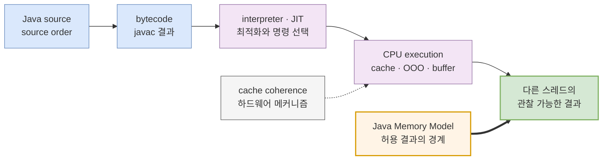
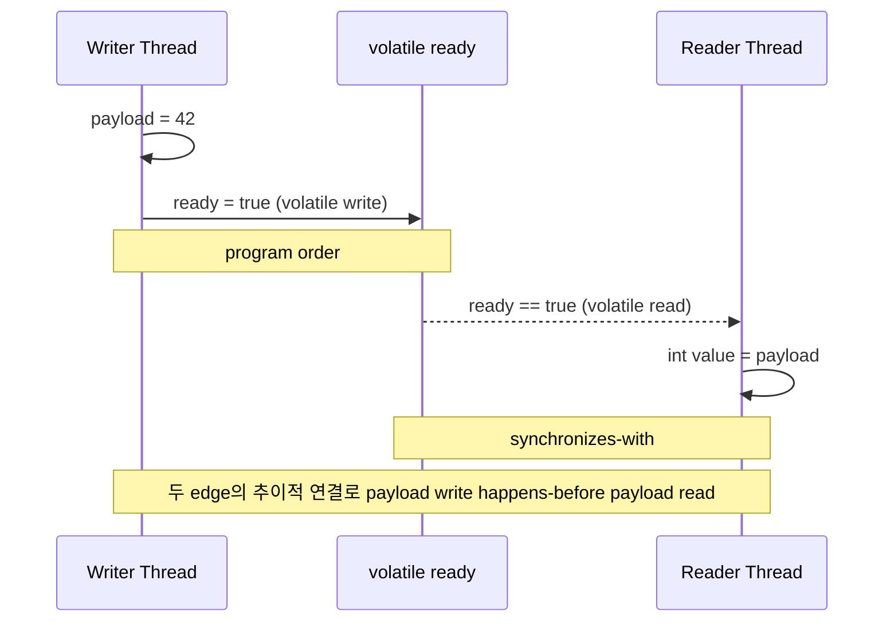

앞선 글에서는 runnable 스레드가 있다고 해서 곧바로 CPU에서 실행 중인 것은 아니며, 실제 실행 기회는 OS 스케줄러가 나눈다는 점을 보았다. 이제 두 스레드가 정말 실행되었다고 해 보자. 한쪽이 `data = 42`를 쓰고 `ready = true`를 썼다면 다른 쪽은 반드시 `ready == true`와 `data == 42`를 함께 볼까?

직관은 “코드는 위에서 아래로 실행되니 그렇다”고 답하기 쉽다. 하지만 Java 소스는 bytecode가 되고, JVM은 interpreter와 JIT compiler로 실행하며, CPU는 cache와 store buffer, out-of-order execution을 사용한다. 이 모든 층의 실제 순서를 하나씩 추적해야만 정답을 알 수 있을까?

그럴 필요도 없고, 그렇게 증명해서도 안 된다.

> **Java 동시성 코드가 의존할 대상은 특정 bytecode나 CPU의 우연한 실행 순서가 아니라, Java Memory Model이 허용하는 관찰 가능한 결과다.**

Java Memory Model(JMM)은 특정 JVM이 어떻게 실행해야 하는지를 한 가지 알고리즘으로 지정하지 않는다. 각 read가 어떤 write를 볼 수 있는지, 어떤 실행 결과가 합법인지를 정한다. 구현은 그 결과 집합을 벗어나지 않는 한 코드를 재배치하거나 동기화를 최적화할 수 있다. 이 관점이 잡히면 `volatile`, `synchronized`, `VarHandle`, `ConcurrentHashMap`이 서로 다른 마법이 아니라 **스레드 사이에 관찰 순서를 만드는 계약**으로 연결된다.

## 1. source order, bytecode, JIT, CPU 실행은 서로 다른 층이다

다음 메서드는 소스에서 `payload`를 먼저 쓰고 `ready`를 나중에 쓴다.

```java
final class BrokenPublication {
    int payload;
    boolean ready;

    void publish() {
        payload = 42;
        ready = true;
    }

    int consume() {
        return ready ? payload : -1;
    }
}
```

한 스레드 안에서만 실행하면 `publish`의 의미는 분명하다. JMM의 **program order**는 각 스레드의 inter-thread action이 그 스레드를 단독 실행했을 때의 의미와 일치하도록 정렬한다. 그러나 `payload`와 `ready`가 plain field인 위 코드를 여러 스레드가 공유하면, source order만으로 두 스레드 사이의 관찰 순서는 생기지 않는다.

정확성을 검토할 때는 다음 층을 구분해야 한다.

| 층 | 확인할 수 있는 것 | 동시성 정확성의 최종 근거가 아닌 이유 |
|---|---|---|
| Java source order | 개발자가 표현한 계산과 제어 흐름 | 다른 스레드와의 관찰 관계를 자동으로 만들지 않는다 |
| bytecode | `javac` 등이 만든 JVM 명령 | JIT 최적화와 실제 machine code를 보여 주지 않는다 |
| JIT machine code | 한 JVM·옵션·프로파일에서 생성된 코드 | 실행 중 재컴파일될 수 있고 JVM·ISA마다 달라진다 |
| CPU 내부 실행 | load/store, cache, speculative·out-of-order 실행 | microarchitecture의 내부 순서와 Java의 관찰 계약은 같은 개념이 아니다 |
| JMM이 허용한 결과 | 다른 스레드가 합법적으로 관찰할 수 있는 값 | Java 프로그램이 이식성 있게 의존할 계약이다 |

아래 다이어그램은 소스에서 관찰 결과까지 내려가는 구현 경로와, 올바름을 판정할 때 거꾸로 봐야 하는 계약 경계를 보여준다.



> 굵은 선은 Java 코드가 넘어서는 안 되는 언어 계약이고, 점선은 JVM이 그 계약을 구현할 때 이용할 수 있는 하드웨어 메커니즘이다.

`javap`으로 bytecode를 보거나 JIT assembly를 확인하는 일은 성능 분석과 구현 이해에 유용하다. 다만 “내 x86 서버에서 store가 이 순서로 보였다”는 관찰은 Java 프로그램의 정확성 증명이 아니다. JVM은 Arm에서는 다른 barrier와 instruction을 고를 수 있고, 같은 ISA에서도 JDK 버전과 최적화 상태에 따라 코드를 다르게 만들 수 있다.

### cache coherence는 JMM과 같지 않다

cache coherence는 여러 코어가 같은 메모리 위치 또는 cache line의 값을 모순되게 유지하지 않도록 만드는 하드웨어 토대다. 하지만 이것만으로 다음을 정하지는 않는다.

- `payload`와 `ready`처럼 **서로 다른 위치**의 쓰기를 다른 코어가 어떤 관계로 볼지
- compiler와 JIT가 어떤 변환을 할 수 있는지
- Java의 monitor, `volatile`, `Thread.start`, `Thread.join`이 어떤 가시성을 약속하는지
- 여러 읽기와 쓰기를 묶은 복합 업무 연산이 원자적인지

따라서 `cache coherence = happens-before = sequential consistency`라는 등식은 성립하지 않는다. coherence는 JMM을 구현하는 재료 중 하나이고, Java 코드가 의존하는 상위 계약은 JLS와 API에 있다.

## 2. 원자성, 가시성, ordering을 먼저 분리한다

세 보장은 자주 함께 필요하지만 서로를 대신하지 않는다.

| 보장 | 질문 | 실패 예 | 대표 수단 |
|---|---|---|---|
| 원자성(atomicity) | 정한 연산이 중간에 찢어지지 않는가? | 두 스레드의 `count++`에서 증가가 사라짐 | monitor 임계 구역, atomic RMW, 원자 API |
| 가시성(visibility) | 한 스레드의 write를 다른 스레드의 read가 볼 수 있는가? | 종료 flag 변경을 worker가 계속 못 봄 | happens-before, `volatile`, lock, 동시성 유틸리티 |
| 순서(ordering) | 여러 action의 관찰 관계를 어떤 순서로 제한하는가? | `ready`는 봤지만 앞선 payload를 못 봄 | monitor unlock/lock, release/acquire, `volatile` |

`volatile int count`는 개별 read와 write의 가시성과 ordering을 제공하지만 `count++` 전체를 원자적으로 만들지 않는다.

```java
volatile int count;

void increment() {
    count++; // volatile read + 계산 + volatile write
}
```

반대로 같은 monitor 안에서 plain field를 읽고 쓰면 상호 배제와 monitor의 happens-before를 함께 이용할 수 있다. 그러나 monitor가 보호하는 범위 밖의 다른 저장소, HTTP 호출, 여러 프로세스의 상태까지 자동으로 원자적이 되는 것은 아니다.

### data race의 정확한 경계

JLS에서 같은 변수에 대한 두 access는 둘 중 하나 이상이 write이면 **conflicting access**다. 서로 다른 스레드의 conflicting access가 happens-before로 정렬되지 않으면 그 프로그램에는 **data race**가 있다.

```java
final class StopFlag {
    boolean stopped; // plain field

    void requestStop() {
        stopped = true;
    }

    void run() {
        while (!stopped) {
            doOneUnit();
        }
    }
}
```

`stopped`의 write와 read 사이에 happens-before가 없으므로 data race다. “반복해서 읽으니 언젠가는 보이겠지”, `sleep`이나 `yield`를 넣으면 보이겠지, cache coherence가 있으니 괜찮겠지는 JMM 보장이 아니다. JLS는 `Thread.sleep`과 `Thread.yield`에 synchronization semantics가 없다고 명시한다.

data race가 없는 올바르게 동기화된 프로그램은 모든 실행이 sequentially consistent하게 보인다는 강한 성질을 얻는다. 다만 이것도 `get`과 `put` 두 호출을 하나의 원자 연산으로 합쳐 주지는 않는다. **data-race freedom과 업무 연산의 atomicity는 다시 별도 문제다.**

## 3. happens-before는 실제 시계 순서가 아니라 관찰 계약이다

JMM을 읽을 때는 네 관계를 순서대로 연결하면 된다.

1. **program order**: 한 스레드의 inter-thread action에 대한 total order다. 단독 실행 의미와 일치한다.
2. **synchronization order**: 한 실행에 있는 모든 synchronization action에 대한 total order다. 각 스레드의 program order와 일치해야 한다.
3. **synchronizes-with**: monitor unlock/lock, volatile write/read 같은 release-acquire 쌍이 만드는 스레드 간 edge다.
4. **happens-before**: program-order edge와 synchronizes-with edge를 포함하고, 추이적으로 연결한 partial order다.

JLS가 직접 제공하는 핵심 synchronizes-with 관계는 다음과 같다.

| release 쪽 | acquire 쪽 | 반드시 같은 대상이어야 하는가? |
|---|---|---|
| monitor `m`의 unlock | synchronization order상 이후의 `m` lock | 같은 monitor |
| volatile 변수 `v`의 write | synchronization order상 이후의 `v` read | 같은 volatile 변수 |
| `thread.start()`를 수행하는 action | 시작된 thread의 첫 action | 해당 thread |
| thread의 마지막 action | 다른 thread가 종료를 감지하는 action | 성공적으로 반환한 `join()` 또는 종료를 확인한 `isAlive()` |

아래 다이어그램은 plain payload가 synchronization action 자체가 아니어도, program order와 volatile synchronizes-with를 통해 reader까지 전달되는 과정을 보여준다.



이 그림의 결론은 “CPU가 네 줄을 물리적으로 절대 재배치하지 않는다”가 아니다. 구현은 합법적인 관찰 결과를 보존하는 한 내부 순서를 바꿀 수 있다. happens-before가 있으면 앞 action이 뒤 action에 **visible and ordered before**가 되도록 결과를 제한한다.

### monitor unlock/lock

```java
final class MonitorPublication {
    private final Object lock = new Object();
    private int payload;
    private boolean ready;

    void publish() {
        synchronized (lock) {
            payload = 42;
            ready = true;
        } // lock monitor의 unlock
    }

    int consume() {
        synchronized (lock) { // 같은 monitor의 이후 lock
            return ready ? payload : -1;
        }
    }
}
```

writer의 unlock 이전 action은 reader가 같은 monitor를 이후 lock한 뒤 수행하는 action보다 happens-before다. 다른 객체를 `synchronized`하면 이 edge는 만들어지지 않는다. 락의 이름이나 코드 블록 모양이 아니라 **같은 monitor**인지가 기준이다.

### volatile write/read

```java
final class VolatilePublication {
    private int payload;
    private volatile boolean ready;

    void publish() {
        payload = 42;
        ready = true;
    }

    int consume() {
        return ready ? payload : -1;
    }
}
```

reader가 volatile read에서 공개된 `true`를 관찰하는 경로에서는 writer의 앞선 `payload = 42`도 볼 수 있다. `volatile`은 이 전달을 위해 monitor의 상호 배제를 요구하지 않는다. 따라서 동시에 한 명만 들어가야 하는 복합 변경에는 부족하고, immutable snapshot이나 상태 flag 공개에는 잘 맞는다.

### `Thread.start()`와 `join()`

```java
int[] result = new int[1];

Thread worker = new Thread(() -> result[0] = 42);
worker.start();
worker.join();

System.out.println(result[0]); // 42
```

- `start()` 호출 이전 action은 시작된 thread의 모든 action보다 happens-before다.
- worker의 모든 action은 다른 thread가 worker의 `join()`에서 성공적으로 반환한 뒤의 action보다 happens-before다.

`start()`는 이미 실행 중인 임의의 thread에게 상태를 공개하는 만능 신호가 아니고, `join()`도 반환을 기다리지 않으면 edge를 사용할 수 없다. lifecycle 경계가 실제 설계와 맞을 때 매우 명료한 publication 수단이다.

## 4. `final`은 immutable 객체를 위한 특별 규칙이다

`final` field는 단순히 setter가 없다는 문법 이상의 JMM semantics를 가진다. 객체가 완전히 초기화되어 constructor가 끝날 때 final field에는 **freeze action**이 생긴다. constructor가 끝나기 전에 `this`가 외부로 탈출하지 않은 올바르게 생성된 객체라면, 다른 thread가 그 참조를 얻었을 때 final field가 constructor에서 초기화된 값을 보도록 특별히 보장한다.

```java
final class RouteSnapshot {
    private final long version;
    private final List<String> routes;

    RouteSnapshot(long version, List<String> routes) {
        this.version = version;
        this.routes = List.copyOf(routes);
    }

    long version() {
        return version;
    }

    List<String> routes() {
        return routes;
    }
}
```

여기서 `final` reference만 붙이고 내부 `List`를 계속 수정한다면 객체 전체가 immutable해지는 것은 아니다. `List.copyOf`처럼 가리키는 객체도 변경되지 않게 만들거나 defensive copy를 사용해야 한다.

constructor 안에서 `this`를 먼저 공개하면 final-field 보장을 깨뜨릴 수 있다.

```java
final class EscapedBeforeConstruction {
    static EscapedBeforeConstruction leaked;

    final int value;

    EscapedBeforeConstruction() {
        leaked = this; // 잘못된 this escape
        value = 42;
    }
}
```

또한 final-field semantics는 참조가 다른 thread에 **언제 도착할지**나 mutable field의 이후 변경까지 해결하지 않는다. 운영 코드에서는 immutable 객체를 만들고 그 참조 자체도 `volatile`, 같은 lock, thread-safe collection, queue 같은 명시적인 publication 경로로 넘기는 편이 계약을 더 분명하게 만든다.

```java
final class RouteRegistry {
    private volatile RouteSnapshot current =
            new RouteSnapshot(0, List.of());

    void replace(long version, List<String> routes) {
        current = new RouteSnapshot(version, routes);
    }

    RouteSnapshot current() {
        return current;
    }
}
```

객체의 내부 일관성은 immutable 설계가 지키고, 새 snapshot의 전달은 volatile reference가 지킨다. reader는 volatile 값을 한 번 local variable에 담아 같은 snapshot을 사용하면 된다.

## 5. non-volatile `long`과 `double`은 지금도 사양상 찢어질 수 있다

“64-bit JVM이나 최신 Java에서는 plain `long`도 항상 atomic이다”라는 설명은 JLS의 이식 가능한 보장보다 강하다.

[JLS 17.7](https://docs.oracle.com/javase/specs/jls/se25/html/jls-17.html#jls-17.7)은 non-volatile `long` 또는 `double`에 대한 단일 write를 JMM의 목적상 두 개의 32-bit write로 취급한다. 구현은 64-bit access를 원자적으로 수행해도 되고 두 부분으로 나눠도 된다. JVM 구현에는 가능한 한 분할을 피하도록 권고하지만, 프로그래머에게 주어진 portable contract는 바뀌지 않는다.

| access | JLS의 atomicity 보장 |
|---|---|
| reference read/write | reference 폭과 관계없이 항상 atomic |
| `byte`, `short`, `char`, `int`, `float`, `boolean` read/write | 개별 access atomic |
| plain `long`, plain `double` read/write | 구현이 두 32-bit 부분으로 나눌 수 있음 |
| volatile `long`, volatile `double` read/write | 항상 atomic |

따라서 여러 thread가 공유하는 64-bit 값을 안전하게 전달하려면 `volatile`을 사용하거나 적절히 synchronize해야 한다. 다만 `volatile long count; count++`는 여전히 복합 read-modify-write이므로 원자적 증가가 아니다. 그 경우 `AtomicLong.incrementAndGet()` 또는 lock처럼 연산 전체의 계약이 필요하다.

## 6. VarHandle은 강도를 점진적으로 선택하는 저수준 도구다

`VarHandle`은 같은 변수에 대해 plain, opaque, acquire/release, volatile access mode를 명시적으로 선택하게 한다. 강도가 올라갈수록 ordering 계약이 추가된다.

| mode | 대표 메서드 | 핵심 보장 | publication 용도 |
|---|---|---|---|
| plain | `get`, `set` | 일반 non-volatile access와 같은 ordering. reference와 최대 32-bit primitive만 bitwise atomic을 보장 | thread 간 publication 근거가 되지 않음 |
| opaque | `getOpaque`, `setOpaque` | bitwise atomic이며 같은 변수 access끼리 coherent order 제공 | unrelated payload 전달에는 부족 |
| acquire/release | `getAcquire`, `setRelease` | matching release의 이전 access와 acquire의 이후 access를 정렬 | 한 방향 message publication에 적합 |
| volatile | `getVolatile`, `setVolatile` | acquire/release·opaque 성질에 더해 volatile operation끼리 total order | 가장 강한 일반 read/write mode |

다음은 `ready`를 release/acquire flag로 사용한다.

```java
import java.lang.invoke.MethodHandles;
import java.lang.invoke.VarHandle;

final class ReleaseAcquireBox {
    private int payload;
    private int ready;

    private static final VarHandle READY;

    static {
        try {
            READY = MethodHandles.lookup().findVarHandle(
                    ReleaseAcquireBox.class, "ready", int.class);
        } catch (ReflectiveOperationException e) {
            throw new ExceptionInInitializerError(e);
        }
    }

    void publish() {
        payload = 42;
        READY.setRelease(this, 1);
    }

    int consume() {
        if ((int) READY.getAcquire(this) == 1) {
            return payload;
        }
        return -1;
    }
}
```

reader의 acquire read가 writer의 matching release write를 관찰하면, release 이전 `payload = 42`와 acquire 이후 `payload` read가 정렬된다. 같은 코드를 `setOpaque`와 `getOpaque`로 바꾸면 `ready` 자체의 coherent order는 얻지만 `payload`를 함께 전달하는 release/acquire 관계는 얻지 못한다.

VarHandle은 `volatile`보다 “빠른 옵션을 골라 쓰는 API”로 접근하면 위험하다. access mode를 섞으면 JMM이 놀라운 결과를 허용할 수 있다고 API도 경고한다. 다음 순서로 선택하는 편이 안전하다.

1. 먼저 immutable object, monitor, `volatile`, concurrent collection 같은 상위 계약으로 표현한다.
2. 성능 측정에서 실제 병목이 확인되고 access protocol을 한 문장으로 증명할 수 있을 때만 VarHandle을 검토한다.
3. 같은 변수의 모든 read/write mode와 matching 관계를 문서화한다.
4. jcstress 같은 동시성 stress harness로 허용·금지 결과를 검증한다.

## 7. CAS는 한 시점의 비교를 원자화하지만 역사를 기억하지 않는다

compare-and-set(CAS)는 현재 값이 expected와 같을 때만 update로 바꾸는 원자적 조건부 갱신이다.

```java
AtomicReference<State> state = new AtomicReference<>(initial);

void advance(UnaryOperator<State> transition) {
    while (true) {
        State current = state.get();
        State next = transition.apply(current);
        if (state.compareAndSet(current, next)) {
            return;
        }
    }
}
```

CAS가 실패하면 다른 thread가 값을 먼저 바꿨다는 뜻이므로 최신 상태를 다시 읽고 계산한다. 이 때문에 `transition`은 재시도되어도 안전해야 한다. 결제, 메시지 발행, 파일 write처럼 반복하면 안 되는 side effect를 CAS loop 안에 넣으면 CAS의 메모리 atomicity와 업무의 exactly-once를 혼동하게 된다.

### ABA 문제

thread A가 값 `A`를 읽고 멈춘 사이 thread B가 `A → B → A`로 바꾸었다고 하자. A의 CAS는 현재 값이 다시 `A`이므로 성공할 수 있다. 그러나 “값이 A다”와 “내가 읽은 뒤 한 번도 변경되지 않았다”는 다른 명제다. 이것이 ABA 문제다.

모든 CAS 코드가 ABA에 취약한 것은 아니다. immutable value를 새 instance로 교체하고 이전 reference가 재사용되지 않는 설계라면 자연스럽게 피할 수 있다. 변경 이력을 구분해야 한다면 reference와 version을 함께 비교하거나 [`AtomicStampedReference`](https://docs.oracle.com/en/java/javase/25/docs/api/java.base/java/util/concurrent/atomic/AtomicStampedReference.html)처럼 reference와 stamp를 원자적으로 갱신하는 API를 고려한다.

CAS는 한 변수의 conditional update를 원자화한다. 여러 field의 invariant, map의 여러 key, DB row와 메시지 발행을 자동으로 transaction으로 만들지는 않는다.

## 8. `ConcurrentHashMap`에서는 per-key API 계약까지만 의존한다

[이전 원자성 시리즈의 `ConcurrentHashMap` 편](/blog/concurrency-02-jvm-concurrent-hash-map)에서 `get`과 `put`의 조합은 원자적이지 않고 `compute` 같은 원자 API를 선택해야 한다고 보았다. JMM 관점에서 추가로 기억할 계약은 **key별 happens-before**다.

Java API는 주어진 key에 대한 update가, 그 갱신값을 보고하는 해당 key의 non-null retrieval보다 happens-before라고 명시한다. 이 계약 덕분에 value를 map에 넣기 전에 수행한 초기화도 올바른 retrieval 경로로 전달할 수 있다.

```java
ConcurrentHashMap<String, RouteSnapshot> snapshots =
        new ConcurrentHashMap<>();

// producer
RouteSnapshot snapshot = new RouteSnapshot(7, routes);
snapshots.put("blue", snapshot);

// consumer
RouteSnapshot observed = snapshots.get("blue");
if (observed != null) {
    use(observed);
}
```

여기서 보장 범위를 넓혀 해석하면 안 된다.

- `size`, 순회, bulk operation이 map 전체의 한 시점 snapshot을 제공한다는 뜻이 아니다.
- key `A`에 대한 `compute`가 key `B`까지 하나의 transaction으로 묶는다는 뜻이 아니다.
- `compute` callback의 외부 side effect가 map update와 같은 transaction으로 commit되거나 실패 시 함께 rollback된다는 뜻이 아니다.
- 내부 bucket, lock, CAS, tree 구조를 추측해 correctness를 증명해서는 안 된다.

`ConcurrentHashMap`의 구현은 JDK에서 바뀔 수 있다. 코드는 class와 method 문서의 per-key happens-before와 atomic method 계약에 의존해야 한다. map 전체 불변식이 필요하면 더 큰 lock, immutable snapshot 교체, 별도 상태 객체, 또는 실제 transaction boundary를 설계한다.

## 9. litmus test를 jcstress로 실행 가능한 가설로 만든다

동시성 bug를 `for` loop와 `Thread.sleep`으로 재현하면 한 번도 실패하지 않을 수 있고, 운 좋게 실패해도 어떤 결과가 사양상 허용되는지 분류하기 어렵다. [OpenJDK jcstress](https://github.com/openjdk/jcstress)는 여러 actor를 반복 실행해 관찰 결과를 모으고, 각 결과를 acceptable, interesting, forbidden으로 판정하는 harness다.

### plain publication: `0`은 놀랍지만 허용된다

```java
import org.openjdk.jcstress.annotations.Actor;
import org.openjdk.jcstress.annotations.Expect;
import org.openjdk.jcstress.annotations.JCStressTest;
import org.openjdk.jcstress.annotations.Outcome;
import org.openjdk.jcstress.annotations.State;
import org.openjdk.jcstress.infra.results.I_Result;

@JCStressTest
@Outcome(id = "-1", expect = Expect.ACCEPTABLE,
        desc = "reader가 publication 전에 실행")
@Outcome(id = "42", expect = Expect.ACCEPTABLE,
        desc = "reader가 payload까지 관찰")
@Outcome(id = "0", expect = Expect.ACCEPTABLE_INTERESTING,
        desc = "ready를 봤지만 payload publication 보장은 없음")
@State
public class PlainPublicationTest {
    int payload;
    int ready;

    @Actor
    public void writer() {
        payload = 42;
        ready = 1;
    }

    @Actor
    public void reader(I_Result r) {
        r.r1 = (ready == 1) ? payload : -1;
    }
}
```

`ready`와 `payload`에 data race가 있으므로 `ready == 1`을 본 사실만으로 `payload == 42`가 강제되지 않는다. 어떤 장비에서 `0`을 관찰하지 못해도 안전성이 증명된 것이 아니다. stress test는 가능한 실행을 더 잘 드러내는 도구이지, 유한한 실행으로 모든 금지 결과의 부재를 수학적으로 증명하는 도구는 아니다.

### volatile publication: `0`은 금지 결과다

```java
@JCStressTest
@Outcome(id = "-1", expect = Expect.ACCEPTABLE,
        desc = "reader가 publication 전에 실행")
@Outcome(id = "42", expect = Expect.ACCEPTABLE,
        desc = "volatile happens-before로 payload 관찰")
@Outcome(id = "0", expect = Expect.FORBIDDEN,
        desc = "ready의 volatile write를 봤다면 payload도 보여야 함")
@State
public class VolatilePublicationTest {
    int payload;
    volatile int ready;

    @Actor
    public void writer() {
        payload = 42;
        ready = 1;
    }

    @Actor
    public void reader(I_Result r) {
        r.r1 = (ready == 1) ? payload : -1;
    }
}
```

두 테스트의 차이는 `volatile` 한 단어지만 결과 분류는 달라진다. 코드 리뷰에서도 “아마 CPU가 순서대로 실행한다”보다 다음처럼 결과를 먼저 적는 습관이 유용하다.

```text
reader가 ready == 1을 관찰했다면 payload == 42여야 한다.
그 결과를 강제하는 happens-before edge는 무엇인가?
```

edge를 답할 수 없다면 아직 설계가 아니라 기대에 가깝다.

## 10. 안전한 publication과 공유 상태 축소 패턴

JMM을 깊이 안다는 것은 모든 코드를 VarHandle과 CAS로 다시 쓰는 일이 아니다. 가능한 한 공유 mutation을 없애고, 상태가 thread 경계를 넘는 지점을 적게 만드는 것이 더 강한 설계다.

### 1. immutable snapshot + 안전한 reference 교체

constructor에서 완전히 만들고, 내부 상태도 변경할 수 없게 한 뒤 `volatile` reference나 `AtomicReference`로 snapshot 전체를 교체한다. reader는 한 snapshot만 잡아 일관되게 읽는다.

### 2. 같은 lock으로 상태와 invariant 보호

여러 field 또는 여러 key가 함께 변해야 한다면 하나의 명시적 critical section이 CAS 여러 개보다 이해하기 쉽고 정확할 수 있다. lock-free라는 이름보다 필요한 atomic boundary가 먼저다.

### 3. message passing으로 ownership 이동

```java
record ReindexCommand(long version, List<String> ids) {
    ReindexCommand {
        ids = List.copyOf(ids);
    }
}

BlockingQueue<ReindexCommand> queue = new LinkedBlockingQueue<>();

// producer
queue.put(new ReindexCommand(version, ids));

// consumer
ReindexCommand command = queue.take();
reindex(command);
```

`java.util.concurrent`의 memory-consistency contract에 따르면 한 thread가 concurrent collection에 객체를 넣기 전에 한 action은, 다른 thread가 그 element를 access 또는 remove한 뒤의 action보다 happens-before다. immutable message를 넘기고 producer가 이후 수정하지 않으면 공유 mutable state 대신 소유권 전달로 문제를 바꿀 수 있다.

### 4. lifecycle edge 활용

thread를 시작하기 전에 입력을 완성하고 `start()`로 넘기거나, worker 결과는 `join()` 성공 뒤에 읽는다. 이미 JMM이 제공하는 lifecycle edge가 있는데 별도 flag를 만들 필요는 없다.

### 안전한 publication 체크리스트

- 공유 variable에 conflicting access가 있는가?
- 있다면 그 사이를 잇는 happens-before edge를 정확히 말할 수 있는가?
- atomic해야 하는 범위는 한 read/write, 한 key, 여러 field, 외부 side effect 중 어디까지인가?
- `volatile`로 가시성을 얻은 것을 복합 연산 atomicity로 오해하지 않았는가?
- final field가 있는 객체가 constructor 중 `this` escape하지 않는가?
- final reference가 가리키는 객체도 실제로 immutable한가?
- plain/opaque/acquire-release/volatile VarHandle mode를 섞는 protocol이 문서화되어 있는가?
- CAS 성공이 중간 변경 이력의 부재까지 뜻한다고 오해하지 않았는가?
- `ConcurrentHashMap`의 key별 계약을 map 전체 snapshot이나 transaction으로 확대하지 않았는가?
- 우연한 재현 테스트 대신 허용·금지 outcome을 적은 jcstress test가 있는가?

## 11. 결론: 실행 순서를 맞히지 말고 edge를 설계한다

소스 순서, bytecode, JIT machine code, CPU 내부 실행 순서는 모두 중요한 관찰 대상이지만 역할이 다르다. Java 동시성 코드의 correctness는 그중 하나의 고정된 실행을 맞히는 문제가 아니다. JMM이 허용하는 모든 실행에서 필요한 결과가 보장되도록 edge를 만드는 문제다.

핵심을 압축하면 다음과 같다.

1. data race는 서로 다른 thread의 conflicting access가 happens-before로 정렬되지 않은 상태다.
2. happens-before는 program order와 synchronizes-with edge를 추이적으로 연결한 관찰 계약이다.
3. monitor unlock/lock, volatile write/read, `Thread.start`/`join`은 대표적인 thread 간 edge를 만든다.
4. atomicity, visibility, ordering은 관련 있지만 같은 보장이 아니다.
5. final-field semantics는 올바르게 생성된 immutable 객체를 돕지만, constructor 중 `this` escape와 이후 mutable state까지 해결하지 않는다.
6. non-volatile `long`과 `double`은 최신 JLS에서도 portable하게 atomic이라고 가정할 수 없다.
7. VarHandle과 CAS는 정밀한 저수준 도구이며, immutable snapshot과 message passing이 더 단순한 답일 때가 많다.
8. cache coherence와 특정 CPU에서의 관찰은 Java의 happens-before 보장을 대신하지 않는다.
9. `ConcurrentHashMap`은 문서화된 per-key happens-before와 method atomicity까지만 의존한다.

다음 글 [비동기와 논블로킹](/blog/parallelism-04-async-nonblocking)에서는 thread가 기다리는 방식과 작업 완료를 표현하는 방식을 분리한다. callback이나 `CompletionStage`로 실행 흐름을 바꾸어도 공유 상태의 JMM 규칙은 사라지지 않는다. 비동기 완료 신호 역시 어떤 API 계약이 앞선 action을 다음 stage에 전달하는지 확인해야 한다.

## 공식 참고 자료

- [JLS 17: Threads and Locks](https://docs.oracle.com/javase/specs/jls/se25/html/jls-17.html)
- [Java SE 25 `VarHandle` API](https://docs.oracle.com/en/java/javase/25/docs/api/java.base/java/lang/invoke/VarHandle.html)
- [Java SE 25 `ConcurrentHashMap` API](https://docs.oracle.com/en/java/javase/25/docs/api/java.base/java/util/concurrent/ConcurrentHashMap.html)
- [Java SE 25 `java.util.concurrent` Memory Consistency Properties](https://docs.oracle.com/en/java/javase/25/docs/api/java.base/java/util/concurrent/package-summary.html#memory-consistency)
- [Java SE 25 `AtomicStampedReference` API](https://docs.oracle.com/en/java/javase/25/docs/api/java.base/java/util/concurrent/atomic/AtomicStampedReference.html)
- [OpenJDK jcstress](https://github.com/openjdk/jcstress)
- [OpenJDK jcstress JMM samples](https://github.com/openjdk/jcstress/tree/master/jcstress-samples/src/main/java/org/openjdk/jcstress/samples/jmm)
