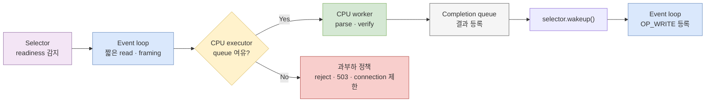
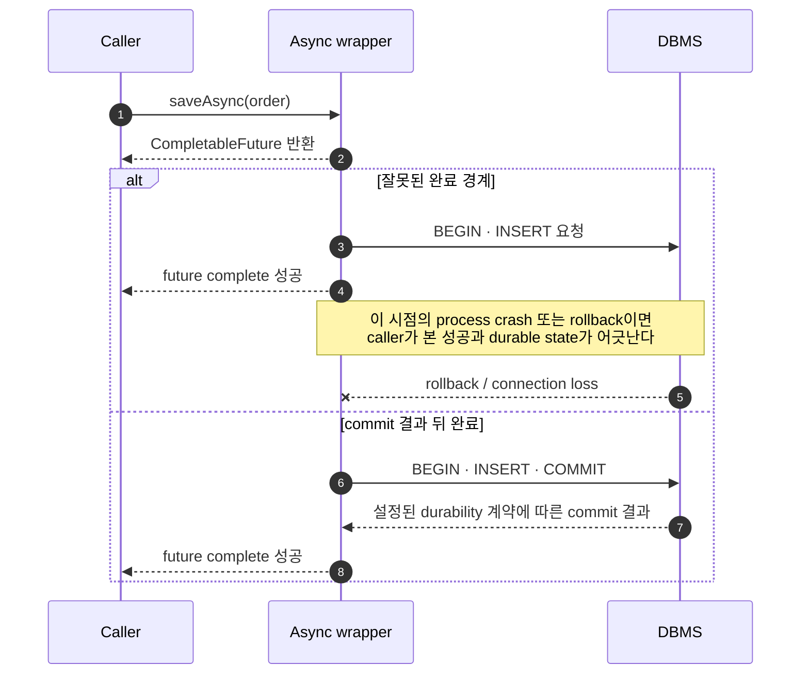

“비동기로 바꾸면 스레드를 점유하지 않고 병렬로 빨라진다.” 익숙하지만 서로 다른 주장을 한 문장에 섞었다. 비동기 API가 내부에서 blocking I/O를 수행할 수도 있고, non-blocking event loop가 한 코어에서만 실행될 수도 있다. callback이 호출됐어도 DB commit은 아직 아닐 수 있다.

이 글은 다음 질문을 분리한다.

1. 호출자는 결과를 **언제** 받는가: synchronous / asynchronous
2. 기다리는 동안 실행 자원이 **멈추는가**: blocking / non-blocking
3. 여러 작업의 수명이 **겹치는가**: concurrency
4. 같은 순간에 여러 실행 자원에서 **실행되는가**: parallelism
5. 성공 신호가 나타내는 **확정 경계는 어디인가**: 메모리 완료 / 전송 확인 / durable commit

핵심은 기술 이름이 아니라 경계를 명시하는 것이다. “reactive”, “async”, “event-driven”이라는 이름만으로 실행 위치, queue 상한, 취소 전파, 저장 내구성은 정해지지 않는다.

## 1. 세 분류 축을 먼저 분리한다

### synchronous / asynchronous: 결과 전달 방식

- **synchronous** 호출은 그 호출의 결과가 정해지는 흐름과 호출자의 다음 진행이 직접 이어진다.
- **asynchronous** 호출은 작업을 시작하거나 등록한 뒤 제어권을 먼저 돌려주고, 결과를 callback, `Future`, event 같은 별도 신호로 전달한다.

### blocking / non-blocking: 대기 중 실행 자원의 상태

- **blocking** 연산은 조건이 충족될 때까지 호출한 thread를 기다리게 할 수 있다.
- **non-blocking** 연산은 지금 진행할 수 없으면 기다리지 않고 반환해 다른 일을 할 기회를 남긴다.

여기서 관찰 경계를 꼭 붙여야 한다. API 호출자는 즉시 `CompletableFuture`를 받아 non-blocking처럼 보여도, 내부 worker thread가 JDBC 응답을 기다리며 block될 수 있다. 반대로 NIO event loop는 non-blocking channel을 다루면서 `Selector.select()`에서 준비된 channel이 생길 때까지 의도적으로 block할 수 있다. 중요한 차이는 **연결마다 thread 하나가 막히는 대신 selector thread 하나가 여러 연결의 readiness를 기다린다**는 데 있다.

| 조합 | 예 | 실제로 일어나는 일 |
|---|---|---|
| synchronous + blocking | blocking `SocketChannel.read()` | 호출 thread가 데이터나 종료를 기다린다 |
| synchronous + non-blocking | non-blocking channel의 `read()`, `Selector.selectNow()` | 지금 가능한 만큼 수행하고 즉시 결과를 돌려준다 |
| asynchronous + blocking 내부 | `supplyAsync(() -> jdbcQuery())` | 호출자는 Future를 받지만 executor worker는 DB 응답 동안 block된다 |
| asynchronous + non-blocking 경계 | selector가 readiness를 감지하고 callback/state machine을 진행 | 적은 수의 event-loop thread가 많은 연결을 번갈아 진행시킨다 |

### concurrency / parallelism: 작업 구성과 실제 실행 폭

동시성은 여러 작업이 시작과 완료 사이에서 겹치며 진행될 수 있는 구조다. 병렬성은 어떤 순간에 둘 이상의 작업이 서로 다른 실행 자원에서 실제로 실행되는 상태다.

- event loop 하나는 수만 연결을 **동시 진행**시킬 수 있지만 Java handler는 한 번에 하나만 실행하므로 그 handler들 사이에 CPU **병렬 실행**은 없다.
- thread pool 여덟 개가 CPU 작업을 수행하면 최대 여덟 작업이 runnable일 수 있지만, 실제 병렬 폭은 CPU와 스케줄러에 제한된다.
- 비동기 callback 열 개가 등록되어도 이를 실행할 executor가 하나라면 callback은 순차 실행된다.
- 한 callback 안에서 공유 map을 잘못 갱신하면 비동기 여부와 무관하게 race가 생긴다. 실행 모델은 [JMM의 happens-before 계약](/blog/parallelism-03-jvm-memory-model)을 대신하지 않는다.

따라서 다음 등식은 모두 성립하지 않는다.

```text
asynchronous != non-blocking
non-blocking != parallel
reactive != always faster
callback success != durable commit
```

## 2. Selector는 완료가 아니라 readiness를 알려 준다

Java NIO의 `Selector`는 여러 `SelectableChannel`을 multiplex한다. channel을 non-blocking mode로 전환하고 관심 연산을 등록하면 selector가 그 연산을 **시도할 준비가 된 channel**을 알려 준다.

`SelectionKey`에는 두 집합이 있다.

- `interestOps`: 다음 selection에서 관찰할 연산, 예를 들어 `OP_ACCEPT`, `OP_READ`, `OP_WRITE`
- `readyOps`: selector가 이번에 준비됐다고 감지한 연산

공식 API는 ready set을 보장된 완료가 아니라 **blocking 없이 수행할 수 있다는 힌트**로 설명한다. readiness 직후 다른 사건이나 I/O가 상태를 바꿀 수 있고, non-blocking `read()`는 `0`을 반환할 수 있다. `OP_WRITE`도 전체 buffer가 한 번에 전송된다는 보장이 아니다.

다음 코드는 selected-key set을 직접 소비하는 최소한의 echo loop다.

```java
import java.io.IOException;
import java.net.InetSocketAddress;
import java.nio.ByteBuffer;
import java.nio.channels.SelectionKey;
import java.nio.channels.Selector;
import java.nio.channels.ServerSocketChannel;
import java.nio.channels.SocketChannel;
import java.util.Iterator;

public final class NioEchoServer {
    public static void main(String[] args) throws IOException {
        try (Selector selector = Selector.open();
             ServerSocketChannel server = ServerSocketChannel.open()) {

            server.configureBlocking(false);
            server.bind(new InetSocketAddress(8080));
            server.register(selector, SelectionKey.OP_ACCEPT);

            while (!Thread.currentThread().isInterrupted()) {
                selector.select(); // 여러 channel의 readiness를 thread 하나가 기다린다

                Iterator<SelectionKey> iterator =
                        selector.selectedKeys().iterator();
                while (iterator.hasNext()) {
                    SelectionKey key = iterator.next();
                    iterator.remove(); // 처리한 key를 selected set에서 제거

                    try {
                        if (!key.isValid()) {
                            continue;
                        }
                        if (key.isAcceptable()) {
                            accept(selector, (ServerSocketChannel) key.channel());
                        }
                        if (key.isReadable()) {
                            read(key);
                        }
                        if (key.isWritable()) {
                            drainPendingWrite(key);
                        }
                    } catch (IOException e) {
                        key.cancel();
                        key.channel().close();
                    }
                }
            }
        }
    }

    private static void accept(Selector selector, ServerSocketChannel server)
            throws IOException {
        SocketChannel channel = server.accept();
        if (channel == null) { // readiness는 보장이 아니라 힌트다
            return;
        }
        channel.configureBlocking(false);
        channel.register(selector, SelectionKey.OP_READ,
                new ConnectionState(ByteBuffer.allocateDirect(8 * 1024)));
    }

    private static void read(SelectionKey key) throws IOException {
        SocketChannel channel = (SocketChannel) key.channel();
        ConnectionState state = (ConnectionState) key.attachment();
        ByteBuffer buffer = state.readBuffer;

        int read = channel.read(buffer);
        if (read == -1) {
            key.cancel();
            channel.close();
            return;
        }
        if (read == 0) {
            return;
        }

        buffer.flip();
        state.pendingWrite = ByteBuffer.allocate(buffer.remaining());
        state.pendingWrite.put(buffer).flip();
        buffer.compact();
        drainPendingWrite(key);
    }

    private static void drainPendingWrite(SelectionKey key) throws IOException {
        SocketChannel channel = (SocketChannel) key.channel();
        ConnectionState state = (ConnectionState) key.attachment();
        ByteBuffer pending = state.pendingWrite;
        if (pending == null) {
            return;
        }

        channel.write(pending);
        if (pending.hasRemaining()) {
            // 남은 바이트를 보존하고 writable readiness에서 다시 시도한다.
            key.interestOps((key.interestOps() | SelectionKey.OP_WRITE)
                    & ~SelectionKey.OP_READ);
            return;
        }

        state.pendingWrite = null;
        key.interestOps((key.interestOps() | SelectionKey.OP_READ)
                & ~SelectionKey.OP_WRITE);
    }

    private static final class ConnectionState {
        final ByteBuffer readBuffer;
        ByteBuffer pendingWrite;

        ConnectionState(ByteBuffer readBuffer) {
            this.readBuffer = readBuffer;
        }
    }
}
```

이 예제는 partial write가 생기면 남은 bytes를 attachment에 보관하고 `OP_WRITE`로 이어 쓰는 최소 경로까지 포함한다. 여전히 framing, 여러 응답을 위한 output queue, buffer 상한은 생략했다. 운영 코드에서 이 셋을 생략하면 메시지 경계가 깨지거나 느린 client가 메모리를 계속 점유한다.

### 흔한 잘못: event loop에서 CPU 작업을 끝낸다

다음 코드는 thread-safe하더라도 event loop 전체를 멈춘다.

```java
if (key.isReadable()) {
    byte[] body = readAvailableBytes(key);
    Parsed parsed = expensiveJsonAndSignatureVerification(body); // 잘못된 경계
    writeResponse(key, parsed);
}
```

서명 검증에 40ms가 걸리면 그 40ms 동안 다른 모든 channel의 accept, read, write도 진행되지 않는다. CPU 사용률은 높지 않아 보일 수 있지만 event-loop lag와 tail latency는 급격히 증가한다. 이 현상이 starvation이다.

아래 다이어그램은 event loop에는 짧은 readiness 처리만 남기고, CPU 작업을 bounded executor로 넘긴 뒤 완료 명령을 다시 event loop로 가져오는 흐름을 보여 준다.



> 실선은 작업과 완료 신호의 이동이다. CPU executor가 가득 찼을 때의 빨간 경로까지 있어야 bounded architecture다.

핵심 구조는 다음과 같다.

```java
import java.nio.channels.SelectionKey;
import java.nio.channels.Selector;
import java.util.concurrent.ArrayBlockingQueue;
import java.util.concurrent.ConcurrentLinkedQueue;
import java.util.concurrent.RejectedExecutionException;
import java.util.concurrent.ThreadPoolExecutor;
import java.util.concurrent.TimeUnit;

final class EventLoopBoundary {
    private final Selector selector;
    private final ConcurrentLinkedQueue<Runnable> completions =
            new ConcurrentLinkedQueue<>();

    private final ThreadPoolExecutor cpuExecutor = new ThreadPoolExecutor(
            Runtime.getRuntime().availableProcessors(),
            Runtime.getRuntime().availableProcessors(),
            0L, TimeUnit.MILLISECONDS,
            new ArrayBlockingQueue<>(512),
            new ThreadPoolExecutor.AbortPolicy());

    EventLoopBoundary(Selector selector) {
        this.selector = selector;
    }

    void offload(SelectionKey key, byte[] frame) {
        // 같은 connection에서 무제한 read가 더 들어오지 않도록 잠시 demand를 끊는다.
        key.interestOps(key.interestOps() & ~SelectionKey.OP_READ);

        try {
            cpuExecutor.execute(() -> {
                try {
                    Result result = parseAndVerify(frame);
                    completions.add(() -> {
                        attachOutput(key, result);
                        key.interestOps(key.interestOps() | SelectionKey.OP_WRITE);
                    });
                } catch (RuntimeException failed) {
                    completions.add(() -> closeKey(key));
                } finally {
                    selector.wakeup();
                }
            });
        } catch (RejectedExecutionException overloaded) {
            closeKey(key); // event loop에서 CallerRunsPolicy를 쓰지 않는다
        }
    }

    void drainCompletions() {
        for (Runnable task; (task = completions.poll()) != null; ) {
            task.run();
        }
    }

    // 예제의 관심사를 드러내기 위한 placeholder
    private static Result parseAndVerify(byte[] frame) { return new Result(); }
    private static void attachOutput(SelectionKey key, Result result) {}
    private static void closeKey(SelectionKey key) {
        try {
            key.cancel();
            key.channel().close();
        } catch (java.io.IOException ignored) {
            // 종료 경로에서는 이미 닫힌 channel도 허용한다.
        }
    }
    private static final class Result {}
}
```

worker가 `SelectionKey`의 상태를 제각각 바꾸게 두기보다 event loop가 connection state의 단일 owner가 되도록 completion command를 되돌려 보냈다. 다른 thread가 command를 넣은 뒤 `selector.wakeup()`을 호출해야 무기한 `select()` 중인 loop가 새 명령을 신속히 처리할 수 있다.

`CallerRunsPolicy`는 일반적인 부하 완화 수단처럼 보이지만 event loop에는 위험하다. queue가 찬 순간 CPU 작업을 event-loop thread에서 실행해 정확히 피하려던 starvation을 되살리기 때문이다.

## 3. Callback, Future, CompletionStage는 완료 표현이지 실행 정책 전체가 아니다

세 표현은 결과를 나중에 전달하지만 조합성과 실행 계약이 다르다.

| 표현 | 장점 | 빠뜨리기 쉬운 경계 |
|---|---|---|
| callback | 단순한 단일 완료 통지 | 중첩, 오류·취소 경로 누락, 호출 thread 불명확 |
| `Future` | 완료 여부와 blocking `get()` 제공 | 여러 작업의 변환·조합이 불편하고 `get()`은 호출 thread를 막음 |
| `CompletionStage` / `CompletableFuture` | 변환, 결합, 오류 처리를 pipeline으로 표현 | non-async/async 메서드와 executor 선택에 따라 실행 위치가 달라짐 |

`CompletableFuture`의 공식 계약에서 가장 중요한 실행 규칙은 다음 세 가지다.

- `thenApply`, `thenRun` 같은 **non-async** dependent action은 source stage를 완료한 thread 또는 completion을 시도한 다른 caller에서 실행될 수 있다.
- 명시적 executor가 없는 `thenApplyAsync`, `supplyAsync` 같은 **async** 메서드는 기본적으로 `ForkJoinPool.commonPool()`을 사용한다.
- `get()`과 `join()`은 결과가 없으면 호출 thread를 기다리게 한다. pipeline이 비동기여도 끝에서 무조건 `join()`하면 그 caller는 block된다.

### 흔한 잘못: blocking I/O와 CPU 작업을 공용 풀에 섞는다

```java
CompletableFuture<OrderView> load(long orderId) {
    return CompletableFuture
            .supplyAsync(() -> jdbcRepository.find(orderId)) // common pool에서 block
            .thenApply(this::renderPdf);                     // 완료 thread에서 CPU 점유
}
```

이 코드의 API는 비동기지만 JDBC가 반환할 때까지 common-pool worker는 block된다. 이어지는 `thenApply`의 PDF 렌더링은 JDBC stage를 완료한 thread에서 실행될 수 있다. 애플리케이션의 다른 parallel stream과 `CompletableFuture` 작업도 같은 common pool을 쓴다면 서로 무관한 요청까지 밀린다.

`ForkJoinPool`에는 특수 blocking 동작을 확장하는 `ManagedBlocker`가 있지만, 임의의 client library 호출이 자동으로 managed blocking이 되는 것은 아니다. 일반 애플리케이션에서는 blocking I/O와 CPU 작업의 executor 경계를 명시하는 편이 관측과 용량 계획에 유리하다.

```java
import java.util.concurrent.ArrayBlockingQueue;
import java.util.concurrent.CompletableFuture;
import java.util.concurrent.ExecutorService;
import java.util.concurrent.ThreadPoolExecutor;
import java.util.concurrent.TimeUnit;

final class OrderPipeline {
    private final ExecutorService blockingIo = boundedPool(32, 256);
    private final ExecutorService cpu = boundedPool(
            Runtime.getRuntime().availableProcessors(), 128);

    CompletableFuture<OrderView> load(long orderId) {
        return CompletableFuture
                .supplyAsync(() -> jdbcRepositoryFind(orderId), blockingIo)
                .thenApplyAsync(this::renderPdf, cpu);
    }

    private static ExecutorService boundedPool(int threads, int queueCapacity) {
        return new ThreadPoolExecutor(
                threads, threads,
                0L, TimeUnit.MILLISECONDS,
                new ArrayBlockingQueue<>(queueCapacity),
                new ThreadPoolExecutor.AbortPolicy());
    }

    private Order jdbcRepositoryFind(long id) { return new Order(); }
    private OrderView renderPdf(Order order) { return new OrderView(); }
    private static final class Order {}
    private static final class OrderView {}
}
```

이 코드는 executor를 나눴지만 과부하 처리를 완성한 것은 아니다. `RejectedExecutionException`을 API의 overload 응답으로 바꾸고, shutdown 시 pipeline을 어떻게 drain할지 정해야 한다. DB connection pool이 20개인데 blocking executor를 200개로 잡으면 DB 앞 대기자만 늘어난다. executor 상한은 downstream의 실제 동시 처리 능력과 함께 정한다.

### `Async` 접미사는 자동 병렬화를 뜻하지 않는다

`thenApplyAsync`는 action을 지정 executor에 제출한다는 뜻이지, action 내부를 여러 조각으로 나눠 병렬화한다는 뜻이 아니다. 큰 JSON 하나를 parse하는 function은 여전히 worker 하나에서 실행된다. 여러 독립 stage를 먼저 시작하고 `allOf`로 합칠 수는 있지만, 공유 상태와 실패 처리도 그만큼 명시해야 한다.

```java
CompletableFuture<Customer> customer = findCustomerAsync(orderId);
CompletableFuture<Price> price = calculatePriceAsync(orderId);

CompletableFuture<OrderSummary> summary = customer.thenCombine(
        price,
        OrderSummary::new);
```

두 작업의 수명은 겹칠 수 있다. 그러나 실제 병렬 실행 여부는 두 stage가 어떤 executor와 I/O mechanism을 사용하는지에 달려 있다.

## 4. Reactive Streams의 핵심은 이름이 아니라 demand다

Reactive Streams는 잠재적으로 끝이 없는 element stream을 asynchronous boundary 너머로 전달하면서 downstream이 감당할 수 없는 양을 강제로 받지 않게 하는 규약이다. Java의 `Flow.Publisher`, `Subscriber`, `Subscription`, `Processor`는 이 규약에 대응한다.

핵심 신호는 `Subscription.request(n)`이다. publisher는 subscriber가 요청한 누적 demand보다 많은 `onNext`를 보내면 안 된다. `request(Long.MAX_VALUE)`는 사실상 backpressure를 포기한다는 뜻이다.

다음 subscriber는 최대 8개의 저장 작업만 in-flight로 유지한다. 저장 하나가 끝날 때마다 demand 하나를 보충한다.

```java
import java.util.concurrent.CompletableFuture;
import java.util.concurrent.CompletionStage;
import java.util.concurrent.Flow;
import java.util.concurrent.atomic.AtomicBoolean;
import java.util.concurrent.atomic.AtomicInteger;

final class BoundedPersistSubscriber implements Flow.Subscriber<Event> {
    private static final int MAX_IN_FLIGHT = 8;

    private final AtomicInteger inFlight = new AtomicInteger();
    private final AtomicBoolean upstreamDone = new AtomicBoolean();
    private final CompletableFuture<Void> drained = new CompletableFuture<>();
    private volatile Flow.Subscription subscription;

    @Override
    public void onSubscribe(Flow.Subscription subscription) {
        this.subscription = subscription;
        subscription.request(MAX_IN_FLIGHT);
    }

    @Override
    public void onNext(Event event) {
        inFlight.incrementAndGet();

        persistAndCommit(event).whenComplete((ignored, failure) -> {
            int left = inFlight.decrementAndGet();

            if (failure != null) {
                subscription.cancel();
                drained.completeExceptionally(failure);
                return;
            }

            if (upstreamDone.get()) {
                if (left == 0) {
                    drained.complete(null);
                }
            } else {
                subscription.request(1); // 완료한 만큼만 demand를 보충
            }
        });
    }

    @Override
    public void onError(Throwable throwable) {
        drained.completeExceptionally(throwable);
    }

    @Override
    public void onComplete() {
        upstreamDone.set(true);
        if (inFlight.get() == 0) {
            drained.complete(null);
        }
    }

    CompletionStage<Void> completion() {
        return drained;
    }

    private CompletionStage<Void> persistAndCommit(Event event) {
        return CompletableFuture.completedFuture(null); // 실제 durable API로 교체
    }
}

record Event(String id, byte[] payload) {}
```

이 예제에는 두 종류의 완료가 있다.

- upstream의 `onComplete`: 더 보낼 element가 없다는 stream protocol의 terminal signal
- subscriber의 `drained`: 이미 받은 element의 비동기 commit까지 모두 끝났다는 애플리케이션 완료

`onComplete()`가 호출될 때 마지막 `persistAndCommit`이 여전히 실행 중일 수 있으므로 둘을 합치지 않았다. 실제 코드에서는 중복 `onSubscribe`, callback race, shutdown, retry/idempotency 정책도 검증해야 한다.

### backpressure도 모든 자원을 자동으로 제한하지 않는다

`request(8)`은 element 개수를 8개로 제한한다. element 하나가 1KB인지 100MB인지, DB transaction이 connection을 몇 개 쓰는지까지 알지 못한다. byte budget, connection pool, 외부 API rate limit이 중요하면 각각의 제한을 별도로 둔다.

JDK의 `SubmissionPublisher`도 정책 선택을 요구한다.

- 기본 생성자는 일반적으로 `ForkJoinPool.commonPool()`을 delivery executor로 쓴다.
- subscriber마다 독립 buffer가 있고 최대 capacity까지 확장될 수 있다.
- `submit()`은 buffer resource가 생길 때까지 producer를 **block**할 수 있다.
- `offer()`는 즉시 또는 bounded timeout 뒤 drop handler를 적용할 수 있다.

즉 reactive API를 사용했다고 모든 호출이 non-blocking인 것은 아니다. Reactive Streams의 “non-obstructing” 계약은 signal method가 caller thread를 오래 막지 않아야 한다는 뜻이며, stage 안의 업무 함수가 저절로 가벼워지는 것은 아니다. map 단계에서 CPU-heavy 작업을 실행하면 그 단계를 호출한 scheduler를 그대로 굶길 수 있다.

## 5. Queue는 지연을 숨길 뿐 처리 능력을 만들지 않는다

producer가 초당 1,000개를 넣고 consumer가 초당 800개를 처리하면 차이 200개는 어딘가에 쌓인다. queue가 unbounded면 처음에는 성공률이 높아 보이지만, 시간이 지날수록 메모리와 대기 시간이 늘다가 더 큰 장애로 바뀐다.

운영 가능한 비동기 경계에는 다음 네 값이 있어야 한다.

| 값 | 질문 | 예 |
|---|---|---|
| concurrency limit | 동시에 downstream을 점유할 작업은 몇 개인가? | DB connection 수 이하의 in-flight query |
| queue capacity | burst를 몇 개 또는 몇 byte까지 흡수할 것인가? | executor queue 256, output buffer 8MB |
| admission policy | capacity를 넘으면 무엇을 할 것인가? | reject, 429/503, drop, producer 대기 |
| deadline budget | queue 대기까지 포함해 언제 포기할 것인가? | 절대 deadline 500ms |

queue capacity를 정할 때 평균 처리량만 보지 않는다. peak arrival rate, service-time 분포, downstream 제한, 허용 tail latency를 함께 부하 실험한다. queue에 들어간 순간부터 deadline을 소비한다. handler가 실행을 시작할 때 timeout을 새로 500ms 주면 여러 hop에서 총 요청 시간이 끝없이 늘어난다.

### reactive가 언제나 빠르지 않은 이유

- 작은 workload에서는 callback, queue, context switch, state machine 비용이 직접 호출보다 클 수 있다.
- CPU-bound 작업은 non-blocking API로 감싸도 필요한 CPU cycle이 줄지 않는다.
- downstream이 느리면 backpressure는 부하를 제한할 뿐 처리 속도를 높이지 않는다.
- operator 사이 scheduler 전환을 많이 넣으면 queue와 context switching이 늘어난다.
- debugging, context propagation, cancellation 경로가 복잡해져 운영 비용이 커질 수 있다.

non-blocking도 “thread zero”가 아니다. selector/event-loop thread, CPU executor worker, timer thread, callback executor와 JVM runtime thread가 여전히 존재한다. 목표는 thread를 없애는 것이 아니라 **대기 connection 수와 platform thread 수의 1:1 결합을 끊고, 실행 자원을 의도한 곳에 배분하는 것**이다.

## 6. Cancellation, deadline, context는 자동 전파되지 않는다

비동기 graph는 시작보다 중단이 어렵다. client가 연결을 끊었는데 DB query와 외부 HTTP 호출이 계속 실행되면 응답으로 쓰이지 않을 작업이 자원을 점유한다.

### cancellation은 요청이며 완료 확인이 아니다

`CompletableFuture.cancel(true)`는 해당 future를 `CancellationException`으로 exceptional completion시킨다. `CompletableFuture`는 자신을 완료시키는 computation을 직접 제어하지 않으므로 `mayInterruptIfRunning`은 실행 중인 작업을 중단한다는 보장이 없다. underlying client의 cancel API, socket close, statement timeout처럼 실제 자원을 중단하는 수단을 연결해야 한다.

`Flow.Subscription.cancel()`도 subscriber가 **결국** signal을 그만 받게 하는 best-effort 요청이다. 비동기 전파 중이던 추가 message를 받을 수 있다. 따라서 cancel 이후 callback이 절대 오지 않는다고 가정하지 말고 terminal state를 idempotent하게 처리한다.

### timeout 대신 절대 deadline을 전파한다

```java
import java.time.Duration;
import java.time.Instant;
import java.util.concurrent.CompletableFuture;
import java.util.concurrent.Executor;
import java.util.concurrent.TimeUnit;

record CallContext(String traceId, Instant deadline) {
    long remainingMillis() {
        long value = Duration.between(Instant.now(), deadline).toMillis();
        return Math.max(0L, value);
    }
}

final class RemoteCall {
    private final Executor blockingIo;

    RemoteCall(Executor blockingIo) {
        this.blockingIo = blockingIo;
    }

    CompletableFuture<Response> fetch(CallContext context) {
        long remaining = context.remainingMillis();
        if (remaining == 0L) {
            return CompletableFuture.failedFuture(
                    new java.util.concurrent.TimeoutException("deadline exceeded"));
        }

        return CompletableFuture
                .supplyAsync(
                        () -> blockingClientFetch(
                                context.traceId(), remaining), // client timeout에도 반영
                        blockingIo)
                .orTimeout(remaining, TimeUnit.MILLISECONDS);
    }

    private Response blockingClientFetch(String traceId, long timeoutMillis) {
        return new Response();
    }

    private static final class Response {}
}
```

`orTimeout`은 future를 시간 초과로 완료하지만 underlying blocking call이 반드시 멈췄다는 뜻은 아니다. 그래서 같은 남은 시간을 client의 connect/read/query timeout에도 전달해야 한다. 가능하다면 timeout callback에서 client가 제공하는 cancel/close까지 호출한다.

trace ID, tenant, auth 정보도 `ThreadLocal`에만 의존하지 않고 immutable context로 명시적으로 넘겼다. completion action은 원래 요청 thread가 아닌 event loop나 executor worker에서 실행될 수 있으므로 thread-local context가 자동으로 따라온다고 가정하면 로그와 권한 정보가 사라지거나 섞일 수 있다.

## 7. Callback 성공과 durable commit은 다른 사건이다

`CompletableFuture.complete(value)`는 JVM 메모리 안의 future 상태를 바꾼다. 이 동작 자체는 file `fsync`, Kafka transaction commit, DB transaction commit을 수행하지 않는다. future가 무엇의 완료를 나타내는지는 그 future를 만든 API의 계약과 코드 순서에 달려 있다.

아래 다이어그램은 DB commit 결과를 받기 전에 future를 완료하는 잘못된 구현과, commit 경계 뒤에 완료하는 구현의 차이를 보여 준다.



> 점선 응답은 완료 통지, `--x`는 commit 전에 실패한 경로다. 실제 내구성 강도는 DBMS 설정과 storage 장애 모델까지 확인해야 한다.

| 성공 신호 | 일반적으로 말할 수 있는 것 | 아직 별도 확인할 것 |
|---|---|---|
| local queue에 enqueue 성공 | process memory의 queue가 작업을 받음 | process crash 뒤 복구, downstream 처리 |
| socket `write` 성공 | 일부 byte를 OS/network stack에 넘김 | peer 수신·처리·commit |
| callback 호출 | callback을 만든 API가 정한 작업이 완료됨 | 그 API의 정확한 성공 경계 |
| Kafka producer send 성공 | 설정된 `acks`와 producer 계약에 따른 record 확인 | Kafka transaction commit, 외부 DB/HTTP 효과 |
| DB transaction commit 성공 | 설정된 DB durability 계약에 따라 transaction 확정 | 다른 system의 부수 효과 |

특히 Kafka producer callback과 업무 완료를 동일시하지 않는다. `send()` 성공, transaction commit, consumer offset commit은 서로 다른 경계다. 자세한 구분은 [파일 append에서 Kafka 복제 로그로: 원자성의 경계](/blog/concurrency-04-kafka-log-atomicity)에서 이어진다.

비동기 wrapper를 설계할 때 메서드 이름과 문서에 완료 경계를 넣는다.

```java
CompletionStage<Queued> enqueueInMemory(Command command);
CompletionStage<BrokerAck> appendToKafka(Command command);
CompletionStage<CommittedOrder> commitOrder(Command command);
```

타입만으로 내구성을 증명할 수는 없지만, 모두 `CompletionStage<Void>`로 뭉개는 것보다 review에서 잘못된 완료 위치를 발견하기 쉽다.

## 8. 부하 실험: 공용 풀에 blocking 작업을 넣으면 무엇이 밀리는가

다음 실험은 blocking I/O를 `Thread.sleep`으로 모델링한다. 첫 scenario는 common pool worker 수만큼 blocking 작업을 common pool에 먼저 넣고 같은 pool에 짧은 CPU probe를 제출한다. 두 번째는 blocking 작업을 전용 bounded executor에 격리하고 CPU probe만 common pool에 남긴다.

```java
import java.util.ArrayList;
import java.util.Collections;
import java.util.List;
import java.util.concurrent.ArrayBlockingQueue;
import java.util.concurrent.CompletableFuture;
import java.util.concurrent.CountDownLatch;
import java.util.concurrent.Executor;
import java.util.concurrent.ExecutorService;
import java.util.concurrent.ForkJoinPool;
import java.util.concurrent.ThreadPoolExecutor;
import java.util.concurrent.TimeUnit;

public final class PoolBoundaryProbe {
    private static final int PROBES = 200;

    public static void main(String[] args) throws Exception {
        int parallelism = ForkJoinPool.getCommonPoolParallelism();
        if (parallelism < 2) {
            System.out.println("common-pool parallelism < 2: 이 실험은 생략");
            return;
        }

        runScenario("blocking-on-common-pool",
                ForkJoinPool.commonPool(), parallelism);

        ExecutorService blockingIo = new ThreadPoolExecutor(
                parallelism, parallelism,
                0L, TimeUnit.MILLISECONDS,
                new ArrayBlockingQueue<>(parallelism),
                new ThreadPoolExecutor.AbortPolicy());
        try {
            runScenario("blocking-on-dedicated-pool", blockingIo, parallelism);
        } finally {
            blockingIo.shutdown();
        }
    }

    private static void runScenario(
            String name, Executor blockingExecutor, int blockers) throws Exception {

        CountDownLatch allBlockingTasksStarted = new CountDownLatch(blockers);
        List<CompletableFuture<Void>> waits = new ArrayList<>();

        for (int i = 0; i < blockers; i++) {
            waits.add(CompletableFuture.runAsync(() -> {
                allBlockingTasksStarted.countDown();
                sleep(300); // blocking I/O를 모델링
            }, blockingExecutor));
        }

        allBlockingTasksStarted.await();

        List<CompletableFuture<Long>> probes = new ArrayList<>();
        for (int i = 0; i < PROBES; i++) {
            long submittedAt = System.nanoTime();
            probes.add(CompletableFuture.supplyAsync(
                    () -> TimeUnit.NANOSECONDS.toMicros(
                            System.nanoTime() - submittedAt)));
        }

        CompletableFuture.allOf(waits.toArray(CompletableFuture[]::new)).join();

        List<Long> latencyMicros = probes.stream()
                .map(CompletableFuture::join)
                .sorted()
                .toList();

        System.out.printf(
                "%s p50=%d us, p99=%d us%n",
                name,
                percentile(latencyMicros, 0.50),
                percentile(latencyMicros, 0.99));
    }

    private static long percentile(List<Long> sorted, double p) {
        int index = Math.max(0,
                (int) Math.ceil(sorted.size() * p) - 1);
        return sorted.get(index);
    }

    private static void sleep(long millis) {
        try {
            Thread.sleep(millis);
        } catch (InterruptedException e) {
            Thread.currentThread().interrupt();
            throw new RuntimeException(e);
        }
    }
}
```

실험 전에 `ForkJoinPool.getCommonPoolParallelism()`과 CPU 수를 기록한다. JVM option, container CPU quota, JDK 구현에 따라 숫자는 달라지므로 특정 배율을 정답으로 두지 않는다.

검증할 가설은 다음과 같다.

- blocking 작업이 common pool을 점유하면 뒤에 제출한 짧은 probe의 queueing latency, 특히 p99가 blocking 시간의 영향을 받는다.
- blocking executor를 분리하면 common pool의 probe는 앞 scenario보다 빨리 시작할 수 있다.
- 전용 executor도 queue를 unbounded로 만들면 overload가 사라지는 것이 아니라 대기 위치만 이동한다.
- pool 분리는 처리 능력을 늘리는 최적화가 아니라 서로 다른 workload의 간섭을 제한하는 격리다.

### Selector starvation 실험도 같은 방식으로 한다

NIO server에는 다음 두 버전을 준비한다.

1. event loop 안에서 요청 100개마다 20~40ms CPU 작업 수행
2. 같은 작업을 bounded CPU executor로 offload

동일한 연결 수와 요청률에서 다음을 함께 기록한다.

- readiness 감지부터 handler 시작까지의 event-loop lag p50/p95/p99
- request latency와 timeout 비율
- CPU executor active count, queue depth, rejection count
- selector loop iteration 시간과 한 iteration에서 처리한 key 수
- throughput, process CPU, allocation과 GC pause

offload 버전의 평균 latency만 낮고 queue가 계속 증가한다면 성공이 아니다. steady state에서 queue가 상한 안에 머물고, overload 시 명시한 reject/drop 정책이 작동하며, 회복 뒤 backlog가 줄어드는지 확인한다.

## 9. 어떤 모델을 선택할 것인가

| 상황 | 우선 검토할 모델 | 반드시 확인할 것 |
|---|---|---|
| 많은 socket 연결, handler가 짧음 | selector / event loop | event-loop starvation, partial I/O, per-connection buffer 상한 |
| 몇 개의 독립 비동기 결과를 조합 | `CompletionStage` | executor 경계, 오류·취소 전파, common-pool 공유 |
| 속도가 다른 producer/consumer의 긴 stream | `Flow` / Reactive Streams 구현 | demand, buffer 상한, terminal signal과 업무 완료 차이 |
| 전통적인 blocking client가 많고 request-per-task가 자연스러움 | 다음 편의 virtual thread 검토 | 외부 자원 limit, pinning, deadline, cancellation |
| 큰 CPU 계산 | bounded CPU executor 또는 data-parallel 분할 | CPU 수, 작업 크기, shared state, work stealing 간섭 |

선택 기준은 “가장 현대적인 API인가”가 아니다. workload가 어디서 기다리고, 누가 실행하며, 얼마나 쌓일 수 있고, 실패하면 어떤 상태가 남는지를 가장 단순하게 표현하는 모델이 좋은 출발점이다.

## 10. 운영 전 체크리스트

### 실행 경계

- non-async `CompletionStage` action이 어느 thread에서 실행될 수 있는지 확인했는가?
- event loop에서 blocking I/O, lock 대기, 긴 CPU 작업을 수행하지 않는가?
- blocking I/O, CPU, callback delivery가 의도치 않게 common pool을 공유하지 않는가?
- executor thread 수와 downstream connection/rate limit가 맞는가?

### 과부하와 backpressure

- 모든 queue와 per-connection buffer에 개수 또는 byte 상한이 있는가?
- capacity 초과 시 reject, drop, 대기 중 무엇을 할지 API에 드러나는가?
- `request(Long.MAX_VALUE)`나 무제한 prefetch가 숨어 있지 않은가?
- `SubmissionPublisher.submit()`처럼 producer를 block할 수 있는 API를 event loop에서 호출하지 않는가?

### 취소와 시간

- timeout을 hop마다 새로 만들지 않고 절대 deadline과 남은 budget을 전달하는가?
- future cancellation이 underlying socket, query, HTTP call까지 이어지는가?
- cancel 뒤 늦게 도착한 callback을 idempotent하게 무시할 수 있는가?
- trace, auth, tenant context가 executor 경계를 건너는 방식이 명시적인가?

### 정확성과 완료 의미

- callback 성공이 queue 수락, 전송 확인, durable commit 중 무엇인지 문서화했는가?
- upstream `onComplete`와 subscriber 내부 비동기 작업의 drain 완료를 구분했는가?
- retry 시 중복 부수 효과를 막을 idempotency key 또는 transaction 경계가 있는가?
- 비동기 결과 공개에 필요한 happens-before와 shared-state 보호가 있는가?

## 마무리

비동기는 결과 전달의 시간 구조이고, 논블로킹은 기다리는 방식이며, 동시성은 여러 작업을 구성하는 방식이고, 병렬성은 실제 실행 상태다. 이 네 축을 분리하면 “비동기로 바꿨으니 빨라졌다” 대신 다음처럼 검증 가능한 문장을 쓸 수 있다.

> selector thread 하나가 connection readiness를 multiplex하고, 짧은 I/O state transition만 수행한다. CPU 작업은 core 수에 맞춘 bounded executor로 넘긴다. subscriber demand와 executor queue로 in-flight 작업을 제한하며, 절대 deadline과 cancellation을 downstream에 전파한다. 성공 future는 DB commit 결과 뒤에만 완료한다.

이 문장에는 실행 자원, queue 상한, overload, 시간과 저장 경계가 모두 있다. 다음 편 [Java 가상 스레드](/blog/parallelism-05-java-virtual-threads)에서는 callback state machine 대신 익숙한 blocking code 형태를 유지하면서 많은 동시 작업을 표현하는 방법을 본다. 가상 스레드도 CPU를 늘리거나 downstream capacity를 만들지는 않으므로, 이 글의 bounded concurrency와 deadline 원칙은 그대로 남는다.

## 공식 자료

- Oracle Java SE 25 API, [`Selector`](https://docs.oracle.com/en/java/javase/25/docs/api/java.base/java/nio/channels/Selector.html)와 [`SelectionKey`](https://docs.oracle.com/en/java/javase/25/docs/api/java.base/java/nio/channels/SelectionKey.html)
- Oracle Java SE 25 API, [`CompletableFuture`](https://docs.oracle.com/en/java/javase/25/docs/api/java.base/java/util/concurrent/CompletableFuture.html), [`CompletionStage`](https://docs.oracle.com/en/java/javase/25/docs/api/java.base/java/util/concurrent/CompletionStage.html), [`ForkJoinPool`](https://docs.oracle.com/en/java/javase/25/docs/api/java.base/java/util/concurrent/ForkJoinPool.html)
- Oracle Java SE 25 API, [`Flow`](https://docs.oracle.com/en/java/javase/25/docs/api/java.base/java/util/concurrent/Flow.html), [`Flow.Subscription`](https://docs.oracle.com/en/java/javase/25/docs/api/java.base/java/util/concurrent/Flow.Subscription.html), [`SubmissionPublisher`](https://docs.oracle.com/en/java/javase/25/docs/api/java.base/java/util/concurrent/SubmissionPublisher.html)
- OpenJDK, [JEP 266: More Concurrency Updates](https://openjdk.org/jeps/266)
- Reactive Streams, [Reactive Streams Specification for the JVM 1.0.4](https://github.com/reactive-streams/reactive-streams-jvm/blob/v1.0.4/README.md)
