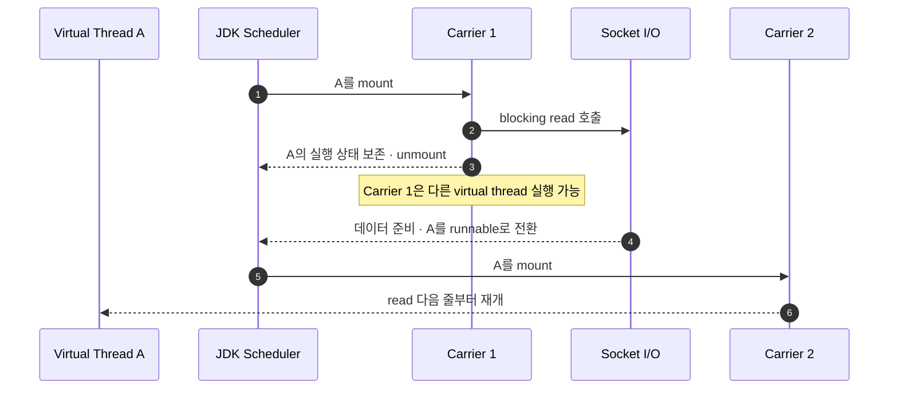
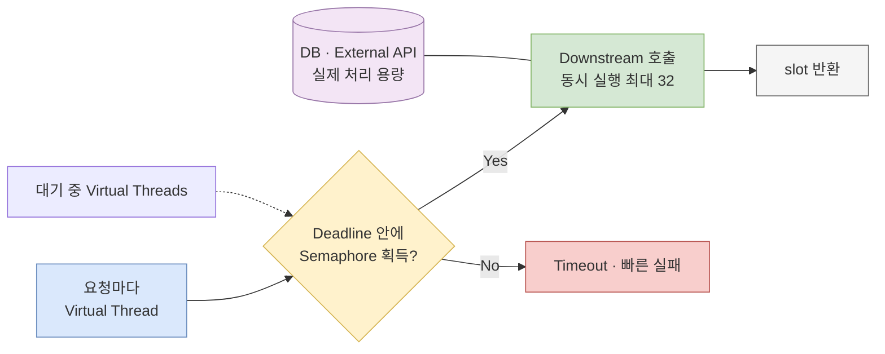

플랫폼 스레드 200개를 가상 스레드 20만 개로 바꾸면 1,000배 병렬로 실행될까? 그렇지 않다. CPU 코어도, DB connection도, 외부 API가 처리할 수 있는 요청 수도 그대로다.

가상 스레드가 늘리는 것은 주로 **동시에 살아 있으면서 기다릴 수 있는 작업의 수**다. 실행할 Java 코드가 생기면 가상 스레드는 제한된 platform thread에 올라가고, 지원되는 blocking I/O에서 기다리게 되면 내려와 그 platform thread를 다른 작업에 양보한다. callback state machine으로 표현하던 많은 I/O-bound 작업을 익숙한 동기 코드와 thread-per-request 구조로 작성하면서도 높은 동시성을 얻는 것이 핵심이다.

> **가상 스레드는 기다림을 저렴하게 표현한다. CPU 병렬성이나 downstream 처리 능력을 새로 만들지는 않는다.**

이 글의 기준은 Java 26이다. Virtual Threads 자체는 JDK 21에서 정식 기능이 되었지만, pinning과 관측 도구는 이후 달라졌다. 특히 JDK 24의 JEP 491 이후에도 “`synchronized` 안에서 block하면 항상 pinning된다”고 설명하면 현재 동작과 맞지 않는다.

## 1. platform thread와 virtual thread는 무엇을 점유하는가

둘 다 `java.lang.Thread` 인스턴스이고 thread-local variable, interrupt, stack trace 같은 익숙한 thread 규칙을 따른다. 차이는 Java 코드를 실행할 OS thread를 수명 내내 붙잡는가에 있다.

| 구분 | Platform thread | Virtual thread |
|---|---|---|
| 구현 주체 | OS thread를 얇게 감싼 Java thread | JDK가 구현하고 스케줄링하는 Java thread |
| OS thread 관계 | 수명 동안 underlying OS thread를 점유 | 실행할 때만 carrier platform thread에 mount |
| 생성·유지 비용 | 상대적으로 커서 보통 pool로 재사용 | 상대적으로 작아 task마다 새로 생성 |
| 잘 맞는 작업 | CPU 작업, 제한된 수의 장기 worker | blocking I/O가 많은 짧은 request/task |
| 병렬 실행 폭 | OS scheduler와 CPU에 제한 | 결국 carrier와 CPU에 제한 |
| pool의 의미 | 비싼 platform thread 수를 관리 | virtual thread 자체는 pool로 재사용하지 않음 |

“가볍다”는 “비용이 0이다”라는 뜻이 아니다. virtual thread마다 `Thread` 객체, stack chunk, task가 참조하는 request body와 buffer, `ThreadLocal` 값, open socket과 `Future`가 남는다. 수십만 task를 만들 수 있다는 사실과 수십만 task를 무제한 수용해도 된다는 결론은 다르다.

### carrier는 virtual thread의 영구적인 주인이 아니다

JDK scheduler는 runnable virtual thread를 platform thread에 **mount**한다. 이 platform thread를 carrier라고 한다. virtual thread가 코드를 실행하다 지원되는 blocking 지점에서 기다리면 continuation의 실행 상태를 보존하고 carrier에서 **unmount**될 수 있다. carrier는 즉시 다른 virtual thread를 실행할 수 있다. I/O가 준비되면 원래 virtual thread는 다시 runnable이 되고, 이전과 같을 필요가 없는 carrier에 mount되어 이어서 실행한다.

아래 다이어그램은 socket read에서 기다리는 동안 virtual thread는 살아 있지만 carrier는 다른 작업에 재사용되는 흐름을 보여 준다.



> mount와 unmount는 JDK가 투명하게 수행한다. 애플리케이션이 특정 carrier의 이름이나 동일성을 업무 로직에 사용해서는 안 된다.

이 구조는 M:N 스케줄링이다. 많은 virtual thread가 더 적은 platform thread를 공유하고, platform thread는 다시 OS scheduler에 의해 논리 프로세서에서 실행된다.

```text
application task N개
        ↓ task마다 virtual thread 하나
virtual thread N개
        ↓ JDK scheduler가 mount / unmount
carrier platform thread M개
        ↓ OS scheduler
논리 프로세서와 CPU core
```

## 2. scheduler parallelism은 동시 task 수가 아니다

JDK Reference Implementation의 virtual-thread scheduler는 별도의 `ForkJoinPool`이다. common pool과 같은 pool이 아니다. Java 26 `Thread` API의 implementation note에 따르면 다음 두 system property로 구현을 조정할 수 있다.

| 설정 | Java 26 기본값 | 의미 |
|---|---:|---|
| `jdk.virtualThreadScheduler.parallelism` | available processor 수 | virtual thread를 carry하는 데 사용할 target parallelism |
| `jdk.virtualThreadScheduler.maxPoolSize` | 256 | scheduler가 사용할 수 있는 platform thread의 최대 수 |

예를 들어 다음 설정은 “virtual thread를 16개만 허용”하거나 “요청을 16개로 제한”하지 않는다.

```bash
java -Djdk.virtualThreadScheduler.parallelism=16 Application
```

동시에 살아 있는 virtual thread는 훨씬 많을 수 있다. `parallelism=16`은 runnable virtual thread의 Java 코드를 carry할 target platform thread 수를 조정하는 구현 설정이다. 이것을 DB connection pool 크기, API concurrency limit, CPU-bound task queue 크기와 혼동하면 안 된다.

Java 24부터는 `VirtualThreadSchedulerMXBean`으로 target parallelism을 동적으로 바꾸고 다음 값을 관찰할 수 있다.

- target parallelism
- scheduler가 시작한 platform thread 수
- 현재 mount된 virtual thread 수의 추정값
- 실행 시작 또는 재개를 기다리며 queue에 있는 virtual thread 수의 추정값

기본값을 먼저 바꾸기보다 CPU 사용률, queued virtual threads, pinning, downstream 대기 시간을 함께 측정한다. parallelism을 올려도 CPU core나 DB 처리량은 늘지 않는다. 오히려 CPU-bound 경쟁과 context switching만 늘 수 있다.

## 3. blocking 코드를 그대로 쓸 수 있다는 말의 정확한 범위

virtual thread의 장점은 “blocking API를 non-blocking API로 바꾼다”가 아니다. 소스 코드에는 blocking 호출과 평범한 제어 흐름을 남기되, JDK가 지원하는 대기에서 virtual thread를 suspend하고 carrier를 풀어 준다는 뜻이다.

다음 메서드는 세 종류의 기다림을 순서대로 보여 준다.

```java
import java.io.IOException;
import java.net.Socket;
import java.util.concurrent.locks.ReentrantLock;

final class VirtualThreadWaits {
    private final ReentrantLock gate = new ReentrantLock();

    byte[] run(Socket socket) throws IOException, InterruptedException {
        Thread.sleep(50);             // timer를 기다린다

        gate.lockInterruptibly();     // 경합 시 lock 획득을 기다린다
        try {
            updateInMemoryState();    // 임계 구역은 짧게 유지한다
        } finally {
            gate.unlock();
        }

        return socket.getInputStream()
                .readNBytes(8);       // network I/O를 기다릴 수 있다
    }

    private void updateInMemoryState() {}
}
```

Java 26에서 `Thread.sleep`, `java.util.concurrent`의 parking 기반 대기, JDK의 여러 network I/O 같은 지점은 virtual thread를 unmount할 수 있다. 대기하는 virtual thread는 사라진 것이 아니며 interrupt와 stack을 가진 task로 남는다. 준비 신호가 오면 scheduler queue를 거쳐 다시 실행된다.

단, “모든 이름이 blocking인 API는 반드시 carrier를 놓는다”는 계약은 아니다. native library, foreign function, 일부 OS/JDK 경계와 사용하는 driver 구현을 확인해야 한다. 파일 I/O나 JDBC 호출도 파일 시스템·driver·native 경로에 따라 실제 대기 방식이 다를 수 있으므로 운영 측정 없이 일반화하지 않는다.

## 4. thread-per-request: callback 대신 task의 stack을 보존한다

플랫폼 스레드 하나가 요청 전체를 맡는 전통적인 thread-per-request 서버는 읽기 쉬웠지만, 요청 대부분이 DB와 network를 기다리면 비싼 OS thread가 놀면서 점유됐다. event loop와 asynchronous pipeline은 이 낭비를 줄이는 대신 callback, stage 조합, 별도 context propagation이 필요했다.

virtual thread는 요청 하나의 stack과 지역 변수를 그대로 보존하면서 기다릴 때 carrier만 반납한다. 그래서 blocking I/O가 많은 서버라면 단순한 동기 코드를 유지하면서 동시 요청 수를 늘릴 수 있다.

```java
import java.net.URI;
import java.net.http.HttpClient;
import java.net.http.HttpRequest;
import java.net.http.HttpResponse;
import java.time.Duration;
import java.util.concurrent.Executors;

final class ProductPageService {
    private static final HttpClient HTTP = HttpClient.newBuilder()
            .connectTimeout(Duration.ofMillis(300))
            .build();

    ProductPage load(String productId) throws Exception {
        try (var executor = Executors.newVirtualThreadPerTaskExecutor()) {
            var product = executor.submit(() -> fetchProduct(productId));
            var inventory = executor.submit(() -> fetchInventory(productId));

            return new ProductPage(product.get(), inventory.get());
        }
    }

    private String fetchProduct(String id) throws Exception {
        var request = HttpRequest.newBuilder(
                        URI.create("https://product.internal/items/" + id))
                .timeout(Duration.ofMillis(500))
                .build();
        return HTTP.send(request, HttpResponse.BodyHandlers.ofString()).body();
    }

    private String fetchInventory(String id) throws Exception {
        var request = HttpRequest.newBuilder(
                        URI.create("https://inventory.internal/stocks/" + id))
                .timeout(Duration.ofMillis(500))
                .build();
        return HTTP.send(request, HttpResponse.BodyHandlers.ofString()).body();
    }

    record ProductPage(String product, String inventory) {}
}
```

`Executors.newVirtualThreadPerTaskExecutor()`는 제출된 task마다 새 virtual thread를 시작한다. 이름에 executor가 있지만 virtual thread를 재사용하는 pool이 아니다. 반환된 executor의 task 수에도 내장된 상한이 없다. `try` 블록이 끝나 `close()`가 호출되면 제출된 task가 종료되기를 기다린다.

이 코드는 구조를 보여 주는 최소 예제다. 운영 코드에는 요청 전체의 deadline, 실패 시 형제 task 취소, downstream concurrency limit와 추적 context가 더 필요하다. virtual thread는 그 정책들을 자동으로 추가하지 않는다.

## 5. virtual thread는 CPU-bound 코드를 더 병렬로 만들지 않는다

virtual thread가 blocking 지점 없이 긴 계산을 수행하면 계속 carrier에서 실행한다. virtual thread 10만 개가 모두 CPU 계산을 원해도 한 순간에 실행할 수 있는 폭은 scheduler의 carrier와 CPU 자원에 제한된다. JEP 444도 virtual threads가 새로운 data-parallelism construct를 제공하는 것이 아니라고 명시한다.

다음 비교 코드는 같은 CPU task들을 core 수에 맞춘 platform-thread pool과 virtual-thread-per-task executor에 각각 제출한다.

```java
import java.util.ArrayList;
import java.util.concurrent.ExecutorService;
import java.util.concurrent.Executors;

public final class CpuBoundComparison {
    public static void main(String[] args) throws Exception {
        int cores = Runtime.getRuntime().availableProcessors();
        int tasks = cores * 4;

        // 먼저 충분히 warm-up하고 별도 fork에서 반복 측정해야 한다.
        try (var platform = Executors.newFixedThreadPool(cores);
             var virtual = Executors.newVirtualThreadPerTaskExecutor()) {

            System.out.printf("platform=%d ms%n", timed(platform, tasks));
            System.out.printf("virtual=%d ms%n", timed(virtual, tasks));
        }
    }

    private static long timed(ExecutorService executor, int tasks)
            throws Exception {
        long started = System.nanoTime();
        var futures = new ArrayList<java.util.concurrent.Future<Long>>();

        for (int i = 0; i < tasks; i++) {
            final int seed = i;
            futures.add(executor.submit(() -> burnCpu(seed)));
        }

        long checksum = 0;
        for (var future : futures) {
            checksum ^= future.get();
        }

        if (checksum == Long.MIN_VALUE) {
            System.out.println(checksum);
        }
        return (System.nanoTime() - started) / 1_000_000;
    }

    private static long burnCpu(long value) {
        long x = value;
        for (int i = 0; i < 20_000_000; i++) {
            x = Long.rotateLeft(x ^ i, 13) * 0x9E3779B97F4A7C15L;
        }
        return x;
    }
}
```

이 코드는 결과 숫자를 성능 결론으로 쓰는 benchmark가 아니라 비교할 가설을 드러낸다. 동일한 CPU-bound 작업에서는 virtual thread 수가 task 수만큼 늘어도 코어 수를 넘는 계산 병렬성이 생기지 않는다. 실제 검증은 JMH 또는 운영과 같은 부하에서 warm-up, JVM fork, container CPU quota, CPU throttling을 통제하고 수행한다.

| workload | virtual thread의 기대 효과 | 우선 볼 병목 |
|---|---|---|
| HTTP·JDBC 대기가 대부분 | 많은 대기 task를 적은 carrier로 유지해 처리량 향상 가능 | downstream capacity, timeout, memory |
| 긴 순수 계산 | 특별한 speed-up 없음 | core 수, task 분할 비용, scheduler queue |
| 짧은 계산 + 긴 I/O 혼합 | I/O 대기 구간에서 carrier 재사용 | 계산 구간의 CPU 포화, I/O concurrency |
| synchronized 공유 상태 경합 | thread 수가 많아져 경합이 더 드러날 수 있음 | lock hold time, 불변식, contention |

## 6. virtual thread를 pool로 제한하지 말고 희소 자원을 직접 제한한다

기존의 fixed thread pool은 두 역할을 우연히 함께 했다.

1. 비싼 platform thread를 재사용한다.
2. 동시에 실행되는 task 수를 pool 크기로 제한한다.

virtual thread는 task마다 만들기 때문에 첫 번째 이유가 사라진다. 그러나 DB connection, 외부 서비스의 동시 요청 수, tenant별 quota는 그대로 제한해야 한다. 이때 virtual-thread pool을 새로 만들지 말고 제한하려는 자원을 `Semaphore`, connection pool, rate limiter로 명시한다.

아래 다이어그램은 virtual thread의 수와 downstream slot 수를 서로 다른 축으로 제한하는 흐름을 보여 준다.



> 실선은 요청 처리 흐름이고 점선은 slot을 기다리는 task의 queue다. virtual thread가 가벼워도 대기열의 길이와 대기 시간에는 상한이 필요하다.

```java
import java.time.Duration;
import java.time.Instant;
import java.util.concurrent.Semaphore;
import java.util.concurrent.TimeUnit;
import java.util.concurrent.TimeoutException;

final class LimitedDownstream {
    private final Semaphore slots = new Semaphore(32);

    Result call(Instant deadline) throws Exception {
        Duration remaining = Duration.between(Instant.now(), deadline);
        if (remaining.isNegative() || remaining.isZero()
                || !slots.tryAcquire(remaining.toNanos(), TimeUnit.NANOSECONDS)) {
            throw new TimeoutException("downstream slot deadline exceeded");
        }

        try {
            return callWithDeadline(deadline);
        } finally {
            slots.release();
        }
    }

    private Result callWithDeadline(Instant deadline) {
        return new Result(); // client에도 남은 deadline을 전달한다
    }

    record Result() {}
}
```

DB connection pool 자체가 이미 connection 수만큼 semaphore 역할을 한다면 같은 목적의 semaphore를 겹쳐 둘 필요는 없다. 다만 pool의 acquisition timeout과 query timeout을 요청 deadline 안에 맞춰야 한다. 동시에 32개 제한은 초당 32개 제한과도 다르므로 rate limit이 목적이면 token bucket 같은 시간 기반 정책이 별도로 필요하다.

## 7. ThreadLocal과 메모리: thread가 싸도 task state는 공짜가 아니다

virtual thread도 `ThreadLocal`과 `InheritableThreadLocal`을 지원한다. request ID, transaction context처럼 **현재 task의 문맥**을 묶는 사용은 가능하다. 문제는 platform-thread pool에서 쓰던 “thread마다 비싼 객체 하나를 cache”하는 패턴이다.

```java
static final ThreadLocal<ExpensiveFormatter> CACHE =
        ThreadLocal.withInitial(ExpensiveFormatter::new);
```

platform thread가 32개라면 객체도 대략 32개에서 재사용될 수 있다. task마다 새로운 virtual thread를 만들면 동시 task 수만큼 객체가 생길 수 있고, virtual thread는 unrelated task에 재사용되지 않으므로 cache의 목적도 사라진다.

- immutable하고 thread-safe한 객체는 singleton으로 공유한다.
- task context는 작게 유지하고 끝난 뒤 큰 객체를 참조하지 않게 한다.
- library가 내부적으로 큰 `ThreadLocal` cache를 만드는지 allocation profile로 확인한다.
- thread 수뿐 아니라 heap, live request buffer, socket, DB acquisition waiters를 함께 관찰한다.
- 변경 불가능한 context 전달에는 Java 25에서 정식 API가 된 `ScopedValue`도 검토하되, 수명과 전달 범위를 명확히 한다.

“virtual thread 백만 개가 가능하다”는 데모는 각 task가 거의 비어 있을 때의 이야기다. 각 request가 256KB body를 잡고 있으면 10만 개만으로 body 참조가 이론상 약 25GB다. 실제 capacity는 thread overhead 하나가 아니라 **task 전체 live set**으로 계산해야 한다.

## 8. Java 24 이후 pinning: synchronized 설명을 업데이트한다

pinning은 virtual thread가 block되었는데 carrier에서 unmount될 수 없어 carrier와 underlying OS thread까지 함께 묶이는 상태다. correctness가 즉시 깨지는 것은 아니지만, 길고 빈번하면 carrier를 소진해 확장성을 해친다.

### 현재 상태: synchronized 자체는 일반적인 pinning 원인이 아니다

JDK 21 시기의 문서에는 `synchronized` block 또는 method 안에서 blocking하면 pinning된다고 적혀 있었다. JDK 24에 전달된 **JEP 491: Synchronize Virtual Threads without Pinning**은 monitor를 소유한 virtual thread, monitor 진입을 기다리는 virtual thread, `Object.wait()` 중인 virtual thread가 unmount될 수 있도록 HotSpot을 바꿨다.

따라서 Java 26에서 다음 코드가 `synchronized` 안에 있다는 이유만으로 항상 pinned된다고 설명하면 틀리다.

```java
synchronized (lock) {
    Thread.sleep(100);
}
```

물론 긴 I/O나 sleep 동안 monitor를 잡는 설계는 다른 thread의 lock 대기를 늘리므로 여전히 피하는 편이 좋다. 이유는 이제 “반드시 carrier를 pin하기 때문”이 아니라 lock contention과 임계 구역 수명 때문이다. Java 26에서 `synchronized`를 무조건 `ReentrantLock`으로 치환하는 migration 규칙도 더는 타당하지 않다.

### 여전히 남는 pinning 경계

Java 26 Oracle 가이드는 virtual thread가 `native` method나 Foreign Function을 실행할 때 carrier에 pinned될 수 있다고 설명한다. 그 구간에서 blocking이 길어지면 carrier도 반환되지 않는다. Java 26의 JFR 예시에는 native 또는 VM frame이 stack에 남은 상태의 park, monitor 진입, `Object.wait()`, class initialization 대기도 나타난다.

```java
Thread.startVirtualThread(() -> {
    nativeOrForeignCallThatMayBlock();
    // 이 경계의 구현과 blocking duration을 확인한다.
});
```

모든 native 호출을 제거하라는 뜻은 아니다. **오래 걸리고 자주 발생하는 pinning**이 처리량을 제한하는지 측정하고, library 업그레이드, 호출 격리, non-blocking 대안, 별도 platform-thread executor 같은 대응을 workload에 맞춰 선택한다.

### 진단: Java 26에서는 JFR을 기준으로 한다

JFR의 `jdk.VirtualThreadPinned` event는 threshold보다 오래 pinned되어 carrier가 풀리지 않은 구간, blocking operation과 이유, carrier와 virtual thread, stack trace를 기록한다. Java 26 Oracle 문서 기준 기본 threshold는 20ms다.

```bash
java -XX:StartFlightRecording=dumponexit=true,filename=recording.jfr Application
jfr print --events jdk.VirtualThreadPinned recording.jfr
```

JDK 21 자료에서 자주 보이는 `-Djdk.tracePinnedThreads=full`은 JEP 491 구현과 함께 JDK 24에서 virtual-thread implementation의 지원 대상에서 빠졌다. Java 26 진단 절차에 이 예전 option을 복사하지 말고 JFR event를 사용한다. `jdk.VirtualThreadPinned`이 없다고 모든 성능 문제가 사라진 것도 아니다. CPU saturation, monitor contention, class initialization, downstream pool 대기와 scheduler queue를 함께 본다.

## 9. cancellation과 deadline은 interrupt 하나로 끝나지 않는다

virtual thread도 Java thread이므로 `Future.cancel(true)`는 실행 중인 task에 interrupt를 요청한다. 하지만 cancellation은 강제 종료가 아니라 협력 계약이다.

- `Thread.sleep`, interruptible lock, 일부 channel은 interrupt에 반응한다.
- `InterruptedException`을 잡으면 다시 throw하거나 interrupted status를 복원한다.
- interrupt를 무시하는 loop와 library call은 계속 실행될 수 있다.
- timeout 난 `Future`만 취소해도 실제 HTTP request, socket, JDBC query가 취소된다는 보장은 없다.
- client의 connect/read/request/query timeout에도 **남은 deadline**을 전달한다.

다음 helper는 상대 timeout을 hop마다 새로 시작하지 않고 절대 deadline의 남은 budget만 사용한다.

```java
import java.time.Duration;
import java.time.Instant;
import java.util.concurrent.Future;
import java.util.concurrent.TimeUnit;
import java.util.concurrent.TimeoutException;

final class Deadlines {
    static <T> T getWithin(Future<T> future, Instant deadline)
            throws Exception {
        Duration remaining = Duration.between(Instant.now(), deadline);
        if (remaining.isNegative() || remaining.isZero()) {
            future.cancel(true);
            throw new TimeoutException("request deadline exceeded");
        }

        try {
            return future.get(remaining.toNanos(), TimeUnit.NANOSECONDS);
        } catch (TimeoutException e) {
            future.cancel(true);
            throw e;
        } catch (InterruptedException e) {
            future.cancel(true);
            Thread.currentThread().interrupt();
            throw e;
        }
    }
}
```

이 helper도 underlying operation의 취소 계약을 대신하지 않는다. 예를 들어 interruptible channel이면 interrupt 시 channel이 닫히며 `ClosedByInterruptException`이 발생할 수 있지만, 사용하는 JDBC driver와 native client는 자체 cancel API나 timeout 설정이 필요할 수 있다. executor의 `close()`는 task 종료를 기다리므로 interrupt를 무시하는 task가 있으면 scope 종료도 늦어진다.

### Structured Concurrency는 Java 26에서도 Preview다

관련 fan-out task의 수명을 block 안에 묶고, 하나가 실패하거나 timeout이면 나머지를 cancel하고, thread dump에서 하나의 작업 단위로 관찰하려면 `StructuredTaskScope`가 더 자연스러운 방향을 제시한다.

그러나 버전을 정확히 적어야 한다. **Java 26의 Structured Concurrency는 JEP 525, Sixth Preview**이며 정식 API가 아니다. 사용하려면 compile과 run 모두 preview를 활성화해야 하고, 다음 JDK에서 API가 바뀔 수 있다.

```bash
javac --enable-preview --release 26 CheckoutService.java
java --enable-preview CheckoutService
```

Java 26 API는 scope configuration에 timeout을 둘 수 있고, 취소 시 unfinished subtask를 interrupt한다. 다만 subtask가 interrupt에 반응하지 않으면 `close()`가 그 thread 종료를 계속 기다릴 수 있다는 조건은 동일하다. 이 글에서는 안정된 `ExecutorService`와 `Future`를 중심으로 설명하고, structured concurrency는 관련 task의 ownership을 더 명시적으로 만드는 preview 선택지로만 둔다.

## 10. 운영 관측: thread 수 대신 실행·대기 이유를 본다

virtual thread가 많아지면 전통적인 thread dump를 눈으로 처음부터 끝까지 읽는 방식은 한계가 있다. task 이름, request ID, scope와 stack을 검색·집계할 수 있게 남기고 다음 도구를 목적별로 사용한다.

### 전체 virtual thread dump

```bash
jcmd <pid> Thread.dump_to_file -format=text threads.txt
jcmd <pid> Thread.dump_to_file -format=json threads.json
```

`Thread.dump_to_file`은 platform thread와 virtual thread를 모두 기록하며 JSON은 도구가 parsing하기 위한 형식이다. 반면 `jcmd <pid> Thread.print`의 HotSpot dump는 platform thread와 **현재 mount된** virtual thread의 stack을 보여 주므로 두 명령의 관찰 범위가 다르다.

### scheduler와 I/O poller

```bash
jcmd <pid> Thread.vthread_scheduler
jcmd <pid> Thread.vthread_pollers
```

Java 26의 `Thread.vthread_scheduler`는 virtual thread의 시작·재개 task, scheduler queue와 starvation·hang을 살피는 데 쓰고, `Thread.vthread_pollers`는 socket/network I/O에서 block된 virtual thread 규모를 파악하는 단서를 준다. `VirtualThreadSchedulerMXBean`의 queued, mounted, pool size 추정값도 시계열로 함께 본다.

### JFR

```bash
java -XX:StartFlightRecording=dumponexit=true,filename=recording.jfr Application
jfr print --events jdk.VirtualThreadStart,jdk.VirtualThreadEnd,jdk.VirtualThreadPinned,jdk.VirtualThreadSubmitFailed recording.jfr
```

`jdk.VirtualThreadStart`와 `End`는 기본 비활성화이므로 대규모 운영 환경에서는 event 양과 overhead를 고려해 선택한다. `Pinned` 외에도 `jdk.SocketRead`, `jdk.ThreadSleep` 같은 기존 event가 virtual thread에 기록되고, `SubmitFailed`는 자원 문제 등으로 시작 또는 unpark 제출에 실패한 상황을 보여 준다.

최소 dashboard에는 다음을 함께 둔다.

- request throughput과 p50/p95/p99 latency
- runnable/queued virtual threads와 mounted carrier 수
- process·container CPU 사용률과 throttling
- heap live set, allocation rate, GC pause
- DB pool active·idle·waiter·acquisition timeout
- downstream별 in-flight, timeout, rejection, rate-limit 응답
- JFR pinning duration·reason·stack과 monitor contention

virtual thread 수가 많다는 사실 자체는 장애가 아니다. queue가 계속 증가하는지, deadline 전에 처리되는지, carrier가 CPU 계산 또는 pinning에 묶였는지, downstream slot을 기다리는지까지 구분해야 한다.

## 11. 도입 실험은 “더 많이 받았다”에서 끝내지 않는다

platform-thread pool을 virtual-thread-per-task로 바꾸기 전후에 같은 request mix와 downstream capacity로 다음 가설을 검증한다.

1. I/O wait 비중이 높은 부하에서 platform thread 고갈 없이 throughput이 늘어나는가?
2. 평균 latency가 아니라 p95/p99와 timeout 비율이 목표를 만족하는가?
3. DB connection waiter와 외부 API in-flight가 설정한 상한을 넘지 않는가?
4. overload에서 heap과 queued virtual threads가 무한히 증가하지 않는가?
5. client disconnect와 request deadline이 child task와 실제 I/O까지 전파되는가?
6. CPU-bound endpoint가 scheduler queue를 독점하거나 다른 요청을 굶기지 않는가?
7. `jdk.VirtualThreadPinned`의 긴·빈번한 stack이 있는가? 원인이 native/foreign/VM 경계인가?
8. library의 `ThreadLocal` cache 때문에 per-task allocation과 live set이 커지지 않는가?

부하를 갑자기 끊은 뒤 backlog가 줄고 heap이 회복되는지도 본다. steady state throughput만 높고 timeout 난 작업이 뒤에서 계속 실행되거나 downstream queue를 채우면 성공이 아니다.

## 12. 선택 기준을 한 문장으로 정리한다

virtual thread는 다음 조건에서 좋은 출발점이다.

- task마다 순차적인 business flow와 stack trace를 유지하고 싶다.
- task 대부분이 JDK가 잘 지원하는 blocking I/O에서 기다린다.
- thread-per-request 구조가 framework와 library에 자연스럽다.
- downstream limit, deadline, cancellation과 memory budget을 별도로 설계할 수 있다.

반대로 긴 CPU-bound 계산, 이미 잘 동작하는 event-loop pipeline, native/foreign blocking이 지배적인 경로에는 자동 해답이 아니다. workload별로 platform pool, virtual-thread-per-task, async/non-blocking, bounded CPU executor를 섞되 실행 경계와 ownership을 명시해야 한다.

그리고 정확성 규칙은 바뀌지 않는다. virtual thread 10만 개가 같은 `ConcurrentHashMap`을 갱신하면 여전히 공유 상태다. map의 단일 연산이 thread-safe하다는 사실은 여러 키의 불변식, DB transaction, 외부 API의 부수 효과를 원자적으로 만들지 않는다. 가상 스레드는 **작업을 표현하고 기다림을 스케줄링하는 모델**이지 새로운 원자성 경계가 아니다.

다음 편 [동시성 모델 선택](/blog/parallelism-06-choosing-concurrency-model)에서는 CPU-bound, I/O-bound, 혼합 workload를 측정하고 platform pool, virtual thread, async pipeline과 data parallelism 중 무엇을 어디에 배치할지 하나의 판단 절차로 묶는다.

## 공식 자료

- Oracle Java 26, [Virtual Threads](https://docs.oracle.com/en/java/javase/26/core/virtual-threads.html)
- Oracle Java SE 26 API, [`Thread`](https://docs.oracle.com/en/java/javase/26/docs/api/java.base/java/lang/Thread.html), [`Executors`](https://docs.oracle.com/en/java/javase/26/docs/api/java.base/java/util/concurrent/Executors.html), [`VirtualThreadSchedulerMXBean`](https://docs.oracle.com/en/java/javase/26/docs/api/jdk.management/jdk/management/VirtualThreadSchedulerMXBean.html)
- OpenJDK, [JEP 444: Virtual Threads](https://openjdk.org/jeps/444)
- OpenJDK, [JEP 491: Synchronize Virtual Threads without Pinning](https://openjdk.org/jeps/491)
- OpenJDK, [JEP 506: Scoped Values](https://openjdk.org/jeps/506)
- OpenJDK, [JEP 525: Structured Concurrency (Sixth Preview)](https://openjdk.org/jeps/525)
- Oracle Java SE 26 API, [`StructuredTaskScope`](https://docs.oracle.com/en/java/javase/26/docs/api/java.base/java/util/concurrent/StructuredTaskScope.html)
