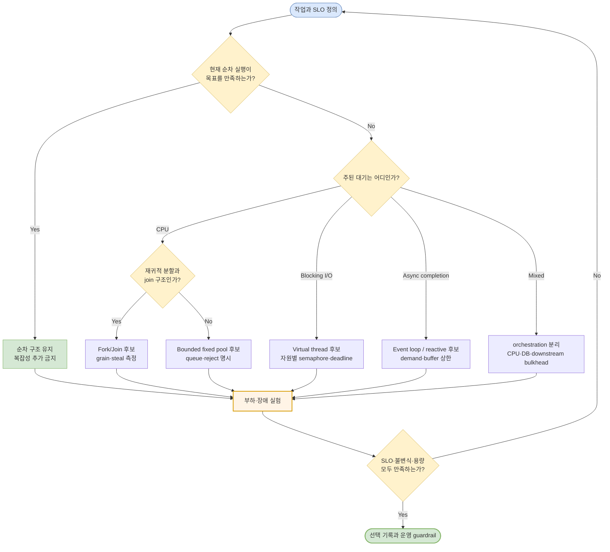
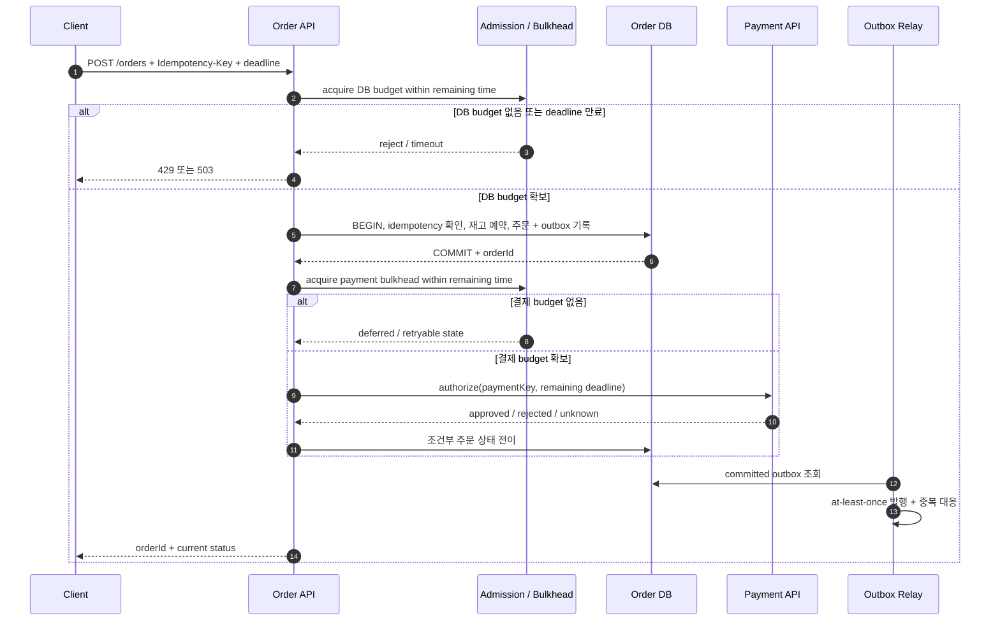

“CPU 작업은 코어 수만큼 thread를 만들고, I/O 작업은 `코어 수 × (1 + 대기/계산)`만큼 만들면 된다.” 익숙한 공식이지만 운영 시스템의 답으로 바로 쓰기에는 빠진 것이 너무 많다. 컨테이너의 CPU quota, 작업 크기와 분할 비용, 요청 도착 패턴, DB connection 수, downstream rate limit, timeout과 retry, queue 상한이 실제 처리 폭을 함께 결정한다.

반대편에는 “가상 스레드를 쓰면 pool tuning이 사라진다”, “reactive면 backpressure가 해결된다”는 결론이 있다. 가상 스레드는 대기 중인 작업을 저렴하게 유지하지만 DB connection을 만들지 않는다. Reactive Streams는 demand를 전달할 규약을 제공하지만, 애플리케이션이 모든 buffer를 bounded로 구성하거나 결제사의 quota를 자동으로 지켜 주지는 않는다.

이 글의 결론은 특정 모델의 우승이 아니다.

> **correctness 모델과 execution 모델을 따로 고르고, 모든 대기열과 희소 자원에 상한을 둔 뒤, 실제 도착률과 장애를 포함한 측정으로 조합을 확정한다.**

## 1. 먼저 두 모델을 분리한다

### Correctness 모델: 어떤 실행 순서에서도 무엇을 지킬 것인가

correctness 모델은 공유 상태와 실패 뒤 결과에 관한 계약이다.

| 모델 | 상태를 지키는 방식 | 주문 시스템의 예 | 주의할 경계 |
|---|---|---|---|
| shared mutable state + 동기화 | 락, 원자 연산, thread-safe 자료구조 | 프로세스 내부 rate counter | 한 연산의 원자성이 여러 객체의 불변식까지 보장하지 않는다 |
| immutable / task ownership | 값을 바꾸지 않거나 한 task만 소유 | 파싱된 주문 command, connection별 state | 소유권을 넘기는 순간과 외부 부수 효과는 별도 계약이다 |
| message passing | mailbox/partition의 처리 순서와 단일 writer | 상품 ID별 재고 command | 재처리·중복·partition 간 불변식이 남는다 |
| transaction | DBMS가 정한 격리·원자성·내구성 | 주문 생성과 재고 예약, outbox 기록 | 외부 결제 호출까지 로컬 DB transaction에 저절로 포함되지는 않는다 |

예를 들어 `ConcurrentHashMap.compute`는 한 key의 갱신을 원자적으로 만들 수 있다. 그러나 “재고 차감 + 주문 생성 + 결제 요청은 정확히 한 번”이라는 업무 규칙을 자동으로 만족시키지 않는다. 이 차이는 [JVM 안의 원자성: volatile에서 ConcurrentHashMap까지](/blog/concurrency-02-jvm-concurrent-hash-map)와 [DBMS 동시성 제어](/blog/concurrency-05-dbms-concurrency-control)에서 다뤘다.

### Execution 모델: 작업을 어디에서 어떻게 진행할 것인가

execution 모델은 기다림과 계산을 실행 자원에 배치하는 방식이다.

- 순차 실행은 한 실행 흐름에서 task를 하나씩 끝낸다.
- fixed platform-thread pool은 제한된 OS thread와 queue에 task를 배치한다.
- fork/join은 task가 만든 하위 task를 worker들이 work stealing으로 나눠 계산한다.
- event loop/reactive pipeline은 readiness, completion, demand 신호로 작업을 짧게 이어 간다.
- virtual-thread-per-task는 동기식 제어 흐름을 유지하면서 대기 시 carrier를 다른 virtual thread가 쓰게 한다.

어느 실행 모델을 골라도 DB transaction의 isolation level, 멱등성 key, message 재처리 정책은 그대로 설계해야 한다. 반대로 correctness를 확보해도 workload가 CPU에서 과도하게 경쟁하거나 queue가 무한히 자라면 운영 성능은 실패한다.

```text
correctness: 어떤 interleaving과 failure에서도 결과가 유효한가?
execution:   그 작업을 어떤 thread·event loop·queue에서 진행할 것인가?
capacity:    동시에 몇 개까지 허용하고 넘치면 무엇을 할 것인가?
```

이 세 질문의 답은 연결되지만 서로 대체하지 않는다.

## 2. 기술 이름보다 workload의 시간 구성을 본다

한 요청의 wall-clock time을 다음처럼 분류해 기록한다.

- 실제 CPU에서 계산한 시간: JSON 변환, 압축, 암호화, 이미지 처리, 규칙 계산
- blocking I/O를 기다린 시간: JDBC, blocking HTTP client, 파일 I/O
- non-blocking completion을 기다린 시간: async HTTP, NIO, reactive DB client
- queue에서 실행 기회를 기다린 시간
- 락, semaphore, DB connection pool처럼 제한된 자원을 기다린 시간
- GC pause, CPU throttling, page fault처럼 런타임·OS에서 멈춘 시간

“I/O-bound 서비스”라는 이름도 endpoint 전체에는 너무 거칠다. 주문 조회는 DB 대기가 대부분일 수 있고, 같은 프로세스의 영수증 서명은 CPU를 오래 쓸 수 있다. 평균 요청은 가벼워도 일부 대형 주문이 event loop를 독점할 수 있다. endpoint, payload 크기, tenant, downstream별로 분해해야 한다.

### CPU-bound

CPU-bound는 runnable task가 실제 계산 자원을 오래 요구한다. 우선 순차 baseline을 만들고, task가 충분히 크며 독립적으로 분할될 때 bounded fixed pool이나 fork/join을 비교한다.

- 작은 task는 submit, steal, join, allocation 비용이 계산 이익보다 클 수 있다.
- 공유 락, 같은 cache line 갱신, memory bandwidth 포화는 코어가 남아 보여도 확장을 멈춘다.
- `Runtime.availableProcessors()`는 JVM이 사용할 수 있다고 관찰한 processor 수이지 물리 코어 수나 보장된 처리량이 아니다.
- 컨테이너에서는 host CPU 사용률이 아니라 cgroup quota 대비 사용률과 throttling을 본다.
- CPU task를 virtual thread로 많이 만들어도 계산 병렬 폭이 늘어나는 것은 아니다.

분할 정복처럼 task가 재귀적으로 하위 task를 만들고 join하는 구조에는 work stealing을 사용하는 `ForkJoinPool`이 자연스러울 수 있다. 독립된 요청을 일정 폭으로 격리하고 명시적으로 reject하려면 bounded queue를 둔 `ThreadPoolExecutor`가 더 직접적이다. 이름이 아니라 task graph와 과부하 계약이 기준이다.

### Blocking I/O

JDBC나 blocking HTTP client처럼 호출 thread가 응답을 기다리는 API에서는 두 선택이 자연스럽다.

1. bounded platform-thread pool로 동시에 block할 작업 수를 제한한다.
2. virtual-thread-per-task로 요청 코드를 단순한 동기식 흐름으로 유지하고, 희소 자원별 `Semaphore`, connection pool, rate limiter로 동시성을 별도 제한한다.

가상 스레드는 “thread가 비싸서 생긴 제한”을 완화한다. “DB가 동시에 처리할 수 있는 query 수”, “결제사가 허용한 in-flight 요청 수”를 완화하지는 않는다. 따라서 platform thread pool을 없앤 뒤 같은 수의 virtual thread pool을 만드는 것은 모델의 장점을 버리고, 아무 제한도 두지 않는 것은 downstream에 queue를 밀어 넣는다.

### Async API ecosystem

네트워크·DB client부터 framework, context propagation, tracing까지 이미 non-blocking API로 이어지고 streaming demand가 중요한 시스템이라면 event loop/reactive가 자연스러울 수 있다.

- 느린 subscriber에 demand를 전달해야 하는 긴 stream
- 연결별 state machine과 partial read/write가 핵심인 gateway
- callback/stage 조합이 이미 서비스의 표준 API인 환경
- 적은 thread로 많은 socket readiness를 관찰해야 하는 경우

단, event loop handler에는 blocking 호출과 긴 CPU 작업을 두지 않는다. CPU 작업은 bounded executor로 offload하고 결과만 loop에 되돌린다. operator 사이의 prefetch, retry buffer, broker client queue까지 상한을 확인해야 “reactive니까 bounded”라는 착각을 피할 수 있다.

### Mixed workload

혼합 workload는 모델 하나로 통일하기보다 **경계를 나누는 문제**다.

예를 들어 주문 API가 “blocking JDBC → CPU가 무거운 서명 → async 결제 client”로 이어진다면 다음처럼 나눌 수 있다.

- 요청 orchestration: virtual thread 또는 reactive pipeline
- 서명 계산: 전용 bounded CPU executor
- DB: connection pool과 query deadline
- 결제: 결제사 quota보다 작거나 같은 별도 bulkhead와 deadline
- 상태 변경: DB transaction, idempotency key, outbox

이 분리는 pool을 많이 만들자는 뜻이 아니다. 서로 다른 병목과 실패 도메인이 같은 queue를 점유해 연쇄 장애를 만들지 않도록 **의미 있는 bulkhead**만 둔다는 뜻이다.

## 3. 모델 선택 결정표

| workload와 제약 | 우선 만들 baseline | 다음 후보 | 잘 맞는 이유 | 선택 전 반증해야 할 위험 |
|---|---|---|---|---|
| 요청량이 작고 latency 목표를 만족 | sequential | 그대로 유지 | queue·동기화·전환 비용이 가장 적고 디버깅이 쉽다 | 한 작업의 지연이 전체 진행을 막는가 |
| 독립된 CPU task, 크기가 비교적 균일 | sequential | bounded fixed pool | 병렬 폭과 queue/reject를 직접 제어한다 | CPU quota, memory bandwidth, allocation, shared lock이 먼저 포화되는가 |
| 재귀적 분할·join, task 크기가 불균일 | sequential | fork/join | work stealing으로 worker 간 남은 일을 나눈다 | blocking I/O와 common pool 간섭, 분할 grain이 너무 작은가 |
| 많은 socket, 짧은 handler, end-to-end async client | 현재 async baseline | event loop/reactive | 기다리는 연결과 실행 thread를 분리하고 demand를 표현한다 | event-loop lag, 숨은 blocking, unbounded prefetch/buffer가 있는가 |
| 많은 독립 blocking I/O, 동기식 라이브러리 | bounded platform pool | virtual-thread-per-task | thread-per-request 구조를 유지하며 대기 task를 저렴하게 표현한다 | connection/quota 제한, pinning, `ThreadLocal` 비용, 취소가 실제 I/O까지 전파되는가 |
| CPU와 여러 종류의 I/O가 혼합 | 단일 모델 baseline | orchestration + 자원별 bulkhead | 병목별 실행 폭과 장애를 격리한다 | executor 간 hop, context·deadline 유실, queue 중첩이 늘어나는가 |

아래 흐름은 후보를 좁히는 출발점이지 자동 선택 알고리즘이 아니다. 마지막 분기는 항상 목표 workload에서의 부하·장애 실험이다.



> 노란 노드는 판단 질문, 파란·초록 노드는 후보, 주황 노드는 모든 후보가 반드시 거쳐야 할 검증 단계다.

## 4. Amdahl의 법칙은 thread 수 공식이 아니다

고정된 전체 workload 중 직렬로 남는 비율을 `S`, 병렬화할 수 있는 비율을 `1-S`, 병렬 실행 자원의 수를 `N`이라고 둔 고전적 모델의 speedup은 다음처럼 쓸 수 있다.

```text
Speedup(N) = 1 / (S + (1 - S) / N)
```

`N`이 아무리 커져도 이 모델에서 speedup의 상한은 `1/S`다. 직렬 구간이 10%라면 병렬 부분을 무한히 빠르게 만들어도 전체가 10배보다 빨라질 수 없다는 뜻이다. Gene Amdahl의 1967년 논문은 병렬 처리로 개선되지 않는 순차적 overhead가 전체 성능 향상을 제한한다는 문제를 제기했다.

운영 서비스에 적용할 때는 모델의 경계를 함께 적어야 한다.

- **고정 workload**의 동일한 일을 더 많은 실행 자원에 나눈다고 가정한다.
- 분할, scheduling, communication, synchronization 비용이 `S` 또는 별도 overhead에 정확히 반영돼야 한다.
- cache miss, memory bandwidth, NUMA, GC, CPU quota throttling 때문에 병렬 구간이 `N`에 반비례한다고 보장할 수 없다.
- 서버 처리량은 서로 독립된 요청을 더 많이 겹치는 문제일 수 있어, 한 요청의 계산 speedup과 동일하지 않다.
- `S`는 코드 줄 수가 아니라 **해당 workload에서 실제로 소비한 시간의 비율**로 추정해야 한다.

따라서 Amdahl의 법칙은 “pool size는 N”이라고 알려 주는 식이 아니다. profile에서 직렬 구간과 공유 병목을 찾고, 병렬화의 최대 기대치를 과장하지 않게 하는 상한 모델이다.

## 5. Little의 법칙은 steady state에서만 용량을 설명한다

같은 시스템 경계와 충분히 긴 관찰 구간에서 다음 값을 둔다.

- `L`: 시스템 안에 있는 평균 요청 수, 즉 실행 중 + queue 대기 중인 평균 in-flight
- `λ`: 단위 시간당 시스템을 통과한 장기 평균 유효 도착률 또는 처리율
- `W`: 요청이 같은 경계 안에서 보낸 평균 시간

Little의 법칙은 다음 관계를 준다.

```text
L = λW
```

John D. C. Little의 1961년 증명은 평균이 유한하고 관련 확률 과정이 strictly stationary인 조건 등을 명시한다. 실무에서는 이를 **warmup이 끝나고, 장기 평균 도착률과 완료율이 같으며, queue가 계속 자라거나 줄지 않는 steady state**에서 사용한다.

예를 들어 안정된 구간에서 처리율이 초당 800건이고 end-to-end 평균 시간이 0.25초라면 같은 경계의 평균 in-flight는 200건이다. 하지만 이 200을 곧바로 “thread 200개”로 바꾸면 안 된다.

- in-flight에는 thread에서 실행 중인 요청뿐 아니라 DB connection, network 응답, queue를 기다리는 요청도 포함된다.
- 평균은 p99 deadline이나 순간 burst를 설명하지 않는다.
- timeout과 reject를 분모에서 숨기면 `λ`가 성공 요청만을 나타내는지 전체 도착을 나타내는지 경계가 달라진다.
- overload에서 도착률이 완료율보다 커 queue가 계속 증가하면 steady state가 아니므로 pool size 계산에 이 식을 쓰면 안 된다.

Little의 법칙은 관측값의 일관성을 검사하는 도구다. “throughput과 latency가 이 정도인데 in-flight가 왜 다른가?”를 묻는 데 유용하고, 원하는 latency를 넣어 안전한 동시성 상한을 자동 산출하는 처방은 아니다.

## 6. 어떤 모델에도 bounded concurrency가 필요하다

성능 문제는 흔히 실행기가 아니라 **대기실**에서 시작한다. unbounded queue는 과부하를 흡수하는 것이 아니라 timeout 직전까지 오래 기다리는 요청과 메모리 사용량으로 바꾼다.

### Admission과 queue capacity

외부 요청을 받은 뒤 모든 작업을 queue에 넣지 않는다.

- queue의 단위가 task 개수인지 byte인지 명시한다.
- capacity에는 정상 burst를 흡수할 근거와 최대 queue wait budget이 있어야 한다.
- 가득 찼을 때 reject, shed, degrade, caller wait 중 하나를 선택한다.
- reject 수와 queue depth뿐 아니라 **submit에서 실제 시작까지 queue wait**를 기록한다.
- queue가 여러 겹이면 ingress, executor, client, DB pool 각각을 관찰한다.

`ThreadPoolExecutor`의 queue 선택은 `maximumPoolSize` 동작과도 연결된다. factory method의 기본값을 외우기보다 core/max, queue, rejection handler가 함께 만드는 admission contract를 코드와 운영 문서에 남긴다.

### Backpressure

backpressure는 “느려졌다”는 사실을 upstream으로 전달해 더 만들지 않게 하는 흐름 제어다. Reactive Streams의 `request(n)`은 이를 표현하지만 다음 경계까지 자동으로 제한하지는 않는다.

- HTTP ingress가 이미 body를 메모리에 읽은 뒤인가?
- broker consumer의 prefetch와 client buffer는 bounded인가?
- reactive chain 안에서 호출한 외부 API의 in-flight 수는 제한되는가?
- retry가 새 demand와 새 queue를 만드는가?

blocking 코드에서도 semaphore, bounded queue, socket read 중단, broker pause로 backpressure를 구현할 수 있다. reactive 여부보다 신호가 **실제 producer까지 도달하는지**가 중요하다.

### Deadline과 cancellation

hop마다 1초 timeout을 새로 시작하면 세 hop을 지난 요청은 이미 사용자의 1초 deadline을 넘길 수 있다. ingress에서 절대 deadline을 만들고 각 hop에는 남은 budget만 전달한다.

- queue에서 deadline이 끝난 작업은 실행 전에 제거하거나 즉시 중단한다.
- `Future.cancel`이나 subscription cancel이 underlying JDBC query, socket, HTTP request까지 실제로 전파되는지 확인한다.
- interrupt를 삼키지 않고 취소 상태를 복원한다.
- 취소 뒤 늦게 도착한 결제 응답은 idempotency key와 상태 전이 규칙으로 처리한다.
- retry는 남은 deadline, retry budget, 멱등성 조건 안에서만 허용한다.

취소는 thread를 멈추는 문법이 아니라 **더는 가치 없는 일이 downstream 자원을 계속 소비하지 않게 하는 end-to-end protocol**이다.

### Connection pool, downstream quota, bulkhead

동시성 상한은 가장 좁은 자원과 실패 정책에 맞춘다.

- DB connection pool의 크기와 wait timeout
- transaction이 connection을 점유하는 시간
- 결제사·재고 서비스의 동시 요청 또는 초당 요청 quota
- tenant별 공정성
- CPU executor와 I/O executor의 독립성

결제사가 느려졌는데 주문 조회까지 같은 executor와 queue를 쓴다면 조회도 함께 멈춘다. 결제 호출에 별도 semaphore와 queue 상한을 두는 bulkhead는 처리 능력을 늘리지 않지만 장애 전파 범위를 줄인다. bulkhead를 너무 잘게 나누면 idle capacity와 운영 복잡성이 늘어나므로, **독립적으로 느려지거나 quota가 다른 경계**에만 둔다.

## 7. 실제 주문 API: 같은 정확성, 세 실행 모델

다음 주문 API를 가정한다.

```text
POST /orders
Idempotency-Key: 8f2...

1. 입력 검증과 가격 계산
2. DB transaction에서 idempotency key 확인, 재고 예약, 주문·outbox 저장
3. transaction commit
4. 결제 승인 요청
5. 결제 결과에 따라 주문 상태 전이
```

여기서 correctness 계약은 세 구현에 공통이다.

- `(customer_id, idempotency_key)` unique constraint로 같은 요청의 중복 주문을 막는다.
- 재고 불변식은 조건부 `UPDATE`, row lock, 적절한 isolation 같은 DB 계약으로 지킨다.
- 주문과 outbox record는 같은 local transaction에서 commit한다.
- 결제 요청에는 별도 idempotency key를 사용한다.
- client disconnect나 timeout은 DB commit을 되돌렸다는 뜻이 아니다. 재조회 가능한 주문 ID와 상태를 남긴다.
- retry와 늦은 응답을 허용하는 명시적 주문 상태 전이만 사용한다.

아래 다이어그램은 실행 모델과 무관하게 유지해야 할 commit·deadline·bulkhead 경계를 보여 준다.



> 실선은 호출 또는 상태 변경이다. 결제 timeout은 “실패 확정”이 아니라 결과 미상일 수 있으므로 조회·조정 절차와 멱등성이 필요하다.

### 대안 A: bounded platform-thread pool + blocking clients

요청을 제한된 platform worker가 처리하고 JDBC와 blocking 결제 client를 호출한다.

```java
ThreadPoolExecutor orderWorkers = new ThreadPoolExecutor(
        coreWorkers,
        maxWorkers,
        30, TimeUnit.SECONDS,
        new ArrayBlockingQueue<>(queueCapacity),
        new ThreadPoolExecutor.AbortPolicy());
```

숫자는 공식으로 고정하지 않는다. CPU quota, blocking 비율, DB connection 수, 결제 quota, queue wait SLO를 바꾸며 실험해 선택한다.

장점은 실행 중인 요청과 queue의 상한, rejection을 한곳에서 이해하기 쉽다는 점이다. 단점은 DB나 결제가 느릴 때 worker가 대기하며 다른 종류의 요청까지 막을 수 있다는 점이다. DB와 결제 작업을 무작정 별도 pool로 넘기면 queue와 context hop만 늘어날 수 있으므로 실제 격리 목적을 확인한다.

관찰할 핵심은 worker active/idle, queue depth·wait, reject, runnable/blocked state, DB pool wait다. `CallerRunsPolicy`를 event loop나 accept thread에서 사용하면 overload 작업을 중요한 ingress thread가 직접 실행하므로 의도한 backpressure인지 검토해야 한다.

### 대안 B: event loop + reactive pipeline

HTTP, DB, 결제 client가 end-to-end non-blocking API를 제공하고 팀이 reactive의 오류·취소·context 규칙을 운영할 수 있다면 pipeline으로 구성한다.

```java
Mono<OrderResponse> placeOrder(Command command, Deadline deadline) {
    return admission.acquire(command.customerId(), deadline)
            .then(orderRepository.reserveAndCommit(command, deadline))
            .flatMap(order -> paymentClient.authorize(
                    order.paymentKey(), deadline.remaining()))
            .flatMap(result -> orderRepository.transition(result))
            .timeout(deadline.remaining())
            .onErrorResume(Overloaded.class, this::reject);
}
```

이는 특정 library의 완성 코드가 아니라 경계를 보이는 의사 코드다. transaction operator의 범위, cancellation 시 resource release, 결제 결과 미상 처리, context propagation은 사용하는 stack의 계약으로 확인해야 한다.

장점은 많은 연결의 기다림을 적은 event-loop thread로 다루고 demand를 pipeline에 표현하기 쉽다는 점이다. 단점은 작은 blocking 호출 하나가 loop를 멈출 수 있고, async stack trace와 context, transaction 경계가 복잡해질 수 있다는 점이다. 가격 계산이 커지면 전용 bounded CPU scheduler로 offload하되, offload queue가 찼을 때의 rejection을 정의한다.

관찰할 핵심은 event-loop lag, operator/prefetch buffer, scheduler queue, cancellation 전파, CPU offload queue, connection pool wait다.

### 대안 C: virtual-thread-per-request + blocking clients

JDBC와 blocking HTTP client를 그대로 사용하면서 요청마다 virtual thread를 만든다.

```java
try (var tasks = Executors.newVirtualThreadPerTaskExecutor()) {
    tasks.submit(() -> {
        Deadline deadline = Deadline.fromRequest();
        Order order;
        try (Connection connection = connections.getWithin(deadline)) {
            order = reserveAndCommit(connection, deadline);
        }
        try (Permit payment = paymentBulkhead.acquire(deadline)) {
            return authorizeAndTransition(order, deadline);
        }
    });
}
```

virtual-thread-per-task executor 자체를 고정 크기 pool로 바꾸지 않는다. DB와 결제처럼 제한이 필요한 **자원 경계**에 connection pool, semaphore, rate limiter 중 그 자원에 맞는 제한을 둔다. DB connection pool이 이미 같은 동시성 제한을 제공한다면 중복 semaphore를 추가하지 않는다. 실제 코드에서는 DB transaction이 끝난 뒤에만 payment permit을 얻어 불필요한 동시 점유를 피하고, connection·permit 획득도 deadline과 cancellation을 따라야 한다. 위 `getWithin`은 이 계약을 드러내기 위한 의사 API다.

장점은 thread dump와 stack trace에서 요청의 제어 흐름이 자연스럽고 blocking library를 그대로 조합할 수 있다는 점이다. 단점은 생성 가능한 virtual thread 수가 서비스 처리 능력으로 오해되기 쉽고, 대기 task의 stack·`ThreadLocal`·요청 객체가 메모리를 차지한다는 점이다.

JDK 24의 JEP 491 이후 일반적인 `synchronized` 사용 중 blocking은 더 이상 예전과 같은 carrier pinning 원인이 아니다. JDK 25 공식 문서는 native method와 foreign function 안의 blocking을 pinning 원인으로 설명한다. 배포 JDK 버전을 고정해 `jdk.VirtualThreadPinned`, scheduler queued virtual thread, carrier 수를 함께 관찰한다. 과거 JDK의 규칙을 현재 런타임에 그대로 적용하지 않는다.

### 세 대안 비교

| 판단 축 | A. bounded platform pool | B. event loop/reactive | C. virtual thread per request |
|---|---|---|---|
| 자연스러운 client API | blocking | end-to-end non-blocking | blocking |
| 요청 제어 흐름 | 동기식 | stage/operator chain | 동기식 |
| 기본 제한 위치 | worker 수 + executor queue | demand + 각 buffer/scheduler | 별도 semaphore/pool/quota |
| 느린 I/O의 비용 | platform worker 점유 | connection state와 callback 유지 | virtual thread 유지, 보통 carrier 반환 |
| CPU 작업 | worker에서 짧게, 크면 CPU pool 분리 | event loop 금지, bounded CPU offload | virtual thread에서 무제한 병렬화 금지, CPU pool 분리 검토 |
| 과부하 신호 | executor reject, queue wait | demand 감소, buffer full, admission reject | admission/semaphore timeout, 메모리·scheduler queue |
| 디버깅 난도 | 익숙한 thread dump | async chain·context 도구 필요 | 요청별 stack trace가 자연스러움 |
| 주된 위험 | worker starvation, queue 폭증 | event-loop starvation, 숨은 buffer | downstream 폭주, 대량 대기 task, 버전별 pinning |
| correctness | 세 모델 모두 동일한 DB transaction·멱등성·상태 전이 필요 | 세 모델 모두 동일 | 세 모델 모두 동일 |

선택은 대개 기존 client 생태계와 팀의 운영 역량에서 갈린다. 동일 workload와 동일 correctness contract로 세 prototype을 비교하지 않고 코드 길이나 단일 happy-path benchmark만으로 결정하지 않는다.

## 8. 측정 계획: 결과와 원인을 같은 시간축에 놓는다

### 결과 지표

| 지표 | 반드시 함께 기록할 차원 | 답하는 질문 |
|---|---|---|
| throughput | offered, admitted, success, reject, timeout, error를 분리 | 실제로 완료한 유효 작업은 얼마인가 |
| latency p50/p95/p99 | 성공만이 아니라 timeout·reject 정책, payload, endpoint별 | 평균이 숨기는 tail이 SLO를 넘는가 |
| queue wait | ingress, executor, CPU offload, DB pool별 | 느린 곳은 실행인가 대기인가 |
| service time | DB, 결제, CPU section별 | 병목 자체가 느린가 앞 queue가 긴가 |
| in-flight·queue depth | 각 bulkhead와 downstream별 | steady state인가 backlog가 누적되는가 |

`p99`만 적고 표본 수와 구간을 생략하지 않는다. 요청 100개에서 p99는 사실상 가장 느린 한 건에 가깝다. 전체 실행의 percentile을 평균내지 말고 같은 histogram 규칙으로 원시 구간을 합치거나 적절한 집계를 사용한다.

### 원인 지표

- **CPU utilization vs quota**: host 전체 CPU가 아니라 process/container가 허용받은 quota 대비 사용과 `cpu.stat`의 throttling을 본다.
- **runnable count**: CPU를 원하는 thread/task가 실행 가능한 자원보다 계속 많은지 본다.
- **context switches와 migration**: thread를 늘린 뒤 전환 비용과 locality 손실이 커졌는지 본다.
- **allocation rate와 GC**: task, callback, buffer, stack chunk, `ThreadLocal` 증가가 allocation과 pause를 바꿨는지 본다.
- **lock contention**: monitor·lock 대기 시간과 stack을 보고 직렬 구간을 찾는다.
- **cache misses**: hardware counter로 비교하되 CPU 모델과 PMU 이벤트 의미, multiplexing을 기록한다. miss 수 하나를 원인으로 단정하지 않는다.
- **carrier pinning**: 배포 JDK에서 `jdk.VirtualThreadPinned` event, carrier platform thread 수, queued virtual thread를 함께 본다.
- **DB pool wait**: acquire latency p50/p95/p99, active/idle, timeout, transaction duration을 본다.
- **downstream**: in-flight, rate-limit response, connection reuse, remote latency와 timeout을 별도로 본다.

Oracle JFR은 allocation, GC, monitor wait, socket/file I/O, virtual-thread event를 같은 recording에서 연결하는 데 유용하다. Linux `perf`와 cgroup 통계는 context switch, cache counter, CPU quota와 throttling을 보완한다. profiler 자체의 overhead와 event threshold도 실험 기록에 남긴다.

### 모델별 추가 지표

| 모델 | 추가 관찰값 |
|---|---|
| sequential | CPU/대기 breakdown, 한 task의 head-of-line blocking |
| fixed pool | active worker, executor queue depth·wait, reject, thread state |
| fork/join | active/running thread, queued task/submission, steal count, join 대기, common-pool 간섭 |
| event loop/reactive | loop iteration/lag, callback 실행 시간, demand, prefetch와 buffer, offload queue |
| virtual thread | live/queued virtual thread, scheduler target parallelism·carrier 수, pinning event, 대기 원인, `ThreadLocal` footprint |

## 9. benchmark가 거짓말하는 세 가지 방식

### Coordinated omission

closed-loop load generator가 응답을 받은 뒤 다음 요청을 보내면 서버가 2초 멈춘 동안 새 요청도 보내지 않는다. 실제 사용자는 그동안 계속 도착할 수 있는데 측정기는 느린 구간의 표본을 **생략**한다. 이것이 coordinated omission이다.

- 목표 arrival schedule을 가진 open-model 또는 constant-rate 실험을 준비한다.
- 예정 시각부터 응답까지 latency를 기록해 queueing을 포함한다.
- load generator 자체의 CPU·connection 한계를 확인한다.
- timeout 요청을 histogram에서 버리지 않는다.
- closed-loop 결과도 concurrency가 고정된 실제 시스템을 모델링한다면 쓸 수 있지만, 어떤 도착 모델을 재현했는지 명시한다.

HdrHistogram은 기대 sample interval을 이용한 coordinated-omission 보정 API를 제공한다. 사후 보정은 실제 open-loop 발생기를 대신하는 만능 해법이 아니므로 raw와 corrected 결과, 가정한 interval을 함께 보관한다.

### Warmup과 JIT

Java 코드는 실행 중 profiling, compilation, deoptimization을 거친다. cold start와 steady-state를 섞으면 동시성 모델보다 JIT 상태를 비교할 수 있다.

- cold-start SLO와 steady-state 성능을 별도 scenario로 측정한다.
- 같은 warmup 조건, JDK build, JVM option, heap, GC, CPU quota를 고정한다.
- compilation log/JFR로 측정 구간의 compilation과 deoptimization을 확인한다.
- 여러 fork를 사용해 process별 편차를 본다.
- 장시간 서비스라면 heap occupancy와 GC가 안정된 구간까지 관찰한다.

### Microbenchmark 함정

executor submit 몇 ns의 차이는 주문 API의 DB wait와 tail latency를 설명하지 않는다. 작은 연산을 비교할 때는 OpenJDK JMH를 사용하되 다음 함정을 피한다.

- 결과를 소비하지 않아 dead-code elimination되는 코드
- 상수 입력으로 계산이 constant folding되는 코드
- setup, allocation, synchronization을 의도치 않게 측정 구간에 넣거나 빼는 오류
- 단일 fork와 지나치게 짧은 warmup
- 실제 경합·payload·NUMA·CPU quota가 없는 환경
- benchmark thread 수를 운영 동시성 상한으로 그대로 복사하는 일

microbenchmark는 작은 가설을 검증하고, end-to-end open/closed workload 실험은 시스템 결정을 검증한다. 둘은 대체 관계가 아니다.

## 10. 주문 API 부하·장애 실험 체크리스트

### 사전 고정

- [ ] JDK build, JVM option, heap/GC, container CPU·memory quota를 기록한다.
- [ ] 서버와 load generator를 분리하고 양쪽 포화를 관찰한다.
- [ ] DB schema, index, connection pool, test data cardinality와 cache warm 상태를 고정한다.
- [ ] 결제 mock의 latency distribution, quota, 오류·timeout 의미를 정의한다.
- [ ] idempotency key 비율, 주문 item 수, hot product 비율을 실제 분포에 맞춘다.
- [ ] 세 대안이 같은 validation, transaction, retry, deadline contract를 사용하는지 확인한다.

### 정상 부하

- [ ] sequential 또는 현행 구현을 baseline으로 남긴다.
- [ ] 낮은 부하부터 saturation 이후까지 offered rate를 단계적으로 높인다.
- [ ] 각 단계가 steady state인지 arrival, completion, queue slope로 확인한다.
- [ ] throughput, p50/p95/p99, queue wait, reject/timeout/error를 함께 기록한다.
- [ ] CPU quota 대비 사용률, runnable, context switch, allocation/GC, lock, cache miss를 같은 시간축에 맞춘다.
- [ ] DB pool acquire wait와 결제 in-flight가 먼저 포화되는지 확인한다.
- [ ] workload 크기와 hot-key 비율을 바꿔 결과가 뒤집히는지 본다.

### 장애 주입

- [ ] DB latency를 단계적으로 늘리고 connection pool exhaustion을 유도한다.
- [ ] 결제 응답을 느리게 하거나 429, 5xx, connection reset, 결과 미상 timeout을 주입한다.
- [ ] CPU quota를 낮추거나 CPU-heavy 주문 비율을 높여 runnable queue를 만든다.
- [ ] executor/offload/admission queue를 가득 채워 reject·degrade가 의도대로 동작하는지 본다.
- [ ] client disconnect와 deadline 만료가 queue, query, HTTP call까지 취소되는지 추적한다.
- [ ] retry storm에서 retry budget, jitter, idempotency가 지켜지는지 본다.
- [ ] lock contention과 hot product 경쟁을 높여 직렬 구간을 드러낸다.
- [ ] virtual-thread 대안은 배포 JDK에서 native/foreign blocking pinning과 scheduler queue를 관찰한다.
- [ ] event-loop 대안은 의도적으로 짧은 blocking/CPU 작업을 넣어 loop lag alert가 탐지하는지 확인한다.

### 정확성과 회복

- [ ] 성공, reject, timeout, client disconnect 뒤에도 재고가 음수가 되지 않는다.
- [ ] 같은 idempotency key의 동시 요청이 주문과 결제를 중복 생성하지 않는다.
- [ ] DB commit 직후 process를 종료해 outbox가 재발행되고 consumer가 중복을 처리하는지 확인한다.
- [ ] 결제 결과 미상 상태가 조회·조정 작업으로 최종 상태에 수렴한다.
- [ ] 장애를 제거하면 queue와 pool wait가 줄어들고 정상 latency로 회복하는지 본다.
- [ ] 회복 중 backlog drain이 새 요청의 deadline을 다시 무너뜨리지 않는지 본다.

## 11. 선택 기록은 숫자보다 가정을 남긴다

최종 결정 문서는 “virtual thread가 가장 빨랐다”가 아니라 다음 형태여야 한다.

```text
workload:
  주문 item p50/p99, hot-product 비율, offered-rate model

correctness:
  idempotency unique key, 재고 transaction, outbox, 결제 상태 전이

execution:
  virtual-thread-per-request + bounded CPU executor

limits:
  DB pool, payment bulkhead, ingress queue, deadline, retry budget

evidence:
  throughput, p50/p95/p99, queue wait, CPU/quota, DB wait, JFR/perf

failure behavior:
  overload reject, DB slow, payment unknown, cancellation, recovery

revisit trigger:
  payload 분포·quota·client stack·JDK version 변경
```

thread 수와 queue capacity는 이 가정들에서 나온 **현재 설정값**이지 보편 공식이 아니다. workload, CPU quota, DB와 downstream 용량, JDK가 바뀌면 다시 측정한다.

## 마무리

순차 실행은 부족함의 표시가 아니라 가장 강력한 baseline이다. fixed pool은 platform thread와 queue를 명시적으로 제한하는 도구다. fork/join은 분할 가능한 계산 graph에 맞는다. event loop/reactive는 non-blocking 생태계와 demand가 이미 중심일 때 강하다. virtual thread는 blocking I/O의 동기식 제어 흐름을 확장하기 좋다.

하지만 실행 모델은 업무 원자성을 만들지 않고, 가벼운 task는 downstream capacity를 늘리지 않으며, backpressure라는 이름은 queue 상한을 대신하지 않는다.

> **상태는 transaction·불변성·소유권·동기화로 지키고, 실행은 workload에 맞춰 배치하며, 동시성은 가장 좁은 자원에서 제한하고, 선택은 tail latency와 장애 실험으로 증명한다.**

이것이 [CPU와 cache coherence](/blog/parallelism-01-cpu-cache-coherence)에서 시작해 [OS scheduler](/blog/parallelism-02-os-threads-scheduler), [Java Memory Model](/blog/parallelism-03-jvm-memory-model), [비동기·논블로킹](/blog/parallelism-04-async-nonblocking), [가상 스레드](/blog/parallelism-05-java-virtual-threads)를 거친 이유다. 아래 계층을 아는 목적은 가장 복잡한 모델을 고르는 데 있지 않다. 현재 병목과 실패 경계에 필요한 만큼만 복잡하게 만드는 데 있다.

## 공식 자료와 원 논문

- Gene M. Amdahl, [“Validity of the Single Processor Approach to Achieving Large Scale Computing Capabilities”](https://doi.org/10.1145/1465482.1465560), AFIPS 1967
- John D. C. Little, [“A Proof for the Queuing Formula: L = λW”](https://doi.org/10.1287/opre.9.3.383), *Operations Research* 9(3), 1961
- Oracle Java SE 25 API, [`ThreadPoolExecutor`](https://docs.oracle.com/en/java/javase/25/docs/api/java.base/java/util/concurrent/ThreadPoolExecutor.html), [`ForkJoinPool`](https://docs.oracle.com/en/java/javase/25/docs/api/java.base/java/util/concurrent/ForkJoinPool.html), [`Runtime.availableProcessors()`](https://docs.oracle.com/en/java/javase/25/docs/api/java.base/java/lang/Runtime.html#availableProcessors())
- Oracle Java SE 25 API, [`Flow`](https://docs.oracle.com/en/java/javase/25/docs/api/java.base/java/util/concurrent/Flow.html), [`VirtualThreadSchedulerMXBean`](https://docs.oracle.com/en/java/javase/25/docs/api/jdk.management/jdk/management/VirtualThreadSchedulerMXBean.html)
- OpenJDK, [JEP 444: Virtual Threads](https://openjdk.org/jeps/444), [JEP 491: Synchronize Virtual Threads without Pinning](https://openjdk.org/jeps/491)
- Oracle Java SE 25, [Virtual Threads](https://docs.oracle.com/en/java/javase/25/core/virtual-threads.html), [Troubleshoot Performance Issues Using Flight Recorder](https://docs.oracle.com/en/java/javase/25/troubleshoot/troubleshoot-performance-issues-using-jfr.html)
- Reactive Streams, [Reactive Streams Specification for the JVM 1.0.4](https://github.com/reactive-streams/reactive-streams-jvm/blob/v1.0.4/README.md)
- OpenJDK, [Java Microbenchmark Harness](https://github.com/openjdk/jmh)와 [JMH samples](https://github.com/openjdk/jmh/tree/master/jmh-samples/src/main/java/org/openjdk/jmh/samples)
- HdrHistogram, [Coordinated Omission 설명과 보정 API](https://github.com/HdrHistogram/HdrHistogram)
- Linux Kernel, [Control Group v2 CPU controller](https://docs.kernel.org/admin-guide/cgroup-v2.html), [`perf_event_open(2)`](https://man7.org/linux/man-pages/man2/perf_event_open.2.html)
