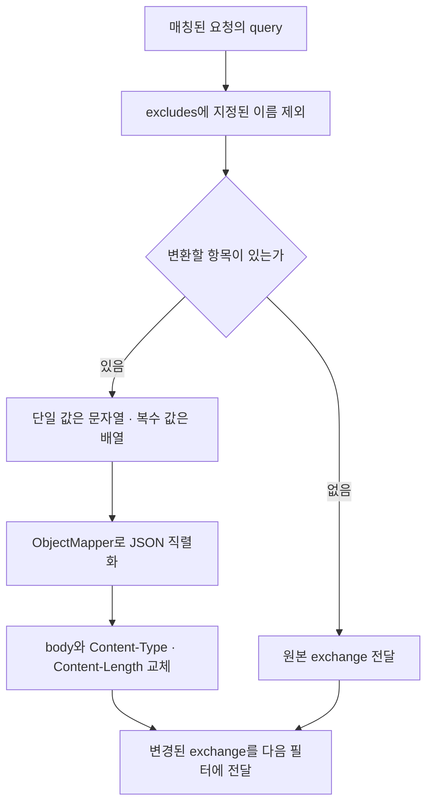

Service Delivery Gateway 작업을 설명할 때 “Legacy API를 수용했다”는 말만으로는 무엇을 바꿨는지 전달하기 어렵다. 이 글에서는 내가 구현한 `QueryParameterToRequestBodyGatewayFilterFactory`를 통해, 클라이언트가 보내는 query parameter와 뒤쪽 서비스가 기대하는 JSON body 사이의 차이를 어떻게 처리했는지 설명한다.

분석 기준은 `sp-gw`의 `9c7dc077380a062a4a992f906c05009c15e6221d`이다. 프로젝트에는 인증과 응답 정규화 등 공동 구현 기능도 있다. 이 시리즈에서 개인 구현 근거로 삼는 범위는 요청 변환, Config 연동·갱신, 배포 구성이다. 커밋 작성자는 기여를 확인하는 단서이며, 프로젝트 전체의 설계 책임을 단독으로 증명하지는 않는다.

## 왜 Gateway에서 변환했는가

클라이언트가 `?channel=music&tag=a&tag=b`처럼 보내고, 서비스는 JSON을 받는다고 가정하자. 클라이언트와 서비스 양쪽의 배포를 맞추는 대신 Gateway에 변환을 두면 라우트에 해당 필터를 적용하는 것으로 접점을 만들 수 있다. 이 예시는 원본 코드의 동작을 설명하기 위한 가상 API이며 실제 운영 요청 기록은 아니다.

이 선택은 계약 차이를 Gateway가 소유하게 만든다. 그래서 변환 대상은 모든 요청이 아니라 해당 계약을 필요로 하는 라우트여야 한다. 서비스별 검증 규칙이나 업무 처리를 계속 넣으면 Gateway가 서비스 변경까지 알아야 하는 구조가 된다.

아래 흐름은 라우트에 이 필터를 설정했을 때의 처리 순서다.



## 변환을 입력과 출력으로 설명하기

필터 이름은 클래스 이름에서 `GatewayFilterFactory`를 제외한 `QueryParameterToRequestBody`다. 다음은 설명용 라우트 예시다. 현재 원본 저장소의 활성 라우트는 외부 Config Server로 이동했으므로, 이 예시가 현재 배포된 설정이라는 의미는 아니다.

```yaml
spring:
  cloud:
    gateway:
      server:
        webflux:
          routes:
            - id: query-body-example
              uri: http://localhost:18081
              predicates:
                - Path=/example/**
              filters:
                - name: QueryParameterToRequestBody
                  args:
                    excludes:
                      - trace
```

| 입력 | 만들어지는 JSON body | 해석 |
|---|---|---|
| `?name=Kim&age=30` | `{"name":"Kim","age":"30"}` | 숫자처럼 보여도 문자열을 유지 |
| `?tag=a&tag=b` | `{"tag":["a","b"]}` | 복수 값 보존 |
| `?name=Kim&trace=t1` | `{"name":"Kim"}` | trace는 body 변환에서 제외 |
| `?trace=t1` 또는 query 없음 | 원본 body 유지 | 결과 map이 비면 요청을 그대로 전달 |

JSON 객체의 필드 순서는 계약으로 삼지 않는다. `excludes`는 query 자체를 삭제하지 않는다. 원래 URI는 그대로이므로 trace를 포함한 원본 query는 여전히 뒤쪽 서비스에 전달된다. 따라서 이 기능을 “민감한 query 제거”라고 설명하면 실제 동작과 어긋난다.

원본의 핵심 매핑은 다음과 같다.

```java
return params.entrySet().stream()
    .filter(entry -> !excludes.contains(entry.getKey()))
    .collect(Collectors.toMap(
        Map.Entry::getKey,
        entry -> entry.getValue().size() == 1
            ? entry.getValue().get(0)
            : entry.getValue()
    ));
```

## WebFlux에서는 요청을 어떻게 바꾸는가

필터는 `ServerHttpRequestDecorator`에서 `getBody()`와 `getHeaders()`를 재정의한다. 만들어 둔 JSON byte 배열을 `Flux<DataBuffer>`로 반환하고, 복사한 헤더의 Content-Type을 JSON으로, Content-Length를 byte 배열 길이로 설정한다. 이후 `exchange.mutate().request(decoratedRequest).build()`를 다음 필터에 넘긴다.

Content-Length에 문자열 글자 수를 쓰지 않는 이유는 한글 같은 문자가 직렬화된 byte 수와 다를 수 있기 때문이다. 반면 URI와 HTTP method는 이 코드에서 수정하지 않는다. GET에 필터를 붙인다고 POST가 되는 것이 아니다.

필터 내부에는 `block()`이 없다. 다만 ObjectMapper의 직렬화는 현재 호출 스레드에서 동기적으로 수행된다. “Reactor를 사용하므로 모든 작업이 비동기다”라고 말할 수는 없다. 큰 query를 허용할 때의 CPU·메모리 비용과 입력 크기 제한은 별도 검토 사항이다.

## 기존 body가 있다면

변환할 query가 한 개라도 있으면 `getBody()`가 새 JSON을 반환하므로 기존 body를 대체한다. 기존 JSON과 병합하는 로직은 없다. 반대로 query가 전부 제외되면 기존 body가 그대로 유지된다. 이 분기 때문에 같은 경로라도 query 구성에 따라 body의 출처가 달라질 수 있다.

운영에 적용할 때는 “원본 body와 query 중 누가 우선하는가”를 API 계약에 써야 한다. body가 있는 요청은 거절할지, 명시적으로 덮어쓸지, 필드를 병합할지는 새 요구사항이다. 현재 코드는 덮어쓰기를 구현하고 있다.

헤더도 검토할 부분이 있다. 원본 헤더를 복사한 뒤 두 항목만 바꾸므로 Transfer-Encoding이나 Content-Encoding과 새 body 사이의 정합성은 통합 테스트 대상이다. 현재 구현만으로 모든 HTTP framing 사례가 검증됐다고 주장하지 않는다.

## 면접에서 설명할 수 있는 답변

**왜 전역 필터가 아닌 라우트 필터인가?**  
변환이 필요한 계약을 가진 서비스에만 적용하기 위해서다. 전역 적용하면 이미 JSON을 보내는 클라이언트의 body도 대체할 수 있다. 적용 범위 자체가 회귀 영향 범위다.

**복수 query를 문자열 하나로 합치지 않은 이유는?**  
원본의 값 개수를 보존하기 위해서다. 콤마로 합치면 실제 값 안에 콤마가 있는 경우 구분이 모호해진다. 다만 같은 키가 한 번이면 문자열, 여러 번이면 배열이 되므로 소비 서비스가 그 타입 차이를 수용해야 한다.

**가장 먼저 추가할 테스트는 무엇인가?**  
단일 값·복수 값·제외 항목을 넘어, 기존 body와 query가 함께 있는 요청, 모든 항목이 제외된 요청, 한글 body의 byte 길이, 원본 URI 유지 여부를 검사하겠다. 실제 HTTP 서버에 보내 최종 헤더와 body를 확인하는 테스트도 필요하다.

**테스트를 이미 구현했는가?**  
`6f3b8cf`에는 JSON 변환과 query가 없는 요청의 통과를 검사하는 테스트 작성 이력이 있다. 기준 HEAD에는 해당 필터 테스트가 남아 있지 않고 `contextLoads`만 있다. 과거 작성 이력과 현재 회귀 검증 범위를 구분해 답해야 한다. 이 문서 작업에서는 Java 테스트를 복구하거나 실행하지 않았다.

## 소스 근거와 다음 글

원본 저장소의 현재 로컬 경로는 다음과 같다.

```text
/Users/son-inchang/Work/mobility/backup/GatewayPoC/sp-gw
└── src/main/java/com/avis/apigateway/filter/
    └── QueryParameterToRequestBodyGatewayFilterFactory.java
```

도입은 `8c1e8cb`, 제외 항목 추가는 `48d48ea`, 과거 테스트는 `6f3b8cf`에서 확인할 수 있다. 저장소 안의 근거 목록(`docs/sp-gw-interview/source-map.md`)에 파일별 역할과 이력 확인 명령을 모았다. 이 글의 예시는 학습용 입력·출력이며 실행 가능한 Demo는 별도로 만들지 않았다.

[2편: 외부 설정을 실행 중인 Gateway에 반영하는 경로](/blog/sp-gw-02-config-refresh)에서는 이 필터를 포함한 라우트 정의를 코드 배포와 어떻게 분리했는지 설명한다.
