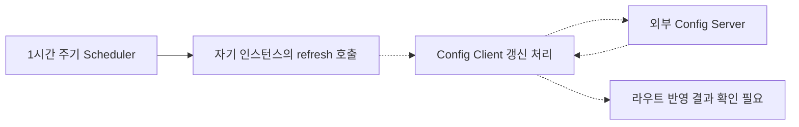

[1편](/blog/sp-gw-01-request-contract)의 필터는 Java 코드로 구현하지만, 어떤 경로에 붙일지는 라우팅 설정의 책임이다. `sp-gw` 작업에서는 이 설정을 Config Server로 모으고 Gateway가 설정을 다시 읽을 경로를 구성했다. 이렇게 하면 이미 구현된 필터의 인자나 서비스 주소를 바꾸기 위해 애플리케이션 JAR를 다시 만들 필요가 줄어든다.

이 글은 `sp-gw@9c7dc07`의 클라이언트 코드와 변경 이력을 분석한다. 별도 Config Server의 저장소 구현, 파일 캐시, 파일 변경 감지는 이 저장소만으로 확인할 수 없다. 따라서 이 글에서 설명하는 범위는 Gateway 쪽 설정 수신과 갱신이다.

## 설정의 위치를 한 군데로 모으다

`9c7dc07`은 애플리케이션 YAML에 있던 route 정의를 제거한 커밋이다. 이전 파일에는 서비스별 URI, Path predicate, 인증 필터와 Rewrite 규칙이 함께 있었다. 현재 파일에는 아래 import와 애플리케이션 이름이 남아 있다.

```yaml
spring:
  config:
    import: optional:configserver:${CONFIG_SERVER_URL}
  application:
    name: sp-gw
```

이 변경에서 확인되는 결과는 **Gateway에 내장된 라우트 정의를 제거하고 외부 설정을 사용하도록 구성했다**는 것이다. Config Server의 현재 응답이나 실제 운영 중인 route 목록은 확인하지 않았다. 과거 YAML을 현재 운영 라우트 표처럼 제시하면 안 되는 이유다.

`optional:`을 사용했다는 사실도 함께 봐야 한다. 외부 설정을 읽지 못했을 때 기동 정책과 서비스 준비 상태를 어떻게 판단할지는 운영 검증 대상이다. 특히 내장 라우트가 없는 구성에서는 프로세스가 떠 있다는 사실과 요청을 처리할 수 있다는 사실을 따로 확인해야 한다.

## 설정을 저장하는 것과 적용하는 것은 다른 단계다

설정 파일이 바뀌어도 이미 실행 중인 Gateway가 새 값을 사용하는지는 별도로 확인해야 한다. 현재 코드는 Actuator의 `refresh`를 웹에 노출하고, `SelfRefreshScheduler`가 자기 인스턴스의 엔드포인트를 호출한다.

```java
this.refreshUri = "http://" + host + ":" + port
    + "/sp-gw/actuator/refresh";

@Scheduled(fixedRateString = "3600000")
public void refresh() {
    webClient.post()
        .uri(refreshUri)
        .retrieve()
        .bodyToMono(Void.class)
        .subscribe();
}
```

host와 port는 Environment에서 읽으며 기본값은 localhost와 8080이다. 기준 코드의 주기는 1시간이다. `8c5e611`에서 주기를 변경했고 `3188dce`에서 `/sp-gw` 경로를 포함하도록 수정했다. base path를 바꾸면 내부 self-call URL도 같이 점검해야 한다는 사례다.

다음 그림에서 실선은 코드에 있는 자기 호출이며, 점선은 프레임워크 연동으로 기대하는 설정 재조회 단계다. 실행 결과를 관측한 시퀀스는 아니다.



`bodyToMono(Void.class)`는 응답 payload를 사용하지 않는다. 따라서 이 코드에는 변경된 설정 키를 비교해 보고하는 기능이 없다. 성공 응답을 받는 것과 실제 라우트가 원하는 주소를 가리키는 것은 다른 검증이다.

## Cloud Bus와 RabbitMQ는 어디에 붙는가

`26d6627`에서 `spring-cloud-starter-bus-amqp` 의존성과 RabbitMQ 접속 설정을 추가했다. Deployment는 RabbitMQ의 host·port·사용자·비밀번호를 Secret에서 환경 변수로 주입한다.

여기서 RabbitMQ는 API 요청을 중계하는 메시지 큐로 설명하는 것이 아니라, 설정 갱신 이벤트를 전달하는 Bus 연결 구성으로 설명한다. 이 코드에는 애플리케이션이 직접 작성한 이벤트 producer나 consumer가 없다. 현재 Actuator 노출 목록도 `health,info,prometheus,refresh`이며 `busrefresh`는 명시되어 있지 않다. 이벤트를 누가 어느 엔드포인트로 발행하는지는 관리 서버 쪽 근거가 더 필요하다.

| 경로 | 이 저장소에서 확인한 것 | 추가로 확인할 것 |
|---|---|---|
| Config import | 외부 주소와 application name 구성 | 서버 응답과 활성 profile별 설정 |
| Self-refresh | 1시간마다 자기 refresh 호출 | 실패 관측, 최종 라우트 반영 |
| Bus 연결 | AMQP starter와 RabbitMQ 환경 변수 | 발행 주체, 소비 성공, 인스턴스별 적용 버전 |
| 실제 요청 | 필터와 라우팅 프레임워크 구성 | 변경 전후 목적지와 응답 계약 |

두 경로가 함께 존재한다는 이유만으로 “Bus 이벤트가 유실되면 정확히 1시간 안에 복구된다”고 단정할 수 없다. 갱신 호출과 Config Server 접근이 성공해야 하고, 실제 라우트 적용도 확인되어야 한다.

## 현재 구현에서 보강할 지점

self-refresh 코드는 WebClient 요청에 명시적인 timeout, retry, 오류 소비자, 성공·실패 지표를 붙이지 않는다. `subscribe()`를 호출하고 메서드는 반환하므로 스케줄러의 작업 완료와 HTTP 요청 완료도 일치하지 않는다. 장시간 요청이 남으면 다음 호출과 겹치는 상황을 고려해야 한다.

또한 여러 인스턴스의 설정이 동시에 바뀌는 원자적 전환은 구현하지 않았다. 한 인스턴스가 v2를 적용하고 다른 인스턴스가 v1을 쓰는 동안 두 계약이 섞일 수 있다. 개선한다면 설정 버전과 마지막 적용 성공 시각을 노출하고, 인스턴스별 적용 상태와 실제 경로 호출을 확인하는 방식부터 도입하겠다. 이것은 현재 완료 기능이 아닌 후속 설계다.

## 면접에서 설명할 수 있는 답변

**“재배포 없이 변경”은 어디까지 가능한가?**  
이미 구현된 predicate·filter의 설정과 대상 URI를 바꾸는 범위다. 새로운 Java 필터 구현이나 처리 방식 변경은 코드 배포가 필요하다. Config Server를 도입했다고 코드와 설정의 차이가 사라지는 것은 아니다.

**폴링이 있는데 Bus를 연결한 이유는?**  
주기 호출과 별개로 이벤트 기반 갱신 경로를 구성하기 위해서다. 실제 지연 개선 수치나 전 인스턴스 전달 보장까지 측정한 근거는 없다. 내 구현은 Bus 의존성·접속 정보·배포 연결이고, 발행·적용 결과는 운영 검증 범위로 설명한다.

**설정 변경 후 404가 발생하면 어디부터 보겠는가?**  
선택된 profile과 Config Server 응답, 갱신 HTTP 결과, 인스턴스별 라우트, Path와 base path, 최종 대상 URI 순서로 확인하겠다. 단순 기동 로그보다 “어느 설정으로 어떤 요청이 어디에 매칭됐는가”를 좁혀 가는 편이 원인을 분리하기 좋다.

**롤백은 어떻게 설계하겠는가?**  
이전 설정 버전 복구, 재갱신, 인스턴스별 적용 확인을 한 절차로 묶겠다. 현재 코드에는 설정 버전 저장과 원클릭 롤백이 없으므로 “롤백까지 자동화했다”고 답하지 않는다.

## 원본 근거와 검증 시나리오

원본 루트는 `/Users/son-inchang/Work/mobility/backup/GatewayPoC/sp-gw`다.

| 상대 경로 | 읽을 부분 |
|---|---|
| `src/main/resources/application.yaml` | import, base path, Actuator 노출 |
| `src/main/java/com/avis/apigateway/route/SelfRefreshScheduler.java` | 자기 호출과 주기 |
| `src/main/java/com/avis/apigateway/support/WebClientConfig.java` | WebClient 생성 |
| `build.gradle` | Config·Bus 의존성 |
| `charts/sp-gw/templates/deployment.yaml` | RabbitMQ와 Config 주소 주입 |

이 글은 정적 소스 분석이다. 재현 환경을 만든다면 두 Gateway 인스턴스와 서로 다른 응답을 주는 backend 두 개를 두고, 목적지 변경·Config Server 중단·Bus 단절을 각각 시험하겠다. 각 요청에서 인스턴스 ID와 설정 버전을 기록하면 “이벤트 수신”과 “실제 트래픽 반영”을 구분할 수 있다. 이 실험은 아직 실행하지 않았다.

근거 목록(`docs/sp-gw-interview/source-map.md`)에는 커밋 조회 명령을, [3편](/blog/sp-gw-03-delivery-boundary)에는 이러한 설정을 배포 환경에 연결한 과정을 정리했다.
