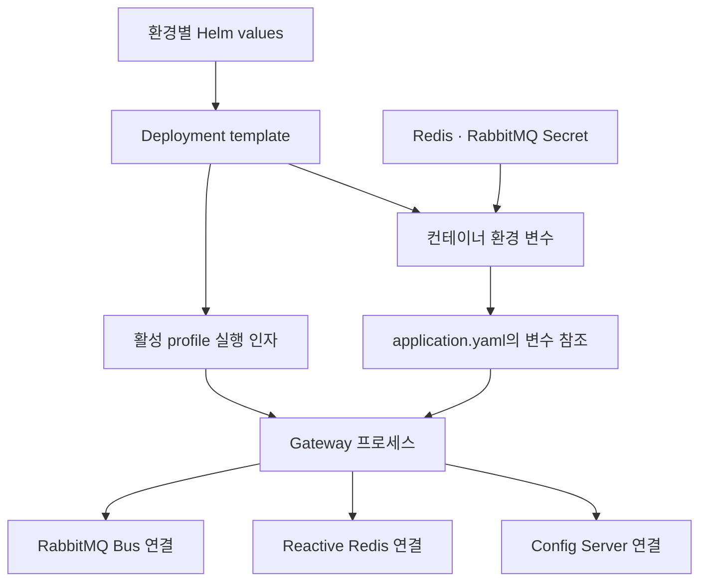
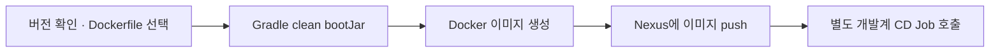

Gateway는 뒤쪽 서비스와 설정 서버에 연결되어야 요청을 처리한다. 그래서 로컬에서 JAR가 실행되는 것만으로 배포 작업을 설명하기 어렵다. `gateway-example`에서는 Skaffold·Helm을 이용한 로컬 개발 구성과 Jenkins의 개발계 빌드·이미지 배포 경로를 만들었다.

분석 기준은 앞선 글과 같은 비공개 이력이다. 2025년 9월에는 로컬 빌드·배포 구성을 추가했고, 11월에는 외부 설정·RabbitMQ 연결을 보강했으며, 12월에는 개발계 Helm과 Jenkins 구성을 추가했다. 현재 소스에서 확인되는 작업 기간이 12월까지 이어지는 이유다.

## 이미지와 환경 설정을 연결하는 방법

Helm Deployment는 image repository·tag, Config Server 주소, 활성 profile을 values에서 받는다. Redis와 RabbitMQ 접속 정보는 Secret의 key를 참조해 환경 변수로 주입한다. 애플리케이션 YAML은 해당 환경 변수를 읽는다.

이 구조가 보여 주는 것은 설정 전달 경로다. Secret 참조를 사용한다는 것만으로 저장소 전체의 비밀정보 관리가 완료되었다고 평가하지 않는다. 원본 빌드·CI 파일의 인증정보 취급은 별도 개선 대상이며, 여기에는 값이나 내부 접속 주소를 복제하지 않는다.

설정 한 개가 실제 프로세스까지 전달되는 관계는 다음과 같다.

같은 코드라도 잘못된 profile이나 Config 주소를 주입하면 다른 라우트를 읽을 수 있다. 그래서 환경 분리는 파일을 나누는 것으로 끝나지 않고, 렌더링된 Deployment와 실제 컨테이너 인자를 확인하는 작업까지 포함한다.

## 로컬에서는 Skaffold가 반복 작업을 묶는다

`skaffold.yaml`은 `Dockerfile.local`을 이용한 이미지 빌드와 `charts/sp-gw` Helm release를 연결한다. 로컬 빌드는 registry push를 끄고, 서비스 8080 포트를 로컬로 포워딩하도록 구성했다. `dev`·`debug` profile도 있으며 debug에는 소스 동기화 설정이 있다.

이 파일만으로 소스 변경이 언제나 재기동 없이 반영된다고 주장하지는 않는다. 동기화 경로와 컨테이너 내부의 빌드·실행 방식까지 맞아야 한다. 확인 가능한 기여는 개발자가 반복하는 이미지 빌드, Helm 배포, 포트 연결을 하나의 구성으로 묶었다는 점이다.

## Jenkins가 실제로 수행하는 단계

현재 Jenkinsfile의 흐름은 아래와 같다.

CI는 Gradle의 `version`을 읽어 이미지 태그에 사용하고, JAR 빌드 뒤 Chart의 version·appVersion을 수정한다. 다만 `helm package` 명령은 주석 처리되어 있다. 따라서 “CI에서 Helm 패키지 배포까지 완료한다”는 설명은 현재 코드와 맞지 않는다.

마지막 단계는 별도 CD Job에 요청을 보내는 것이다. 해당 CD Job의 소스는 이 저장소에 없고, 여기에는 Job 완료를 기다리거나 Kubernetes rollout을 확인하는 코드도 없다. Jenkins의 이 단계가 끝났다는 사실만으로 새 Gateway가 트래픽을 받을 준비가 되었다고 판단할 수 없다.

## values에 쓴 값이 모두 적용되는가

실제 Deployment template에는 `resources`나 readiness/liveness probe를 연결하는 항목이 없다. values에 CPU·메모리 값을 작성했더라도 template이 참조하지 않으면 Pod 자원 제한으로 전달되지 않는다. 면접에서 “Helm에 limits를 설정했다”고만 말하기보다 렌더링 결과를 확인해야 하는 이유다.

현재 CI의 빌드 명령은 `gradle clean bootJar`이며 테스트를 명시적으로 실행하는 단계가 없다. 이미지 생성 성공은 테스트 통과나 Config Server 연결 성공을 의미하지 않는다.

개선한다면 테스트 실행, Helm 렌더링 검증, readiness와 rollout 확인, 실제 라우트 호출을 단계적으로 연결하겠다. 이미지에는 고유한 빌드 식별자 또는 digest를 사용해 동일 버전 문자열을 재사용할 때의 추적 문제도 줄이겠다. 이 항목들은 이번 원본 코드에 적용한 변경이 아닌 후속 설계다.

## 장애 상황을 계층별로 설명하기

| 증상 | 먼저 확인할 근거 | 다음 단계 |
|---|---|---|
| 이미지 pull 실패 | Pod event, 이미지 이름·태그, pull Secret | registry 권한과 이미지 존재 여부 확인 |
| 컨테이너 기동 실패 | 로그, 활성 profile, 누락된 환경 변수 | Secret key와 Config 주소 점검 |
| 기동했지만 요청이 404 | Config 응답, 적용 라우트, Path | [2편](/blog/sp-gw-02-config-refresh)의 갱신 경로 확인 |
| 서비스가 body를 해석하지 못함 | 전달된 query·body·헤더 | [1편](/blog/sp-gw-01-request-contract)의 변환 계약 확인 |
| CD 호출은 성공했는데 버전이 그대로 | 실제 CD Job 결과, Pod image와 digest | CI 호출 성공과 배포 완료를 분리 |

표는 실제 장애 빈도나 해결 시간을 측정한 결과가 아니라 현재 구성에서 도출한 진단 순서다.

## 면접에서 설명할 수 있는 답변

**Dockerfile을 로컬과 개발계로 나눈 이유는?**  
개발계 Dockerfile은 Jenkins가 이미 만든 JAR를 복사해 실행하는 역할이다. 로컬은 Skaffold 빌드·배포 반복 과정에 연결한다. 빌드 주체가 어디인지 설명하면 분리 이유가 명확해진다.

**Helm을 썼으니 무중단 배포인가?**  
Helm은 배포 리소스를 구성하는 수단이다. 이 코드에는 readiness probe 연결이나 트래픽 전환 검증이 없어 무중단을 주장할 근거가 부족하다. 배포 후 준비 상태와 실제 요청 성공을 확인하는 절차가 더 필요하다.

**가장 중요한 운영 개선 한 가지는?**  
CD 호출 성공과 실제 서비스 준비 완료를 연결하는 확인 단계를 추가하겠다. 이미지 식별, rollout 상태, 활성 라우트와 작은 smoke test를 묶어야 잘못된 배포를 빨리 발견할 수 있다. 이때 테스트 요청이 외부 부작용을 만들지 않는 경로여야 한다.

**본인의 작업을 1분 안에 설명한다면?**  
“Legacy API의 입력 차이를 처리하는 query-to-body 필터와, 라우팅 정의를 외부 Config로 모으는 연동을 구현했습니다. Gateway의 주기 refresh와 RabbitMQ Bus 연결을 구성했고, Helm·Skaffold·Jenkins로 환경 설정 주입부터 이미지 배포와 개발계 CD 호출까지 연결했습니다. 현재 코드가 확인하는 범위는 여기까지이며, 인스턴스별 설정 적용 확인과 배포 준비 상태 검증은 후속 보강 지점입니다.”

## 소스 경로와 읽는 순서

원본 저장소 위치는 공개하지 않는다. 아래 경로는 역할을 설명하기 위해 일반화한 예시다.

1. `skaffold.yaml`: 로컬 build·deploy·portForward
2. `charts/local-values.yaml`, `charts/development-values.yaml`: 환경별 입력
3. `charts/gateway-example/templates/deployment.yaml`: 입력이 실제로 사용되는 위치
4. `src/main/resources/application.yaml`: 프로세스에서 읽는 설정
5. `cicd/Jenkinsfile_development`, `Dockerfile.development`: JAR에서 이미지, CD 호출까지

Skaffold·Helm, 외부 설정, 개발계 CI와 profile 관리의 변경 이력을 확인했다. [공개 근거 안내](https://github.com/inchangson/inchangson.github.io/blob/master/docs/sp-gw-interview/source-map.md)에 검증 범위를 정리했다.
